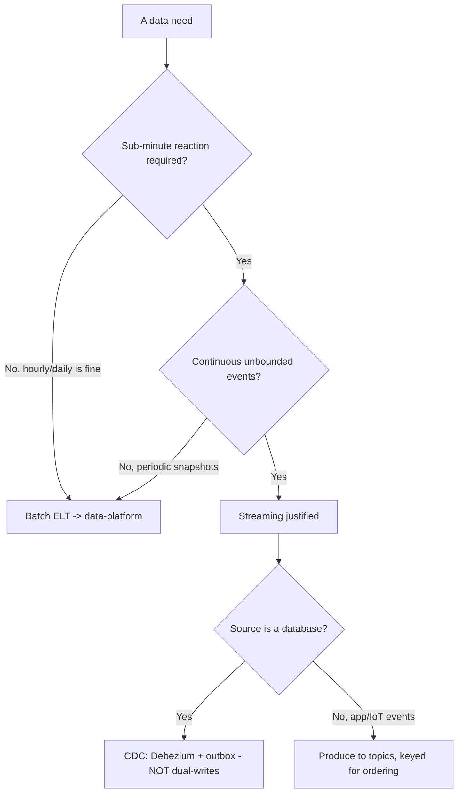
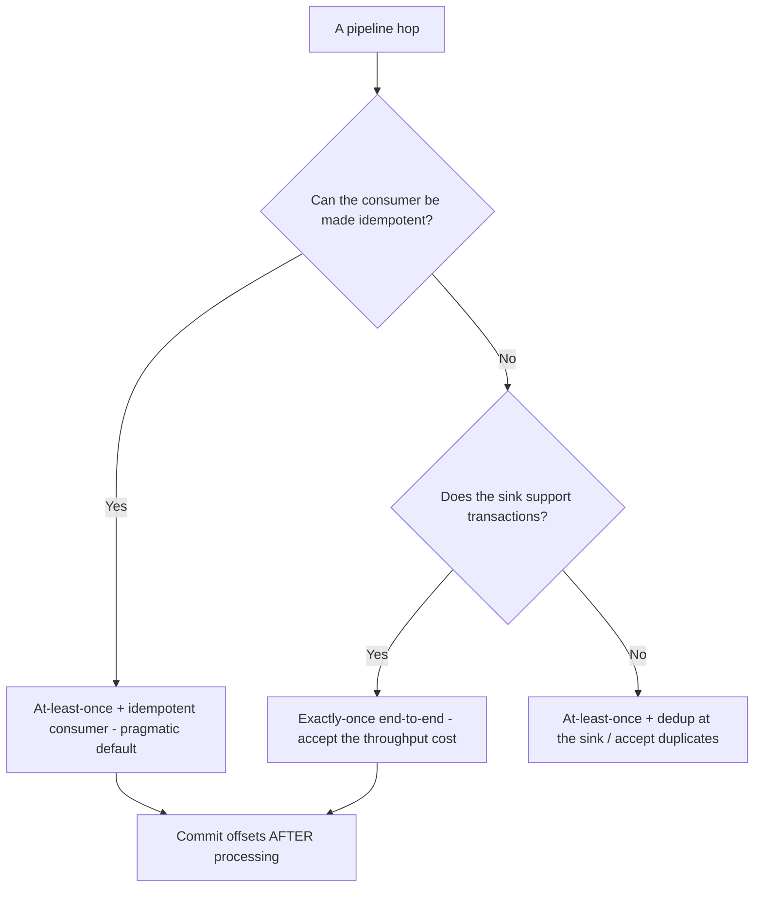

# Data Streaming — Decision Trees

_Decision trees + a dated capability map. Capability rows are `[verify-at-build]` — re-check against the vendor before quoting. Last reviewed: 2026-06-04._

Traverse before building a stream or choosing delivery semantics.

## Decision Tree: Streaming or batch?

Justify streaming with a real latency need; otherwise batch is simpler and cheaper.

_Streaming is operationally heavy — don't pay for it without a latency need._

## Decision Tree: Delivery semantics

Pick the weakest semantic that meets the requirement; stronger costs throughput + complexity.

## Capability map (dated — verify at build)

| Capability | 2026 state `[verify-at-build]` | Notes |
|---|---|---|
| Apache Kafka | GA, ecosystem default | KRaft (no ZooKeeper) standard |
| Schema Registry (Avro/Protobuf/JSON) | GA | Compatibility rules essential |
| Debezium CDC | GA | Log-based change capture |
| Apache Flink | GA | Event-time, watermarks, exactly-once |
| Kafka Streams | GA | JVM library; stateful processing |
| Kafka transactions / EOS | GA | Exactly-once within Kafka; sink matters |
| Pulsar / Kinesis | GA | Multi-tenant / AWS-managed alternatives |
