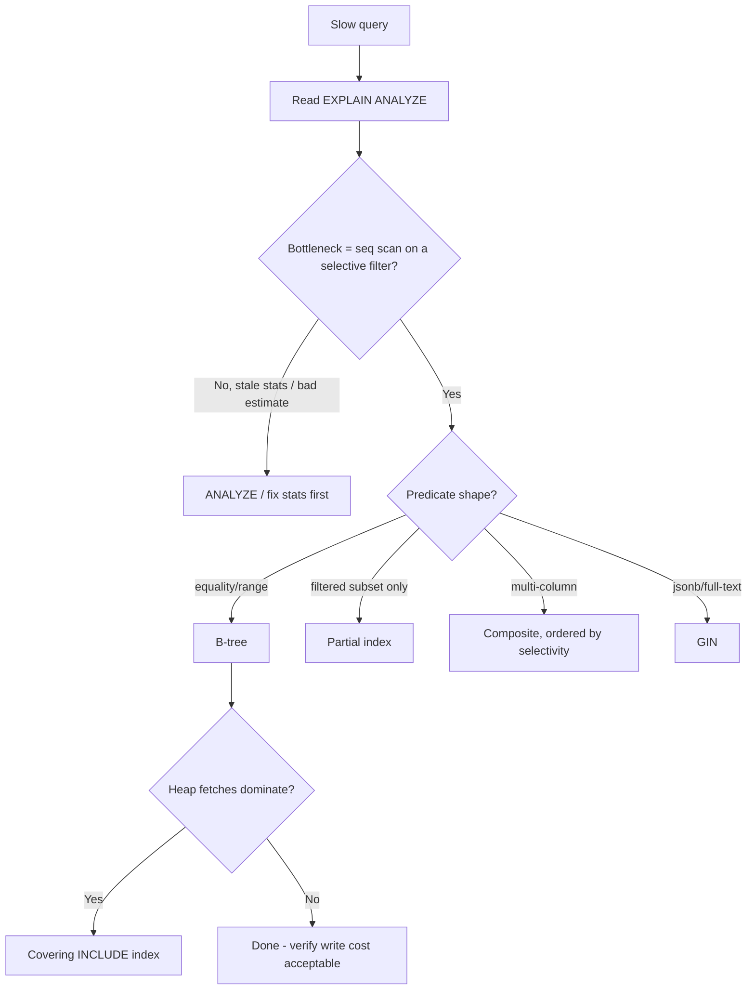
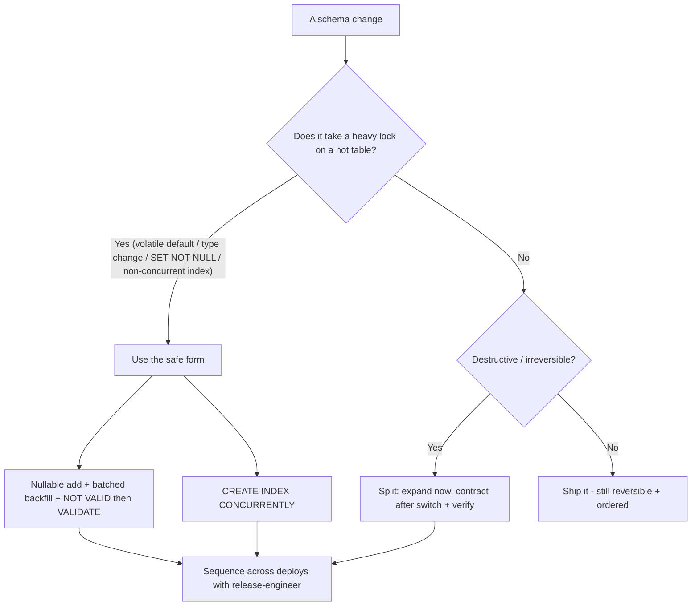

# Database Engineering — Decision Trees

_Decision trees + a dated capability map. Capability rows are `[verify-at-build]` — re-check against the vendor before quoting. Last reviewed: 2026-06-04._

Traverse before adding an index or running a migration.

## Decision Tree: Which index (or none)?

Read the plan first; match the index to the predicate; weigh the write cost.

_Function on the indexed column = non-sargable = the index won't be used. Rewrite instead._

## Decision Tree: Is this migration safe to run live?

Expand/contract and lock-awareness keep a migration off the outage list.

## Capability map (dated — verify at build)

| Capability | 2026 state `[verify-at-build]` | Notes |
|---|---|---|
| PostgreSQL | GA, current major | Leaned-on here; principles port |
| CREATE INDEX CONCURRENTLY | GA | Online index without long lock |
| ADD CONSTRAINT NOT VALID + VALIDATE | GA | Add FK/CHECK without long lock |
| Partial / covering (INCLUDE) / GIN indexes | GA | Match to predicate |
| PgBouncer / built-in pooling | mature | Size to workload |
| Logical + physical replication | GA | Read replicas eventually consistent |
| PITR | GA (managed + self) | Test the restore |
