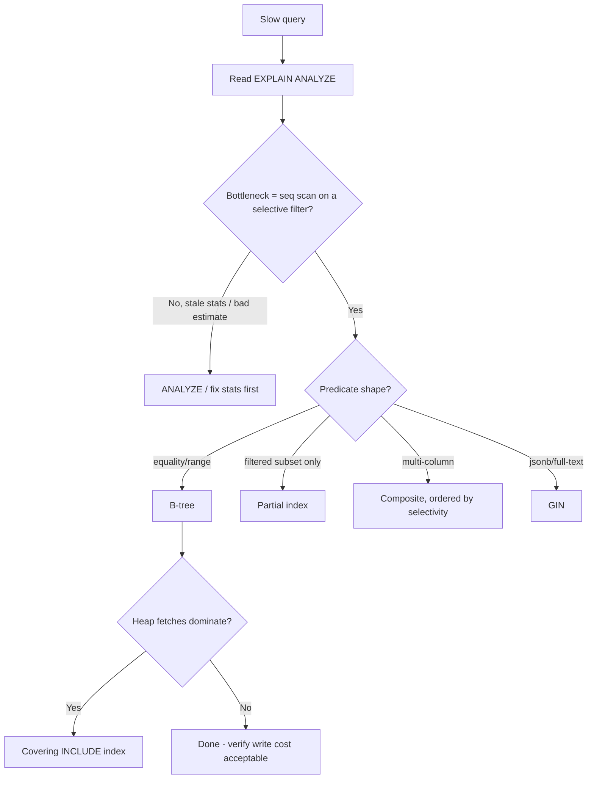
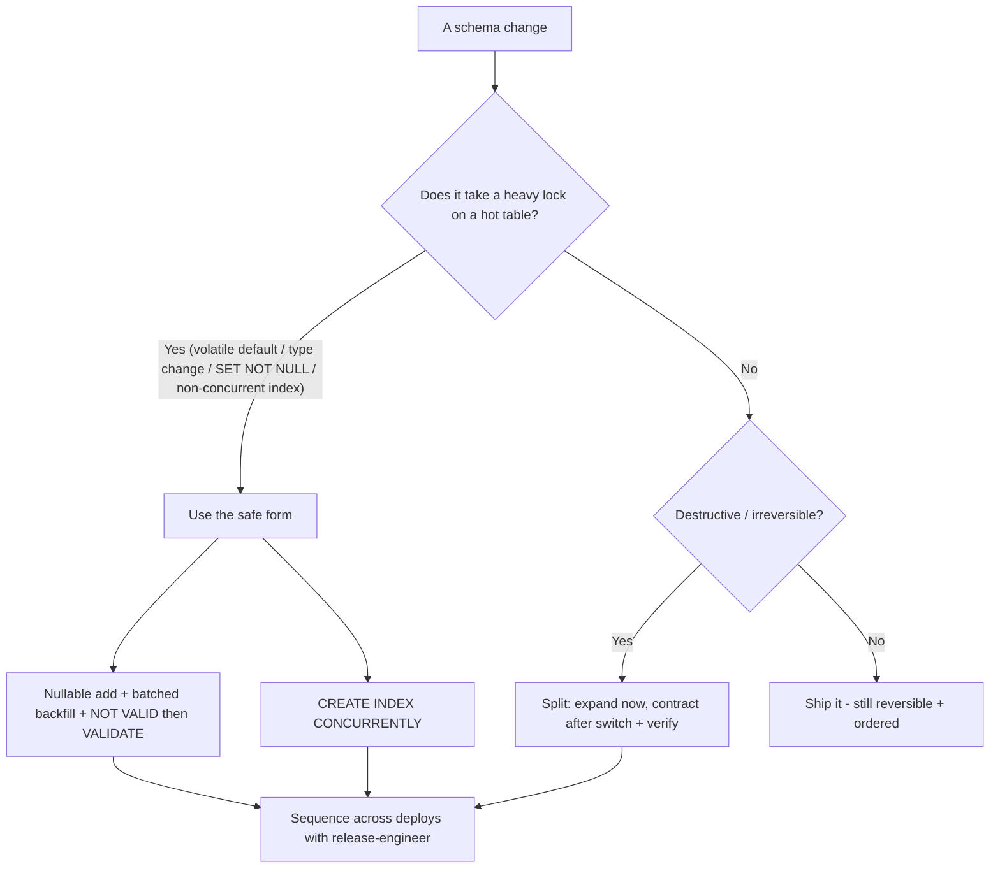
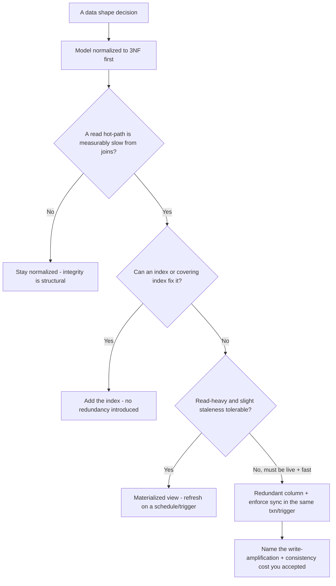
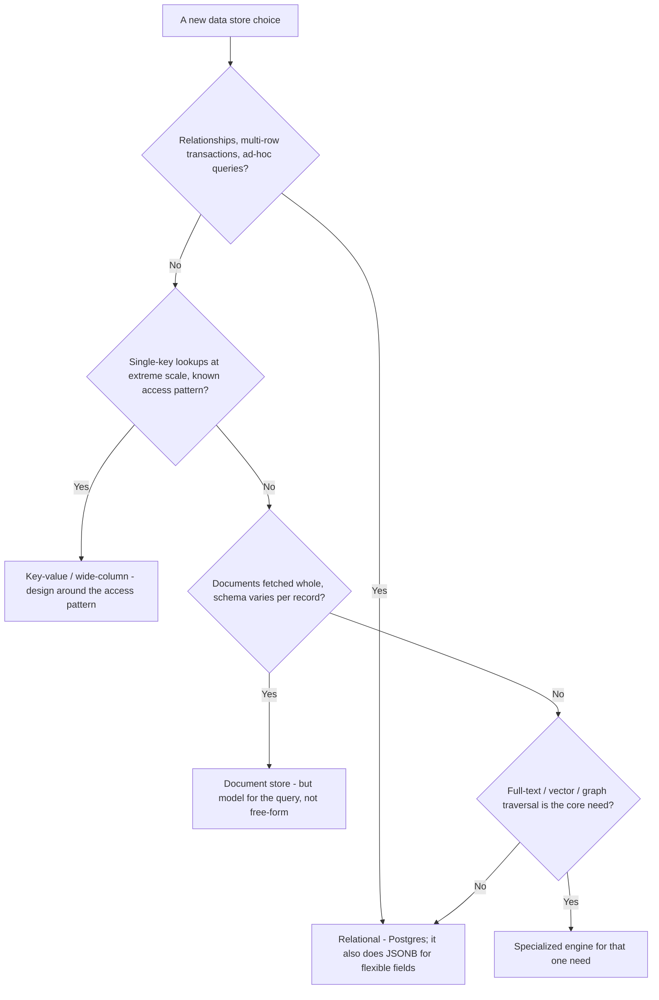
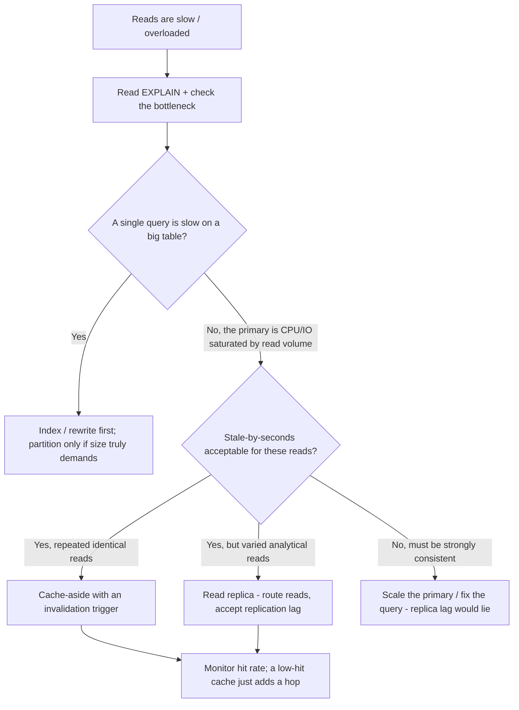
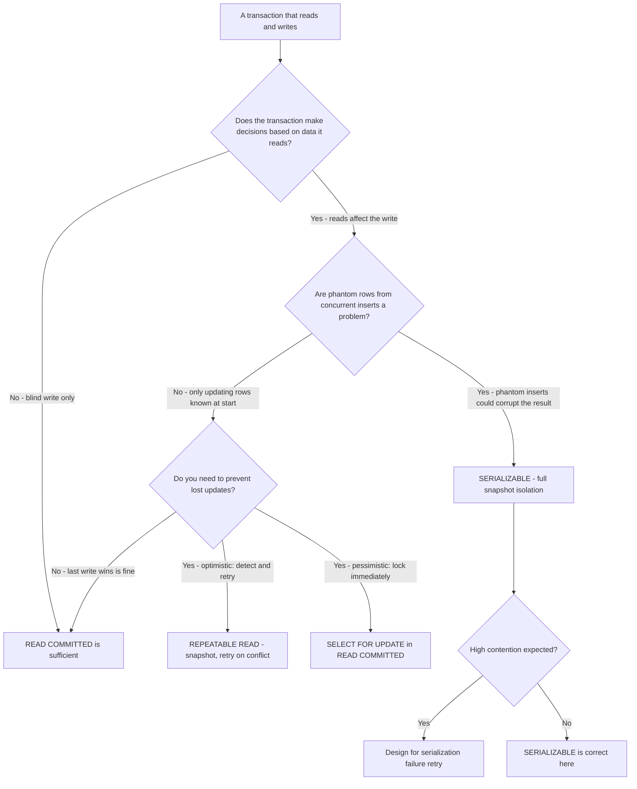
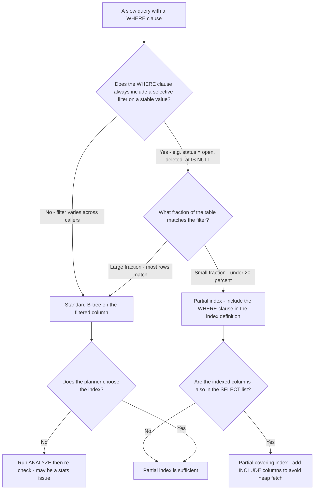
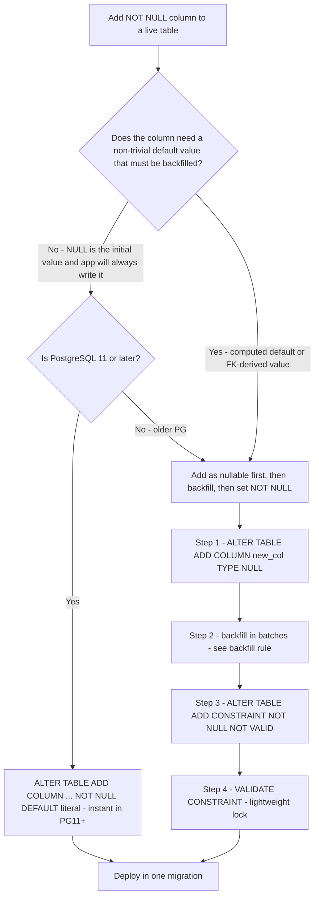

# Database Engineering — Decision Trees

_Decision trees + a dated capability map. Capability rows are `[verify-at-build]` — re-check against the vendor before quoting. Last reviewed: 2026-06-04._

Traverse before adding an index or running a migration.

## Decision Tree: Which index (or none)?

Read the plan first; match the index to the predicate; weigh the write cost.

_Function on the indexed column = non-sargable = the index won't be used. Rewrite instead._

## Decision Tree: Is this migration safe to run live?

Expand/contract and lock-awareness keep a migration off the outage list.

## Decision Tree: Normalize or denormalize this?

Default to 3NF; denormalize only with a measured read win and the write cost named.

_Prefer a covering index or materialized view over redundant columns; redundant columns are a consistency bug you must now maintain by hand._

## Decision Tree: SQL or NoSQL for this access pattern?

Start relational; choose a non-relational store only when the access pattern genuinely fits it.

_"NoSQL for flexibility" usually means an un-modeled relational schema; Postgres JSONB covers most flexible-field needs without giving up joins and transactions._

## Decision Tree: Scaling reads — replica, cache, or partition?

Read the plan first; each lever fixes a different bottleneck and they don't substitute.

_A replica adds eventual-consistency lag, a cache adds an invalidation problem, partitioning adds operational complexity — pick by the bottleneck the plan shows, not by reflex._

## Capability map (dated — verify at build)

| Capability | 2026 state `[verify-at-build]` | Notes |
|---|---|---|
| PostgreSQL | GA, current major | Leaned-on here; principles port |
| CREATE INDEX CONCURRENTLY | GA | Online index without long lock |
| ADD CONSTRAINT NOT VALID + VALIDATE | GA | Add FK/CHECK without long lock |
| Partial / covering (INCLUDE) / GIN indexes | GA | Match to predicate |
| PgBouncer / built-in pooling | mature | Size to workload |
| Logical + physical replication | GA | Read replicas eventually consistent |
| PITR | GA (managed + self) | Test the restore |

## Decision Tree: Which transaction isolation level?

**When this applies:** You are opening a transaction and need to decide which isolation level to use. Typically triggered when a race condition, lost update, or phantom-read anomaly is suspected or needs to be prevented by design.

**Last verified:** 2026-06-05 against PostgreSQL documentation on transaction isolation.

**Rationale per leaf:**
- *READ COMMITTED* — the PostgreSQL default; sees the latest committed version of each row; correct for most blind writes and simple reads.
- *REPEATABLE READ* — the transaction sees a snapshot from its start time; concurrent writes to the same rows fail with a serialization error you retry; good for optimistic patterns.
- *SELECT FOR UPDATE* — pessimistic lock; prevents concurrent updates without raising the isolation level; correct for "read-then-update" in READ COMMITTED.
- *SERIALIZABLE* — full snapshot isolation; prevents phantoms and write skew; the highest blast radius (retry on conflict); required when correctness depends on the total view of the dataset.

**Tradeoffs summary:**

| Method | Cost / time | Blast radius | Approval gate? | Use when |
|---|---|---|---|---|
| READ COMMITTED | Minimal | None | None | Default; blind writes or simple reads |
| SELECT FOR UPDATE | Low | Locks rows | None | Pessimistic read-then-update |
| REPEATABLE READ | Low-medium | Retry on conflict | None | Optimistic concurrent update |
| SERIALIZABLE | Medium | Retry on conflict | None | Phantom prevention or write skew |

## Decision Tree: When to add a partial index?

**When this applies:** You are adding an index to speed up a query and the query always includes a filter that selects a small subset of rows.

**Last verified:** 2026-06-05 against PostgreSQL documentation on partial indexes.

**Rationale per leaf:**
- *Partial index* — an index with a `WHERE` clause that matches the query's filter; smaller, faster to build, and cheaper to maintain than a full-table index on the same column.
- *Partial covering index* — adds `INCLUDE` columns so the query can be answered entirely from the index without a heap fetch; maximum read speed, slightly higher write and storage cost.
- *Standard B-tree* — when the filter is not selective enough to justify a partial index, a full index is the correct choice.

**Tradeoffs summary:**

| Method | Cost / time | Blast radius | Approval gate? | Use when |
|---|---|---|---|---|
| Standard B-tree | Low | Full index maintained | None | Filter varies or covers most rows |
| Partial index | Low-medium | Smaller, targeted | None | Selective stable filter, small subset |
| Partial covering | Medium | Wider index entry | Schema review | Read-heavy, avoid heap fetch |

## Decision Tree: Add a NOT NULL column to a live table — how?

**When this applies:** You need to add a column with a NOT NULL constraint to a table that is receiving concurrent writes. A naive ALTER TABLE will take a long lock and potentially block reads and writes for minutes on a large table.

**Last verified:** 2026-06-05 against PostgreSQL documentation on ALTER TABLE and lock behavior.

**Rationale per leaf:**
- *PG11+ instant default* — PostgreSQL 11 rewrote how constant defaults are stored; `ADD COLUMN ... DEFAULT constant NOT NULL` no longer rewrites the table; it is instant and safe.
- *Expand/contract for computed defaults* — when the default requires a backfill (a function, a JOIN-derived value), the expand/contract sequence spreads the change across safe, non-locking steps.
- *NOT VALID then VALIDATE* — `ADD CONSTRAINT NOT VALID` adds the constraint for new rows immediately without checking existing rows; `VALIDATE CONSTRAINT` checks existing rows under a ShareUpdateExclusiveLock (the lightest write-compatible lock) rather than an AccessExclusiveLock.

**Tradeoffs summary:**

| Method | Cost / time | Blast radius | Approval gate? | Use when |
|---|---|---|---|---|
| PG11+ instant default | Minimal | None | None | Constant default, PG11+ |
| Expand/contract | High - multi-deploy | Non-locking | Release coordination | Computed default or pre-PG11 |
