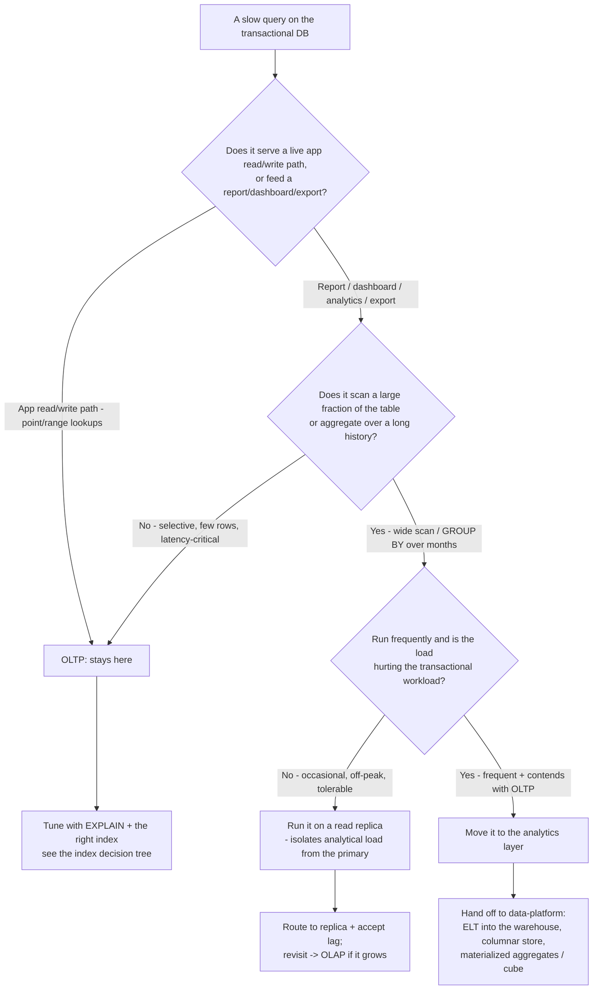
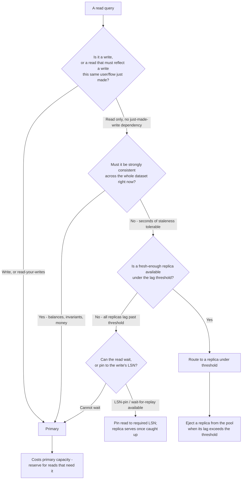

# OLTP/OLAP & Read-Routing Decision Trees

_Two decision trees for choices the existing [`database-engineering-decision-trees.md`](database-engineering-decision-trees.md) does not cover: **does this workload belong in the transactional store at all (OLTP vs OLAP)**, and **where does a given read go (primary vs which replica)**. These are architectural-priors trees, not version-volatile facts — but specific engine/topology capabilities marked `[verify-at-use]` move; re-check against the vendor before quoting. Last reviewed: 2026-06-05._

Traverse the relevant graph top-to-bottom **before** reaching for another index (OLTP/OLAP tree) or routing a read to a replica (read-routing tree). The first tree is the **seam to `data-platform`** drawn as a decision; the second operationalizes the "replication lag is a consistency risk" rule into a per-read routing call.

---

## Decision Tree: Is this an OLTP query or does it belong in OLAP?

**Default: the transactional database serves the application's reads and writes.** But a recurring class of "this query is slow, what index do I need?" tickets are actually **analytical** workloads — wide scans, aggregations over months of history, multi-table roll-ups — that no OLTP index makes fast and that *do* belong in the analytics store. Knowing which side of the line a query is on is the first decision, before any indexing work.

**How to read it:**

- **The litmus is the access shape, not the table size.** A point/range lookup that returns a handful of rows for the live app is OLTP no matter how big the table — fix it with the right composite/partial index. A query that *scans a large fraction* of the rows or aggregates over a long history is analytical; an OLTP B-tree index will not make a full-history `GROUP BY` fast, because the work is the scan + aggregation, not the lookup.
- **"It's slow, add an index" is the wrong first move for an analytical query.** No OLTP index makes a multi-month roll-up fast; you'll add indexes that are never used and still have a slow report. The fix is a different *store* (columnar/warehouse) or a pre-computed aggregate (materialized view), not another B-tree.
- **A read replica is the middle ground — and the seam's warning track.** An occasional analytical query that's tolerable but contends with OLTP can run on a read replica, isolating its scan from the primary's transactional load (accept the lag — see the read-routing tree). If that workload grows frequent or heavy, it has crossed into `data-platform`'s lane: ELT it into the warehouse rather than letting analytics squat on the transactional topology.
- **Don't bolt analytics onto OLTP indefinitely.** Materialized views and a replica buy time, but a real, growing analytical workload wants a columnar/warehouse store, dimensional modeling, and an ELT pipeline — all of which are `data-platform`'s craft, not more indexes here.

> **Seam:** the boundary with `data-platform` *is* this tree. The litmus from the team constitution — "serves the app's reads/writes → here; feeds dashboards → there" — drawn as a decision. `analytics-engineering` (dbt) owns the transformation layer on top of the warehouse once the workload has crossed over.

_Name the trade: keeping an analytical query on OLTP buys "one fewer system" and pays in contention, an index graveyard, and a report that never gets fast; moving it to OLAP buys query performance + isolation and pays in an ELT pipeline, eventual freshness, and a second store to operate._

---

## Decision Tree: Read routing — primary, or which replica?

**Default: writes and read-your-writes go to the primary; lag-tolerant reads go to a replica.** Once read replicas exist, every read is a routing decision, and the wrong call serves stale data (a lagging replica) or wastes the offload (everything on the primary). This tree turns the "replication lag is a consistency risk" rule into a per-read call.

**How to read it:**

- **Read-your-writes is the classic trap.** "Write to primary, then immediately read it back" lands on a lagging replica and shows the *old* value — even a few milliseconds of lag loses a just-committed write. Route read-your-writes flows to the primary, or use **LSN-pinning**: capture the write's log position and have the replica read wait until it has replayed past that position. `[verify-at-use]` — the exact LSN/wait-for-replay mechanism is engine- and driver-specific (Postgres `pg_last_wal_replay_lsn`, etc.); confirm against the deployed engine.
- **Strong-consistency reads (money, balances, invariants) go to the primary, full stop.** A replica's eventual consistency would let it lie about a value the business treats as authoritative. The lag is invisible until it isn't.
- **Eject lagging replicas from the read pool.** Monitor each replica's lag and remove it from rotation when it exceeds the freshness threshold for that read class, so a far-behind replica never silently serves user reads. A replica past threshold is worse than no replica — it returns wrong data confidently.
- **The primary is finite — that's why replicas exist.** Don't reflexively send everything to the primary "to be safe": that re-creates the saturation replicas were added to relieve. Push genuinely lag-tolerant reads (lists, search, dashboards, analytics) to replicas; reserve primary capacity for writes, read-your-writes, and strong-consistency reads.

> **Seam:** the application-side wiring that *implements* this routing (read/write splitting in the data-access layer, the ORM's replica config) is `backend-engineering`'s lane; this team owns the **topology and the routing rule**. The failover-durability posture (async vs synchronous replication, which replica gets promoted) is the operational complement — see the `replication-lag-stale-reads-after-failover` scenario.

_Name the trade: a replica buys read offload and pays in lag (a consistency risk you route around); the primary buys correctness and pays in finite capacity you must ration._

---

## Note — PostgreSQL 18 and the read-routing calculus (added 2026-06-25)

PostgreSQL 18 (released **2025-09-25**, the current major release) ships a new **asynchronous I/O subsystem** controlled by the `io_method` GUC (`worker` | `io_uring` | `sync`), with an `io_workers` GUC sizing the worker pool and a new `pg_aios` view for in-flight I/O. It delivers up to **~3x faster reads** in some scenarios (sequential scans, bitmap heap scans, vacuum). **This shifts read-routing math but does not eliminate the trade:** AIO accelerates **reads**, while **writes stay synchronous** — so a primary on PG18 can absorb more lag-tolerant read volume before you must offload to a replica, but it changes none of the consistency reasoning above (read-your-writes and strong-consistency reads still go to the primary; replicas still lag). PG18 also adds native **UUIDv7** (`uuidv7()`) — timestamp-ordered keys with better index locality than v4 — and **OAuth 2.0** authentication. `[verify-at-use]` — the LSN/wait-for-replay mechanism noted above (`pg_last_wal_replay_lsn`) is unchanged in 18; confirm against the deployed engine.

Source: [PostgreSQL 18 Released!](https://www.postgresql.org/about/news/postgresql-18-released-3142/) (retrieved 2026-06-25).

## See also

- [`database-engineering-decision-trees.md`](database-engineering-decision-trees.md) — index choice, migration safety, normalize/denormalize, SQL-vs-NoSQL, scaling reads, isolation level, partial index, online NOT NULL add.
- [`../best-practices/replication-lag-is-a-consistency-risk.md`](../best-practices/replication-lag-is-a-consistency-risk.md) — the canonical rule this read-routing tree operationalizes.
- [`../CLAUDE.md`](../CLAUDE.md) §3 (seams) — the `data-platform` boundary the OLTP/OLAP tree draws.
