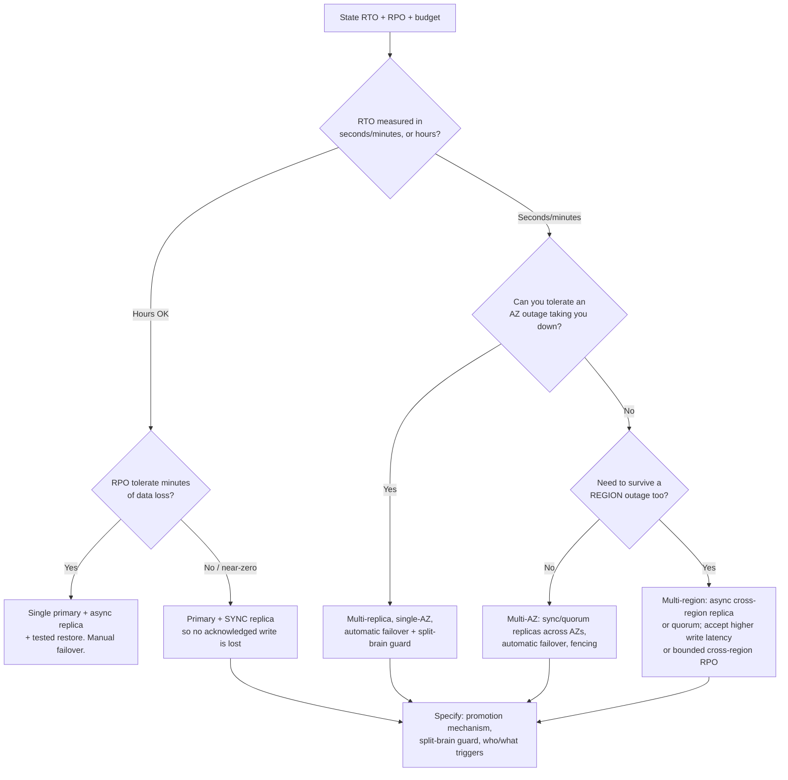
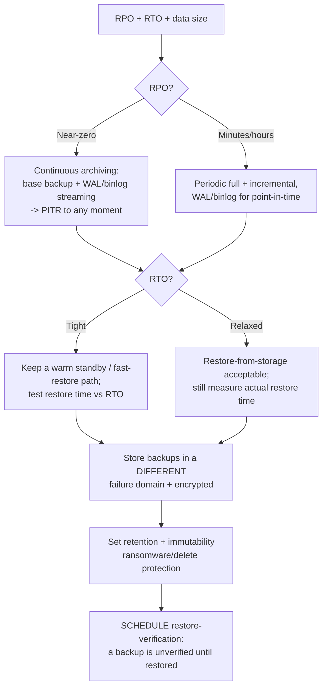
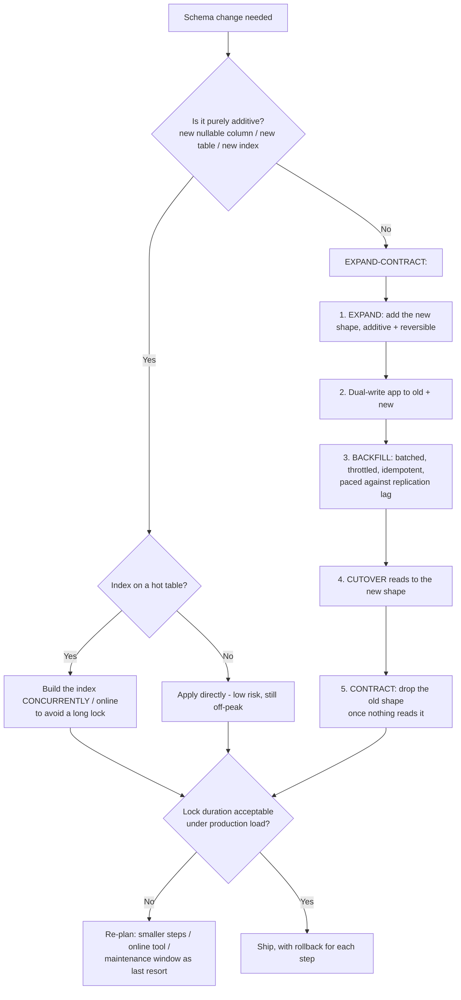
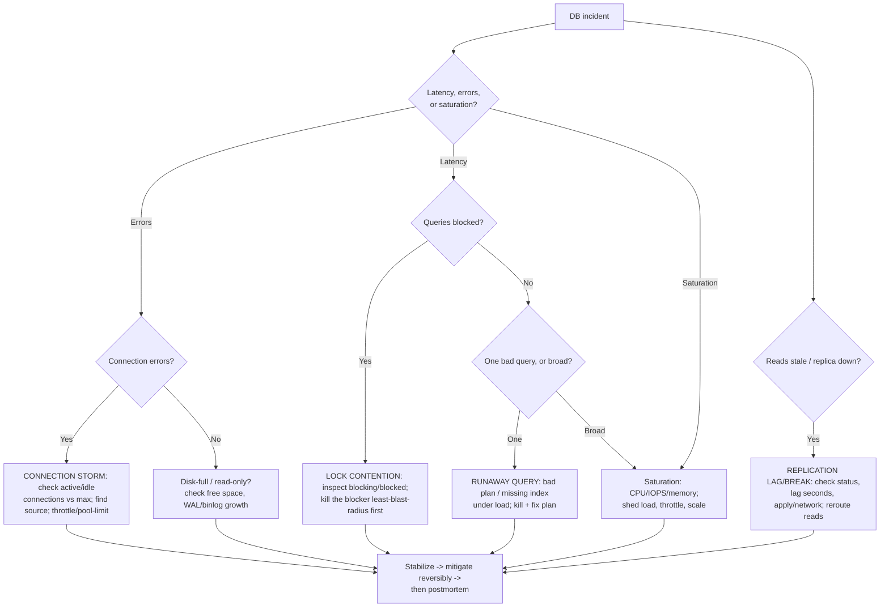

# DBRE decision trees

Four Mermaid decision trees the agents traverse. Each ends at a leaf you can act
on; **record the path and the runner-up** when you use one. These encode *durable*
reliability craft — the tradeoffs move slowly. Volatile facts (engine HA feature
matrices, managed-service SLAs, tool flags) live in
[`dbre-2026-reference.md`](dbre-2026-reference.md), retrieval-dated.

Two definitions used throughout:
- **RPO (Recovery Point Objective):** how much data you can afford to lose (drives
  *backup/replication cadence*).
- **RTO (Recovery Time Objective):** how long you can be down (drives *topology and
  restore approach*).

---

## §1 — HA topology selection

Start from the availability target, not from a favorite architecture.

Rules: a replica in the **same failure domain** as the primary is not HA. Design
the **failover mechanism** (promotion + split-brain guard: fencing / quorum /
STONITH), not just the replica. Synchronous replication protects RPO but costs
write latency — choose it deliberately.

---

## §2 — Backup & recovery strategy

A backup exists to be *restored*. Design backward from RTO/RPO.

Rule: **a backup is unverified until a restore is tested.** Untested backups fail
exactly when you need them. Bake a restore-verification cadence in, measure real
restore time against RTO, and keep backups in a separate, immutable, encrypted
location.

---

## §3 — Schema-migration safety (zero-downtime)

Default to **expand-contract**. Never a destructive change in one step.

Rules: watch **lock duration** — a brief ACCESS EXCLUSIVE lock on a hot table is an
outage. Backfills are **batched, throttled, idempotent, resumable**, never one big
`UPDATE`. Each step is individually reversible.

---

## §4 — Incident triage

Classify first, then reach for the failure-mode diagnostic. Stabilize before full
root-cause.

Rule: **least blast radius first** — kill one query before restarting the instance;
throttle one source before failing over. Every failure mode has a diagnostic
view/query — look before you act. After the bleeding stops, blameless postmortem
with contributing factors, not a single root cause.
