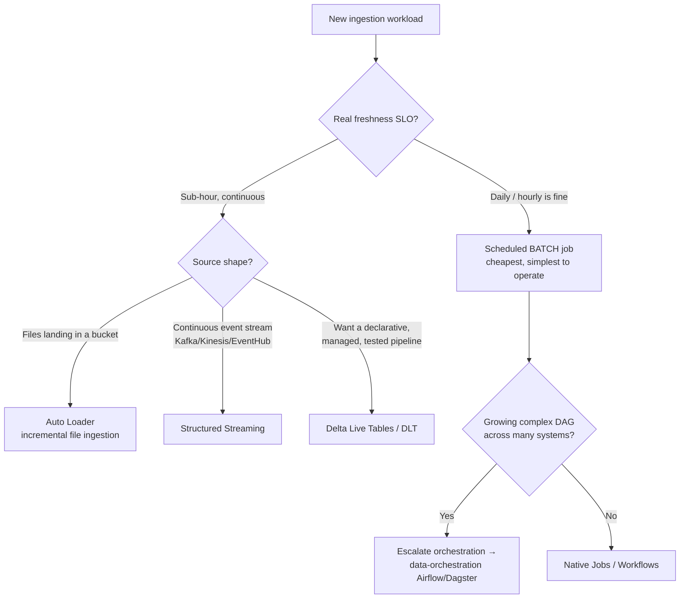
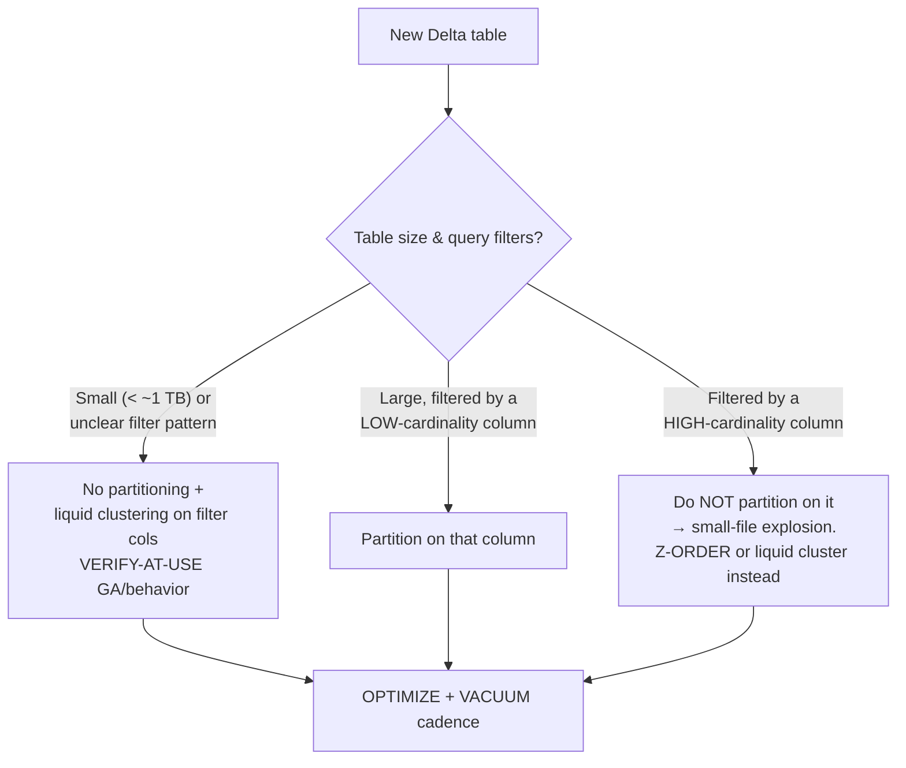
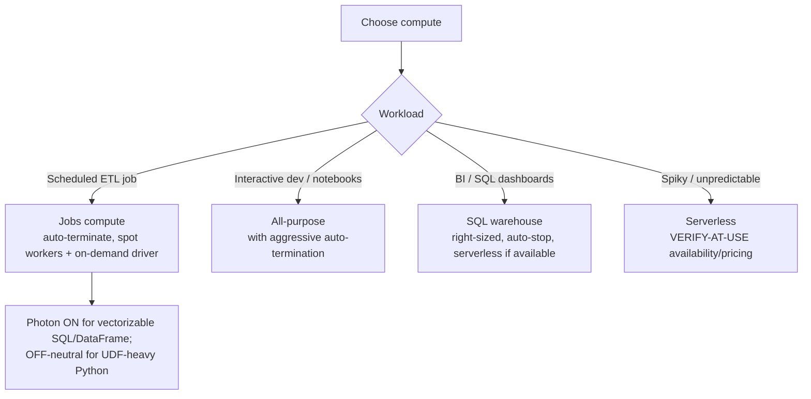

# Databricks Lakehouse — Decision Trees

> Last reviewed: 2026-07-20. Confidence: **HIGH** for the durable engineering patterns (medallion, Delta table design, batch-vs-streaming, skew/spill diagnosis, DBU cost drivers); **VERIFY-AT-USE** for every version-specific fact (DBR runtime versions, feature GA status such as liquid clustering / predictive optimization / serverless availability, and all DBU/list pricing). Numbers move often — re-verify against current Databricks docs before a commitment.

The agents traverse these before naming a primitive. Do not brand-match "streaming" / "Photon" / "DLT" to a request a simpler, cheaper primitive serves.

## 1. Batch vs streaming — the freshness gate

**Rule:** batch is the default. Streaming is earned by a real sub-hour SLO, not by the word "real-time." Streaming triples the operational surface (checkpoints, state, backpressure, exactly-once).

## 2. Medallion layering — what each layer earns

| Layer      | Contents                                       | Write pattern                      | Keep it when                                        |
| ---------- | ---------------------------------------------- | ---------------------------------- | --------------------------------------------------- |
| **Bronze** | Raw, append-only, schema-on-read, immutable    | Append (replayable landing zone)   | Always — it's your replay/audit anchor              |
| **Silver** | Conformed, deduped, validated, typed           | MERGE/upsert, CDC                  | Always — the clean canonical model                  |
| **Gold**   | Business aggregates / serving tables           | Overwrite or MERGE, shaped to read | When a consumer (BI/ML/API) reads it at that shape  |

Don't collapse bronze→silver to save a hop when replay/audit value is real. Don't add a gold table no reader queries.

## 3. Delta table design — partitioning & layout

**The most common self-inflicted wound: over-partitioning.** A high-cardinality partition column creates millions of tiny files, slowing every query — the opposite of the intent. Target reasonable file sizes; compact with `OPTIMIZE`; `VACUUM` with a safe retention (respecting time-travel / concurrent readers).

## 4. Slow/failing Spark job — read the evidence, then fix

| Spark UI symptom                              | Likely cause                        | Fix (evidence-driven, not guessed)                          |
| --------------------------------------------- | ----------------------------------- | ----------------------------------------------------------- |
| One task runs 100× longer than its stage peers | **Data skew** on a hot key          | AQE skew join / salting / broadcast the small side          |
| Heavy **shuffle spill** to disk               | Too-few partitions / wide shuffle   | Increase shuffle partitions; let AQE coalesce; reduce shuffle |
| Millions of tiny files, slow scans            | **Small-file** problem              | `OPTIMIZE`/compaction; right-size writes; auto-optimize      |
| Sort-merge join on a small dim table          | Missing **broadcast**               | `broadcast()` hint (within the broadcast threshold)         |
| **Driver OOM**                                | `collect()` / `toPandas()` on big DF | Write to a table / stream; don't pull to the driver         |
| Executor OOM, high GC                         | Oversized partitions / caching bloat | Repartition; cache selectively; size executors correctly     |

**Rule:** read the Spark UI (stages, task-time distribution, shuffle read/spill, GC) and the query plan (AQE, join type, partition pruning) _before_ proposing a tuning fix. `spark.conf` knob-twiddling is the last resort.

## 5. Compute & DBU cost — the leak points

**Top DBU cost drivers (design these out first):**

1. **Idle always-on compute** — clusters/warehouses left running. Fix: auto-termination, auto-stop, right-sized scaling.
2. **Oversized always-on SQL warehouses** for light BI.
3. **Small-file shuffle** and un-compacted tables burning scan time.
4. **Photon premium on a job it doesn't accelerate** (UDF-bound Python).
5. **All-purpose compute for scheduled jobs** instead of cheaper jobs compute.

Every DBU/list-price figure is **VERIFY-AT-USE + dated** — pricing and SKUs change.

## 6. Seams to adjacent plugins

| Boundary                                              | Owner                                    |
| ----------------------------------------------------- | ---------------------------------------- |
| dbt / semantic-layer modeling of the gold layer       | `analytics-engineering`                  |
| External orchestration (Airflow/Dagster), complex DAGs | `data-orchestration`                     |
| Org-wide privacy / PII classification / retention     | `data-governance-privacy`                |
| Data tests / expectations / freshness monitors        | `data-quality-observability`             |
| Model training / serving / feature store lifecycle    | `ml-engineering`                         |
| Job SLOs, alerting, on-call                            | `observability-sre`                      |
| Cross-cloud spend beyond DBUs                          | `finops-cloud-cost`                      |
| **Microsoft Fabric / OneLake** (a different platform) | `microsoft-fabric`                       |
| Generic, non-Databricks ETL scaffolding               | `data-platform`                          |
