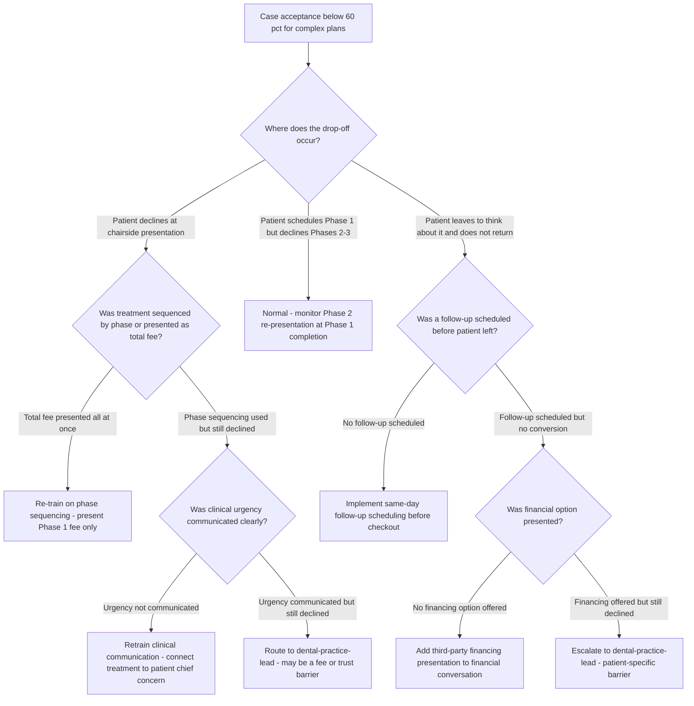
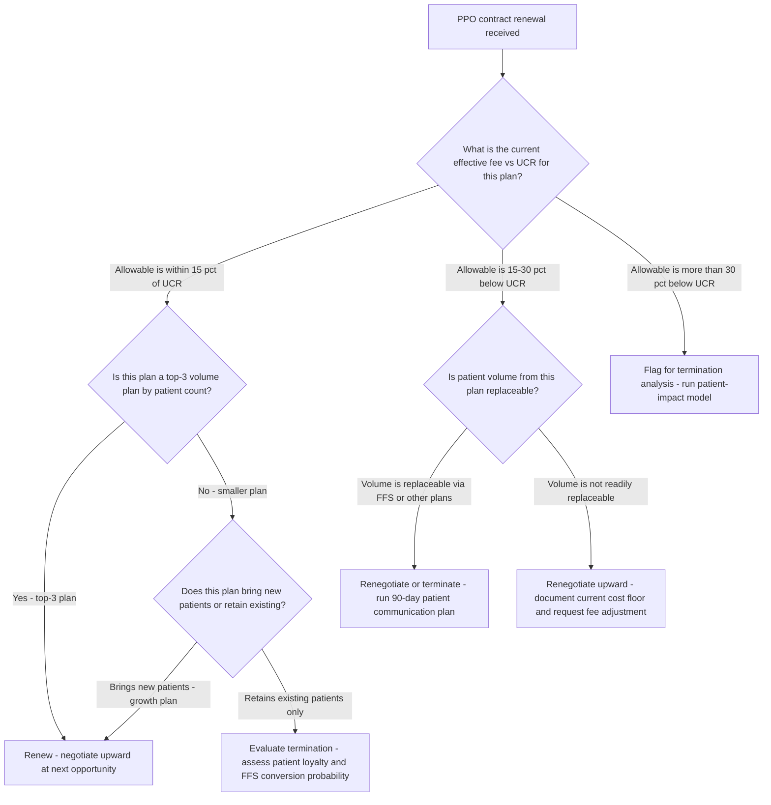
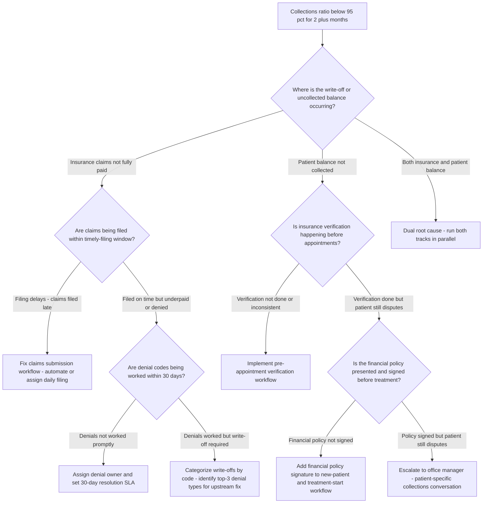

# Dental practice decision trees

Which analysis for which symptom — traverse top-to-bottom before picking a method.

## Decision Tree: Take-home is down

1) Benchmark overhead (§3 #1). 2) Check the collection ratio (§3 #2). 3) Check case acceptance (§3 #3). 4) Read production per hour and hygiene (§3 #4, #5).

## Decision Tree: Big plans don't close

1) Measure acceptance by plan type (§3 #3). 2) Find the presentation/sequencing drop-off. 3) Re-sequence with financial options.

## Decision Tree: Margin erodes despite volume

1) Read effective fee by payer (§3 #6). 2) Map the PPO mix. 3) Decide the mix deliberately.

## How to read these trees

Traverse top-to-bottom and stop at the first matching branch — the order encodes the cheap-checks-before-expensive-checks discipline (§3). Each leaf names a skill, a specialist, or a house-opinion to apply. Never skip a higher branch because a lower one looks more interesting; a denominator, seasonal, or definitional artifact masquerades as a finding more often than not.

## Decision Tree: Which skill for which task

- **Benchmark overhead** → use when: Read overhead as a % of collections against the ~62% median before cutting any single cost, so the diagnosis targets the real driver. ([`../skills/benchmark-overhead/SKILL.md`](../skills/benchmark-overhead/SKILL.md))
- **Protect the collection ratio** → use when: Read banked-vs-produced dollars and recover the collection ratio toward 98%+, so production becomes income. ([`../skills/protect-the-collection-ratio/SKILL.md`](../skills/protect-the-collection-ratio/SKILL.md))
- **Lift case acceptance** → use when: Raise treatment-plan acceptance through presentation and sequencing rather than discounting. ([`../skills/lift-case-acceptance/SKILL.md`](../skills/lift-case-acceptance/SKILL.md))
- **Read production per hour** → use when: Read doctor and hygiene production per hour, not per day, to expose the real capacity story. ([`../skills/read-production-per-hour/SKILL.md`](../skills/read-production-per-hour/SKILL.md))
- **Manage the PPO payer mix** → use when: Read the effective fee by plan and manage PPO write-offs as a deliberate strategy, not an accident. ([`../skills/manage-the-payer-mix/SKILL.md`](../skills/manage-the-payer-mix/SKILL.md))

## Decision Tree: Which specialist owns this

- **The engagement** → [`dental-practice-lead`](../agents/dental-practice-lead.md)
- **Case acceptance** → [`clinical-treatment-planner`](../agents/clinical-treatment-planner.md)
- **The revenue cycle** → [`dental-rcm-specialist`](../agents/dental-rcm-specialist.md)
- **The economics** → [`dental-operations-analyst`](../agents/dental-operations-analyst.md)

When two leaves apply, route to the **lead** first to scope and sequence — overlapping symptoms usually mean two drivers at once, and the lead keeps the analysis from collapsing into a single-cause story.

## Decision Tree: Which house-opinion gates the call

Before picking any method, check whether one of the standing biases (§3) already decides the framing:

1. Overhead is the master margin number — if this is in question, apply §3 #1 before any method.
2. Collections, not production, pay the bills — if this is in question, apply §3 #2 before any method.
3. Case acceptance is presentation, not price — if this is in question, apply §3 #3 before any method.
4. Production per hour is the capacity lens — if this is in question, apply §3 #4 before any method.
5. The hygiene department is a profit engine, not a loss leader — if this is in question, apply §3 #5 before any method.
6. PPO write-offs are a strategy decision, not an accident — if this is in question, apply §3 #6 before any method.
7. Read the DSO-vs-independent position honestly — if this is in question, apply §3 #7 before any method.
8. Cite the source and date for every benchmark — if this is in question, apply §3 #8 before any method.

## Escalation & guardrails

- Anything touching client PII / regulated records → stop and route to `ravenclaude-core` `security-reviewer`.
- Any external figure entering a deliverable → carry a source URL + retrieval date, or mark it `[unverified — training knowledge]` / `[ESTIMATE]` (§3, final house opinion).
- A recommendation ships only with an owner, a date, and an expected metric movement.
## Sourcing note

Figures in this file are from the author's domain knowledge and are marked `[unverified — training knowledge]` or `[ESTIMATE]` at point of use. Validate against a primary source before putting any figure in a client deliverable (§3 cite-or-mark rule).

---

## Decision Tree: Dental Practice — Why Case Acceptance Is Below Target

**When this applies:** Case acceptance rate for complex restorative treatment plans is below 60%, or the dentist reports that "patients are not accepting big cases." The clinical-treatment-planner or dental-practice-lead needs to identify the root cause before recommending an intervention.

**Last verified:** 2026-06-05 against standard dental case-acceptance consulting frameworks.

**Rationale per leaf:**
- *Normal - monitor Phase 2 re-presentation* — patients completing Phase 1 who decline later phases is expected; re-present at Phase 1 completion, not at initial presentation.
- *Re-train on phase sequencing* — sticker shock from total-fee presentation is the most common fixable case acceptance problem; phase sequencing is the primary remedy.
- *Implement same-day follow-up scheduling* — a "let me think about it" patient without a scheduled follow-up has a very low conversion rate; anchor the next contact before they leave.
- *Retrain clinical communication* — if the patient does not understand why the treatment is needed now, urgency is not landing; connect to their stated concern.
- *Route to dental-practice-lead* — persistent decline despite good presentation and clinical urgency suggests a fee, trust, or competitive barrier that needs engagement-level framing.
- *Add third-party financing* — many treatment declines are financial, not clinical; presenting a monthly payment option often converts a "no" to a "yes."
- *Escalate to dental-practice-lead* — unresolved after all standard levers; may require patient-specific outreach or practice-level positioning review.

**Tradeoffs summary:**

| Method | Cost / time | Blast radius | Approval gate? | Use when |
|---|---|---|---|---|
| Phase sequencing retraining | Low - training session | Small | Dentist + team lead | Total-fee presentation confirmed as root cause |
| Clinical communication retraining | Low - training session | Small | Dentist | Urgency not landing at chairside |
| Follow-up scheduling protocol | Low - workflow change | Small | Front desk + team lead | Patients leaving without scheduled follow-up |
| Third-party financing addition | Medium - vendor setup | Medium | Owner approval | Financial barrier confirmed |

---

## Decision Tree: Dental Practice — How to Respond to a PPO Contract Renewal Offer

**When this applies:** A PPO plan has sent a contract renewal with proposed fee schedule changes, or the practice is evaluating whether to renew, renegotiate, or terminate a PPO relationship. The dental-rcm-specialist or dental-practice-lead needs a structured path.

**Last verified:** 2026-06-05 against standard dental PPO contract management practice.

**Rationale per leaf:**
- *Renew - negotiate upward at next opportunity* — top-volume or growth-engine plans should be retained; negotiate incrementally at each renewal rather than accepting the first offer.
- *Flag for termination analysis* — allowables more than 30% below UCR typically represent a cost-of-service loss on many procedures; run a patient-impact model before deciding.
- *Renegotiate or terminate* — if patient volume is replaceable, a plan with deep write-offs is a margin drain; structured termination with patient communication is the right path.
- *Renegotiate upward - document cost floor* — when volume is not replaceable, negotiate from a cost basis, not from "we want more" — documented procedure costs strengthen the ask.
- *Evaluate termination - assess patient loyalty* — retention-only plans with deep write-offs may have high patient loyalty; model the FFS conversion rate before terminating.

**Tradeoffs summary:**

| Method | Cost / time | Blast radius | Approval gate? | Use when |
|---|---|---|---|---|
| Renew as offered | Minimal | Minimal | Owner sign-off | Strong plan, allowable within 15% of UCR |
| Renegotiate upward | Low - letter and follow-up | Small | Owner + billing manager | Allowable is negotiable and volume is important |
| Structured termination | Medium - 90-day notice + patient communication | Large - patient attrition risk | Owner decision | Allowable below cost floor, volume replaceable |

---

## Decision Tree: Dental Practice — Diagnosing a Collections Ratio Below 95%

**When this applies:** The practice's collections ratio (collections ÷ adjusted production, i.e., net of contractual write-offs) is below 95% for two or more consecutive months. The dental-rcm-specialist needs to identify the upstream cause.

**Last verified:** 2026-06-05 against standard dental billing and RCM practice.

**Rationale per leaf:**
- *Dual root cause - run both tracks* — when both insurance and patient balance contribute, serial diagnosis misses half the problem; run parallel tracks.
- *Fix claims submission workflow* — late filing is a process failure, not a payer problem; automation or daily filing assignment is the fix.
- *Implement pre-appointment verification* — most patient balance disputes trace to incorrect patient portion at checkout, which originates in missing verification.
- *Assign denial owner and set SLA* — unworked denials are the most common cause of insurance collections gaps; ownership and a timeline fix the behavior.
- *Categorize write-offs by denial type* — a write-off that recurs on the same denial code is a systemic process issue, not a one-off; top-3 categories drive the upstream fix.
- *Add financial policy signature* — unacknowledged financial responsibility is the primary patient balance dispute driver; a signed policy eliminates most disputes.
- *Escalate to office manager* — persistent individual patient disputes after policy acknowledgment require a direct conversation, not a billing workflow change.

**Tradeoffs summary:**

| Method | Cost / time | Blast radius | Approval gate? | Use when |
|---|---|---|---|---|
| Claims submission workflow fix | Low - process change | Small | Billing manager | Filing delays confirmed as root cause |
| Pre-appointment verification | Low-medium - training and workflow | Medium | Front desk lead + owner | Verification gaps confirmed |
| Denial management SLA | Low - assignment + tracking | Small | Billing manager | Unworked denials confirmed |
| Financial policy workflow | Low - form and script update | Small | Owner approval | Patient balance disputes on uncommunicated responsibility |
