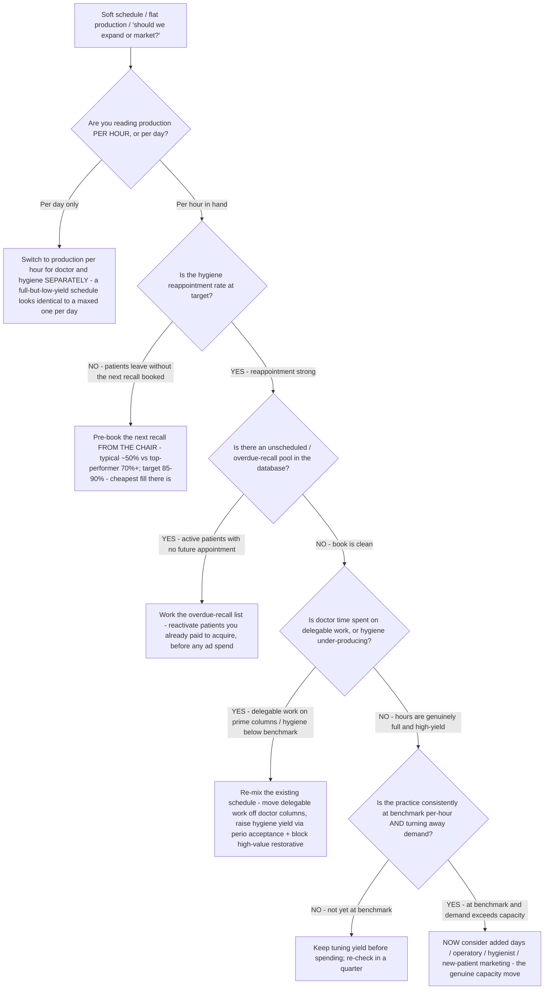

# Dental capacity decision tree — fill the schedule before you expand it (hygiene recall, re-mix, then add)

**Last reviewed:** 2026-06-05 · **Confidence:** medium (dental-economics + KPI trade sources, web-verified this date). Reappointment targets, per-hour benchmarks, and hygiene-share figures are practice- and segment-dependent — they carry inline `[verify-at-use]` markers and must be calibrated to the practice's patient base and procedure mix before any deliverable (CLAUDE.md §3 #8).

> Canonical decision tree for the `dental-operations-analyst` (the economics / capacity) with a clinical assist from `clinical-treatment-planner` (perio acceptance, treatment hand-offs). Traverse top-to-bottom before recommending a capacity move — a new operatory, more days, or new-patient marketing. The order encodes the house discipline: **fill and re-mix the hours you already own before buying more** (CLAUDE.md §3 #4 — production per hour is the capacity lens; §3 #5 — hygiene is a profit engine). The most expensive moves (marketing spend, expansion) sit at the bottom on purpose.

---

## When this applies

A practice has soft spots in the schedule, "feels busy" but production is flat, or someone has proposed adding days, an operatory, a hygienist, or new-patient marketing. Use this before any of those — the cheapest capacity is usually retained patients and re-mixed hours, not acquired patients or added supply.

## The tree



## Rationale per leaf (cheapest → most expensive)

- **Read per hour first** — a schedule that looks full per day can be full of low-yield blocks. Dentist production runs ~**$475–$575/hr** (high performers **$700+**) and hygiene ~**$145–$175/hr** (a healthy hygienist produces ~**3–3.5× their hourly wage**) [verify-at-use]. Per-hour exposes whether "busy" means "producing." (CLAUDE.md §3 #4.)
- **Pre-book recall from the chair (the cheapest fill)** — hygiene reappointment commonly sits near **~50%** at typical practices vs **70%+** at top performers, with KPI sources citing an **85–90%+** target [verify-at-use]. Booking the next recall before the patient leaves the chair — not "we'll call you" — is the single highest-leverage retention habit. An under-booked hygiene schedule is unbooked margin already paid for (CLAUDE.md §3 #5).
- **Work the overdue-recall list** — active patients with no future appointment are a recoverable book sitting in the practice's own database; reactivation is cheaper than acquisition. Size the pool before spending on ads.
- **Re-mix the existing hours** — move doctor-delegable work off prime columns, block high-value restorative time, and raise hygiene yield (perio acceptance, hand-offs to restorative). Hygiene should contribute ~**25%** of total production at the ADA baseline, **30–33%** at high performers [verify-at-use]; an under-running hygiene department is the largest recoverable lever before expansion.
- **Tune before you spend** — if per-hour yield is still below benchmark, keep tuning; expanding multiplies a low-yield pattern.
- **Expand / market (the most expensive move)** — only when the practice is at benchmark per-hour, hygiene is at target, the database is worked, **and** genuine demand exceeds capacity. New-patient marketing is the most expensive growth lever — earn the right to it by closing the back-door leaks first.

## The capacity test (the load-bearing arithmetic)

Capacity is hours × yield-per-hour, not chairs. Before adding supply, confirm:

```
recoverable capacity ≈ (target_reappointment − actual) × hygiene_visits   [retained-patient fill]
                      + overdue_recall_pool                               [reactivation fill]
                      + (benchmark_$/hr − actual_$/hr) × booked_hours      [yield fill]
```

Exhaust those three before the expansion math. The variable that flips "expand" to "re-mix" is **yield per hour** — a full schedule at low yield is mis-allocated capacity, not a capacity shortage.

## Gotchas

- **"Booked solid" is a volume signal, not a yield signal** — divide by hours before concluding you're at capacity.
- **New-patient marketing for a soft hygiene schedule is the most expensive answer to the cheapest problem** — measure reappointment and the overdue pool first.
- **Hygiene is not a loss leader** — it screens for restorative, drives perio, and produces margin; staffing it down to "save cost" cuts the funnel (CLAUDE.md §3 #5).
- **Re-mix can't fix a yield problem caused by payer mix** — if effective fee is the real drag, cross-check [`dental-ppo-vs-ffs-decision-tree.md`](dental-ppo-vs-ffs-decision-tree.md).

## Escalation & guardrails

- Perio diagnosis / treatment appropriateness → [`clinical-treatment-planner`](../agents/clinical-treatment-planner.md) (decision-support for the licensed dentist, never an order — CLAUDE.md §2).
- Staffing/employment specifics for a hygienist hire → out of scope; route to the practice's HR/legal counsel (CLAUDE.md §2).
- Whole-P&L impact of an expansion → [`dental-operations-analyst`](../agents/dental-operations-analyst.md). The `../scripts/dental_calc.py hygiene-capacity` mode sizes the recoverable fill.
- Every figure entering a deliverable carries a source URL + retrieval date or an `[unverified — training knowledge]` / `[ESTIMATE]` mark (CLAUDE.md §3 #8).

## Sources (retrieved 2026-06-05)

- Dental Economics — *The successful hygiene department: Understanding the numbers*: https://www.dentaleconomics.com/science-tech/article/16391556/the-successful-hygiene-department-understanding-the-numbers
- Dentx — *How Much Should a Hygienist Produce Per Day?* (3–3.5× wage; hygiene share): https://dentx.ca/blog/dental-hygiene-production-benchmarks/
- Dental Intelligence — *Performance Board: Hygiene Re-Appointment* (~50% typical vs 70%+ top): https://learn.dentalintel.com/en/articles/6070096-performance-board-hygiene-re-appointment
- Adams Brown CPA — *Top KPIs to track in your dental practice* (reappointment, recall): https://www.adamsbrowncpa.com/blog/top-6-kpis-to-track-in-your-dental-practice/
- Titan Web Agency — *Dental Practice Financials: Benchmarks, Overhead, and Profit* (production/hr): https://blog.titanwebagency.com/dental-practice-financials
