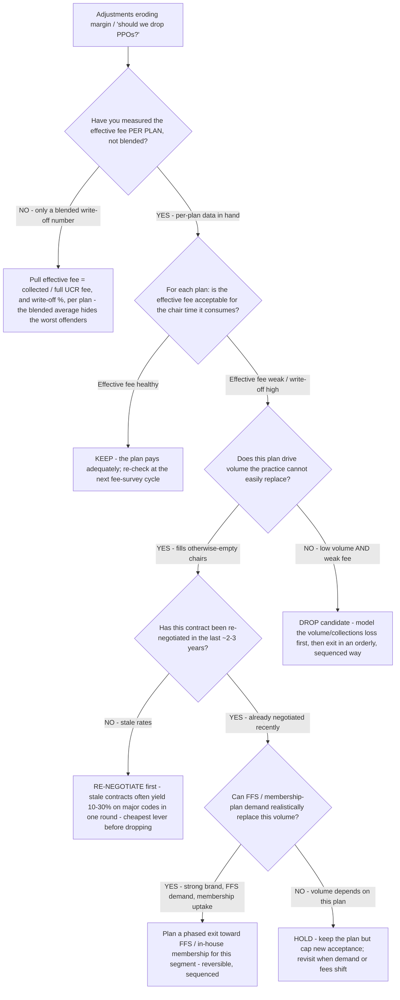

# Dental payer-mix decision tree — keep, re-negotiate, or drop a PPO (and the FFS question)

**Last reviewed:** 2026-06-05 · **Confidence:** medium (ADA HPI + dental-economics trade sources, web-verified this date). Write-off ranges, effective-fee thresholds, and negotiation-lift figures are practice- and contract-dependent — they carry inline `[verify-at-use]` markers and must be validated against the practice's own ledger and contracts before any deliverable (CLAUDE.md §3 #8).

> Canonical decision tree for the `dental-rcm-specialist` (the revenue cycle) with an economics assist from `dental-operations-analyst`. Traverse top-to-bottom before recommending a payer move. The decision is **not** "PPOs bad, FFS good" — it is a per-plan effective-fee × volume × strategic-value trade where the right move is usually **re-negotiate the worst high-volume contracts first**, drop selectively, and go FFS only where the volume can be replaced. This is decision-support for the practice owner, not a coding/insurance authority (CLAUDE.md §2).

---

## When this applies

A practice's adjustments line is growing, take-home is slipping despite healthy production, or someone has proposed "drop the PPOs and go fee-for-service." Use this before keeping, re-negotiating, or dropping any plan — and before a blanket FFS switch that could shed volume the practice can't yet replace. PPO write-offs are a **strategy decision, not an accident** (CLAUDE.md §3 #6).

## The tree



## Rationale per leaf (measure → cheap lever → expensive lever)

- **Measure per-plan first** — a blended write-off average hides which contracts are actually underwater. Effective fee = collected ÷ the practice's full UCR fee, computed per plan. Trade sources put participating-PPO write-offs commonly in the **~30–45%** range, with heavily-contracted practices writing off toward **50%** of gross production [verify-at-use]. For every $1,000 produced, some practices collect only **~$550–$580** [verify-at-use].
- **Keep** — a plan with a healthy effective fee for the chair time it consumes earns its slot; don't disrupt volume to chase a marginal gain.
- **Re-negotiate (the cheapest fix)** — contracts not touched in years are still paying a prior economy's rates. A single negotiation round on stale, high-volume contracts is commonly reported to yield **10–30% on major codes** [verify-at-use] — far cheaper and lower-risk than dropping. Do this **before** any drop.
- **Drop (selective)** — a plan that is both low-volume **and** weak on effective fee is the first to cut, but model the volume/collections loss before exiting and sequence the exit; don't shed it blindly.
- **Phased FFS exit** — go fee-for-service for a segment only where brand strength, FFS demand, or an in-house membership plan can realistically replace the volume. FFS is the highest-effective-fee path but the highest volume risk — sequence it, don't flip a switch.
- **Hold + cap** — when volume depends on a recently-negotiated weak plan, keep it but cap new acceptance and revisit when demand or fees shift.

## The economic test (the load-bearing arithmetic)

Rank every plan on three axes, not write-off alone:

```
plan value ≈ effective_fee  ×  patient_volume  ×  strategic_value
where effective_fee = collected / full_UCR_fee   (1 − write-off %)
```

A high-write-off plan that fills otherwise-empty chairs can still beat a low-volume plan with a slightly better fee. The variable that flips the answer is **replaceable volume** — drop only what FFS/membership demand can backfill. `[verify-at-use]` every figure against the practice's ledger.

## Gotchas

- **Don't decide on the blended number** — it averages a near-break-even plan with a tolerable one and hides both.
- **Re-negotiate before you drop** — dropping forfeits the volume permanently; negotiating is reversible and often recovers most of the gap (`[verify-at-use]`).
- **Model the volume loss before any FFS switch** — going FFS without replaceable demand trades a margin problem for a revenue problem.
- **Effective fee, not UCR fee, is what you bank** — raising the UCR fee schedule does nothing for a plan whose contracted rate is fixed (CLAUDE.md §3 #2 — collections, not production, pay the bills).

## Escalation & guardrails

- Contract-language or legal interpretation of a PPO agreement → out of scope; route to the practice's counsel (the team is not a coding/insurance authority, CLAUDE.md §2).
- A/R, claims, and adjustments-line mechanics → [`dental-rcm-specialist`](../agents/dental-rcm-specialist.md).
- Whole-P&L impact of the payer-mix decision → [`dental-operations-analyst`](../agents/dental-operations-analyst.md).
- Every figure entering a deliverable carries a source URL + retrieval date or an `[unverified — training knowledge]` / `[ESTIMATE]` mark (CLAUDE.md §3 #8). The `../scripts/dental_calc.py ppo-mix` mode does the effective-fee/write-off arithmetic.

## Sources (retrieved 2026-06-05)

- Veritas Dental Resources — *The True Cost of Dental Insurance Participation: A Write-Off Reality Check*: https://veritasdentalresources.com/post/the-true-cost-of-dental-insurance-participation-a-write-off-reality-check
- Veritas Dental Resources — *PPO Fee Negotiations in 2025* (10–30% increases possible): https://veritasdentalresources.com/post/ppo-fee-negotiations-2025-0919
- BoomCloud — *The Shocking Truth About Your PPO Write-off Percentage*: https://boomcloudapps.com/ppo-write-off-percentage-dental/
- ADA Health Policy Institute — *Dental Practice Research / Dental Fees Survey* (write-off context): https://www.ada.org/resources/research/health-policy-institute/dental-practice-research
