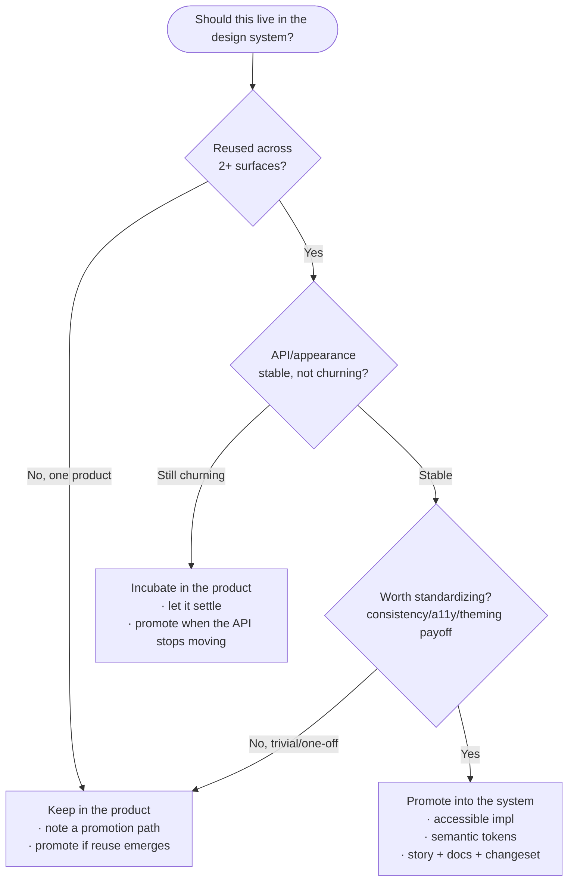
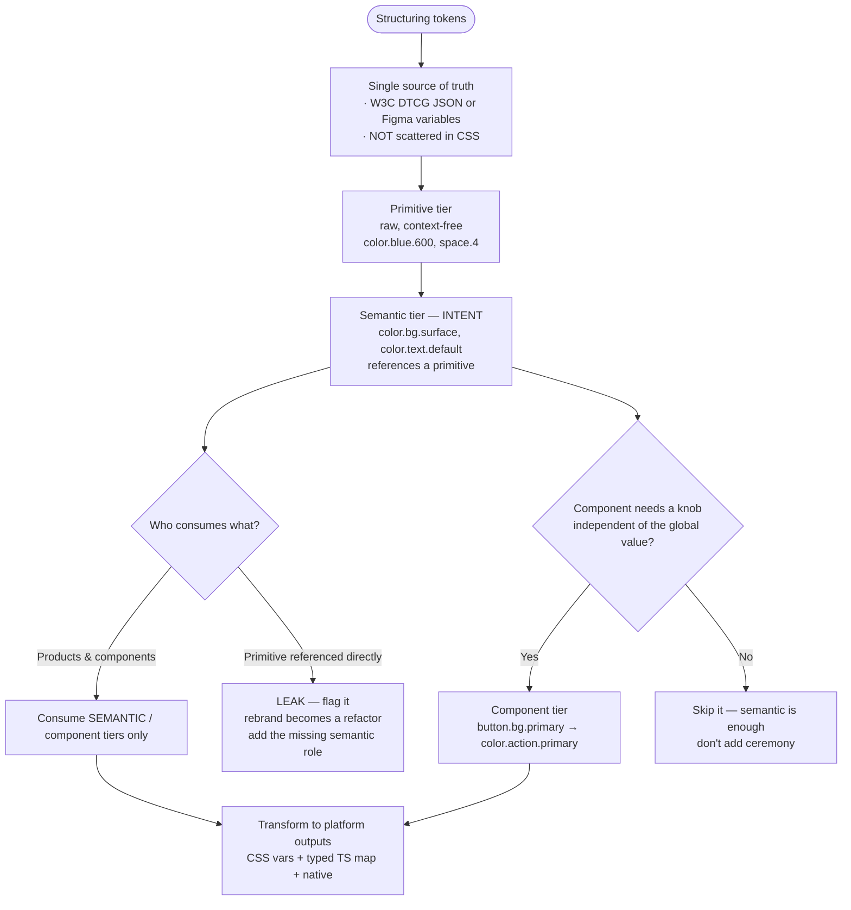
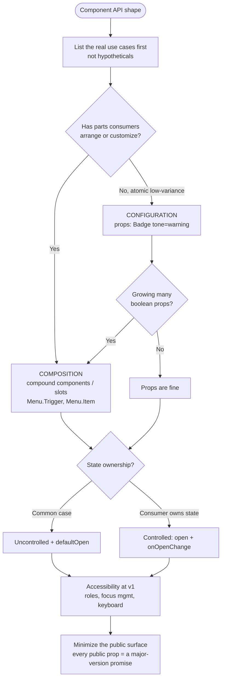
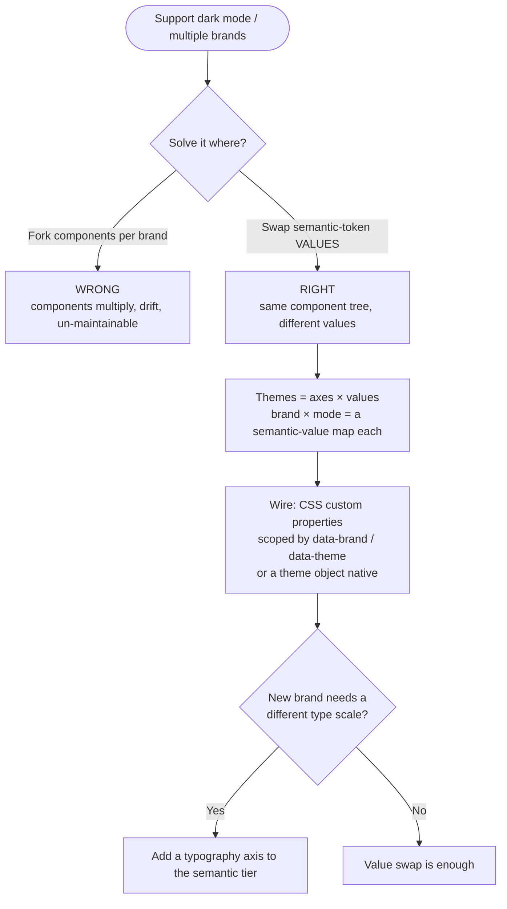
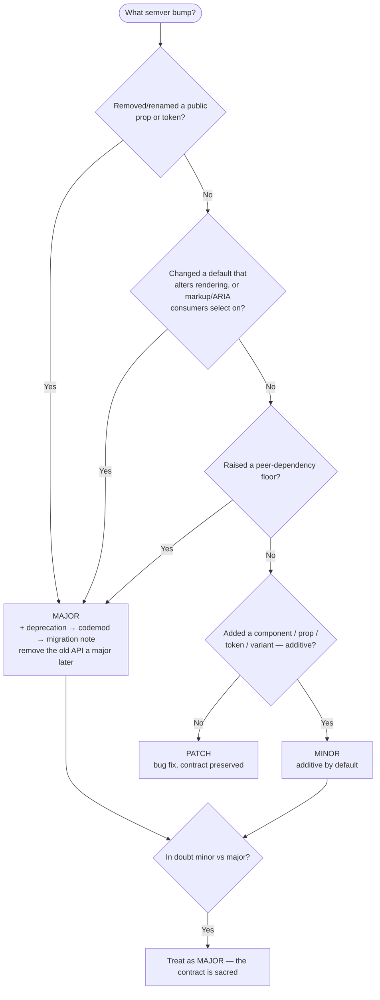

# Knowledge — Design-systems decision trees

> **Last reviewed:** 2026-07-22 · **Confidence:** High on the durable framings (token tiering,
> composition-vs-configuration, semver-of-a-public-contract, theming-at-the-semantic-tier,
> adoption-as-the-metric — broad industry consensus). **Specific tooling APIs (Style Dictionary,
> Storybook, changesets), the W3C DTCG token-spec status, and framework primitives are volatile —
> re-verify before wiring them (see the reference doc's retrieval dates).**
> The most-asked design-system questions are "does this belong in the system?", "how should tokens
> be tiered?", "compose or configure this component?", "how do we theme / support multi-brand?", and
> "what version bump is this?". These are the trees the team traverses **before** naming a structure.

The team's discipline: **name the boundary first (system vs product), tier tokens by intent, choose
the component contract before writing it, and version by the contract you're breaking.** Tooling
specifics carry a retrieval date and are verified at use. Building an *app* leaves this layer for
`frontend-engineering`; a WCAG *audit* goes to `accessibility-engineering`; *site/brand visual
design* is `web-design`. This team owns the **system** those all build from.

---

## Decision Tree 1: does this belong in the system?

Gate on **reuse × stability × worth-standardizing** — an opinionated system, not a greedy one.

**Rule of thumb:** a bloated system is as bad as no system. Reused **and** stable **and** worth
standardizing — all three — earns a place. Everything else stays in the product with a promotion
path.

---

## Decision Tree 2: how should tokens be tiered?

Products consume **intent**, never raw values.

**The rename test:** if renaming your brand color would force edits in *product* code, the semantic
tier is missing or being bypassed.

---

## Decision Tree 3: compose or configure this component?

**Smell test:** a boolean-prop explosion (`isPrimary`, `isLarge`, `isRounded`, `hasIcon`…) means
composition was the answer.

---

## Decision Tree 4: theming & multi-brand

---

## Decision Tree 5: what version bump is this?

The library's contract = component APIs + token names + rendered output consumers depend on.

---

## Seams to adjacent plugins

| If the question is… | It belongs to… |
|---|---|
| Build this app / feature / page (a **consumer** of the system) | `frontend-engineering` |
| A WCAG conformance audit, remediation program, or legal a11y posture | `accessibility-engineering` |
| Make this landing page / site visually compelling | `web-design` |
| Create a brand (logo, identity) from scratch | `brand-identity-studio` |
| Author the docs *site* around the library | `technical-writing-docs` |
| The CI/release infra the publish flow runs on | `devops-cicd` |

This team keeps the **system**: tokens, component contracts, versioning, and adoption.
