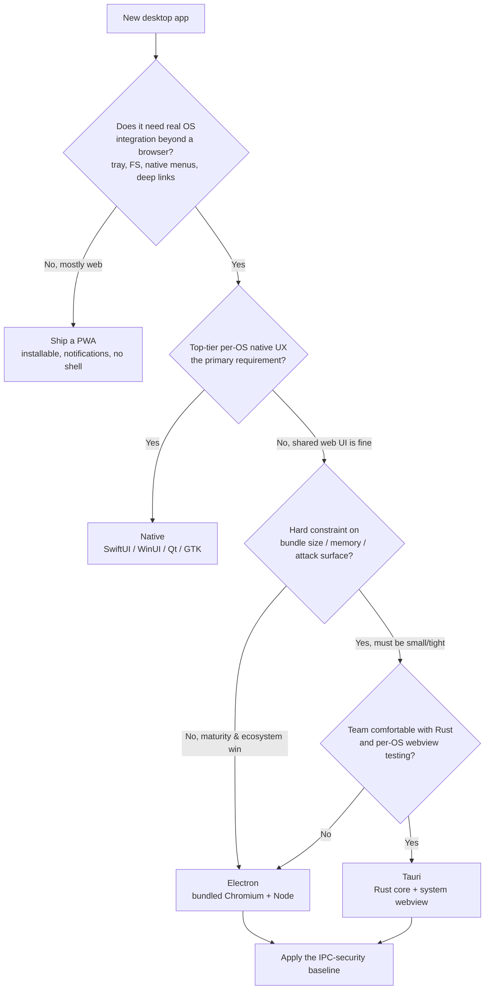
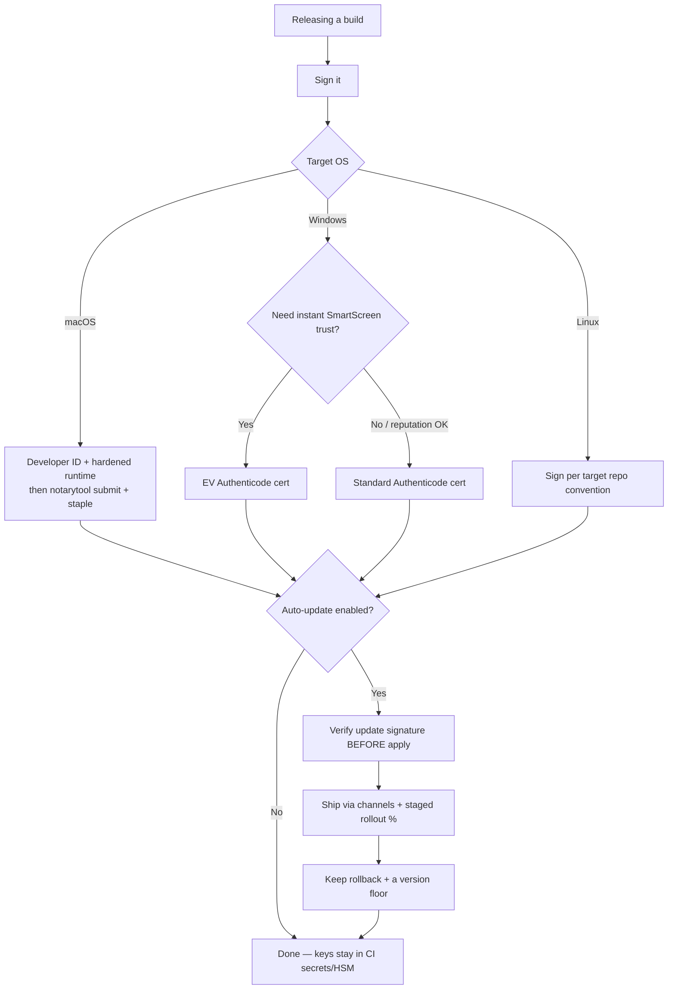

# Desktop Engineering — decision trees & capability map

> Canonical knowledge bank for `desktop-app-engineering`. **Traverse the relevant `## Decision Tree` top-to-bottom before choosing an approach** — the proactive complement to the Capability Grounding Protocol. Capability rows are dated and `[verify-at-use]`; re-confirm against the vendor before quoting a version-specific fact.
>
> _Last reviewed: 2026-06-12._

---

## Decision Tree — framework choice (Electron vs Tauri vs native vs PWA)



**Read:** default to **Electron** when a large web UI, deep native integration, and ecosystem maturity dominate and bundle size is acceptable. Choose **Tauri** when a small footprint / tight security surface matters *and* the team is Rust-comfortable and will test the system webview per OS. Choose **native** only when platform-native UX is the product. Choose a **PWA** when the OS needs are light enough that a desktop shell adds risk without value. Name the trade in every case.

---

## Decision Tree — the renderer→privileged IPC security boundary

```mermaid
flowchart TD
    A[Renderer needs an OS/native capability] --> B{Is the renderer<br/>untrusted web content?}
    B -- Always assume yes --> C[Do NOT give it direct FS/OS access]
    C --> D{Electron or Tauri?}
    D -- Electron --> E[contextIsolation on + nodeIntegration off + sandbox on]
    E --> F[Expose a NAMED op via contextBridge]
    F --> G[Back it with ipcMain.handle that VALIDATES every arg]
    D -- Tauri --> H[Write a #[tauri::command], validate every arg]
    H --> I[Authorize it with a scoped capability/permission]
    G --> J{Does it touch FS/shell?}
    I --> J
    J -- Yes --> K[Scope to exact path / exact program+args<br/>no wildcard fs/shell]
    J -- No --> L[Ship the narrow allow-listed op]
    K --> L
```

**Read:** the renderer is always untrusted. It reaches the OS only through a **named, validated, least-privilege** operation — a `contextBridge` + validated `ipcMain.handle` (Electron) or a validated `#[tauri::command]` authorized by a **scoped capability** (Tauri). Any filesystem/shell reach is scoped to an exact path or program, never a wildcard. Re-enabling `nodeIntegration` or granting a wildcard capability to "make it work" defeats the entire model.

---

## Decision Tree — signing, notarization & safe auto-update



**Read:** sign every build; on macOS notarize + staple (Gatekeeper blocks un-notarized apps); on Windows prefer EV for immediate SmartScreen trust. If auto-update is on, the updater must **verify the signature before applying**, ship behind **channels** with **staged rollout**, and keep **rollback + a version floor**. Keys live in CI secrets/HSM. A 100%-at-once unsigned update is a fleet outage by construction.

---

## Storage & secrets prior

| What | Where | Never |
|---|---|---|
| App data / settings | Per-OS app-data dir (`app.getPath('userData')` / Tauri path API) | A folder next to the executable |
| Secrets / tokens | OS credential store — Keychain / Credential Manager / libsecret (via `safeStorage` / Stronghold) | Plaintext `config.json` |
| Cache / temp | OS temp/cache dir, safe to clear | Mixing cache into the data dir |

If Linux has no secret service available, **name the weaker fallback explicitly** (e.g. an encrypted file with a stated weaker guarantee) — don't silently write plaintext.

---

## 2026 capability map `[verify-at-use]`

| Area | Current shape (dated 2026-06-12) | Note |
|---|---|---|
| Electron security | `contextIsolation`/`sandbox` default-on in modern majors; `@electron/remote` is opt-in and discouraged | Re-confirm per Electron major; CSP + IPC validation still on you |
| Tauri | **v2** ships the capabilities/permissions model + the updater/Stronghold plugins; v1's allowlist is legacy | Quote v2; re-confirm plugin permission identifiers |
| macOS signing | `notarytool` (Xcode 13+) replaced the **deprecated** `altool`; hardened runtime + staple required | Gatekeeper policy shifts — re-verify |
| Windows trust | SmartScreen reputation; EV cert → immediate trust; standard cert → accrues over downloads | Cert-issuance rules change |
| Updaters | `electron-updater` (Electron); Tauri updater plugin — both support signature verification | Verify signature config at adoption |

> Every row is version-volatile. These are priors to *route* the decision, not specs to quote verbatim — re-confirm against the vendor docs at use.
