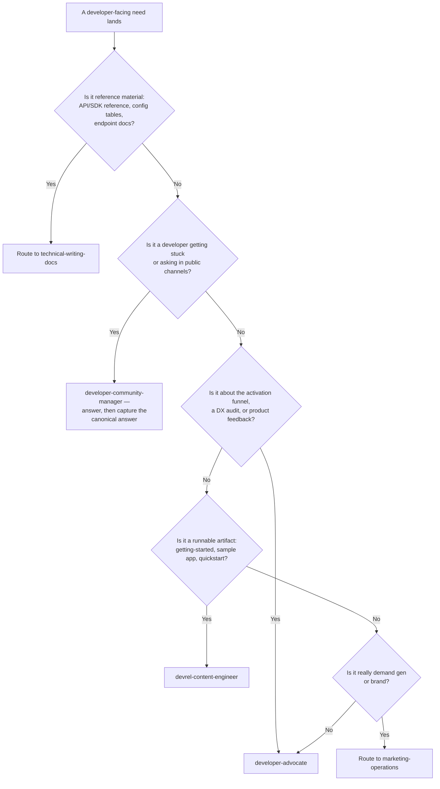
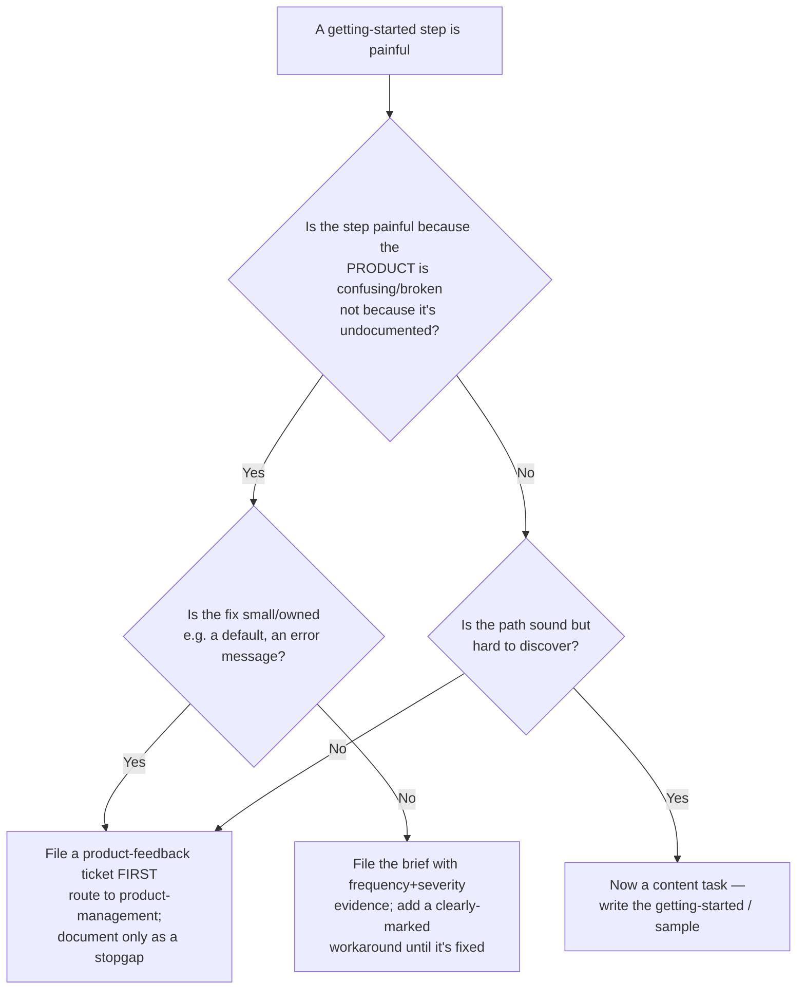
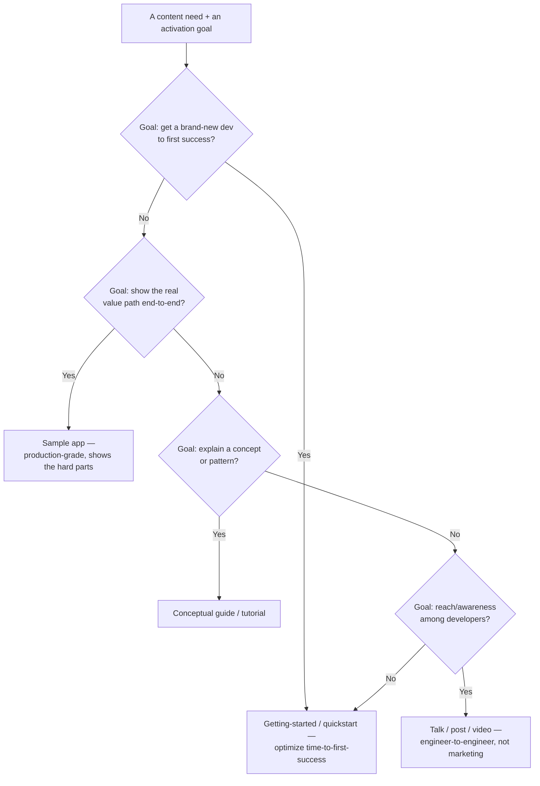

# DevRel engagement decision trees

Traverse these top-to-bottom before picking a move. They keep this team from
papering over product flaws with content, from drifting into demand gen, and from
choosing a content format by habit.

## 1. Advocate vs. docs vs. community — who owns this?

## 2. Fix the product or document around it?

**Rule:** DevRel's highest-leverage output is the friction it *removes*. A longer
tutorial that papers over a product flaw is technical debt with a smile. File the
bug first; document as a stopgap, clearly marked.

## 3. Content-format choice

**Rule:** the format follows the activation goal, not the channel that's trendy.
Optimize the getting-started path before any reach play — reach that lands a dev on
a broken first-run wastes the reach.
