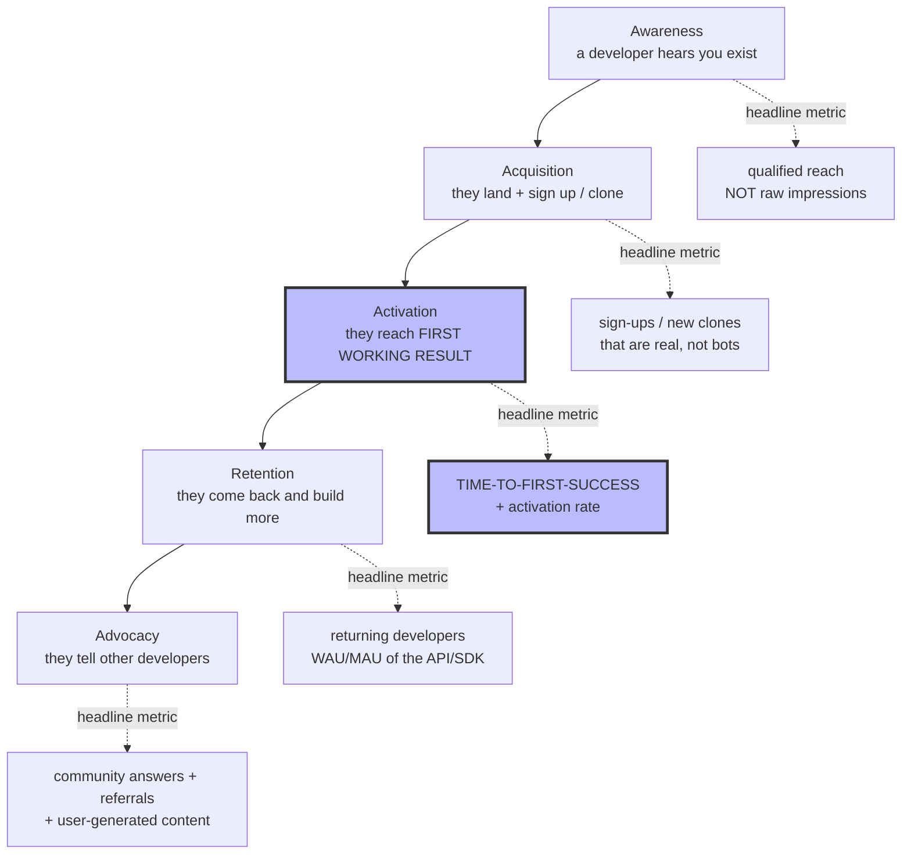

# Knowledge — The DevRel funnel and the metrics that track it

> **Last reviewed:** 2026-06-18 · **Confidence:** High for the funnel model and the vanity-vs-real
> distinction (well-established DevRel practice); **Medium** for any specific benchmark number
> (varies wildly by product, audience, and motion — treat ranges as directional, not targets).
> This is the spine of the plugin: the `devrel-strategist` frames every recommendation in this
> funnel, and the advisory hook flags scorecards that lead with a vanity metric.

A DevRel program that can't say *which stage it moves* and *which metric proves it* is a budget line
waiting to be cut. Everything starts from the funnel.

---

## The developer funnel (awareness → activation → advocacy)

**Activation is the load-bearing stage.** Most DevRel waste is poured into awareness while the
activation step silently leaks. If a developer can't reach a first working result, no amount of
top-of-funnel reach matters. Optimize **time-to-first-success** first.

---

## Vanity vs. real metrics

| Stage | ❌ Vanity (applause) | ✅ Real (outcome) |
|---|---|---|
| Awareness | impressions, follower count, GitHub stars | qualified reach; referral-source quality; branded search volume |
| Acquisition | total registered developers (cumulative) | new active sign-ups / clones; sign-up→activation conversion |
| Activation | "we have an SDK", page views on docs | **time-to-first-success**; **activation rate**; getting-started completion |
| Retention | total accounts (never churned out) | returning developers (WAU/MAU); repeat API/SDK calls; depth of use |
| Advocacy | total community members | questions answered by *members*; resolution rate; referrals; UGC count |

**The tell:** a vanity metric only ever goes up and never forces a decision. A real metric can go
*down*, and when it does you change something. If your scorecard can't get worse, it isn't measuring.

> **Stars are not nothing** — they're a weak awareness signal. The defect is making them the
> *headline*. Demote them to context; lead with activation.

---

## Time-to-first-success (TTFS) — the one metric to instrument first

The elapsed time (and step count) from "landed / signed up" to "saw the thing work." Instrument it as:

- **Step count** of the documented golden path (every step is a place to lose someone).
- **Wall-clock median** from sign-up to first successful API call / first passing sample run.
- **Completion rate** of the getting-started (the funnel's activation conversion).

Improving TTFS is almost always the highest-ROI DevRel work. See
[`developer-experience-and-onboarding.md`](developer-experience-and-onboarding.md) for the audit method.

---

## What a healthy DevRel scorecard looks like

1. **One activation headline** — TTFS and activation rate, trended over time.
2. **One retention number** — returning developers (WAU/MAU of the SDK/API).
3. **One community-health number** — resolution rate or unanswered-question rate (not member count).
4. **Context, not headlines** — reach/stars/event count sit below the line as context.
5. **Every number can move both ways**, and each is owned by a stage of the funnel, not a person.

---

## Provenance

Codifies developer-relations CLAUDE.md §3 house opinions #1 (measure activation, not applause) and
#4 (time-to-first-success is the product). The awareness→activation→advocacy funnel is the
standard DevRel adaptation of a pirate-metrics (AARRR) funnel; the vanity-vs-actionable-metric
distinction is long-standing analytics practice (Ries, *Lean Startup*). Benchmarks intentionally
omitted — they are product-specific and quoting a generic number as a target would violate the
claim-grounding discipline.

---

_Last reviewed: 2026-06-18 by `claude`_
