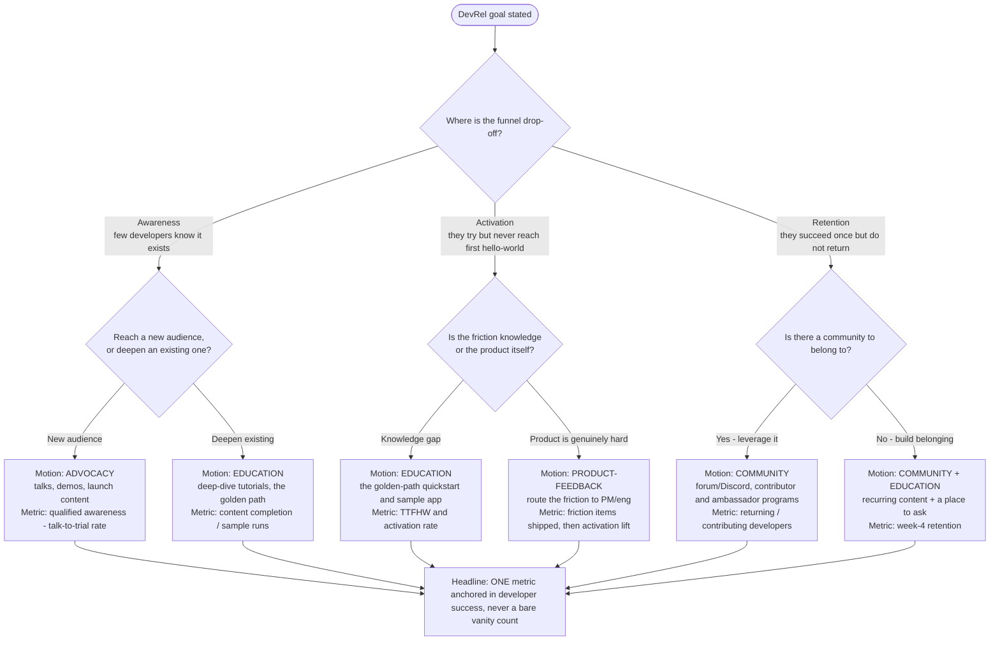

# Knowledge — DevRel strategy: goal → motion → metric

> **Last reviewed:** 2026-06-17 · **Confidence:** High (canonical DevRel operating-model + pirate-funnel consensus; see Provenance).
>
> This file is the **motion-choice** decision tree. Given a DevRel goal, it resolves to the right *motion* (advocacy / education / community / product-feedback), the *content* that motion produces, and the *one metric* that proves it. It is the decision-tree form of the prose operating-model and metrics guidance in [`devrel-metrics.md`](devrel-metrics.md) and the house opinions in [`../CLAUDE.md`](../CLAUDE.md) §3.
>
> **How the agent uses it:** the [`devrel-strategist`](../agents/devrel-strategist.md) traverses the Mermaid graph **top-to-bottom before naming a motion** (the pre-action decision-tree traversal the Capability Grounding Protocol requires). Resolve each node against *observable* facts — where developers actually drop off in the funnel — not against the stakeholder's framing ("we need more awareness" is a hypothesis, not a diagnosis).

---

## Decision Tree: which DevRel motion does this goal need?

**When this applies:** you have a DevRel goal and must decide what the team should *do* and how to *measure* it. Observable inputs: (a) where in the developer funnel the drop-off is — **awareness** (few developers encounter the product), **activation** (they try but never reach first hello-world), or **retention** (they succeed once but don't return); (b) whether the friction is *knowledge* (they don't know how) or *product* (the thing is genuinely hard); (c) whether a developer *community* already exists to leverage.

## Per-leaf rationale

| Goal / drop-off | Motion | What it produces | The one metric |
|---|---|---|---|
| Awareness, new audience | **Advocacy** | Talks, demos, launch posts, conference presence | Talk-to-trial / qualified-awareness rate (not raw views) |
| Awareness, deepen existing | **Education** | Deep-dive tutorials, golden-path content | Content completion / sample-app runs |
| Activation, knowledge gap | **Education** | The golden-path quickstart + runnable sample app | **TTFHW** + activation rate |
| Activation, product is hard | **Product-feedback** | Friction routed to PM/eng as a standing artifact | Friction items shipped → then activation lift |
| Retention, community exists | **Community** | Forum/Discord, contributor + ambassador programs | Returning / contributing developers |
| Retention, no community yet | **Community + Education** | Recurring content + a place to ask | Week-4 retention |

## Tradeoffs / why not the reflex move

- **The reflex for any goal is "more advocacy" (more talks, more posts).** It only helps an *awareness* problem. Pouring advocacy into an *activation* leak fills a leaky bucket — the diagnosis (where the funnel drops) selects the motion, not the loudest stakeholder.
- **Education vs advocacy.** Advocacy gets a developer to *try*; education (a working golden path) gets them to *succeed and stay*. When activation is the problem, education wins.
- **Product-feedback is a motion, not a byproduct.** When the product itself is hard, no amount of content fixes activation — the highest-leverage move is routing the friction to PM/eng. Teams skip this because it has no flashy output; the metric (friction shipped → activation lift) keeps it honest.
- **Community is a retention lever, not an acquisition one.** A community deepens developers who already succeeded; it rarely creates first-time activation.

## See also

- [`devrel-metrics.md`](devrel-metrics.md) — the funnel + metric definitions + vanity-metric traps the leaves reference.
- [`../skills/design-developer-funnel/SKILL.md`](../skills/design-developer-funnel/SKILL.md) — instruments the funnel this tree diagnoses.
- [`../CLAUDE.md`](../CLAUDE.md) — §3 house opinions (motion before tactic; one metric per goal; product-feedback is first-class).

## Provenance

Codifies the DevRel operating-model (advocacy / education / community / product-feedback) and the developer pirate funnel (AAARRP), consensus framings in the DevRel field as of the review date. Format follows the marketplace decision-tree convention (a *When this applies*, a `Last reviewed:` date, a Mermaid graph, per-leaf rationale, a tradeoffs section).

---

_Last reviewed: 2026-06-17 by `claude`_
