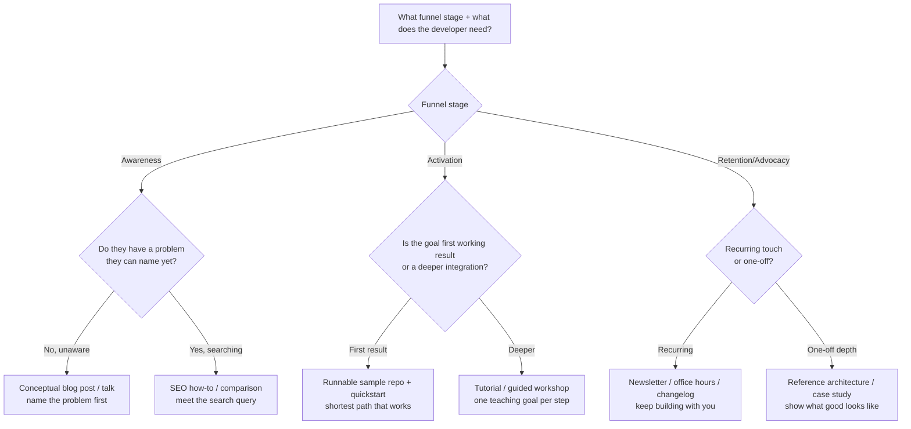
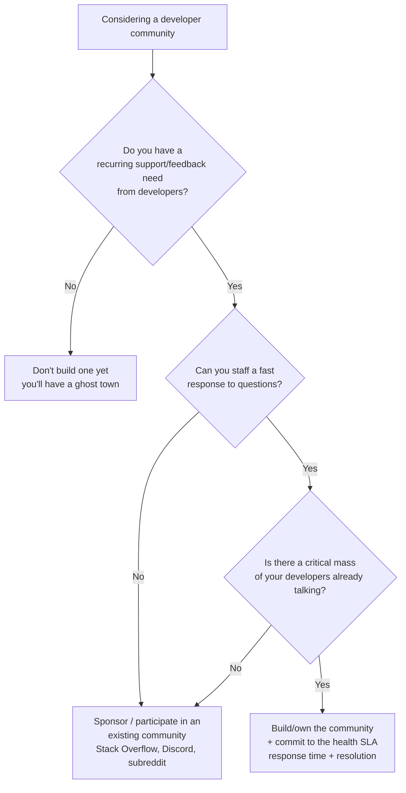
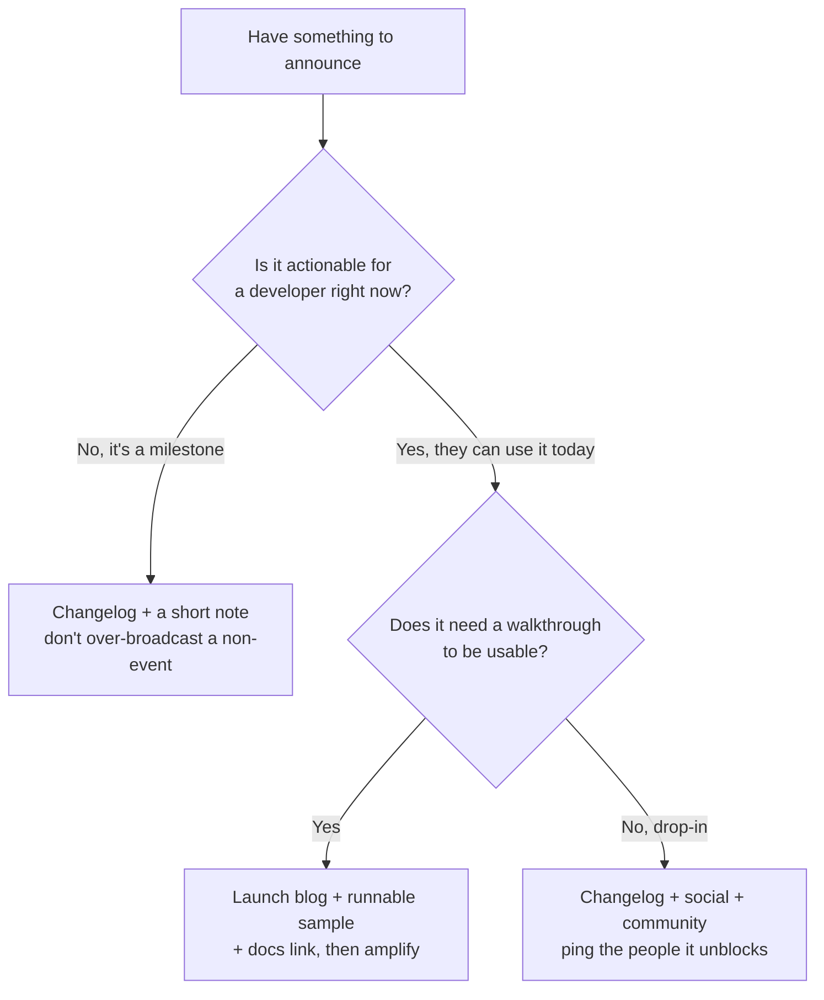

# Knowledge — DevRel strategy decision trees

> **Last reviewed:** 2026-06-18 · **Confidence:** High (these are format/channel selection heuristics,
> not volatile facts). Both agents traverse the relevant tree *before* recommending a tactic — the
> Capability Grounding Protocol's pre-action decision-tree traversal.

Don't keyword-match a tactic to a request ("they asked about a conference → submit a talk"). Walk the
tree from the **funnel stage** and the **audience**.

---

## Tree 1 — Which content format?

**Rule of thumb:** format follows funnel stage, not personal preference for video vs. writing.
Awareness teaches the *problem*; activation hands a *runnable path*; retention/advocacy keeps the
relationship warm.

---

## Tree 2 — Build, sponsor, or skip a community?

**The trap:** building an owned community (Discord/forum) you can't staff. A 5,000-member channel
where questions sit for a week is a liability — it advertises neglect. Health is response time +
resolution, never headcount. If you can't staff it, *sponsor* an existing one.

---

## Tree 3 — Which channel for a launch / announcement?

**Rule:** don't spend launch capital on a non-event. Reserve the big push for things a developer can
*do something with today*, and always pair an announcement with the runnable path to use it.

---

## How to use these trees

1. Resolve the **funnel stage** first (from [`devrel-funnel-and-metrics.md`](devrel-funnel-and-metrics.md)).
2. Walk the matching tree top-to-bottom to a leaf.
3. State the path you took on the Output Contract `Recommendation:` line, and the metric the leaf
   moves on the `Metric:` line.
4. If the situation outgrows the flat tree (multi-audience, multi-stage campaign), compose leaves and
   say so — don't force one leaf to cover everything.

---

## Provenance

Codifies developer-relations CLAUDE.md §3 house opinions #2 (teach, don't market), #6 (community
health is response/resolution), and the §2 routing rules. These are selection heuristics, not
vendor-specific facts; tooling specifics live in [`devrel-tooling-2026.md`](devrel-tooling-2026.md)
with retrieval dates.

---

_Last reviewed: 2026-06-18 by `claude`_
