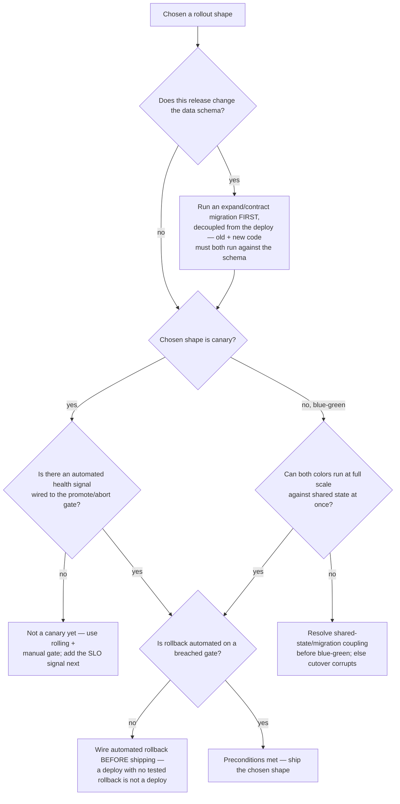
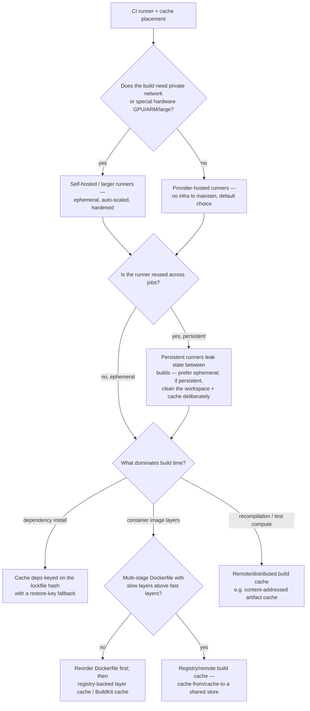

# Deployment Strategy & Runner/Build-Cache — Decision Trees

_Two Mermaid decision trees that **complement** [`devops-cicd-decision-trees.md`](devops-cicd-decision-trees.md): that file's "Deploy / rollout strategy selection" tree picks the rollout shape by reversibility; these two go a layer deeper — (1) the data/dependency preconditions a rollout strategy actually requires before it's safe to run, and (2) where CI compute and the build cache should live. Capability rows are `[verify-at-use]` — re-check against the vendor before quoting._

_Last reviewed: 2026-07-08._

## Decision Tree: Deployment-strategy preconditions — is this rollout actually safe to run?

**When this applies:** you've tentatively chosen a rollout shape (from the rollout-strategy tree in `devops-cicd-decision-trees.md`) and need to confirm the **preconditions** that shape requires are met. Picking "canary" or "blue-green" without its preconditions is how a strategy that looks safe ships a bad release anyway (see the `2026-06-05-canary-rollback-no-health-signal` scenario).

**Rationale per leaf:**

- _Migration first_ — a rolling/canary/blue-green deploy runs old and new code **simultaneously**; the schema must satisfy both. A schema change coupled to the deploy is the classic rolling-deploy outage. The application-side expand/contract sequencing belongs to `backend-engineering`/`database-engineering`; this team owns _decoupling the migration from the deploy in the pipeline_.
- _Not a canary yet (downgrade)_ — a canary's only value is the automated promote/abort decision; with no health signal it's a slow timed rollout that still ships the bad version. The honest move is rolling + a manual gate until the signal exists. The signal is `observability-sre`'s to define.
- _Fix shared-state coupling_ — blue-green flips all traffic at once; if the two colors share mutable state or a half-applied migration, the cutover corrupts. Resolve the coupling (or pick rolling) first.
- _Wire automated rollback first_ — decide and test the rollback path **before** you ship (§3 #2). Automated rollback on a failed health gate beats a 2am manual `git revert`.
- _Ship_ — preconditions met; proceed with the shape the rollout-strategy tree selected.

**Tradeoffs summary:**

| Shape | Hard precondition | Blast radius if precondition missing |
|---|---|---|
| Rolling | Old+new coexist (no coupled schema change) | Mixed-version errors during the roll |
| Canary | Automated health signal + auto-rollback | Bad release promotes to 100% on a timer |
| Blue-green | Both colors safe against shared state | Cutover corrupts shared data |
| Feature-flagged | Flag kill-switch tested; flag debt tracked | Dark code path ships untested; flag rot |

_The promote/abort and rollback **signal** comes from `observability-sre`; the **migration** sequencing seams to `backend-engineering`/`database-engineering`. This tree decides whether the pipeline is allowed to run the shape, not how the workload reconciles (that's `cloud-native-kubernetes`)._

## Decision Tree: Runner & build-cache placement — where should CI compute and cache live?

**When this applies:** CI is slow, expensive, or can't reach private infrastructure, and you're deciding **where the build runs** (hosted vs self-hosted) and **where the cache lives** (provider cache vs registry vs remote build cache). The wrong placement is the most common silent CI cost — see the `2026-06-05-slow-build-cache-strategy` scenario for the cache-key half.

**Rationale per leaf:**

- _Self-hosted / larger runners_ — only when you genuinely need private-network reach or special hardware; they carry maintenance + a security surface (untrusted PR code on your network), so keep them **ephemeral** and isolated. Don't reach for self-hosted just to go faster — a cache fix is usually cheaper.
- _Provider-hosted_ — the default; no infra to own. Scale via larger hosted runner classes before going self-hosted.
- _Persistent-runner warning_ — a reused runner leaks dependency state, caches, and secrets between builds; an ephemeral runner is reproducible and safer. If persistence is unavoidable, clean the workspace and scope the cache explicitly.
- _Dependency cache_ — key on the **lockfile hash** (content-addressed), never a constant; a constant key serves a stale cache forever (a correctness risk, not a speedup). A dependency cache is also a **cache-poisoning** surface: an untrusted-trigger job (fork PR, `pull_request_target`) that can write the shared cache can plant a tampered artifact that a later trusted job restores and executes — not just a secret/state leak. GitHub Actions' read-only-cache-for-untrusted-triggers default (2026-06) mitigates this on hosted runners too, but don't rely on a pipeline that writes cache from an untrusted-trigger job.
- _Reorder Dockerfile first_ — layer cache is structurally defeated if `COPY . .` precedes the dependency install; fix the ordering before investing in a remote layer cache.
- _Registry/remote build cache_ — `cache-from`/`cache-to` a shared store (registry or remote backend) so layers are reused across runners, not just within one runner's local disk.
- _Remote/distributed cache_ — for compile/test-heavy builds, a content-addressed remote cache (shared across the team) beats per-runner local caching.

**Tradeoffs summary:**

| Placement | Cost / setup | Reach / speed | Watch out for |
|---|---|---|---|
| Provider-hosted | Lowest — zero infra | Public deps only | Per-minute billing at scale |
| Self-hosted ephemeral | Medium — infra + scaling | Private network, special HW | Untrusted-PR security surface |
| Provider cache (lockfile-keyed) | Low | Big win on deps | Stale on a constant key |
| Registry/remote build cache | Medium | Layers reused cross-runner | Cache store auth + size |

## Capability map (dated — verify at use)

| Capability | 2026 state `[verify-at-use]` | Notes |
|---|---|---|
| GitHub Actions hosted larger runners | GA | Larger CPU/RAM, GPU, ARM classes; per-minute billing |
| GitHub Actions self-hosted runners | GA | Prefer ephemeral; isolate untrusted PR code |
| `actions/cache` lockfile-hash keying | GA | `hashFiles()` + `restore-keys` fallback prefix |
| GitHub Actions cache — read-only for untrusted triggers | GA, default (2026-06) | Actions now issues read-only cache tokens to the default-branch cache for events runnable without write perms (pull_request_target, issue_comment, fork workflow_run) — blocks cross-fork cache poisoning by default; you gain it with no config. Don't design a pipeline that WRITES cache from an untrusted-trigger job (the write is now dropped). [Changelog 2026-06-26](https://github.blog/changelog/2026-06-26-read-only-actions-cache-for-untrusted-triggers/) |
| Docker BuildKit `cache-from`/`cache-to` | GA | Registry or remote (`type=gha`, `type=registry`) backends |
| Argo Rollouts automated analysis | GA | `AnalysisTemplate` + metric provider gates promote/abort |
| Flagger (Flux) progressive delivery | GA | Same canary-with-analysis model for Flux users |

_Sources: [GitHub Actions runners docs](https://docs.github.com/en/actions/using-github-hosted-runners), [GitHub Actions caching docs](https://docs.github.com/en/actions/using-workflows/caching-dependencies-to-speed-up-workflows), [Docker build cache docs](https://docs.docker.com/build/cache/), [Argo Rollouts analysis docs](https://argo-rollouts.readthedocs.io/en/stable/features/analysis/) — all retrieved 2026-06-05; capability/version rows are volatile, re-confirm at use._
