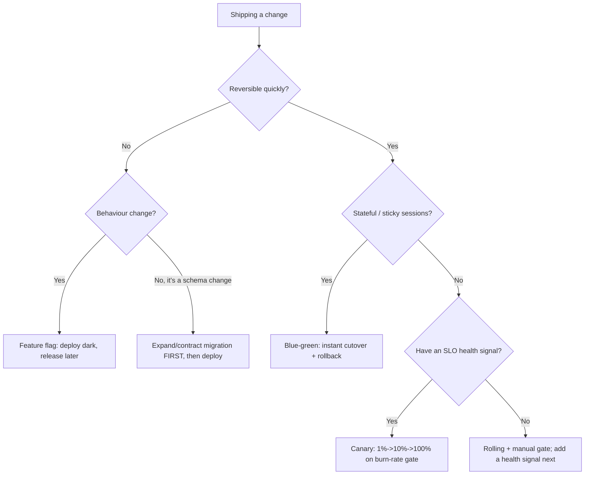
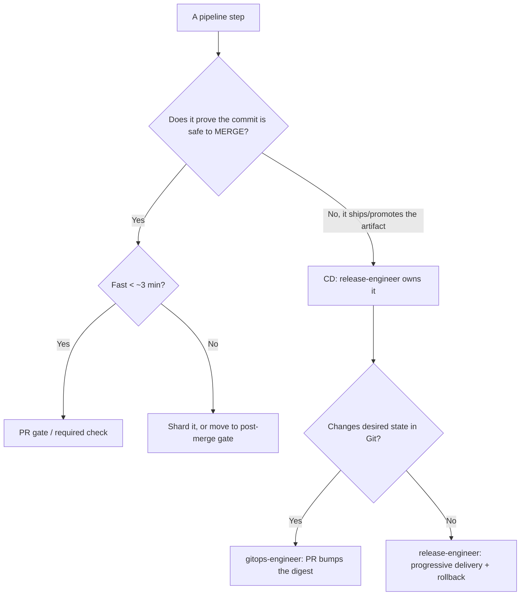

# DevOps & CI/CD — Decision Trees

_Decision trees + a dated capability map. Capability rows are `[verify-at-build]` — re-check against the vendor before quoting. Last reviewed: 2026-06-04._

Traverse these before choosing a pipeline shape or a rollout strategy.

## Decision Tree: Deploy / rollout strategy selection

Pick the rollout by blast radius and reversibility — not by what the tool defaults to.

_The canary's promote/abort signal comes from `observability-sre`. No signal → don't auto-promote._

## Decision Tree: CI vs CD boundary — where does this step belong?

Keep the PR gate fast; push slow and deploy-side work to the right phase.

## Capability map (dated — verify at build)

| Capability | 2026 state `[verify-at-build]` | Notes |
|---|---|---|
| GitHub Actions OIDC to cloud | GA | Prefer over long-lived keys; federate to AWS/Azure/GCP |
| Argo CD | GA, CNCF graduated | App-of-apps, ApplicationSets, drift self-heal |
| Flux | GA, CNCF graduated | GitOps Toolkit controllers |
| SLSA provenance | v1.0 framework | Build L2/L3 levels; pair with signing (cosign/Sigstore) |
| CycloneDX / SPDX SBOM | both widely supported | Pick one and attach at build time |
| Conventional Commits | de-facto standard | Drives SemVer bump + changelog automation |
