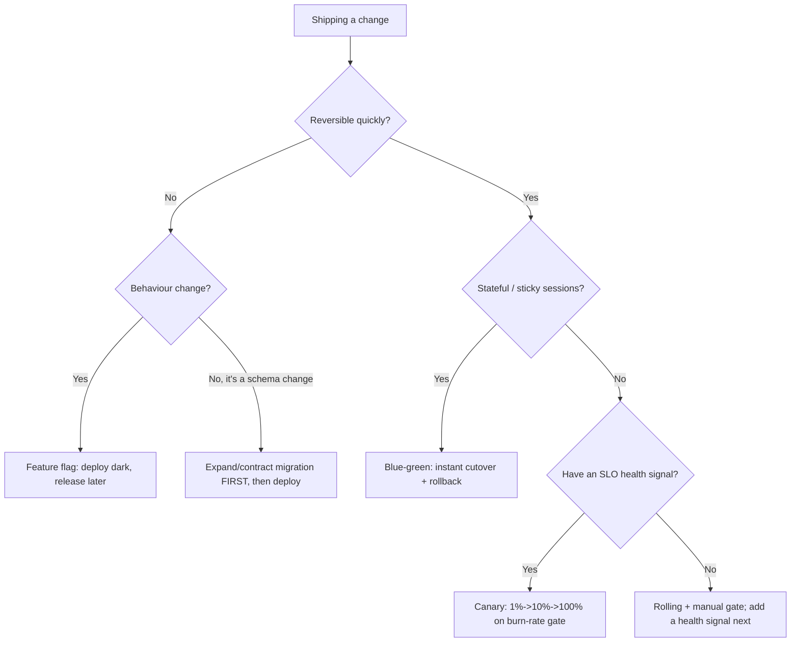
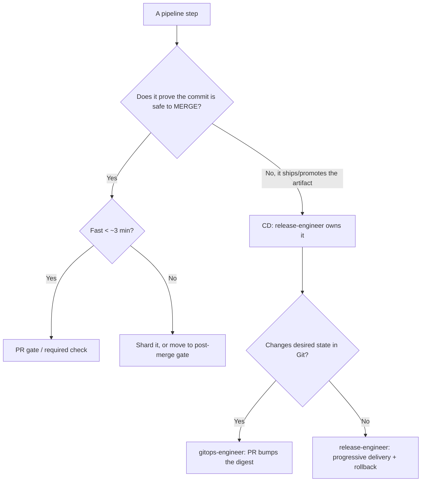
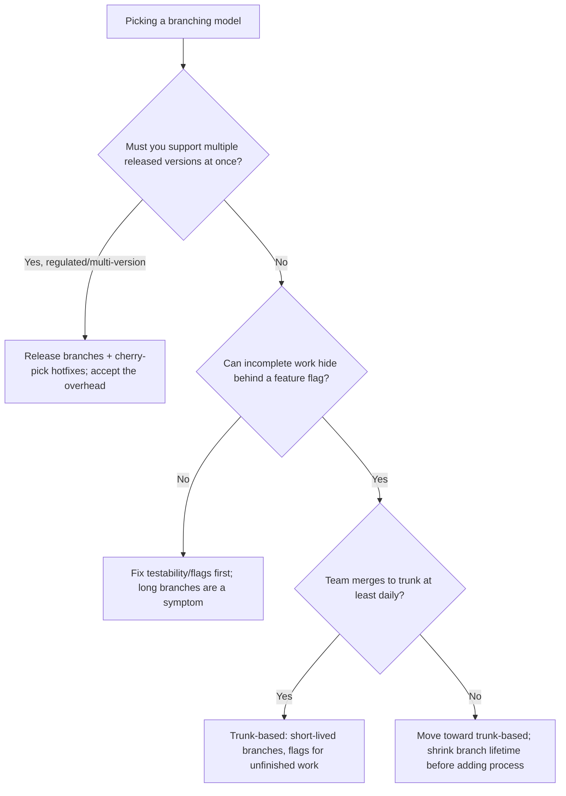
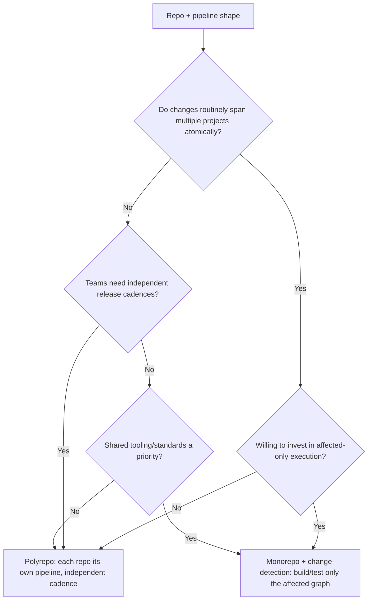
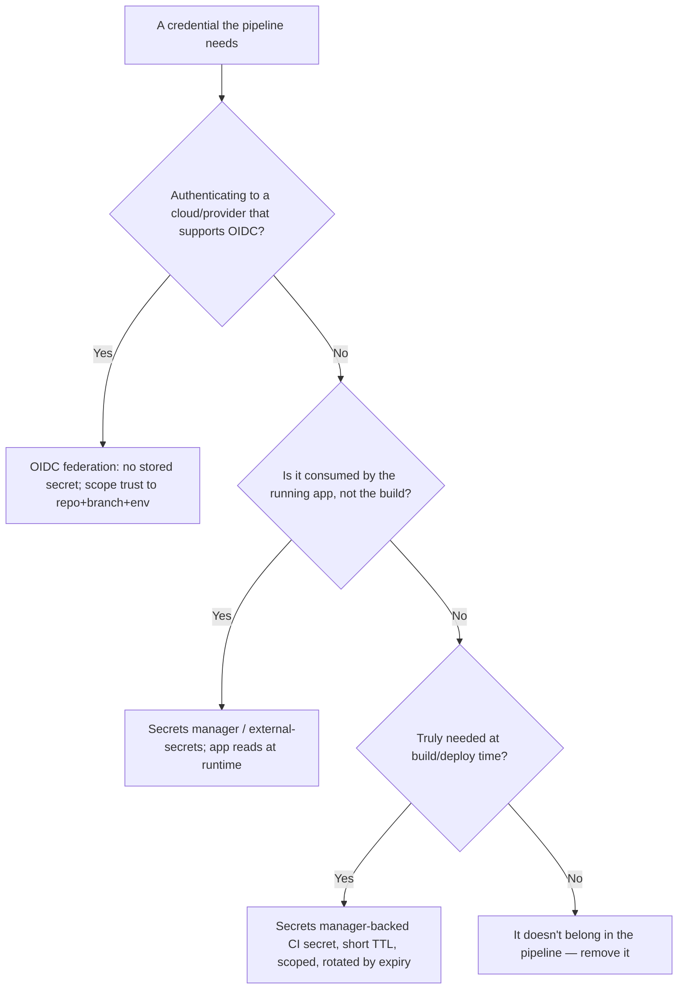
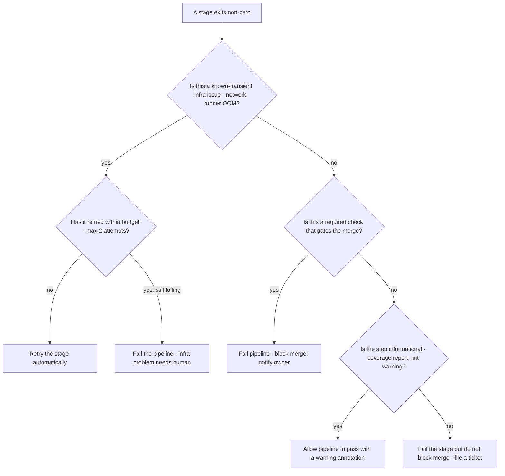
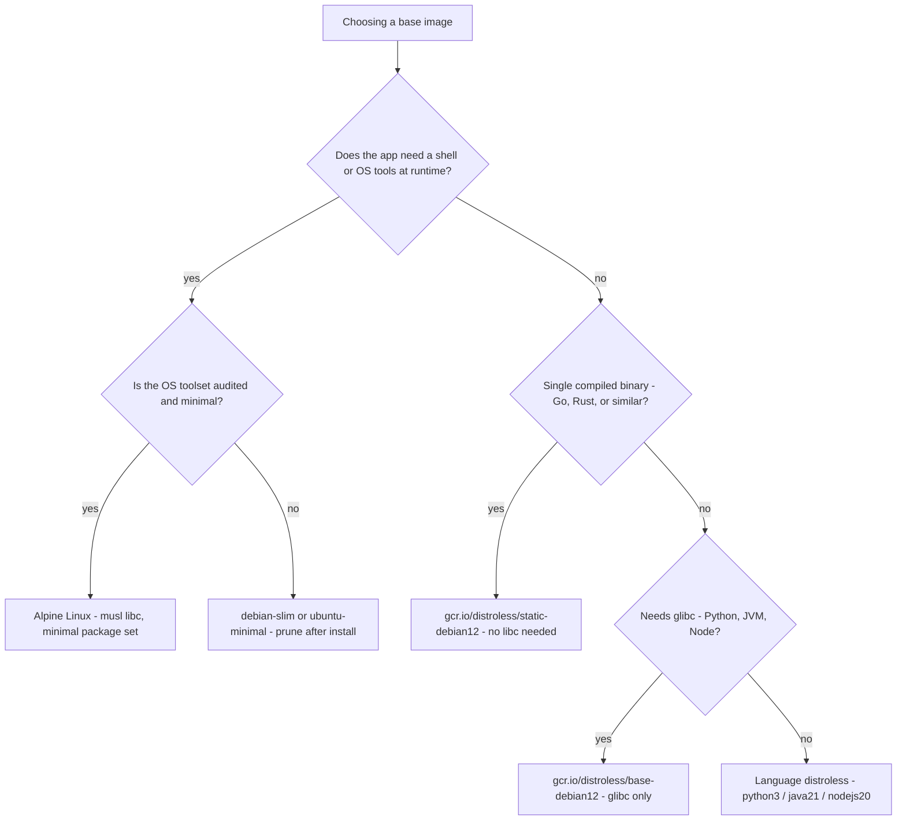
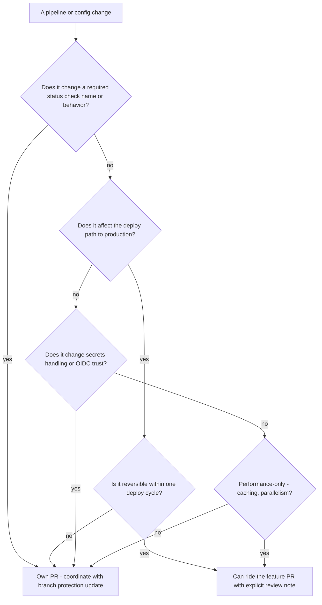

# DevOps & CI/CD — Decision Trees

_Decision trees + a dated capability map. Capability rows are `[verify-at-build]` — re-check against the vendor before quoting. Last reviewed: 2026-06-04._

Traverse these before choosing a pipeline shape or a rollout strategy.

## Decision Tree: Deploy / rollout strategy selection

Pick the rollout by blast radius and reversibility — not by what the tool defaults to.

_The canary's promote/abort signal comes from `observability-sre`. No signal → don't auto-promote._

## Decision Tree: CI vs CD boundary — where does this step belong?

Keep the PR gate fast; push slow and deploy-side work to the right phase.

## Decision Tree: Trunk-based vs branch strategy

Choose by integration frequency and the real need to support multiple versions — not by habit.

_GitFlow's develop/release/hotfix lattice is overhead most teams pay without the multi-version need that justifies it._

## Decision Tree: Monorepo vs polyrepo pipeline shape

The repo layout is a choice; the pipeline shape it forces is the real cost — decide with eyes open.

_A monorepo that rebuilds everything on every commit is the worst of both worlds — affected-only execution is the price of admission._

## Decision Tree: Secrets — where does this credential live?

Before pasting any credential into a pipeline, route it to the least-exposed home that still works.

_A static key pasted into a CI variable is the last resort, never the default — and it has an owner and an expiry date the moment it exists._

## Capability map (dated — verify at build)

| Capability | 2026 state `[verify-at-build]` | Notes |
|---|---|---|
| GitHub Actions OIDC to cloud | GA | Prefer over long-lived keys; federate to AWS/Azure/GCP |
| Argo CD | GA, CNCF graduated | App-of-apps, ApplicationSets, drift self-heal |
| Flux | GA, CNCF graduated | GitOps Toolkit controllers |
| SLSA provenance | v1.0 framework | Build L2/L3 levels; pair with signing (cosign/Sigstore) |
| CycloneDX / SPDX SBOM | both widely supported | Pick one and attach at build time |
| Conventional Commits | de-facto standard | Drives SemVer bump + changelog automation |

## Decision Tree: Pipeline stage — retry, fail, or skip?

When applies: a CI stage exits non-zero or times out. The right response depends on whether the failure is transient infrastructure noise, a real defect, or an optional informational step.

**Last verified:** 2026-06-05 against GitHub Actions retry semantics and general CI/CD practice.

**Rationale per leaf:**
- *Retry the stage* — transient infra noise should not block a developer; one automatic retry surfaces real failures while absorbing flaps.
- *Fail pipeline - infra problem* — repeated infra failures are on-call territory, not developer territory; surfacing them fast gets them fixed.
- *Fail pipeline - block merge* — a required check that fails is the whole point of the gate; it must block.
- *Allow with warning* — optional informational steps (coverage delta, dependency audit summary) should never block a merge; file a ticket instead.
- *Fail stage, no merge block* — non-required steps that fail indicate work to do, but the merge can proceed with the defect tracked.

**Tradeoffs summary:**

| Method | Cost / time | Blast radius | Approval gate? | Use when |
|---|---|---|---|---|
| Auto-retry | Adds 1-3 min | None | No | Known-transient infra noise |
| Fail and block | Blocks PR until fixed | Developer blocked | No (auto) | Required safety check fails |
| Warn and continue | No block | Low - tracked | No | Informational step only |
| Fail stage, pass pipeline | Ticket created | Low | No | Non-required quality signal |

## Decision Tree: Image base selection — which base image?

**When this applies:** creating or updating a production container image Dockerfile. The base image choice has direct implications for image size, CVE surface, and rebuild cadence.

**Last verified:** 2026-06-05 against Google distroless project, Alpine, and Docker Hub official images.

**Rationale per leaf:**
- *Alpine* — smallest full-shell base; musl libc means fewer CVEs vs glibc; requires testing for musl compatibility.
- *debian-slim* — familiar tooling, larger than Alpine but compatible with glibc expectations; prune after install.
- *distroless/static* — no OS at all; only the binary; zero CVE surface from system packages; ideal for Go/Rust.
- *distroless/base* — adds glibc and ca-certs only; right for C-extension Python wheels, JVM, Node native modules.
- *language distroless* — adds the language runtime on top of base; maintained by Google with rapid CVE turnaround.

**Tradeoffs summary:**

| Method | Cost / time | Blast radius | Approval gate? | Use when |
|---|---|---|---|---|
| distroless/static | Smallest/fastest pull | Minimal CVE surface | No | Compiled static binary |
| distroless/base | Slightly larger | Low CVE surface | No | glibc-dependent runtime |
| Alpine | Small, shell available | Low-medium | No | Need shell tools or scripts |
| debian-slim | Medium, familiar | Medium | No | Complex glibc dependencies |

## Decision Tree: When does a pipeline change need its own PR?

**When this applies:** a developer wants to modify a CI/CD pipeline definition, Dockerfile, or GitOps manifest. Deciding whether the change needs its own PR or can ride the feature branch.

**Last verified:** 2026-06-05 against general CI/CD change-management practice.

**Rationale per leaf:**
- *Own PR* — changes to required checks, deploy paths, secrets handling, or irreversible configuration need explicit review and a clean rollback story before they touch main.
- *Can ride the feature PR* — purely additive, reversible, or performance-only pipeline changes can be bundled with the feature for context; flag them in the PR description for the reviewer.

**Tradeoffs summary:**

| Method | Cost / time | Blast radius | Approval gate? | Use when |
|---|---|---|---|---|
| Own PR | Extra PR overhead | Low - isolated | Yes - reviewer | Affects prod path, security, or required checks |
| Ride feature PR | No extra PR | Medium - bundled | Implicit | Reversible, non-security, performance-only |
