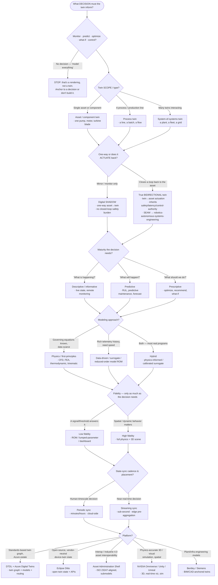

# Knowledge — Digital-twin architecture decision tree

> **Last reviewed:** 2026-07-09 · **Confidence:** Medium-High (consensus on the twin-type / shadow-vs-bidirectional / maturity framing, the fidelity-to-the-decision principle, and where physics vs data-driven vs hybrid and each platform fit; **specific platform feature/pricing claims and standards-revision details are volatile — re-verify before a client commitment**).
> The most-asked digital-twin question is "what should we build — and on Azure Digital Twins, Ditto, an AAS shell, or Omniverse?". This is the decision tree the `digital-twin-architect` traverses **before** naming a fidelity or platform, plus the trade-off table and the seams to adjacent plugins.

The agent's discipline: **name the decision the twin serves first, then the type, then the *lowest* fidelity that decision needs, and only then the platform.** Device firmware, edge drivers, and robot control loops are **not** twin work — they leave this layer for `embedded-iot-engineering` / `robotics-autonomous-systems-engineering`.

---

## Decision Tree: scoping and architecting a digital twin

Traverse top-to-bottom. Gate on **the decision the twin informs** first, then **twin type**, **shadow-vs-bidirectional**, **maturity**, **modeling approach**, **fidelity**, **sync**, and finally the **platform**.

---

## Trade-off table

| Platform / approach | Sweet spot | Watch out for |
|---|---|---|
| **DTDL + Azure Digital Twins** | A standards-based **twin graph** (models, relationships, live properties) on an Azure estate; routing telemetry to twins | Azure-centric; the graph is state + relationships, not a physics engine — pair with a simulator for high fidelity |
| **Eclipse Ditto** | Open-source, vendor-neutral **device-twin state** + APIs; you own the stack | You assemble more yourself (no managed graph analytics / lineage out of the box) |
| **AAS / Asset Administration Shell (ISO 23247-aligned)** | **Interoperability** across vendors / Industrie 4.0; a portable submodel structure for the asset | Heavier standard to adopt; ecosystem maturing — verify tool support for your submodels |
| **NVIDIA Omniverse / Unity / Unreal** | **Physics-accurate 3D**, real-time visualization, spatial/operator-facing decisions, sim | Overkill (cost + skills) when a reduced-order signal answers the decision — fidelity for its own sake |
| **Bentley / Siemens (Xcelerator, etc.)** | **Engineering/infrastructure** twins anchored to BIM/CAD; plant & built-asset lifecycle | Vendor platforms; integration cost; heavier than a bare device-state twin needs |
| **Physics / first-principles model** | Governing equations known, calibration data scarce; extrapolates beyond observed data | Compute-heavy; needs the equations + parameters; slow for real-time without reduction |
| **Data-driven / surrogate / ROM** | Rich telemetry history, need fast inference (real-time, many what-ifs) | Can't extrapolate past its training envelope; needs enough representative data |
| **Hybrid (physics-informed / calibrated)** | Most real programs — physics for structure, data to calibrate | More moving parts; you must manage which parts are physics vs learned |

> **Volatile:** platform feature sets, pricing, connector coverage, and the exact state of ISO 23247 / AAS / DTDL revisions change frequently. Treat the rows above as a 2026-07 snapshot and re-verify with `ravenclaude-core/deep-researcher` before a client commitment.

---

## The two sub-choices that trip teams up

**Shadow vs bidirectional (revisited).** Most value — remote monitoring, predictive maintenance, what-if planning — is captured by a **one-way digital shadow**. A **true bidirectional twin** that actuates back inherits real-time safety, latency, and control-authority obligations; the moment closed-loop control is in scope, the seam to `robotics-autonomous-systems-engineering` opens. Default to shadow; earn bidirectional.

**Fidelity is a cost, not a virtue.** The rule is **only as much fidelity as the decision needs**. Ask: what error tolerance does the decision accept? If "service this pump within a week" tolerates ±1 day of RUL error, a reduced-order thermal/vibration model beats a full CFD you can't run in the loop. State the lowest fidelity that clears the tolerance, and what a fidelity increase would buy (and cost).

---

## Seams (the twin is a layer over the physical-systems stack, not a rival to it)

- **Device firmware / sensor drivers / edge gateways / connectivity / device management** → `embedded-iot-engineering` (the layer that *produces* the telemetry — "get the signal off the machine").
- **Robot control loops / motion planning / autonomy** → `robotics-autonomous-systems-engineering` (where a bidirectional twin's actuation becomes real-time control).
- **The warehouse / lakehouse / BI the twin history lands in** → `data-platform`.
- **Shop-floor MES / OEE / production scheduling** → `manufacturing-operations`.
- **Vision-based inspection/defect detection feeding twin state** → `computer-vision-engineering`.
- **Provisioning Azure Digital Twins / IoT Hub / event ingestion** → `azure-cloud`.

---

## Provenance

- Consensus framing for the twin taxonomy (asset/component vs process vs system-of-systems), digital-shadow-vs-bidirectional, and the descriptive/predictive/prescriptive maturity ladder is standard digital-twin literature, reviewed 2026-07-09.
- Standards: **DTDL** (Digital Twins Definition Language) + **Azure Digital Twins**, **ISO 23247** (digital twin framework for manufacturing), **AAS / Asset Administration Shell** (Industrie 4.0 / IDTA) — positioning reviewed 2026-07-09; **spec revisions and tool support are volatile, re-verify before quoting.**
- Platforms: **Eclipse Ditto**, **NVIDIA Omniverse**, **Unity / Unreal**, **Bentley / Siemens** positioning as of 2026-07; **feature depth, pricing, and connector coverage vary and change — treat as a 2026-07 snapshot.**
