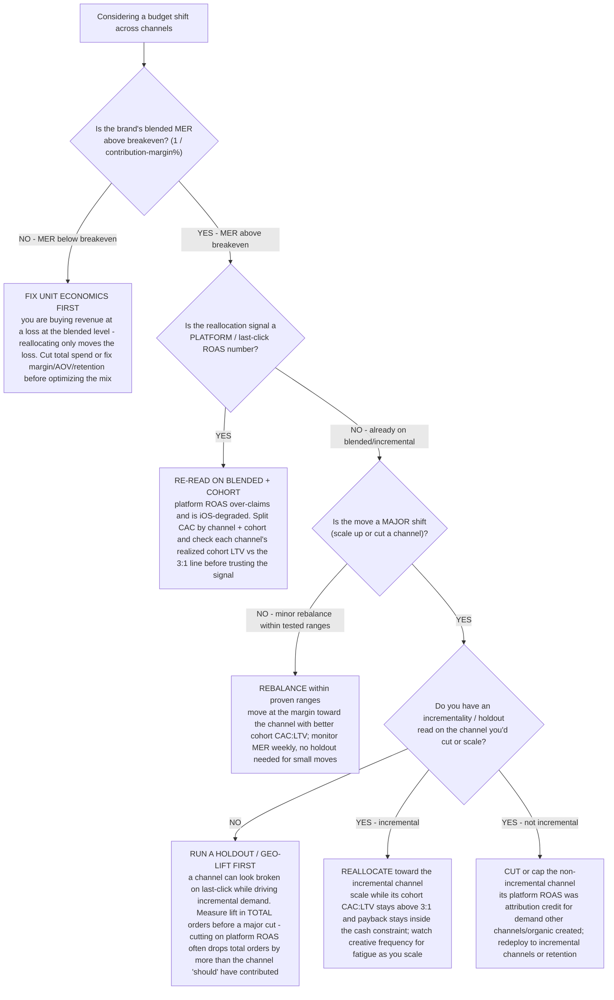

# DTC acquisition decision tree — channel-mix reallocation (MER-gated)

**Last reviewed:** 2026-06-05 · **Confidence:** medium (DTC performance-marketing + MER/blended-ROAS sources, web-verified this date). CAC, MER, and breakeven figures are brand- and segment-dependent — they carry inline `[verify-at-use]` markers and must be validated against the brand's actual contribution margin and channel data before any deliverable (CLAUDE.md §3 #8).

> Canonical decision tree for the [`performance-marketing-strategist`](../agents/performance-marketing-strategist.md) (acquisition), with a numbers assist from [`retention-analytics-analyst`](../agents/retention-analytics-analyst.md). Traverse top-to-bottom before moving a dollar of budget between channels. The load-bearing discipline: **never reallocate on a blended or platform-attributed (last-click) number** — those are the least trustworthy figures on the dashboard post-iOS signal loss. Reallocation is gated on a contribution-margin-derived breakeven and, for a real shift, an incrementality read. This is decision-support, not an ad-buying account (CLAUDE.md §2).

---

## When this applies

A brand is deciding whether to shift acquisition budget — scale a channel, cut one, or rebalance the mix. Common triggers: a channel's platform ROAS "falling," a blended CAC rising, a new-channel opportunity, or a quarterly budget reset. This complements the existing trees: **"CAC is climbing — root cause diagnosis"** (why is *this* channel's CAC up) and **"New channel test — go or no-go"** (should I add a channel). This tree answers the **reallocation across the existing mix** question.

## The tree



## Rationale per leaf

- **Fix unit economics first** — if blended MER is below breakeven (`1 / contribution-margin%`), the *whole* mix is unprofitable; reallocating only relocates the loss. Cut total spend or fix margin/AOV/retention before tuning the mix (§3 #2, #5).
- **Re-read on blended + cohort** — platform/last-click ROAS over-claims conversions it merely witnessed and is degraded by iOS signal loss. Split CAC by channel + cohort and read each channel's realized cohort LTV against the 3:1 line before acting on a platform number (§3 #5).
- **Rebalance within proven ranges** — small moves within already-tested spend ranges don't need a holdout; move toward better cohort CAC:LTV and watch MER weekly.
- **Run a holdout / geo-lift first** — a major cut or scale on a channel you can't read incrementally is a guess. A holdout measures lift in *total* orders; cutting on last-click frequently drops total orders by more than the channel was "credited" for.
- **Reallocate / cut on the incremental read** — scale a proven-incremental channel while its cohort CAC:LTV clears 3:1 and payback fits the cash constraint; cut or cap a channel whose ROAS was just attribution credit for demand created elsewhere.

## The economic test (the load-bearing arithmetic)

```
breakeven MER (= blended ROAS floor) = 1 / contribution-margin%
```

At ~30% contribution margin, breakeven MER ≈ 3.3 [verify-at-use]. MER (total revenue ÷ total ad spend) is the un-inflatable top-line check — unlike per-platform ROAS, it can't be inflated by attribution overlap. [`../scripts/dtc_calc.py`](../scripts/dtc_calc.py) `breakeven-roas` computes the floor from your margin and the per-order CAC headroom at a target ROAS; `ltv-cac` checks a channel's realized cohort LTV against the 3:1 line.

## Gotchas

- **Blended ROAS ≠ MER.** Blended ROAS uses only paid-attributed revenue; MER uses *total* revenue (incl. organic/email/direct), so MER is always higher for an established brand. Pick one definition and hold it constant — don't compare last month's MER to this month's blended ROAS. [verify-at-use]
- **Stage matters.** MER benchmarks rise with revenue stage (smaller brands often lose money on the first order and recover on repeat); a "low" MER at $2M is normal, the same number at $30M is a problem. [verify-at-use]
- **Creative fatigue masquerades as channel decay** — a frequency spike (> ~3.0) raises CAC without the channel being "wrong." Rotate creative before reallocating (see the "CAC is climbing — root cause diagnosis" tree).
- **Don't starve the working channel to fund a test** — ringfence test budget; a half-funded test produces a false negative (see the "New channel test" tree).

## Escalation & guardrails

- Any reallocation that would push a channel's cohort CAC:LTV below 2:1 → stop and re-scope with the lead (§3 #1).
- Every external benchmark (MER range, breakeven figure) carries a source URL + retrieval date or an `[unverified — training knowledge]` / `[ESTIMATE]` mark (§3 #8).
- A reallocation recommendation ships only with an owner, a date, and an expected metric movement.

## Sources (retrieved 2026-06-05)

- Northbeam — *Marketing Efficiency Ratio (MER): definition, benchmarks, vs ROAS*: https://www.northbeam.io/blog/marketing-efficiency-ratio-mer-roas
- Eightx — *What is MER? Formula + 2026 DTC benchmarks* (breakeven MER = 1 / contribution-margin%; stage-based ranges): https://eightx.co/blog/what-is-mer-marketing-efficiency-ratio
- AdLibrary — *Blended ROAS: the ratio every operator should track weekly* (can't be inflated by per-platform overlap): https://adlibrary.com/posts/blended-roas
