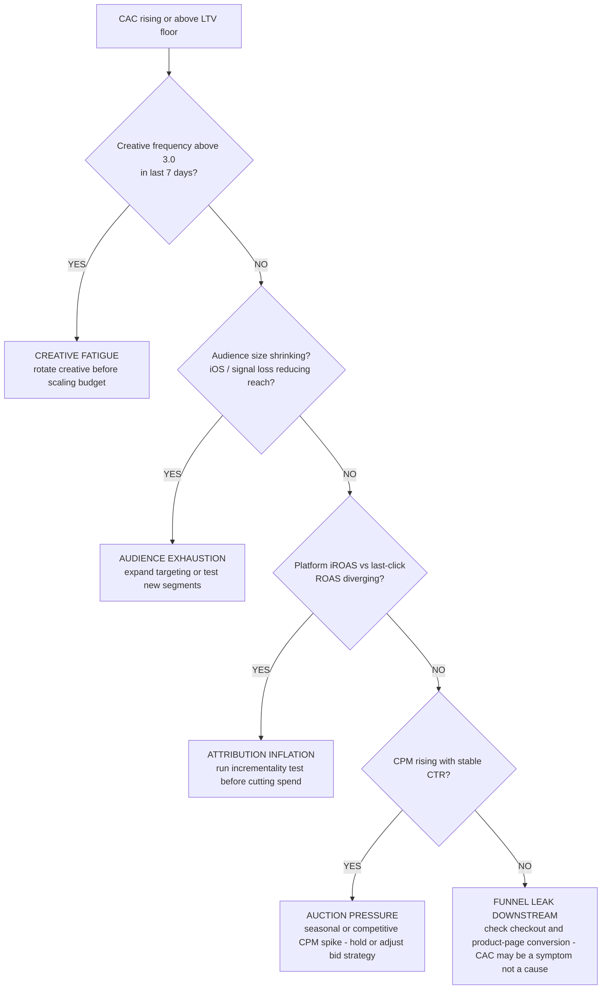
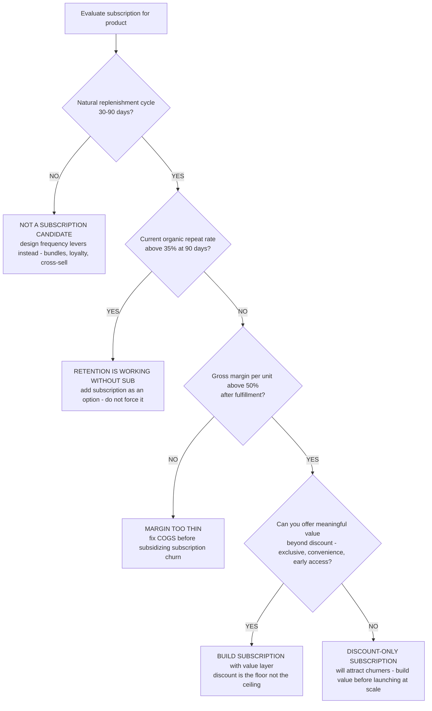
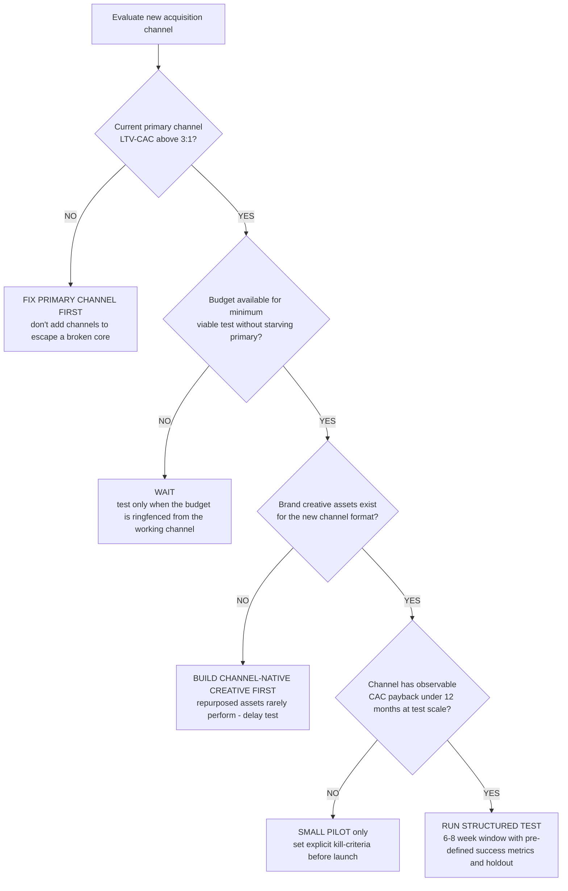

# DTC decision trees

Which analysis for which symptom — traverse top-to-bottom before picking a method.

## Decision Tree: Growing but not profitable

1) Read LTV:CAC and contribution margin (§3 #1, #2). 2) Split CAC by channel (§3 #5). 3) Check retention (§3 #3). 4) Cost the returns (§3 #6).

## Decision Tree: Conversion is low

1) Map the funnel (§3 #4). 2) Find the drop-off stage. 3) Attribute to traffic, product page, or checkout.

## Decision Tree: CAC is climbing

1) Split CAC by channel and cohort (§3 #5). 2) Match to cohort LTV (§3 #1). 3) Reallocate to efficient channels.

## How to read these trees

Traverse top-to-bottom and stop at the first matching branch — the order encodes the cheap-checks-before-expensive-checks discipline (§3). Each leaf names a skill, a specialist, or a house-opinion to apply. Never skip a higher branch because a lower one looks more interesting; a denominator, seasonal, or definitional artifact masquerades as a finding more often than not.

## Decision Tree: Which skill for which task

- **Read LTV:CAC and contribution margin** → use when: Read LTV:CAC against the 3:1 line and contribution margin after the real costs, so a profitability problem is diagnosed correctly. ([`../skills/read-ltv-cac/SKILL.md`](../skills/read-ltv-cac/SKILL.md))
- **Diagnose the conversion funnel** → use when: Locate a conversion problem by funnel stage — traffic, product page, cart, checkout — instead of reading the headline rate. ([`../skills/diagnose-the-funnel/SKILL.md`](../skills/diagnose-the-funnel/SKILL.md))
- **Build the retention engine** → use when: Read cohort retention and the repeat rate and build the second-purchase engine, since retention compounds LTV. ([`../skills/build-the-retention-engine/SKILL.md`](../skills/build-the-retention-engine/SKILL.md))
- **Manage CAC by channel** → use when: Read CAC by channel and cohort and allocate budget to efficiency, instead of a blended number. ([`../skills/manage-cac-by-channel/SKILL.md`](../skills/manage-cac-by-channel/SKILL.md))
- **Cost the returns** → use when: Read return rate and its full cost as a contribution-margin line, so a high-return category isn't mistaken for a winner. ([`../skills/cost-the-returns/SKILL.md`](../skills/cost-the-returns/SKILL.md))

## Decision Tree: Which specialist owns this

- **The engagement** → [`ecommerce-lead`](../agents/ecommerce-lead.md)
- **Product and conversion** → [`merchandising-specialist`](../agents/merchandising-specialist.md)
- **Acquisition** → [`performance-marketing-strategist`](../agents/performance-marketing-strategist.md)
- **The numbers** → [`retention-analytics-analyst`](../agents/retention-analytics-analyst.md)

When two leaves apply, route to the **lead** first to scope and sequence — overlapping symptoms usually mean two drivers at once, and the lead keeps the analysis from collapsing into a single-cause story.

## Decision Tree: Which house-opinion gates the call

Before picking any method, check whether one of the standing biases (§3) already decides the framing:

1. LTV:CAC is the master ratio — 3:1 is the line — if this is in question, apply §3 #1 before any method.
2. Contribution margin, not revenue, is the scoreboard — if this is in question, apply §3 #2 before any method.
3. Retention is the profit engine — the second purchase is everything — if this is in question, apply §3 #3 before any method.
4. Read the conversion funnel, not the conversion rate — if this is in question, apply §3 #4 before any method.
5. CAC is a blended lie — read it by channel and by cohort — if this is in question, apply §3 #5 before any method.
6. Returns are a margin line, not a customer-service line — if this is in question, apply §3 #6 before any method.
7. AOV and frequency are levers you design, not constants — if this is in question, apply §3 #7 before any method.
8. Cite the source and date for every benchmark — if this is in question, apply §3 #8 before any method.

## Escalation & guardrails

- Anything touching client PII / regulated records → stop and route to `ravenclaude-core` `security-reviewer`.
- Any external figure entering a deliverable → carry a source URL + retrieval date, or mark it `[unverified — training knowledge]` / `[ESTIMATE]` (§3, final house opinion).
- A recommendation ships only with an owner, a date, and an expected metric movement.
## Sourcing note

Figures in this file are from the author's domain knowledge and are marked `[unverified — training knowledge]` or `[ESTIMATE]` at point of use. Validate against a primary source before putting any figure in a client deliverable (§3 cite-or-mark rule).

---

## Decision Tree: CAC is climbing — root cause diagnosis

**When this applies:** blended or channel-level CAC has risen more than 15% month-over-month OR is above the 3:1 LTV:CAC floor after dividing into the channel's realized cohort LTV. Observable inputs: platform-reported spend, channel-level CAC trend, creative frequency, and audience size.

**Last verified:** 2026-06-05 against standard DTC performance-marketing practice.

**Rationale per leaf:**
- *Creative Fatigue* — frequency above 3.0 is the primary creative-fatigue signal; rotating creative is the first and cheapest fix before budget changes.
- *Audience Exhaustion* — shrinking available audience from iOS signal loss or a small TAM is a targeting problem, not a bid problem.
- *Attribution Inflation* — diverging platform and incremental ROAS means the platform is overclaiming; the real channel efficiency may be fine or worse than measured.
- *Auction Pressure* — rising CPM with stable CTR is a supply-side auction signal, often seasonal; waiting out or adjusting bid caps is lower cost than creative iteration.
- *Funnel Leak Downstream* — if none of the above apply, the issue may not be acquisition cost but conversion — the same spend hitting a lower-converting checkout inflates measured CAC.

**Tradeoffs summary:**

| Root cause | Fix speed | Cost | Blast radius | Use when |
|---|---|---|---|---|
| Creative fatigue | days | low | single campaign | Frequency spike |
| Audience exhaustion | weeks | medium | account-wide | Reach declining |
| Attribution inflation | weeks | low - run a test | diagnostic only | Platform vs incremental gap |
| Auction pressure | days-weeks | hold | seasonal | CPM spiking, CTR stable |
| Funnel leak | weeks | medium | full funnel | None of the above |

---

## Decision Tree: Subscription vs one-time purchase — LTV design choice

**When this applies:** a brand is deciding whether to introduce a subscription option for an existing product, or is evaluating whether the current subscription economics are working. Observable inputs: current repeat purchase rate, average purchase frequency, product category, and gross margin per unit.

**Last verified:** 2026-06-05 against DTC subscription-design practice.

**Rationale per leaf:**
- *Not a Subscription Candidate* — products without a natural replenishment cycle create subscription friction that damages the brand relationship.
- *Retention Is Working* — if organic repeat is strong, subscription is an add-on option, not a requirement; forced subscription on a willing repeat buyer can irritate.
- *Margin Too Thin* — a sub-50% gross margin subscription at discounted price may generate negative contribution margin at the unit level; fix COGS first.
- *Full Subscription with Value Layer* — the most durable subscriptions add convenience and access value beyond a discount so they survive when competitors offer a discount too.
- *Discount-Only Subscription* — a price-only subscription attracts deal-seekers who churn when a better promotion appears; acceptable as a test, dangerous at scale.

**Tradeoffs summary:**

| Path | CAC impact | LTV impact | Churn risk | Use when |
|---|---|---|---|---|
| Not a sub candidate | neutral | neutral | n/a | No replenishment cycle |
| Subscription as option | low | medium uplift | low | Repeat rate already strong |
| Full value-layer sub | medium build cost | high | low | Margin good - value layer possible |
| Discount-only sub | low | medium | high | Early test only |

---

## Decision Tree: New channel test — go or no-go

**When this applies:** the team is evaluating whether to add a new acquisition channel (TikTok, affiliate, influencer, podcast, direct mail) to an existing channel mix. Observable inputs: current blended CAC, existing channel saturation, budget headroom, and minimum viable test spend.

**Last verified:** 2026-06-05 against DTC channel-diversification practice.

**Rationale per leaf:**
- *Fix Primary Channel First* — adding a new channel to escape a broken primary only spreads the problem and obscures which channel is actually the issue.
- *Wait* — a channel test that cannibalizes the working budget creates a false negative; the new channel appears to underperform because it ran on half the viable test spend.
- *Build Creative First* — channel-native creative (vertical video for TikTok, conversational copy for podcast) is a prerequisite for a signal; borrowed assets generate noise not signal.
- *Small Pilot* — a channel without visible payback evidence at test scale needs explicit kill criteria so it doesn't run indefinitely on sunk-cost logic.
- *Run Structured Test* — a channel with payback evidence deserves a proper test with a holdout, not a casual boost; the holdout is what makes the result actionable.

**Tradeoffs summary:**

| Decision | Investment | Signal quality | Risk | Use when |
|---|---|---|---|---|
| Fix primary first | zero new spend | high | low | Primary LTV-CAC below 3:1 |
| Wait | zero | n/a | low | Budget not ringfenced |
| Build creative | weeks plus cost | medium | low | Assets not ready |
| Small pilot | minimal | low - directional | medium | No payback evidence |
| Structured test | medium | high | medium | Evidence exists - test cleanly |
