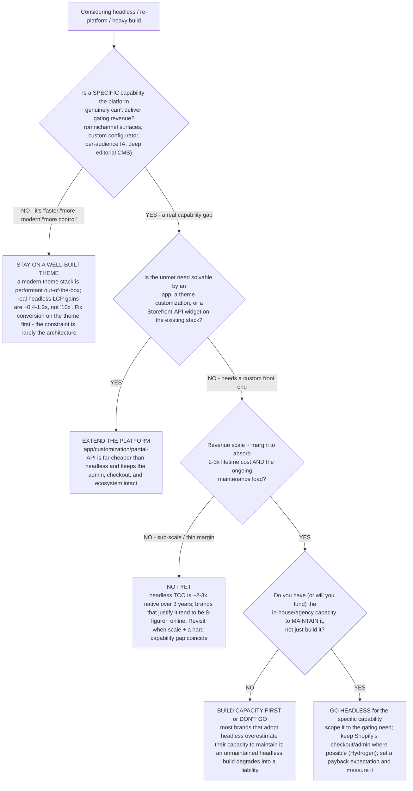

# DTC storefront decision tree — platform (themed Shopify) vs. headless/build

**Last reviewed:** 2026-06-05 · **Confidence:** medium (Shopify-headless build-cost + TCO sources, web-verified this date). Build-cost, monthly-TCO, and the revenue-threshold figures are agency- and scope-dependent — they carry inline `[verify-at-use]` / `[ESTIMATE]` markers and must be validated against actual quotes and the brand's real requirements before any deliverable (CLAUDE.md §3 #8).

> Canonical decision tree for the [`ecommerce-lead`](../agents/ecommerce-lead.md) (the engagement) with a conversion assist from [`merchandising-specialist`](../agents/merchandising-specialist.md). Traverse top-to-bottom before recommending a re-platform or a headless build. The decision is **not** "headless is faster/better" — it is a **capability-need + capacity + payback** trade where the default for almost every DTC brand is **stay on a well-built theme**, and headless earns its 2–3x lifetime cost only when a specific capability the platform genuinely can't deliver is gating revenue. This is decision-support; the team is **not** a storefront/CMS platform or a dev shop (CLAUDE.md §2).

---

## When this applies

A brand is weighing a storefront architecture change — going headless (custom front end on a commerce API, e.g. Shopify Hydrogen / a separate framework), a major re-platform, or a heavy custom build — usually triggered by an agency pitch, a perceived performance ceiling, or an omnichannel ambition. The cheap-checks-first order matters here because the wrong call "costs six figures and months of runway for no meaningful return" [verify-at-use].

## The tree



## Rationale per leaf

- **Stay on a well-built theme (the default)** — "faster," "more modern," and "more control" are not capability gaps. A modern theme stack is performant out of the box; real-world headless performance gains are ~0.4–1.2s LCP, not the "10x faster" marketing claim, and a poorly-built headless front end can be *slower* [verify-at-use]. Conversion problems are almost always merchandising/PDP/checkout, not architecture (§3 #4) — fix those first.
- **Extend the platform** — when there *is* a real gap, an app, a theme customization, or a Storefront-API widget on the existing stack is dramatically cheaper than a full headless build and keeps the native checkout, admin, and app ecosystem.
- **Not yet (sub-scale)** — headless lifetime cost runs ~2–3x a native build over three years, and the brands that justify it tend to be 8-figure-plus online revenue [verify-at-use]. Below that, the payback rarely closes.
- **Build capacity first** — a 2025 survey found a majority of brands overestimated their internal capacity to maintain headless [verify-at-use]; an unmaintained custom front end becomes a security/perf liability, not an asset.
- **Go headless (scoped)** — only when a real capability gap, the scale/margin to absorb 2–3x TCO, and the maintenance capacity all coincide. Scope to the gating capability, keep the native checkout/admin where possible, and attach a measurable payback (§3 #2).

## The economic test (the load-bearing arithmetic)

Headless is justified when the **incremental contribution margin** from the capability it unlocks exceeds the **fully-loaded incremental cost** over the payback horizon:

```
go-headless if:  delta-contribution-margin (3yr)  >  build cost + (monthly TCO uplift x 36)
```

Typical build ranges run ~$80K–$400K+ (enterprise 350k EUR+), with 3-year TCO roughly 2–3x a native Shopify Plus implementation [verify-at-use]. Most "performance" justifications fail this test because the LCP gain doesn't move conversion enough to cover the cost — re-quantify on *your* numbers, not the agency's reference customer.

## Gotchas

- **The constraint is rarely the architecture** — re-platforming to fix a conversion problem usually re-builds the same funnel leak on a more expensive stack. Diagnose the funnel first (§3 #4).
- **"10x faster" is a marketing claim** — demand a measured LCP delta on a comparable theme baseline, not a generic benchmark [verify-at-use].
- **Maintenance is the hidden line** — the monthly dev/hosting/CMS load, not the build, is where most headless TCO surprises live; model 36 months, not the launch.
- **Don't conflate re-platform with re-design** — a theme refresh delivers most of the perceived "modern" benefit at a fraction of headless cost.

## Escalation & guardrails

- A re-platform/headless recommendation that can't show positive 3-year payback on the brand's real numbers → do not ship it; route back to the lead to re-scope (§3 #2).
- Anything touching customer PII migration or payment/checkout re-architecture → stop and route to `ravenclaude-core` `security-reviewer`.
- Every cost/threshold figure carries a source URL + retrieval date or an `[unverified — training knowledge]` / `[ESTIMATE]` mark (§3 #8).

## Sources (retrieved 2026-06-05)

- Ask Phill — *Shopify headless commerce: when it's worth it & what it costs* (build cost, when it's justified): https://askphill.com/blogs/blog/shopify-headless
- Conversion Design — *Shopify headless: Hydrogen, costs & trade-offs (2026)* (3-yr TCO ~2–3x native; LCP ~0.4–1.2s; capacity-overestimation survey): https://conversion-design.com/blog/shopify-headless-commerce-guide
- Shopify — *Headless vs traditional commerce: how to choose (2025)*: https://www.shopify.com/enterprise/blog/headless-commerce-vs-traditional-commerce
