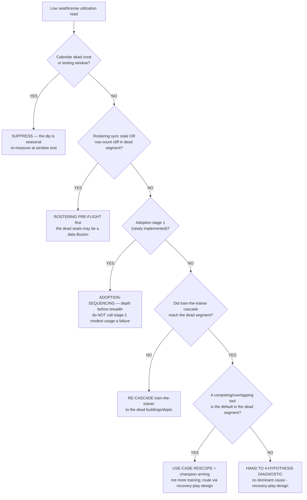
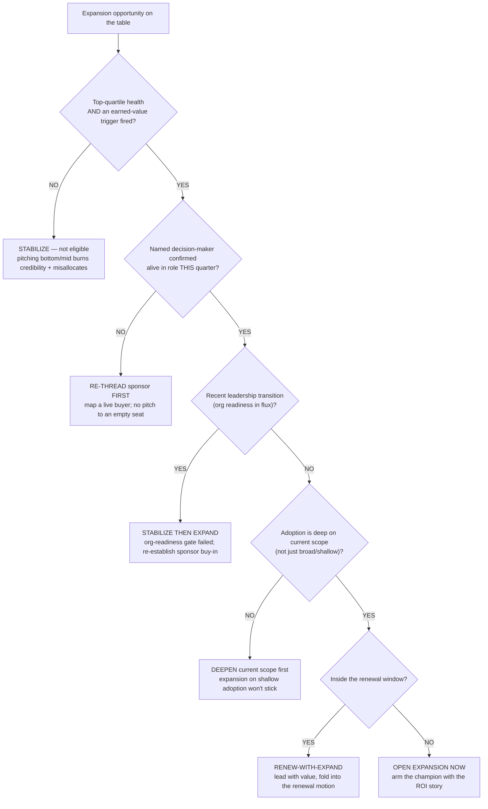

# Adoption-intervention & expand-vs-stabilize decision trees

> **Last reviewed:** 2026-06-05. Added in the value-add build-out as the **net-new complement** to the existing canonical trees in [`partner-success-decision-trees.md`](partner-success-decision-trees.md) (health-triage, renewal-risk, cadence, escalation, recovery-root-cause, AI-policy, handoff, FERPA-classification) and [`partner-health-decline-which-play.md`](partner-health-decline-which-play.md) (the play-selection *router*). Those route at the **band / play** altitude. The two trees here operate **one level deeper**: given a *measured utilization read*, which **adoption intervention** to run; and given an *earned* partner, whether to **expand or stabilize**. They deliberately do not duplicate any existing tree — they hand off to the play router and the expansion/adoption skills rather than re-deciding what those already decide.
>
> Format follows [`../../../docs/best-practices/decision-trees-in-knowledge-files.md`](../../../docs/best-practices/decision-trees-in-knowledge-files.md): observable entry condition, `Last verified` date, Mermaid graph, per-leaf rationale, tradeoffs table for any tree with ≥3 leaves. These are **priors to traverse before acting**, not keyword matches. Higher branches win on ties.

---

## Decision Tree: Adoption intervention — which lever for a low-utilization read

**When this applies:** the **license/seat-utilization** metric has come back low (a meaningful fraction of provisioned seats have <N meaningful sessions in the last 90 days), and the PSM must decide *which adoption intervention* to run — **before** reaching for any commercial motion. This is the deeper traversal beneath the play-selection router's IMPLEMENTATION / ADOPTION branches. Observable inputs: last-successful-rostering-sync recency + row-count stability, calendar phase, adoption stage, whether the train-the-trainer cascade reached the dead segment, and whether a competing/overlapping tool is the default.

**Last verified:** 2026-06-05 against `rostering-data-quality-typology.md`, `district-implementation-failure-modes.md`, `k12-spend-utilization-43pct.md`, `adoption-sequencing-k12/SKILL.md`, and the play-selection router. K-12 utilization figures `[verify-at-use]`.

**Rationale per leaf:**

- _SUPPRESS_ — a utilization dip inside a dead zone (winter break, testing window, first 2 weeks of school) is seasonal; intervening trains the partner to see the PSM as out of touch and burns credibility when usage rebounds on its own.
- _ROSTER_ — dead seats are *most often* a rostering-completeness illusion ("sync ran successfully" ≠ data is correct): a roster that synced but never populated a building reads as zero-usage. Verify the data before treating the segment as a real adoption failure.
- _SEQUENCE_ — a stage-1 partner's modest usage is expected (deep-feature adoption hasn't had time to develop); the right lever is sequencing depth-before-breadth, not an intervention the partner experiences as "you're already calling us a failure." **Do NOT push feature breadth in stage 1.**
- _RECASCADE_ — if the cascade simply never reached the dead segment, the fix is to re-run train-the-trainer there (the only model that scales in K-12), not to re-train everyone or escalate.
- _RESCOPE_ — when an overlapping competing tool is the default, more training won't move usage; the lever is use-case rescoping + arming the champion to win the default, routed through `recovery-play-design`.
- _DIAGNOSE_ — no dominant cause means run the full 4-hypothesis recovery diagnostic (product fit / implementation / sponsorship / external pressure) before any single remedy.

**Tradeoffs summary:**

| Intervention | Time-to-signal | Cost if wrong | Approval gate? | Use when |
|---|---|---|---|---|
| Suppress | 0 | High if a real drop hides behind the dead zone | No — PSM internal | Dead zone / testing window |
| Rostering pre-flight | hours-days | Low — partner grateful for the fix | Sometimes (eng) | Stale sync / row-count cliff in dead segment |
| Adoption-sequencing | 4-12 wks | Low — reads as service | No | Stage-1 newly-implemented partner |
| Re-cascade train-the-trainer | 2-6 wks | Low-medium | No | Cascade never reached the dead segment |
| Use-case rescope + arm champion | weeks | Medium — wrong if it's actually a data issue | No | Overlapping tool is the default |
| 4-hypothesis diagnostic | days | Low — diagnostic owns the next call | No | No dominant cause |

`requires:` the ROSTER leaf needs read access to the integration-broker logs; the RESCOPE / DIAGNOSE leaves need feature-level usage telemetry. If a signal is missing, refreshing it is the first job — not picking a leaf. This tree resolves which **adoption** lever to pull; it never reaches a renewal or expansion motion (those live above it in the play router).

---

## Decision Tree: Expand or stabilize — gating an expansion motion

**When this applies:** a partner looks like an expansion candidate (a seat / module / department / tier-upgrade / multi-year opportunity is on the table) and the PSM must decide whether to **open the expansion motion now** or **stabilize first**. This operationalizes the expansion 3-gate model (top-quartile health AND demonstrable adoption AND organizational readiness) as a traversable tree, with the don't-sell discipline baked in. Observable inputs: health band/quartile, an earned-value trigger, named-decision-maker liveness, recent leadership transition, adoption depth vs. breadth, and renewal-window proximity.

**Last verified:** 2026-06-05 against `expansion-play-design/SKILL.md`, `executive-sponsor-mapping/SKILL.md`, the renewal-risk tree, and house opinions §3 #10 (don't sell — PSM is not AE) + the earned-value gate.

**Rationale per leaf:**

- _STABILIZE_ — the first gate is non-negotiable: an expansion pitch to a bottom- or mid-quartile partner burns PSM credibility ("you're already failing and you want to *sell* me more?") and misallocates effort that a struggling partner needs. No earned value → no pitch. (§3 #10 — don't sell.)
- _RETHREAD_ — even a thriving partner can't be pitched into an empty seat (the ghost-sponsor pattern); confirm a live decision-maker or re-thread to a successor before any commercial motion.
- _STABILIZE_THEN_ — a leadership transition fails the organizational-readiness gate (gate 3); re-establish a bought-in sponsor first, then re-open expansion. Pitching into a transition reads as tone-deaf and lands cold.
- _DEEPEN_ — expansion built on broad-but-shallow adoption doesn't stick; deepen the current scope to genuine value first so the expansion has a foundation (and an ROI story).
- _RENEW_EXPAND_ — inside the renewal window, an eligible expansion folds into the renewal motion (RENEW-INCREASE / EXPAND in the renewal-risk tree) — lead with value delivered, price second; don't run a parallel disconnected pitch.
- _EXPAND_NOW_ — top-quartile, earned trigger, live sponsor, stable org, deep adoption, outside the renewal window: open the expansion now and arm the champion with the ROI/value story to carry internally.

**Tradeoffs summary:**

| Decision | Lead time | Cost if wrong | Approval gate? | Use when |
|---|---|---|---|---|
| Stabilize (not eligible) | n/a | Low — protects credibility | No | Not top-quartile / no earned-value trigger |
| Re-thread sponsor first | weeks | High — motion wasted on empty seat | No | Decision-maker unconfirmed |
| Stabilize then expand | weeks-months | High — tone-deaf if pitched into flux | No | Recent leadership transition |
| Deepen current scope first | 4-12 wks | Medium — expansion won't stick on shallow adoption | No | Adoption broad but shallow |
| Renew-with-expand | months | High — credibility burn if not earned | Yes (gate + pricing) | Eligible AND inside renewal window |
| Open expansion now | weeks | High — credibility burn if not earned | Yes (gate model) | All gates pass, outside renewal window |

Higher branch wins: the earned-value gate precedes sponsor liveness precedes org readiness precedes adoption depth. An expansion never jumps a failed gate — "stabilize" is the honest default, not a fallback.

---

## How agents consume these trees

Each tree is a **pre-action prior**: when the user's situation matches an entry condition, traverse the matching Mermaid graph top-to-bottom before selecting an action; do not pattern-match on the user's phrasing. Higher branches win on ties. If a signal is stale or missing, refreshing it is the first job — not picking a leaf. The adoption-intervention tree hands declining/red cases **down** to the play-selection router and the `recovery-play-design` skill; the expand-vs-stabilize tree hands eligible-inside-window cases **into** the renewal-risk tree (RENEW-INCREASE / EXPAND). The relevant agents — `learning-analytics-analyst` (utilization read → adoption intervention), `success-playbook-designer` (expand-vs-stabilize), `edtech-partner-success-manager` (executing either) — already carry decision-tree traversal priors; these two extend that discipline to the adoption-lever and expansion-gate decisions the existing trees stop short of.

## References

- [`partner-success-decision-trees.md`](partner-success-decision-trees.md) — the canonical triage / renewal / cadence / escalation / recovery / AI / handoff / FERPA trees this file complements (and does not duplicate)
- [`partner-health-decline-which-play.md`](partner-health-decline-which-play.md) — the play-selection *router* the adoption tree hands off to
- [`k12-spend-utilization-43pct.md`](k12-spend-utilization-43pct.md) — the 57%/43% utilization framing the adoption tree's entry condition rests on
- [`rostering-data-quality-typology.md`](rostering-data-quality-typology.md) + [`district-implementation-failure-modes.md`](district-implementation-failure-modes.md) — the ROSTER / RE-CASCADE leaves
- [`../skills/adoption-sequencing-k12/SKILL.md`](../skills/adoption-sequencing-k12/SKILL.md) — the SEQUENCE / DEEPEN leaves (depth before breadth)
- [`../skills/expansion-play-design/SKILL.md`](../skills/expansion-play-design/SKILL.md) — the 3-gate model the expand-vs-stabilize tree operationalizes
- [`../scripts/psm_calc.py`](../scripts/psm_calc.py) — `utilization` mode quantifies the entry condition for the adoption tree
- [`../../../docs/best-practices/decision-trees-in-knowledge-files.md`](../../../docs/best-practices/decision-trees-in-knowledge-files.md) — the format this file follows
