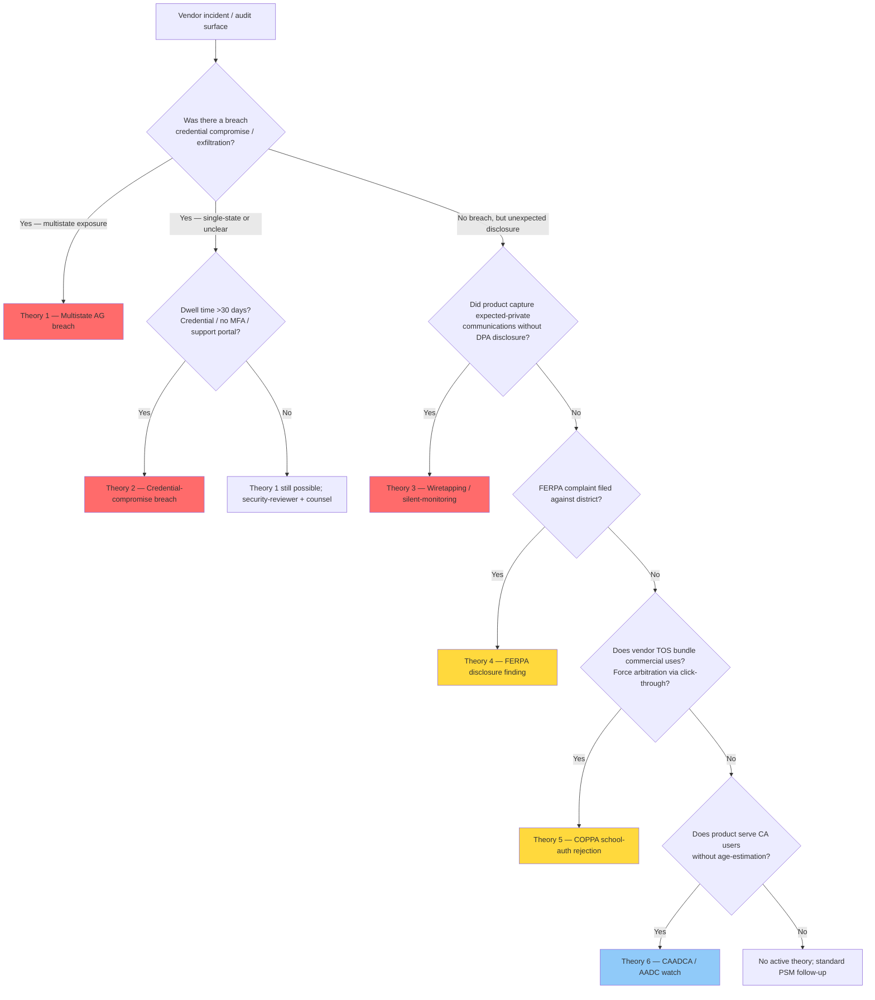

# EdTech Enforcement Precedents 2025-2026 — Six Theories, Four Precedents

> Field guidance for PSMs evaluating EdTech vendors when an incident or near-incident surfaces. **Not legal advice.** Maps an observed incident to the litigation theory it most resembles so the PSM can route to the right surface (security-reviewer, district counsel, or an "elevated risk — escalate" memo).

---

## 1. The four canonical precedents (2025-2026)

| Precedent | Date | Amount | Theory | Bound parties | Source |
|---|---|---|---|---|---|
| **Illuminate Education multistate AG** | Nov 12, 2025 | **$5.1M** ($3.25M CA / $1.7M NY / $150K CT) | KOPIPA (CA) + CT student-data law + NY § 2-d | EdTech vendor | [NY AG press release](https://ag.ny.gov/press-release/2025/attorney-general-james-and-multistate-coalition-secure-51-million-education), [CA AG press release](https://oag.ca.gov/news/press-releases/attorney-general-bonta-joins-states-securing-51-million-settlements-education), [CT AG press release](https://portal.ct.gov/ag/press-releases/2025-press-releases/attorney-general-tong-enters-into-settlement-in-first-action-under-student-data-privacy-law) |
| **PowerSchool Dec 2024 breach** | Detected Dec 28, 2024 (attacker present since Aug-Sep 2024) | Track One litigation ongoing; MTD denied Mar 18, 2026 | Negligence + breach of fiduciary duty + unjust enrichment | EdTech vendor | [Labaton Keller Sucharow](https://www.labaton.com/cases/in-re-powerschool-holdings-customer-security-breach-litigation), [TechCrunch May 8 2025](https://techcrunch.com/2025/05/08/powerschool-paid-a-hackers-ransom-but-now-schools-say-they-are-being-extorted/) |
| **PowerSchool / Naviance class settlement** | Feb 27, 2026 (preliminary); **Jun 10, 2026 final hearing** | **$17.25M** | Wiretapping / unauthorized disclosure; recording of student↔counselor communications transmitted to third-party analytics | EdTech vendor + district co-defendant (CPS) | [ClassAction.org](https://www.classaction.org/news/17.25m-powerschool-settlement-resolves-class-action-over-alleged-interception-of-confidential-student-communications) |
| **CDE FERPA finding** | Jan 28, 2026 | (Sanction TBD; first **written notice of findings** progressed to this stage in FERPA enforcement process) | FERPA disclosure obligations (gender-identity policies alleged to conceal information from parents) | State Department of Education | [Fagen Friedman & Fulfrost](https://www.f3law.com/insights/us-department-of-education-finds-cde-violated-ferpa-by-enforcing-laws-prohibiting-gender-identity-disclosure/) |

`[verify-at-use — 2026-06-04 — source dates and amounts confirmed via deep-research scan; specific case dockets may have advanced since]`

---

## 2. Six litigation theories — which one fits which incident

When a vendor incident or audit surface surfaces, the PSM's first move is to identify *which theory* is in play. Each theory has a different remediation surface and a different escalation path.

### Theory 1 — Multistate AG breach (Illuminate pattern)
- **Predicate:** vendor breach affecting students in multiple states; state laws independently violated.
- **Shape:** joint settlement, multiple AGs acting together, parallel state-law violations.
- **PSM signal:** vendor operates in NY + CA + CT (or any 2-of-3 of that cluster) AND a breach is reported, however small.
- **Escalation route:** security-reviewer → counsel → multistate-insurance-disclosure ask to vendor.
- **Bright-line:** the $5.1M precedent shows **first-enforcement under KOPIPA + CT student-data law + second under NY § 2-d** — small-cell incidents *do* now reach the AG track even where no FERPA DOE complaint was filed.

### Theory 2 — Credential-compromise breach (PowerSchool Dec 2024 pattern)
- **Predicate:** single point of failure (e.g., support-portal credential without MFA); attacker persistence; ransom paid; downstream extortion.
- **Shape:** vendor pays ransom → individual districts subsequently extorted → state AG consolidation expected.
- **PSM signal:** vendor's incident disclosure mentions "support credential," "no MFA on portal," or "extended dwell time."
- **Escalation route:** security-reviewer immediately + counsel; recommend district contact district AG affairs office proactively if extortion contact occurs.
- **Bright-line:** the **dwell time** (~4 months in PowerSchool) is what distinguishes this from a "fast smash-and-grab" breach. Long dwell = larger PII pool = larger AG exposure.

### Theory 3 — Wiretapping / silent-monitoring (Naviance pattern)
- **Predicate:** *no breach occurred.* Product silently recorded what students wrote to staff and transmitted to third-party analytics without a DPA-disclosed expectation-of-monitoring or parent opt-in.
- **Shape:** class action alleging unauthorized disclosure of expected-private communications; distinct legal theory from breach.
- **PSM signal:** vendor's product collects student-to-staff messaging, voice-to-text, browser session recording, or similar passive-observation features → check DPA disclosure language carefully.
- **Escalation route:** counsel review of DPA wording; route to `ferpa-comms-translator` for parent-notification language; co-defendant exposure means district is bound too.
- **Bright-line:** the $17.25M class settlement shows the wiretapping theory has teeth even without a breach. **"No breach = no FERPA exposure" is now false.**

### Theory 4 — FERPA disclosure-obligation finding (CDE pattern)
- **Predicate:** DOE direct enforcement; not an EdTech vendor case but ends the "FERPA has no teeth" era.
- **Shape:** written notice of findings; formal enforcement track engaged.
- **PSM signal:** any FERPA complaint filed against a district that the vendor's product is implicated in (e.g., notification system that withheld safety information from parents).
- **Escalation route:** the district is the bound party; vendor exposure is downstream via DPA indemnification. Counsel-led response, not security-reviewer.
- **Bright-line:** post-Jan 28, 2026, FERPA enforcement is back on. Vendors that built their DPA assuming "FERPA never enforces" need a posture refresh.

### Theory 5 — COPPA school-authorization rejection (Edmodo + IXL amicus pattern)
- **Predicate:** vendor's commercial use exceeded "educational purpose"; school authorization claimed but FTC says insufficient.
- **Shape:** FTC enforcement (Edmodo $6M) or amicus briefs rejecting forced arbitration via TOS (IXL).
- **PSM signal:** vendor TOS bundles non-educational uses (targeted-ad-equivalent, profile-building) with educational features; vendor relies on click-through TOS to bind parents.
- **Escalation route:** counsel review of DPA + TOS; demand binding-by-LEA-only model with named-purpose enumeration.
- **Bright-line:** the FTC has issued **two amicus briefs** (Aug 13, 2024 + post-IXL-interlocutory-appeal) reaffirming the position. The school-authorization theory is not a defense against arbitration-bundling.

### Theory 6 — CAADCA / age-appropriate design challenge (NetChoice v. Bonta pattern)
- **Predicate:** state-law age-appropriate-design code provisions; constitutional + scope challenge in federal court.
- **Shape:** Ninth Circuit Mar 12, 2026 — most CAADCA provisions remain enjoined, but **age-estimation and most-protective-default-privacy-settings revived** as potentially enforceable.
- **PSM signal:** vendor product serves CA users; age-estimation requirement may apply (post-remand).
- **Escalation route:** counsel; track NetChoice docket; don't assume CAADCA is enforceable yet but plan for age-estimation.
- **Bright-line:** **data-use restrictions remain blocked**; CA overlay should *not* assume CAADCA is enforceable.

---

## 3. Mapping vendor incidents to theories

---

## 4. What's anticipated next (watch-items)

- **PowerSchool Dec 2024 breach → expected multistate AG consolidation 12-18 months out.** The absence of an AG settlement *yet* (mid-2026) for a breach affecting 62M+ records is itself notable. `[verify-at-use]`
- **DOE FERPA rulemaking** — FTC explicitly deferred EdTech-specific COPPA carveouts pending this. When DOE publishes, the EdTech school-authorization line gets a federal rewrite.
- **KOSA federal** — Senate passed by UC May 2025; House E&C reported gutted KIDS Act Mar 2026; duty-of-care provision is contested. Until enacted, KOSA is footnote-watch, not gate.
- **CT neural-data classification effective Jul 1, 2026** — EdTech-adjacent surfaces (BCI study tools, focus-tracking) fall in scope.
- **CAADCA Ninth Circuit remand** — age-estimation may become enforceable; data-use restrictions still enjoined.

---

## 5. PSM playbook — what to do when a theory matches

| Theory matched | First-move (24h) | Within-week | Within-month |
|---|---|---|---|
| 1 — Multistate AG breach | Security-reviewer + counsel; freeze new partner-district adds | Confirm vendor multistate insurance + AG notification status | Update partner-facing DPA addenda; PSM portfolio review for state-cluster exposure |
| 2 — Credential-compromise breach | Same as Theory 1 + MFA-on-support-portal audit | Vendor dwell-time disclosure ask | Partner districts brief on extortion risk |
| 3 — Wiretapping / silent-monitoring | Pull DPA + product surface inventory; identify capture-points | Counsel review of disclosure language; route to `ferpa-comms-translator` for parent notice | Co-defendant exposure check — district named or not |
| 4 — FERPA disclosure finding | Counsel; identify whether product is implicated | DPA indemnification clause review | DPA refresh if "FERPA never enforces" assumption baked in |
| 5 — COPPA school-auth rejection | Counsel + DPA + TOS review | Demand binding-by-LEA + named-purpose | Renegotiate DPA if forced arbitration is present |
| 6 — CAADCA / AADC watch | None immediate; tracker entry | NetChoice docket check | Age-estimation roadmap with vendor if CA users present |

---

## See also

- [`ferpa-dashboard-boundaries.md`](./ferpa-dashboard-boundaries.md) — what a PSM dashboard can/can't surface.
- [`ferpa-aggregate-threshold-defaults.md`](./ferpa-aggregate-threshold-defaults.md) — PTAC small-cell defaults.
- [`state-privacy-law-matrix.md`](./state-privacy-law-matrix.md) — state-by-state overlay including 2026 enforcement scoreboard.
- [`ai-training-prohibition-clauses.md`](./ai-training-prohibition-clauses.md) — 5-clause DPA model for AI subprocessors.
- [`coppa-2025-amendment-edtech-implications.md`](./coppa-2025-amendment-edtech-implications.md) — Apr 22 2026 compliance deadline mapping.
- [`parent-comms-jurisdictional-bear-traps.md`](./parent-comms-jurisdictional-bear-traps.md) — state-by-state parent-notification posture.
