# FERPA aggregate-threshold defaults — n≥10 + complementary suppression

> **Status.** Authoritative defaults for any EdTech dashboard that surfaces aggregate engagement metrics (logins, completion counts, MAU/DAU, streaks). PTAC does **not** mandate a single numeric threshold — it defers to state/LEA. The defaults below are industry-standard fallbacks; honor the stricter of (a) LEA contract, (b) state law, (c) PTAC guidance, (d) this default.
> **NOT legal advice.** Any specific disclosure question routes through the LEA's privacy officer / counsel.

---

## 1. The defaults

| Default | Value | Source |
|---|---|---|
| **Minimum cell size (general)** | **n ≥ 10** for any cell shown outside the contributing LEA | CDC WONDER convention; one notch stricter than NCHS n≥5; survives most state n-sizes [1] |
| **Suppression floor (hard)** | **n ≤ 5 → suppress unconditionally** | NCHS RDC output policy; the floor under which no defensible argument lands [1] |
| **Rare-attribute threshold** | **k ≥ 10 AND l-diversity ≥ 2** for IEP / ELL / FRL / race-by-grade intersections | HHS/ASPE k-anonymity guidance [2] |
| **Complementary suppression** | Suppress at least one additional cell whenever row/column totals are published alongside a suppressed cell | PTAC "Disclosure Avoidance" FAQ [3] |
| **Longitudinal floor** | Threshold must be met at **every time point**, not just the latest | Differencing-attack protection [research §5] |

> **Read together: "n ≥ 10 + complementary suppression on n ≤ 5"** is the load-bearing two-rule package. Either rule alone fails — single-cell suppression without complementary suppression back-derives; complementary suppression without an n-floor publishes small cells.

---

## 2. Why these numbers (and where they come from)

PTAC's load-bearing claim, verbatim: *"The Department does not mandate a particular method, nor does it establish a particular threshold for what constitutes sufficient disclosure avoidance, leaving these decisions up to individual State and local educational agencies and institutions."* [3]

Cross-walk from public health (the field that *has* standardized):

| Agency | Threshold | Mechanic |
|---|---|---|
| NCHS Research Data Center | n < 5 | Frequency-cell suppression with margin complementary suppression |
| CDC WONDER | n < 10 | Suppresses any rate/count from fewer than 10 observations |
| U.S. Cancer Statistics (CDC) | n < 16 | Counts and rates |
| CMS Medicare/Medicaid | n ≤ 10; round to nearest 10 | Complementary suppression mandatory if margins published |
| ESSA accountability (DQC survey) | states use 5–30; **5 most common** | Department of Ed leaves to states |

Source: research report §1 + §5; sources ledger [1]-[10].

**Why n=10 (not n=5 or n=16) as the EdTech default.** n=5 (NCHS floor) is the absolute hard suppression line, not a publishable threshold. n=16 (Cancer Statistics) is conservative for rare medical events, overkill for student engagement. n=10 (CDC WONDER) is the sweet spot — survives ESSA's most-common state floor of 5 with a margin, matches HHS k-anonymity ideal, and lands inside virtually every observed state LEA n-size.

---

## 3. Complementary suppression — the rule that gets skipped

PTAC, verbatim: *"complementary cell suppression suppresses a select number of additional cells to prevent the possibility that suppressed small cells could be re-calculated by subtracting other reported cells from the tables' row and column totals."* [3]

**Worked example.** A 4×3 dashboard showing "weekly active students" by school × week:

```
              Week 1   Week 2   Week 3   Total
School A      45       48       50       143
School B      32       *        36       102   ← * = suppressed (n=6)
School C      28       29       31        88
Total         105      111      117      333
```

The reader subtracts: `111 − 45 − 29 = 37`. The "suppressed" cell is now disclosed. **Complementary fix:** also suppress at least one other cell in School B's row AND one cell in the Week 2 column, OR suppress the relevant totals.

---

## 4. Longitudinal / differencing-attack pattern

Showing the same chart at multiple time points exposes individuals via **differences** even if every snapshot passes the threshold:

- Week 1 cohort: n=12 students with IEPs active on platform.
- Week 2 cohort: n=11 students with IEPs active on platform.
- **The one student who churned is identifiable** by which IEP-using student stopped logging in.

**Rule:** apply n≥10 at every time point AND keep the underlying *cohort* stable (or aggregate over a window large enough that single-student churn doesn't cross the threshold).

---

## 5. Decision tree — is this dashboard field FERPA-OK?

**When this applies:** any new or changed dashboard field that aggregates student-level data and may be shown to anyone outside a single school-official-pathway viewer.

**Last verified:** 2026-06-04 against PTAC current guidance + research ledger §7 (13 nodes, 12 STOP-needs-counsel leaves).

```mermaid
flowchart TD
    START([Dashboard field under review<br/>e.g. 'MAU by school', 'student streak leaderboard']) --> Q1{Does the field, alone or<br/>combined with other fields on<br/>this dashboard or reasonably-<br/>available external data,<br/>identify an individual student<br/>with reasonable certainty?<br/>34 CFR 99.3}

    Q1 -- No, definitely aggregate --> Q2{Smallest cell shown<br/>n >= 10?<br/>CDC WONDER default}
    Q1 -- Maybe / depends on viewer --> Q1a{Who is the viewer?}
    Q1 -- Yes, direct or indirect PII --> SO

    Q1a -- LEA staff member of THIS<br/>student's school/district --> SO
    Q1a -- Anyone else --> STOP1[STOP - needs counsel.<br/>Treat as PII until LEA<br/>confirms in writing]

    Q2 -- No, n less than 10 --> SUPPRESS{Apply suppression?}
    Q2 -- Yes, n >= 10 --> Q3{Does the cell involve a<br/>'rare attribute'?<br/>IEP, ELL, FRL,<br/>race-by-grade intersection, etc.}

    SUPPRESS -- Suppress this cell<br/>AND complementary cells on<br/>margins --> Q3
    SUPPRESS -- Don't suppress --> STOP2[STOP - likely FERPA violation.<br/>Small-cell publication]

    Q3 -- Yes --> Q3a{k >= 10 AND l-diversity >= 2<br/>for the sensitive attribute?}
    Q3 -- No, ordinary attribute --> Q4

    Q3a -- Yes --> Q4
    Q3a -- No --> STOP3[STOP - rare-attribute leak.<br/>Suppress or raise k]

    Q4{Is this dashboard shown<br/>only inside the LEA that<br/>contributed the data?} -- Yes --> SO
    Q4 -- No, cross-LEA or external --> Q5

    Q5{Are all LEAs in the view<br/>aggregated together such that<br/>no single LEA is identifiable<br/>AND each LEA contributes<br/>n >= 10?} -- Yes --> Q6
    Q5 -- No --> Q5a{Written cross-LEA consent<br/>or DOE-approved multi-LEA study?}
    Q5a -- Yes --> Q6
    Q5a -- No --> STOP4[STOP - redisclosure across<br/>LEAs without consent.<br/>99.33 a violation risk]

    Q6{Is this a longitudinal view?<br/>Same chart over multiple<br/>time points?} -- Yes --> Q6a{Threshold met at EVERY<br/>time point, not just latest?}
    Q6 -- No --> Q7

    Q6a -- Yes --> Q7
    Q6a -- No --> STOP5[STOP - differencing attack.<br/>Drop sparse time points<br/>or raise threshold]

    Q7{Will the underlying data,<br/>or anything derived from it,<br/>be used to train any ML model?} -- No --> Q8
    Q7 -- Yes --> Q7a{DPA expressly authorizes<br/>this LEA's data for<br/>model training?}

    Q7a -- Yes, with LEA opt-in --> Q8
    Q7a -- No or silent --> STOP6[STOP - unauthorized purpose.<br/>FERPA 99.31 a 1 i B 4<br/>and 2025 DOE TOS guidance]

    Q8{Will an LLM provider see<br/>this data in any request?} -- No --> Q9
    Q8 -- Yes --> Q8a{Provider under signed ZDR +<br/>'no training' enterprise contract<br/>AND listed as subprocessor<br/>in the DPA?}

    Q8a -- Yes --> Q9
    Q8a -- No --> STOP7[STOP - undisclosed subprocessor.<br/>SOPPA list violation;<br/>NY 2-d Part 121 vendor<br/>disclosure violation]

    Q9{Will the field be shown to a<br/>partner not under the LEA's<br/>direct control?} -- No --> Q10
    Q9 -- Yes --> Q9a{Suppressed/aggregated per the<br/>rules above AND partner is a<br/>'school official' under the LEA's<br/>DPA OR data is fully de-identified<br/>to PTAC standard?}

    Q9a -- Yes --> Q10
    Q9a -- No --> STOP8[STOP - redisclosure to<br/>non-school-official.<br/>Needs parental consent<br/>or de-identification]

    Q10{Will the disclosure be logged<br/>per 99.32 in the LEA's<br/>record-of-access system?} -- Yes --> Q11
    Q10 -- No --> Q10a{Disclosure to a 'school official'<br/>under direct control AND the LEA's<br/>policy treats this as internal access?}

    Q10a -- Yes --> Q11
    Q10a -- No --> STOP9[STOP - missing record<br/>of disclosure. 99.32 a 1]

    Q11{State law overlay:<br/>Does CA SOPIPA, NY 2-d,<br/>or IL SOPPA apply to any<br/>student in the cell?} -- No --> Q12
    Q11 -- Yes --> Q11a{Vendor satisfies the strictest<br/>applicable state law -<br/>NIST CSF, operator list,<br/>breach SLAs, ad-tech ban?}

    Q11a -- Yes --> Q12
    Q11a -- No --> STOP10[STOP - state law violation.<br/>NY/IL/CA stricter than FERPA]

    Q12{Is any student in the cell<br/>under 13?} -- No --> Q13
    Q12 -- Yes --> Q12a{COPPA path covered?<br/>School-authorization theory holds:<br/>educational purpose only,<br/>no ad-targeting, no parent waiver<br/>via TOS, per Edmodo + IXL amicus}

    Q12a -- Yes --> Q13
    Q12a -- No --> STOP11[STOP - COPPA exposure.<br/>Verifiable parental consent<br/>required; school cannot bind<br/>parents to vendor TOS]

    Q13{Will any third-party<br/>analytics/telemetry see<br/>this data?} -- No --> OK
    Q13 -- Yes --> STOP12[STOP - PowerSchool/Naviance<br/>wiretap risk pattern.<br/>Strip telemetry from student<br/>surfaces or get explicit<br/>opt-in disclosure]

    OK([DASHBOARD FIELD OK<br/>Document the decision in<br/>FERPA decision log,<br/>refresh quarterly]):::ok
    SO([SCHOOL OFFICIAL pathway -<br/>OK if 99.31 a 1 i B prongs<br/>all met AND logged per 99.32<br/>if LEA policy requires]):::ok

    STOP1:::stop
    STOP2:::stop
    STOP3:::stop
    STOP4:::stop
    STOP5:::stop
    STOP6:::stop
    STOP7:::stop
    STOP8:::stop
    STOP9:::stop
    STOP10:::stop
    STOP11:::stop
    STOP12:::stop

    classDef stop fill:#ffd6d6,stroke:#c0392b,color:#000
    classDef ok fill:#d6ffd6,stroke:#27ae60,color:#000
```



**How to use.** Walk every distinct dashboard field through it once. Re-walk on every schema change. If the situation doesn't map cleanly into a branch, **default to STOP — needs counsel**. The tree is conservative on purpose: a false OK is an enforcement action; a false STOP is a phone call to the LEA's data-privacy officer.

---

## 6. Worked examples

| Scenario | Path | Result |
|---|---|---|
| Show weekly MAU for District X to District X's superintendent | Q1 → SO | OK — school official, logged per LEA policy |
| Show weekly MAU for District X to District Y administrator at a partner-success conference | Q1 → Q1a → STOP1 | STOP — redisclosure outside contracting LEA |
| Show "% IEP students completing problem set X" with n=7 IEP students | Q1 → Q2 → SUPPRESS → STOP2 (if not suppressed) | STOP — small-cell + rare-attribute leak |
| Show cross-LEA aggregate engagement chart, every LEA contributes n≥10 | Q1 → Q2 → Q3 → Q4 → Q5 → ... → OK | OK if all subsequent gates pass |
| Send aggregate engagement to a Salesforce CRM (a subprocessor) | Q9 → Q9a | OK only if Salesforce is in DPA subprocessor list AND under school-official extension |

---

## 7. Audit-gate regex set (Gate 60 — FERPA aggregate-threshold lint)

These six regex patterns ship with the plugin and run in CI. Source: research §8c.

```bash
# Pattern 1 — student counts shown without a minimum-cell floor
grep -nE '("metric"|"field")\s*:\s*"[^"]*(count|mau|dau|actives?|users?)' \
  | grep -vE '"min_cell"\s*:\s*([0-9]|1[0-5])' \
  && echo "Gate 60 violation: count-style metric without min_cell guard"

# Pattern 2 — rare-attribute dimensions without k-anonymity guard
grep -rnE '"group_by"\s*:\s*\[[^]]*(iep|ell|frl|free_reduced|race|ethnicity|gender|disability)' \
  | grep -vE '"k_anonymity"\s*:\s*[0-9]+' \
  && echo "Gate 60 violation: rare-attribute group_by without k_anonymity guard"

# Pattern 3 — cross-LEA aggregation flag without consent reference
grep -rnE '"scope"\s*:\s*"(cross_lea|multi_district|all_customers)"' \
  | grep -vE '"consent_basis"\s*:\s*"(written_dpa|deidentified_ptac|multi_lea_approval)"' \
  && echo "Gate 60 violation: cross-LEA scope without consent_basis"

# Pattern 4 — telemetry endpoints on student-facing surfaces
grep -rnE '(google-analytics\.com|mixpanel\.com|heap\.io|fullstory\.com|hotjar\.com|segment\.io)' \
  plugins/edtech-partner-success/templates/student-* \
  && echo "Gate 60 violation: PowerSchool/Naviance-pattern telemetry on student surface"

# Pattern 5 — AI subprocessor referenced without DPA listing
grep -rnE '(openai|anthropic|cohere|mistral|pinecone)\.com/(v1|api)' \
  | xargs -I {} sh -c 'grep -lq "{}" docs/dpa/subprocessors.md || echo "Gate 60: undisclosed AI subprocessor: {}"'

# Pattern 6 — "improve the services" language in DPAs
grep -rniE 'improve (the|our) (service|product|model|platform)' plugins/edtech-partner-success/templates/dpa/ \
  && echo "Gate 60 violation: 'improvement' carve-out detected — narrow or remove"
```

Each pattern pairs with a `tests/fixtures/gate-60/bad-*` and `tests/fixtures/gate-60/good-*` per the existing audit-gates discipline.

---

## 8. When to escalate (not negotiable)

Any of the following routes through the LEA's privacy officer / counsel before publication:

- Rare attributes (IEP, ELL, FRL, disability, race-by-grade) in any cell
- Longitudinal view with cohort churn
- Cross-LEA aggregation
- Any ML training or LLM-provider data flow without a verified ZDR + DPA listing
- Anything that would identify ≥1 student under context-aware re-identification

**The tree's 12 STOP leaves are the *known* failure modes — if your situation doesn't map cleanly, default to STOP.**

---

## Sources

[1] CDC RDC Output Policies; CDC WONDER suppression — https://www.cdc.gov/rdc/output/index.html
[2] HHS/ASPE *Minimizing Disclosure Risk in HHS Open Data Initiatives* (k-anonymity / l-diversity)
[3] PTAC *FAQs — Disclosure Avoidance* (no federal threshold mandate; complementary suppression)
[4] 34 CFR § 99.3 — PII definition under FERPA
[5] PTAC *Data De-identification: An Overview of Basic Terms*
[6] Data Quality Campaign *Understanding Minimum N-Size and Student Data* (June 2017)

Full sources ledger (53 URLs across 10 topic angles): `/tmp/research-ferpa-decision-tree.md` §Sources.
