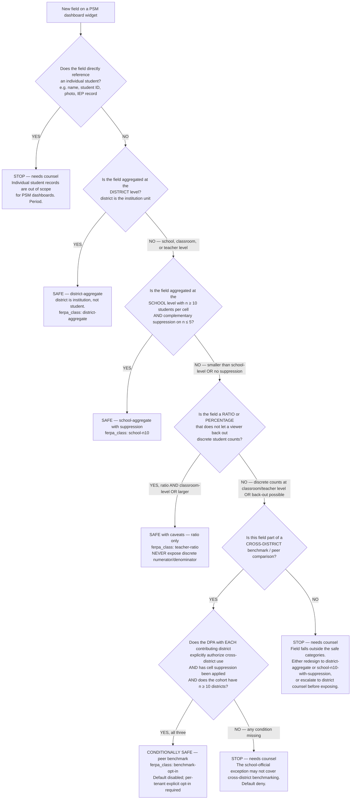

# FERPA Dashboard Boundaries

> **Scope.** Compliance contract every widget in a K-12 EdTech PSM dashboard must pass before shipping. **The build kit refuses to ship a widget without a populated `ferpa_class` field that maps to one of the safe categories defined here.**
>
> **Status disclaimer.** This is field guidance based on PTAC published rules, state practice, and the 2024-25 enforcement landscape. It is NOT legal advice. District counsel makes the call on edge cases; the dashboard's job is to make sure the edge cases reach counsel BEFORE data is exposed, not after.
>
> **Refresh trigger.** When PTAC publishes new disclosure-avoidance guidance; when a major FERPA enforcement action sets new precedent; when a state adds or revises small-cell thresholds; when the DoE's stance on the school-official benchmark exception changes.

---

## 1. The core FERPA rule for vendors

EdTech vendors are usually not directly subject to FERPA, but operate as **"school officials"** under contract with school districts — they inherit FERPA's obligations via that contract:

> "While FERPA does not apply directly to EdTech companies, vendors are typically required by their contracts with individual educational institutions to comply fully with FERPA's obligations and restrictions." ([Strike Graph — FERPA for EdTech Companies](https://www.strikegraph.com/blog/ferpa-for-ed-tech-companies); [Tech Policy Press — Case for Making EdTech Liable](https://www.techpolicy.press/the-case-for-making-edtech-companies-liable-under-ferpa/), both accessed 2026-06-04.)

**Operational consequence.** Even if FERPA doesn't directly bind the vendor, the DPA (Data Processing Agreement) with the district does — and the DPA almost always says "comply with FERPA." A dashboard that exposes prohibited data violates the DPA, which voids the school-official basis for processing the data at all.

---

## 2. The aggregate-vs-de-identifiable line (the critical rule)

PTAC's explicit positions ([PTAC — Disclosure Avoidance FAQ page](https://studentprivacy.ed.gov/resources/frequently-asked-questions-disclosure-avoidance); [PTAC FAQs Disclosure Avoidance PDF](https://studentprivacy.ed.gov/sites/default/files/resource_document/file/FAQs_disclosure_avoidance_0.pdf), accessed 2026-06-04):

### 2.1 What PTAC says is risky

> "Information that would make the student's identity easily traceable may exist in small cell sizes in aggregated or statistical information from education records." ([PTAC Disclosure Avoidance FAQ](https://studentprivacy.ed.gov/resources/frequently-asked-questions-disclosure-avoidance), accessed 2026-06-04.)

> "Simply removing identifiers from education records does not result in de-identified data … individuals could still be picked out through combinations of demographic variables, course histories, or other characteristics showing substantial variance across a population." ([PTAC — Disclosure Avoidance Webinar PDF](https://studentprivacy.ed.gov/sites/default/files/training/supporting_materials/Disclosure%20Avoidance%20Webinar_508_0.pdf), accessed 2026-06-04 — SERP summary; WebFetch 403, citation per research-ledger.)

### 2.2 What PTAC stops short of mandating

> "The Department does not mandate a particular method, nor does it establish a particular threshold for what constitutes sufficient disclosure avoidance" — but recommends data about small groups not be reported. ([PTAC FAQs Disclosure Avoidance PDF](https://studentprivacy.ed.gov/sites/default/files/resource_document/file/FAQs_disclosure_avoidance_0.pdf), accessed 2026-06-04 — SERP summary.)

**Operational reading.** PTAC doesn't give you a number. It tells you to use one, and that small-cells must be suppressed. State practice fills in the number.

---

## 3. State-practice thresholds (the practical defaults)

Federal guidance doesn't mandate, but state practice converges:

- **Connecticut:** "Standard practice for protecting personally identifiable data is that information for groups of less than 10 students may not be reported in aggregated tables." ([CT EdSight — Data Suppression Rules PDF](https://edsight.ct.gov/relatedreports/BDCRE%20Data%20Suppression%20Rules.pdf), accessed 2026-06-04.)
- **Many states converge on n ≥ 10**; some require n ≥ 20 ([UW Student Data — FERPA Suppression & Complementary Suppression](https://studentdata.washington.edu/student-reports/ferpa-suppression-and-complementary-suppression/), accessed 2026-06-04).

### 3.1 Complementary suppression (the un-obvious rule)

> "If a cell is ≤ 5 and only one value is suppressed in a row or column, the next highest value in that row or column is also suppressed" — otherwise the suppressed value can be back-calculated from the row/column total. ([CT EdSight](https://edsight.ct.gov/relatedreports/BDCRE%20Data%20Suppression%20Rules.pdf); [UW Student Data](https://studentdata.washington.edu/student-reports/ferpa-suppression-and-complementary-suppression/), accessed 2026-06-04.)

This is the rule most dashboard implementations get wrong. Suppressing one cell isn't enough if a row total + one suppressed cell + the remaining visible cells reveal the suppressed value via subtraction. **You must also suppress the next-smallest cell.**

### 3.2 Practical defaults for a PSM dashboard

- **District-level metrics aggregated across schools:** safe (district is institution, not student).
- **School-level student-engagement metrics with n ≥ 10**: safe with complementary suppression.
- **Classroom / teacher-level student metrics:** risky — small class sizes routinely fall under n=10. Display as ratios ("/active") rather than discrete counts.
- **Individual student records:** regulated. **Don't surface in PSM-facing views. Period.**

---

## 4. The benchmarking trap

A "compare to peers" widget that uses other districts' aggregated data is a FERPA edge case:

> "Some EdTech vendors use student data from multiple institutions to build benchmarks or train algorithms, which may not be covered by the school official exception and requires explicit opt-out provisions at minimum, and opt-in authorization in most interpretations." ([Hireplicity — FERPA Compliance Checklist 2025](https://www.hireplicity.com/blog/ferpa-compliance-checklist-2025); [Number Analytics — FERPA in EdTech](https://www.numberanalytics.com/blog/ferpa-in-edtech-a-comprehensive-guide), both accessed 2026-06-04.)

### 4.1 The conditions a peer-benchmark widget must meet

To ship a peer-benchmark widget:
1. The data must be genuinely de-identified at the school-official level (institutional-level, not individual-level).
2. The vendor's DPA with each contributing district must explicitly authorize the cross-district use.
3. Cell suppression (n ≥ 10 + complementary) must be applied.
4. The widget defaults to **deny** in the build-kit config; explicit per-tenant opt-in required to enable.

### 4.2 What the widget can never show

Even with all conditions met, the widget must NOT:
- Name individual peer districts (only show as anonymized cohort).
- Show a peer-district's count that would identify its size (n < 10 schools in the comparison group → suppress).
- Reveal a district's relative rank in a way that would let an outsider infer its specific data (e.g., "your district is one of 3 in the bottom decile" tells too much).

---

## 5. The 2024-25 enforcement landscape (lessons)

### 5.1 The PowerSchool breach (2024)

- 2024 PowerSchool breach affected 62M students ([Total Assure — FERPA Penalties](https://www.totalassure.com/blog/ferpa-violation-penalties); [Ogletree — FERPA Implications](https://ogletree.com/insights-resources/blog-posts/president-trump-orders-closure-of-the-department-of-education-what-schools-and-edtech-companies-need-to-know-about-ferpa/), accessed 2026-06-04).
- "Cases involving third-party sharing rose 34% in 2024, driven in part by the rapid expansion of educational technology" ([Total Assure](https://www.totalassure.com/blog/ferpa-violation-penalties), accessed 2026-06-04).

### 5.2 Lessons for dashboard design

- **The breach was a vendor-side breach** — the DPA exception only protects the school district if the vendor handles the data per FERPA. A dashboard that exposes more than DPA-permitted data turns a vendor security incident into a district FERPA violation.
- **Reputation + contract loss > formal penalty.** "As of 2025, the DoE has never imposed a financial penalty for FERPA violations, instead using monitored compliance" ([Tech Policy Press](https://www.techpolicy.press/the-case-for-making-edtech-companies-liable-under-ferpa/), accessed 2026-06-04). But "reputational and contract-cancellation consequences are routinely severe." A vendor whose dashboard surfaces a FERPA violation will lose districts faster than the DoE can act.
- **The 96% statistic ([Public Interest Privacy Center — EdTech Accountability](https://publicinterestprivacy.org/edtech-data-sharing/), accessed 2026-06-04 — flagged in research ledger as directional not precise)**: "96% of K-12 apps reportedly share student data with third parties." The political environment has moved decisively against vendors who don't apply discipline. Conservative defaults are the strategic posture.

### 5.3 Operational consequence

Default every new widget to **maximum suppression** until proven safe. The cost of a too-suppressive widget is "the PSM has to ask their analyst" (low cost). The cost of a too-revealing widget is breach of contract + district loss + breach + potential regulatory action (high cost).

---

## 6. Widget patterns: pass and fail examples

### 6.1 Passes

| Pattern | Why it passes |
|---|---|
| District-aggregate health score (e.g., "Cedar Valley: 76 composite") | District is institution-level, not student-level |
| School-aggregate teacher login frequency, n ≥ 10 teachers per school | n ≥ 10 + teachers are staff, not students under FERPA |
| District-level `roster_sync_error_count: 12` | Operational metric, no student-level reveal |
| Family-coverage % at school level when school has ≥ 50 families | n ≥ 10 (well above) + family aggregate |
| District-aggregate sentiment "Cedar Valley NPS: 42" | Institutional aggregate |
| Funding-source flag "ESSER-funded: yes" | District-level, no student data |

### 6.2 Fails

| Pattern | Why it fails | Fix |
|---|---|---|
| "Mrs. Smith's 3rd grade class: 18 students, 7 below proficient" | n < 10 + classroom-level + student outcome data | Suppress; show as ratio or "no data — small class" |
| "Cedar Valley: 92 students with IEPs" if total student count is low | IDEA + FERPA combined risk; small-cell on protected sub-group | Suppress + complementary suppression on the IEP row |
| Peer benchmark: "Your district ranks #2 of 3 in the bottom decile" | Reveals the district's relative position with low-n cohort | Suppress when n < 10 districts in the comparison group |
| "Student of the Week: Jane Doe (ID 12345)" surfaced in PSM view | Individual student record in PSM-facing view | Never surface; remove from data feed |
| Discrete count "47 students used Feature X" with no n-floor check on per-classroom rollup | Risks classroom-level small-cells in the drill-down | Apply n ≥ 10 floor + complementary suppression at every drill level |
| Cross-district benchmark with un-suppressed cell totals | The math reveals individual values via subtraction | Apply complementary suppression rule |
| District-aggregate metric where the district has only 2 schools, and 1 school is the only one with the metric | The "aggregate" is effectively single-school | Apply n ≥ 10 floor at the *schools-contributing* level, not just the *students* level |

---

## 7. Decision Tree: dashboard field — is THIS field FERPA-OK?

**When this applies:** authoring or reviewing a new dashboard widget's data contract; auditing an existing widget; reviewing a build-kit-generated dashboard before ship.

**Last verified:** 2026-06-04 against PTAC published guidance + CT EdSight + UW Student Data + 2024-25 enforcement landscape.

**Rationale per leaf:**
- *STOP_A (individual student records)* — FERPA + DPA scope; PSM-facing surfaces are not the right venue. ([PTAC — Education Technology Vendors](https://studentprivacy.ed.gov/audience/education-technology-vendors), accessed 2026-06-04.)
- *SAFE_DISTRICT (district-aggregate)* — district is the institutional unit; PTAC + state practice converge on institutional-level reporting being safe. ([CT EdSight Suppression Rules](https://edsight.ct.gov/relatedreports/BDCRE%20Data%20Suppression%20Rules.pdf), accessed 2026-06-04.)
- *SAFE_SCHOOL (school-aggregate, n≥10 + complementary suppression)* — practical state-practice default; CT EdSight is the reference. ([CT EdSight](https://edsight.ct.gov/relatedreports/BDCRE%20Data%20Suppression%20Rules.pdf); [UW Student Data](https://studentdata.washington.edu/student-reports/ferpa-suppression-and-complementary-suppression/), both accessed 2026-06-04.)
- *SAFE_RATIO (ratio at classroom level)* — ratios obscure the discrete count; safe only when the underlying counts can't be reverse-engineered (small denominators can still reveal — see §6.2 row "discrete count" fail).
- *SAFE_BENCHMARK (peer comparison, conditional)* — requires DPA authorization + suppression + cohort n≥10; defaults to deny per §4. ([Hireplicity](https://www.hireplicity.com/blog/ferpa-compliance-checklist-2025); [Number Analytics](https://www.numberanalytics.com/blog/ferpa-in-edtech-a-comprehensive-guide), both accessed 2026-06-04.)
- *STOP_B / STOP_C (needs counsel)* — the dashboard's job is to escalate, not to make the call. District counsel sees the edge case before the data is exposed.

**Tradeoffs summary table:**

| Method (ferpa_class) | Approval gate? | Suppression required? | Default in build kit | Use when |
|---|---|---|---|---|
| `district-aggregate` | none | none | allowed | District-level metrics: composite health, NRR, ARR, KPI cards on the portfolio summary |
| `school-n10` | none beyond suppression check | n ≥ 10 + complementary on n ≤ 5 | allowed with linter | School-level student-engagement metrics; family-activation per school |
| `teacher-ratio` | analyst review | underlying counts must not be exposed | allowed with linter + ratio-only display | Classroom-level signal where a ratio is the right summary (e.g., "75% of teachers in this school" — not "12 of 16") |
| `benchmark-opt-in` | DPA review + per-tenant opt-in | n ≥ 10 districts + complementary | **denied by default** | Peer-benchmark widgets; LearnPlatform vendor-aggregate context |
| `never` | n/a | n/a | always denied | Individual student records; any field that fails the tree |

**Pre-action traversal prior (for the dashboard-architect agent and the build-kit skill).** When a new field appears in a widget data contract, traverse this tree top-to-bottom before assigning a `ferpa_class`. Do NOT pattern-match on field-name keywords ("anything called 'student_*' is bad" — wrong because `student_count` aggregated at district level is fine). The first leaf where the field's properties resolve cleanly is the class to apply. If two leaves both apply, take the more restrictive one. If no leaf applies cleanly, the answer is STOP — needs counsel.

---

## 8. Build-kit integration

The dashboard-build-kit skill enforces this document as a hard gate:

1. **Every widget contract has a `ferpa_class` field.** Required. No default; the author must populate it.
2. **The class must be one of:** `district-aggregate`, `school-n10`, `teacher-ratio`, `benchmark-opt-in`, or `never`.
3. **The build kit refuses to ship** a widget without a class, or with a class that doesn't match the data shape implied by the widget's `data_source` query (e.g., a query returning per-student rows can't be classed `district-aggregate`).
4. **The `school-n10` class triggers an automated cell-suppression linter** that confirms n ≥ 10 + complementary suppression rule are applied at every drill level.
5. **The `benchmark-opt-in` class triggers a per-tenant config requirement** — the build kit emits the widget but disabled-by-default; an explicit `enable_peer_benchmark: true` config plus a recorded DPA-confirmation entry are required to enable.
6. **A widget classed `never` fails the build.** This catches accidental student-PII surfaces before ship.

---

## 9. Anti-patterns this document flags

- A widget shipped without a `ferpa_class` field.
- A `district-aggregate` class applied to a query that returns school-level or per-student rows.
- A `school-n10` widget without the complementary-suppression check applied (suppression on n ≤ 5 only, not on the next-smallest cell when one cell is suppressed).
- A `benchmark-opt-in` widget enabled in a default config (must be per-tenant opt-in).
- A "ratio only" widget that reveals the discrete denominator (e.g., "75% of teachers" where the school has 4 teachers — the count is recoverable).
- A drill-down path where the parent widget is FERPA-safe but the drill-down reveals individual records.
- A peer-benchmark widget that names individual peer districts.
- A dashboard whose flag-bar mentions an individual student by name or ID.
- A QBR export of the dashboard that includes raw data tables not passing the same gate.
- An "we'll handle FERPA in the export" pattern — the dashboard view itself is governed by FERPA + the DPA; you can't ship a view to a vendor employee and then sanitize on export.

---

## 10. The Mandatory Phrasing — when in doubt, escalate

The plugin's Capability Grounding Protocol convention ([`../CLAUDE.md`](../CLAUDE.md) §5) defines a mandatory-phrasing pattern when an agent can't fully complete a task. The FERPA-specific version, when a dashboard field's class is unclear:

> "After traversing the FERPA decision tree, I cannot confidently classify field `<field_name>` because [specific reason — e.g., the underlying query mixes district-aggregate and per-classroom rows]. The class options I considered are: [district-aggregate (ruled out because Y) / school-n10 (ruled out because Y) / teacher-ratio (ruled out because Y) / benchmark-opt-in (ruled out because Y)]. The default-safe action is to mark this field `never` and route to district counsel before exposure. I recommend [escalation path]."

---

## 11. Refresh triggers for this document

- PTAC publishes new disclosure-avoidance guidance or revises FAQ stances.
- A major FERPA enforcement action sets new precedent (especially first DoE financial penalty, if it happens).
- A state adds or revises small-cell suppression thresholds (e.g., CT moves from n≥10 to n≥20).
- The DoE's stance on the school-official benchmark exception changes.
- The PowerSchool-2024-style breach pattern recurs and triggers new vendor-liability rules (per [Tech Policy Press](https://www.techpolicy.press/the-case-for-making-edtech-companies-liable-under-ferpa/), accessed 2026-06-04).
- A FERPA-amendment passes Congress (proposed reforms tracked at [Public Interest Privacy Center — EdTech Accountability](https://publicinterestprivacy.org/edtech-data-sharing/), accessed 2026-06-04).
- A new state-level student-privacy statute (NY Ed Law §2-d, IL SOPPA, CA SOPIPA, CO SB 1, FL HB 1547 [verify-at-use — 2026-06-04]) revises permitted vendor-data use.

---

## 12. References (existing plugin artifacts)

- [`parent-comms-jurisdictional-bear-traps.md`](parent-comms-jurisdictional-bear-traps.md) — the FERPA three-bucket model + state-by-state typology (CA, IL, NY, CT, CO, TX, VA, WA, UT, FL); the natural parent of this dashboard-specific gate.
- [`k12-signal-taxonomy.md`](k12-signal-taxonomy.md) — every signal carries a `ferpa_class` that this document's tree validates.
- [`psm-dashboard-canon-2026.md`](psm-dashboard-canon-2026.md) — the dashboard surface this gate protects.
- [`health-score-v2-extension.md`](health-score-v2-extension.md) — schema-level FERPA classification for every component.
- [`../CLAUDE.md`](../CLAUDE.md) §2 routing rule "Anything touching student-level PII, IEP / 504 data, or FERPA records → mandatory `ravenclaude-core` `security-reviewer`."
- [`../agents/ferpa-comms-translator.md`](../agents/ferpa-comms-translator.md) — the existing FERPA-aware comms agent; this document complements its remit on the dashboard surface.
- [`edtech-segment-fundamentals.md`](edtech-segment-fundamentals.md) — segment-level regulation context (HECVAT, COPPA, state laws).
- [`../../../docs/best-practices/decision-trees-in-knowledge-files.md`](../../../docs/best-practices/decision-trees-in-knowledge-files.md) — the convention §7's Mermaid tree follows.
