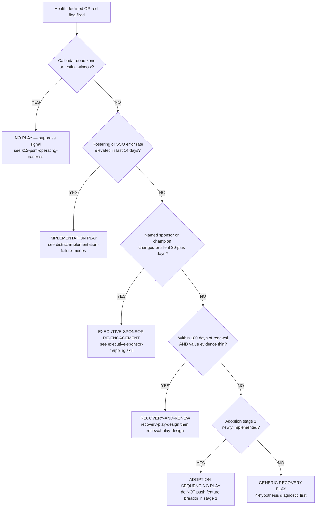

# Partner health declined — which play do I run?

> **Last reviewed:** 2026-05-22. Source: research-distilled from Gainsight + ChurnZero practitioner content (retrieved 2026-05-22), the plugin's own [`recovery-play-design`](../skills/recovery-play-design/SKILL.md), [`renewal-play-design`](../skills/renewal-play-design/SKILL.md), and [`expansion-play-design`](../skills/expansion-play-design/SKILL.md) skills, and the house opinion "diagnose before treat" already encoded in `recovery-play-design.md`. Refresh when: (a) the play library gains or loses a play type, (b) a new failure-mode pattern emerges that doesn't fit any of the five branches, or (c) the segment mix in the PSM's book changes materially (e.g., book shifts from majority K-12 to majority higher-ed).

A health score going red is the start of a decision, not the end of one. The most common — and most costly — PSM mistake is **picking the play that fits the score's color rather than the play that fits the root cause.** A renewal play offered to a partner whose problem is a broken roster sync reads as tone-deaf; a recovery play run on a partner whose decline is calendar-suppression false-positive burns the PSM's credibility when the score bounces back on its own in two weeks. The decision tree below is the router that lives upstream of [`recovery-play-design`](../skills/recovery-play-design/SKILL.md), [`renewal-play-design`](../skills/renewal-play-design/SKILL.md), and [`expansion-play-design`](../skills/expansion-play-design/SKILL.md).

This file is **not** about how to execute a given play. The skills own that. This file is about **which play the situation actually calls for.**

---

## Decision Tree: Partner health decline — play selection

**When this applies:** the composite health score has dropped a band (green → yellow, yellow → red) OR an independent red-flag signal has fired (sponsor departure, escalated ticket, vendor-comparison signal, >30% WoW usage drop). The PSM is about to choose between recovery, renewal, expansion, executive-sponsor re-engagement, or do-nothing. **Traverse this tree top-to-bottom before selecting a play. Do NOT pattern-match on the partner's emotional tone or the score's color.**

**Last verified:** 2026-05-22 against the plugin's v0.4.x skill set and Gainsight/ChurnZero 2024-2026 practitioner guidance.

**Rationale per leaf:**

- _SUPPRESS_ — the most common wrong-first-pick is _acting_ on a signal that the calendar would have suppressed anyway. K-12 December usage drops aren't churn signals; they're winter break. Running any play here trains the partner to view the PSM as out-of-touch with their operating reality. See `k12-psm-operating-cadence.md` and `k12-adoption-arc-fall-spring-summer.md` Phase 4.
- _IMPL_ — rostering/SSO failure is the single most-common true root cause of an EdTech health drop and the one most-often misdiagnosed as commercial. If error rates are elevated, no other play works until the data layer is fixed. The PSM coordinates the fix, doesn't own it. See `district-implementation-failure-modes.md` and `sis-sso-rostering-integration-patterns.md`.
- _SPONSOR_ — a missing or silent named champion is the most predictive single signal in many books. Renewal and expansion plays both require a live sponsor; running them without one is talking to an empty room. Re-engage the sponsor (or identify a successor) before any other play.
- _RECOVERY_THEN_RENEW_ — within 180 days of renewal with thin value evidence, a pure renewal play will be a price negotiation the PSM loses. Run recovery first (value-evidence pack, 30/60/90 signal targets), then layer renewal. K-12 specifically: 180-day clock per `renewal-pricing-conversations-edtech.md`.
- _ADOPTION_ — stage-1 partners (newly implemented) look red by health-score math because deep-feature adoption hasn't had time to develop. The right play is sequencing them through the early-adoption arc, not running recovery. **Do NOT push feature breadth in stage 1.**
- _RECOVERY (generic)_ — only when the four earlier branches don't apply. Run the 4-hypothesis diagnostic from `recovery-play-design.md` (product fit / implementation / sponsorship / external pressure) before any remedy.

**Tradeoffs summary:**

| Play                            | Time-to-first-signal | Partner-relationship cost if wrong                            | Approval gate?                  | Use when                                                  |
| ------------------------------- | -------------------- | ------------------------------------------------------------- | ------------------------------- | --------------------------------------------------------- |
| Suppress signal                 | 0 (no action)        | Low if right; high if you're wrong — silent churn risk        | No — PSM internal only          | Calendar dead zone, testing window, known seasonal dip    |
| Implementation play             | 1-4 weeks            | Low — the partner is grateful for the fix                     | Sometimes (engineering capacity)| Roster/SSO/train-the-trainer broken                       |
| Executive-sponsor re-engagement | 2-6 weeks            | Medium — re-introducing is awkward but recoverable            | No                              | Sponsor changed, silent, or never engaged                 |
| Recovery-and-renew              | 8-26 weeks           | High if mistimed — looks like a panic move at T-30            | Yes (success leadership)        | Within 180 days of renewal, value evidence thin           |
| Adoption-sequencing             | 4-12 weeks           | Low — feels like service                                      | No                              | Stage-1 partner (newly implemented)                       |
| Generic recovery                | 4-12 weeks           | Medium — burns goodwill if root cause matched an above branch | No                              | None of the above branches resolved                       |

If the partner's situation matches multiple branches, **the higher branch wins**. SUPPRESS beats IMPL beats SPONSOR beats RECOVERY_THEN_RENEW beats ADOPTION beats generic RECOVERY. The ordering reflects "what would be most costly to skip past."

---

## The wrong-first-pick patterns (named)

Each branch above exists because a named wrong-first-pick has been observed often enough to encode:

1. **Calendar-blindness** — PSM sees December usage drop, fires a recovery play, partner replies "we were on break for two weeks." Score recovers in mid-January regardless. PSM loses credibility. _Mitigation: SUPPRESS branch._
2. **Renewal-on-rostering** — PSM sees yellow score 120 days from renewal, opens renewal conversation, partner's first reply is "the data still isn't right." Renewal motion stalls; trust is now negative. _Mitigation: IMPL branch above renewal branches._
3. **Play-to-ghost-sponsor** — PSM runs a renewal or expansion play threading the named buyer; named buyer left the org 60 days ago and the partner profile wasn't updated. Play arrives in an inbox no one reads. _Mitigation: SPONSOR branch._
4. **Discount-as-recovery** — PSM treats every renewal-stage decline as a pricing problem. Offers discount T-60; partner accepts; partner churns the following year because the actual problem was never addressed. _Mitigation: RECOVERY_THEN_RENEW (recovery first, renewal second)._
5. **Recovery-on-stage-1** — PSM treats a stage-1 partner's modest adoption metrics as recoverable decline. Fires an intervention that the partner experiences as "you're already calling us a failure." _Mitigation: ADOPTION branch._

These are the patterns the tree exists to prevent.

---

## Signals the tree depends on

For the tree to work, the PSM (or the agent reading the partner profile) needs these signals fresh:

- **Calendar phase** — derived from K-12 school calendar, higher-ed academic calendar, or corp L&D fiscal quarter.
- **Rostering/SSO error rate (last 14 days)** — from the integration broker (Clever / ClassLink / OneRoster / SIS direct / SCIM logs). "Sync ran successfully" ≠ data is correct.
- **Named sponsor + champion status** — from the durable partner profile, refreshed in the last 90 days.
- **Days-to-renewal** — from CRM or contract record. K-12 renewal clock starts at T-180, not T-120.
- **Adoption stage** — stage 1 (newly-implemented) / 2 (first-year-sustaining) / 3 (multi-year-mature) / 4 (pre-renewal).

If any of these are stale or missing, **the tree can't resolve cleanly** — the PSM's first job is to refresh them, not to pick a play.

---

## Segment overlays

- **K-12** — the calendar branch is the most-active. Q1 in the tree resolves to YES roughly 40% of the calendar year (winter break + spring break + summer + testing windows + start-of-year + end-of-year wrap). The implementation branch (Q2) is also disproportionately active in K-12 because rostering is the silent killer.
- **Higher-ed** — calendar branch resolves on academic-calendar phases (between-semester, finals, summer-session). Sponsor branch is heavier — institutional turnover (provosts, deans, department chairs) is the most common decline trigger.
- **Corp L&D** — calendar branch is fiscal-quarter-driven. Implementation branch is lighter (HRIS sync is usually cleaner than K-12 SIS). External-pressure branch (budget squeeze, "L&D first to cut" pattern) is heavier; route through `recovery-play-design.md` hypothesis D.

---

## When NONE of the branches fit

If you've traversed the tree and none of the five branches resolved cleanly, **don't invent a sixth branch on the spot.** The right action:

1. Pause the play selection.
2. Pull `learning-analytics-analyst` to verify the score isn't drifting (see `partner-health-score-drift.md`).
3. If the score is sound, escalate to the Team Lead with the signals named.
4. Generic RECOVERY is the leaf of last resort, not the default.

The tree is designed for the situations that recur. Genuine novelty deserves a custom plan, not a forced fit.

---

## Citations / sources

- [Gainsight — Customer Health Scoring: Misunderstandings, Myths, & Truths](https://www.gainsight.com/customer-success-best-practices/customer-health-scoring/) — anchor for "diagnose before reaching out."
- [Gainsight — Putting your customer health scores to work](https://www.gainsight.com/blog/putting-your-customer-health-scores-to-work/) — health score → playbook mapping discipline.
- [ChurnZero — What if the way you define customer value is wrong?](https://churnzero.com/blog/define-customer-value/) — value-definition trap (renewal-on-rostering pattern).
- [ChurnZero — Forecast Renewals and Predict Churn Risk](https://churnzero.com/customer-success-software/forecast-renewals-predict-churn/) — leading-indicator surfaces.
- [Customer Success Collective — The anatomy of the customer health score](https://www.customersuccesscollective.com/the-anatomy-of-the-customer-health-score/) — practitioner depth on score-to-action mapping.
- Internal: `plugins/edtech-partner-success/skills/recovery-play-design.md` — "diagnose before treat" core opinion; this tree operationalizes the opinion at play-selection time.
- Internal: `plugins/edtech-partner-success/knowledge/district-implementation-failure-modes.md` — failure-mode frequency ranking informs the IMPL branch.
- Internal: `plugins/edtech-partner-success/knowledge/renewal-pricing-conversations-edtech.md` — K-12 180-day renewal clock anchors RECOVERY_THEN_RENEW branch.
- Internal: `plugins/edtech-partner-success/knowledge/k12-psm-operating-cadence.md` and `k12-adoption-arc-fall-spring-summer.md` — calendar-suppression branch (SUPPRESS leaf).
