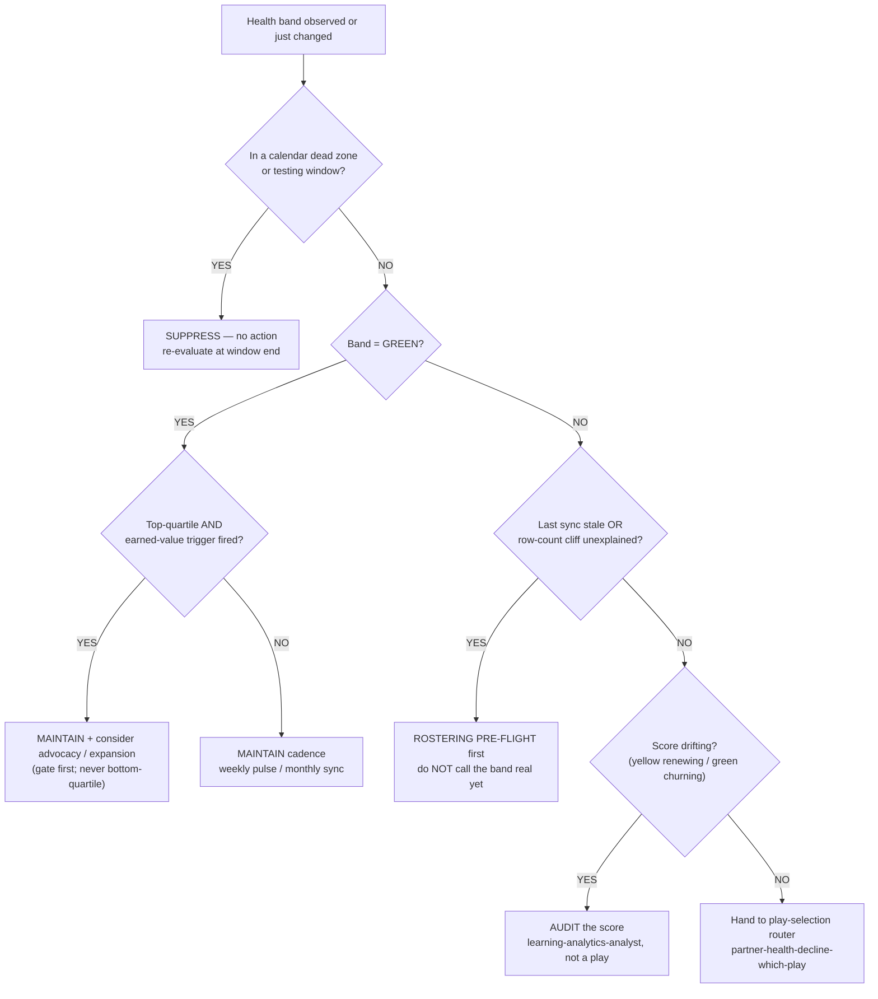
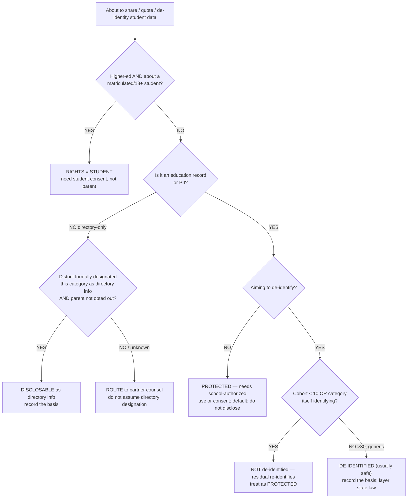
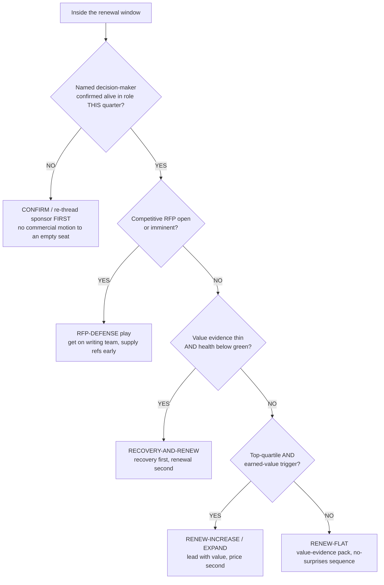
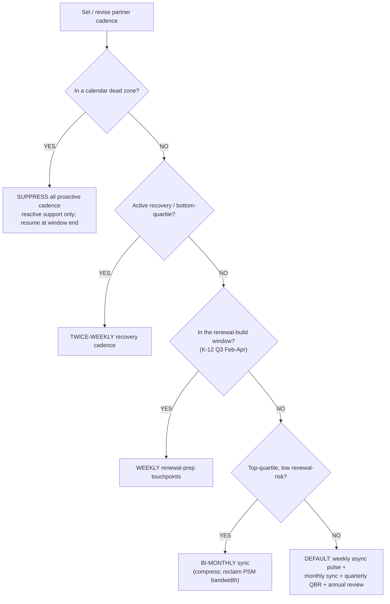
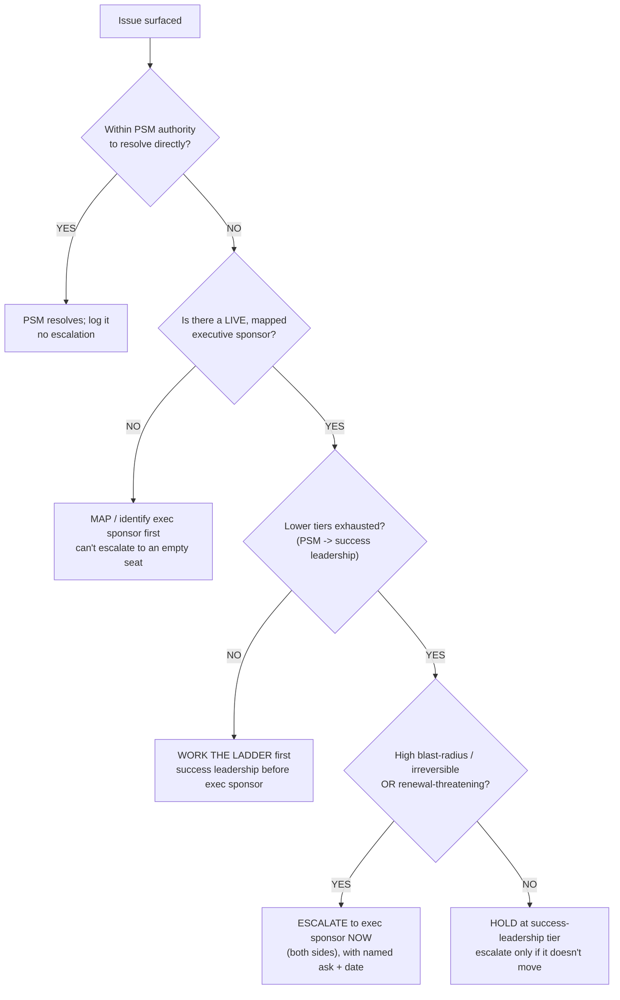
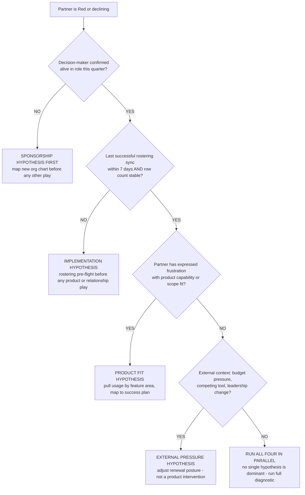
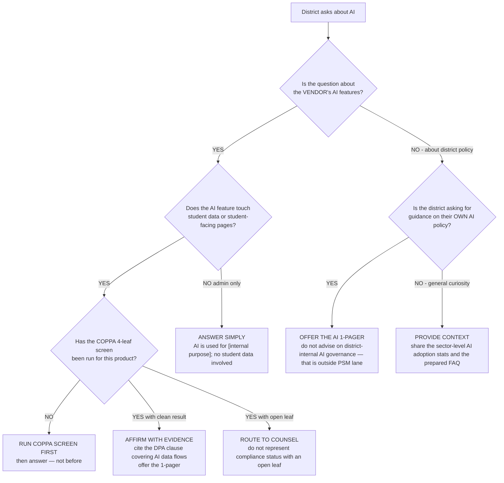
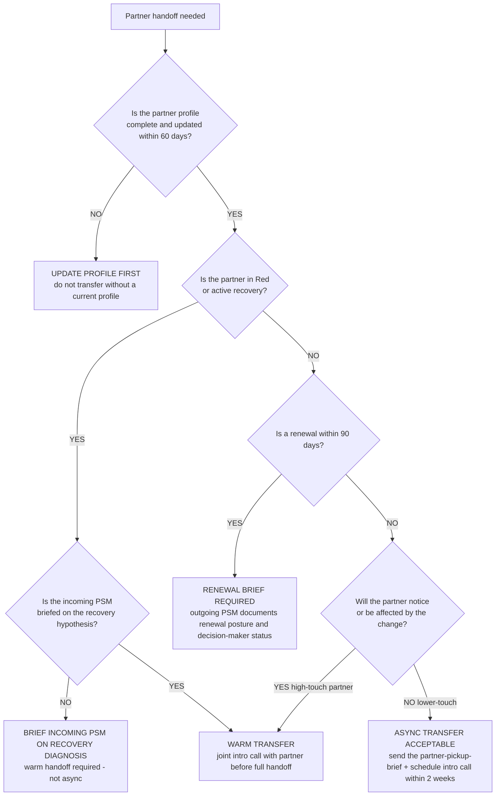

# Partner-success decision trees

> **Last reviewed:** 2026-05-30. Sources: research-distilled from this plugin's own agents (`partner-success-manager`, `learning-analytics-analyst`, `ferpa-comms-translator`, `success-playbook-designer`, `partner-profile-curator`, `qbr-composer`), its skills (`recovery-/renewal-/expansion-play-design`, `executive-sponsor-mapping`, `partner-health-scoring`), and its knowledge bank (`partner-health-decline-which-play.md`, `k12-psm-operating-cadence.md`, `parent-comms-jurisdictional-bear-traps.md`, `renewal-pricing-conversations-edtech.md`, `rostering-data-quality-typology.md`). Refresh when: (a) a play type is added/removed, (b) the segment mix in the book shifts materially, (c) a state-privacy regime or FERPA guidance changes (FERPA/COPPA/state specifics are `[verify-at-build]`), or (d) the health-score bands are recalibrated.

This file holds the canonical branching decision trees for the EdTech PSM team, in the format mandated by [`../../../docs/best-practices/decision-trees-in-knowledge-files.md`](../../../docs/best-practices/decision-trees-in-knowledge-files.md): observable entry condition, `Last verified` date, Mermaid graph, per-leaf rationale, and a tradeoffs table for any tree with ≥3 leaves. These are **priors to traverse before acting** — not keyword pattern-matches.

> **Relationship to the play-selection tree.** The `## Decision Tree: Partner health decline — play selection` in [`partner-health-decline-which-play.md`](partner-health-decline-which-play.md) is the canonical *play router* (which of recovery/renewal/expansion/sponsor/suppress fires). The **Account health → first action** tree below is the *triage altitude above it* — what the PSM does the moment a band changes, including the green and yellow cases the play router doesn't cover. Traverse the triage tree first; it hands red/declining cases down to the play router.

---

## Decision Tree: Account health → first action (green / yellow / red)

**When this applies:** a partner's composite health band has just changed, OR you're doing a routine pulse and need the first action for a partner sitting in a given band. Observable inputs: the band (green / yellow / red), whether a red-flag trigger fired independently, last-successful-sync recency, calendar phase, and score-drift suspicion. This is the *triage* step; declining/red cases hand off to the play-selection router.

**Last verified:** 2026-05-30 against the plugin's v0.4.x agents, skills, and the play-selection router.

**Rationale per leaf:**

- _SUPPRESS_ — a band change inside a dead zone is most often seasonal, not real; acting trains the partner to see the PSM as out-of-touch (the calendar-blindness wrong-first-pick).
- _ADVOCATE_EXPAND_ — green + top-quartile + an earned-value trigger is the only state where advocacy or expansion is in scope; both are gated and never run on bottom-quartile or mid-recovery partners.
- _MAINTAIN_ — green without an earned-value trigger means keep the cadence; don't manufacture a motion to fill a quota (don't-sell house opinion).
- _ROSTER_ — a stale sync or unexplained row-count drop means the band may be computed on a wrong roster; verify the data is flowing before treating the partner as declining ("sync ran successfully" ≠ data correct).
- _AUDIT_ — if the score has stopped predicting (yellow renewing, green churning), the suspect is the score, not the partner; route to the analyst, don't fire a remedy.
- _ROUTER_ — a genuine decline on a sound score with a fresh roster is exactly what the play-selection router is built to triage; hand it down rather than improvising.

**Tradeoffs summary:**

| First action | Time-to-act | Cost if wrong | Approval gate? | Use when |
|---|---|---|---|---|
| Suppress | 0 | High if a real drop is hiding behind the dead zone | No — PSM internal | Dead zone / testing window |
| Maintain | low | Low — opportunity cost only | No | Green, no earned-value trigger |
| Advocate / expand | weeks | High — credibility burn if not actually earned | Yes (gate model) | Green, top-quartile, trigger fired |
| Rostering pre-flight | hours-days | Low — partner grateful for the fix | Sometimes (eng) | Stale sync / row-count cliff |
| Audit the score | days | Low — internal only | No | Score-drift symptoms |
| Hand to play router | minutes | Low — router owns the next decision | No | Real decline, sound score, fresh roster |

`requires:` the ROSTER and AUDIT leaves need read access to the integration-broker logs and the score-vs-outcome history respectively; if either is unavailable, escalate to `learning-analytics-analyst` rather than guessing the leaf.

---

## Decision Tree: Is this student data FERPA-restricted? (directory vs education-record vs de-identified)

**When this applies:** before sharing, quoting, publishing, or "anonymizing" any student-touching data — a parent comm, a case-study quote, a dashboard export, an analytics sample. Observable inputs: whether the field is an education record / PII, whether the district designated the category as directory information, the cohort denominator, whether the category is itself identifying, and K-12 vs higher-ed. `[verify-at-build — FERPA / directory-info / de-identification specifics are regulatory and shift; confirm against current DOE guidance before acting on this tree]`

**Last verified:** 2026-05-30 against `parent-comms-jurisdictional-bear-traps.md` (itself last reviewed 2026-05-21).

**Rationale per leaf:**

- _STUDENT_CONSENT_ — in higher-ed the rights-holder shifts to the student at 18 / matriculation; a parent letter about an adult student's record without consent is a violation.
- _DISCLOSE_ — directory information is disclosable, but only when the district *designated* the category and the parent hasn't opted out; both conditions, recorded.
- _COUNSEL_ — directory designation varies district to district; "unknown" is not "yes." Route rather than assume.
- _PROTECTED_ — education records / PII default to non-disclosure absent school-authorized use or consent.
- _RESIDUAL_ — a small denominator or an identifying category re-identifies "de-identified" data (the cohort residual); FERPA prohibits identifiable-from-context disclosure, so this is still protected.
- _DEIDENT_ — a large (> 30), generic, non-identifying-category aggregate is usually safe; still record the basis and layer the partner's state regime.

**Tradeoffs summary:**

| Leaf | Speed | Cost if wrong | Approval gate? | Use when |
|---|---|---|---|---|
| Student-consent (higher-ed) | slow | Violation if skipped | Student consent | Matriculated/18+ student record |
| Disclose as directory info | fast | Violation if district didn't designate / parent opted out | District designation check | Designated directory category, no opt-out |
| Route to counsel | slow | Low — conservative | Counsel | Designation unknown / any "uncertain" |
| Protected (default) | n/a | Low — conservative | Consent / authorized use | Education record or PII, no de-id intent |
| Residual = protected | n/a | High if shipped | — | Cohort < 10 or identifying category |
| De-identified | fast | Low if test honestly passed | — | > 30, generic, non-identifying category |

The PSM's job is to recognize the **shape** of the question and route — not to render a legal opinion. Any "uncertain" resolves to COUNSEL.

---

## Decision Tree: Renewal-risk triage

**When this applies:** a partner is inside the renewal window (K-12: T-180; others: their budget-build window) and you need to decide the renewal posture. Observable inputs: days-to-renewal, value-evidence strength, decision-maker liveness, health band, and competitive-procurement (RFP) status.

**Last verified:** 2026-05-30 against `renewal-pricing-conversations-edtech.md` and the renewal-/recovery-play-design skills. K-12 timing/benchmark figures `[verify-at-build]`.

**Rationale per leaf:**

- _CONFIRM_ — a renewal motion to a departed or silent decision-maker lands in a dead inbox (the ghost-sponsor pattern); confirm or re-thread before anything commercial. K-12 superintendent turnover makes this the rule, not the exception.
- _RFP_ — once competitive procurement opens, the incumbent advantage is real but conditional: it depends on getting onto the RFP-writing team and supplying reference districts before the RFP drops.
- _RECOVER_RENEW_ — thin value evidence + sub-green health inside the window makes a pure renewal play a price negotiation the PSM loses; run recovery (value-evidence pack, 30/60/90 targets) first, then layer renewal.
- _EXPAND_RENEW_ — top-quartile with an earned-value trigger is the only state where a renewal-with-increase or expansion is credible; lead with value delivered, price second.
- _RENEW_FLAT_ — a healthy partner with adequate evidence but no earned-value-expansion trigger renews flat on the value-evidence pack and the no-surprises sequence.

**Tradeoffs summary:**

| Posture | Lead time needed | Cost if wrong | Approval gate? | Use when |
|---|---|---|---|---|
| Confirm / re-thread sponsor | weeks | High — whole motion wasted on empty seat | No | Decision-maker unconfirmed |
| RFP-defense | months | High — lose the account | Yes (pricing) | Competitive procurement open |
| Recovery-and-renew | 8-26 wks | High if mistimed (reads as T-30 panic) | Yes (success leadership) | Thin evidence + sub-green health |
| Renew-increase / expand | months | High — credibility burn if not earned | Yes (gate model) | Top-quartile + earned-value trigger |
| Renew-flat | months | Low | No | Healthy, adequate evidence, no expansion trigger |

If multiple branches fit, the higher branch wins — sponsor confirmation precedes everything; RFP defense precedes the commercial postures.

---

## Decision Tree: Which touchpoint cadence by segment + health

**When this applies:** setting or revising a partner's standing cadence. Observable inputs: segment, current health band/recovery status, dead-zone status, and the partner's budget-build window.

**Last verified:** 2026-05-30 against `k12-psm-operating-cadence.md` (per-partner cadence table).

**Rationale per leaf:**

- _SUPPRESS_ — proactive cadence into a dead zone lands on no one; reactive support still runs. Resume at the window's end.
- _TWICE_WEEKLY_ — active risk needs the recovery cadence; monthly is too sparse to see whether the recovery targets are moving.
- _WEEKLY_RENEWAL_ — the renewal-build window is the highest-leverage quarter; the calendar shifts from monthly to weekly renewal prep so the success story enters the budget conversation.
- _BIMONTHLY_ — a top-quartile, low-risk partner can compress to bi-monthly, recovering PSM bandwidth for partners who need it; forced touchpoints to a thriving partner are a churn vector.
- _DEFAULT_ — everyone else runs the standard weekly-pulse / monthly-sync / quarterly-QBR / annual-review rhythm, scheduled in the partner's TZ.

**Tradeoffs summary:**

| Cadence | PSM load | Risk if too sparse | Risk if too dense | Use when |
|---|---|---|---|---|
| Suppress | none | Miss a real issue | n/a | Dead zone / testing window |
| Twice-weekly | high | Recovery targets drift unseen | Over-rotation reads as panic | Active recovery / bottom-quartile |
| Weekly renewal-prep | high | Miss the budget-build window | — | Renewal-build window (K-12 Q3) |
| Bi-monthly | low | Slow to catch a turn | — | Top-quartile, low renewal-risk |
| Default rhythm | medium | — | Forced touchpoints = churn vector | Everyone else |

Segment overlay: the dead-zone calendar differs by segment (K-12 school calendar / higher-ed academic calendar / corp L&D fiscal quarter) — use the partner's own calendar at Q1, not the K-12 one by default.

---

## Decision Tree: Escalate to the executive sponsor — or not

**When this applies:** an issue has surfaced (a stalled commitment, a recovery target missed, a cross-functional blocker, a renewal at risk) and the PSM must decide whether to pull the executive sponsor in. Observable inputs: whether the issue is within PSM authority, whether lower escalation tiers have been exhausted, the blast radius / reversibility, and whether a live exec sponsor exists.

**Last verified:** 2026-05-30 against `executive-sponsor-mapping/SKILL.md`, `recovery-play-design/SKILL.md` (escalation ladder), and the agent-collaboration escalation norms.

**Rationale per leaf:**

- _PSM_OWN_ — most issues are inside PSM authority; escalating them burns the exec-sponsor relationship for routine work and trains the sponsor to disengage.
- _MAP_FIRST_ — you can't escalate to a sponsor you haven't mapped or who has left; identify a live sponsor (or successor) before trying to pull them in.
- _LADDER_ — the escalation ladder is PSM → success leadership → exec sponsor → counsel → churn-prep; skipping to the top wastes the highest-value relationship on something a lower tier could solve.
- _ESCALATE_NOW_ — a high-blast-radius, irreversible, or renewal-threatening issue is exactly what the exec-sponsor relationship is for; escalate on both sides with a named ask and a date, not a vague "we have concerns."
- _HOLD_ — a non-urgent, recoverable issue holds at the success-leadership tier and only climbs if it stalls; premature escalation is as costly as late.

**Tradeoffs summary:**

| Action | Speed | Relationship cost | Reversible? | Use when |
|---|---|---|---|---|
| PSM resolves | fast | none | yes | Within PSM authority |
| Map sponsor first | slow | none | yes | No live mapped sponsor |
| Work the ladder | medium | low | yes | Lower tiers not yet tried |
| Escalate now | fast | High if cried-wolf; right if genuine | depends | High-blast / irreversible / renewal-threat |
| Hold at success-leadership | medium | low | yes | Non-urgent, recoverable |

Higher branch wins: sponsor-mapping precedes escalation; ladder-discipline precedes a top-tier pull unless the blast radius forces an immediate escalation.

---

## How agents consume these trees

Each tree is a **pre-action prior**: when the user's situation matches an entry condition, traverse the matching Mermaid graph top-to-bottom before selecting an action. Do not pattern-match on keywords in the user's phrasing; the first branch that resolves cleanly is the leaf to apply. Higher branches win on ties. If the signals a tree depends on are stale or missing, refreshing them is the first job — not picking a leaf. The relevant agents (`partner-success-manager`, `learning-analytics-analyst`, `ferpa-comms-translator`, `success-playbook-designer`, `partner-profile-curator`, `qbr-composer`) already carry decision-tree traversal priors pointing at the play-selection router; these triage/classification/renewal/cadence/escalation trees extend that same discipline to the decisions upstream and adjacent to it.

## References

- [`partner-health-decline-which-play.md`](partner-health-decline-which-play.md) — the canonical play-selection router this file's triage tree hands off to
- [`k12-psm-operating-cadence.md`](k12-psm-operating-cadence.md) — dead zones, TZ discipline, per-partner cadence (cadence tree)
- [`parent-comms-jurisdictional-bear-traps.md`](parent-comms-jurisdictional-bear-traps.md) — FERPA three-bucket model + residual (FERPA tree)
- [`renewal-pricing-conversations-edtech.md`](renewal-pricing-conversations-edtech.md) — K-12 renewal clock, RFP defense, Recurly 71% (renewal tree)
- [`rostering-data-quality-typology.md`](rostering-data-quality-typology.md) — the rostering pre-flight the triage tree branches into
- [`../best-practices/`](../best-practices/) — the named one-rule docs these trees operationalize
- [`../../../docs/best-practices/decision-trees-in-knowledge-files.md`](../../../docs/best-practices/decision-trees-in-knowledge-files.md) — the format this file follows

---

## Decision Tree: Recovery root-cause diagnosis — which hypothesis first

**When this applies:** a partner has flipped to Red or the PSM has identified a declining health trend and must decide which recovery hypothesis to investigate first. Observable inputs: the specific complaint or signal that triggered the Red designation, recency of the score drop, and last-known decision-maker status.

**Last verified:** 2026-06-05 against the `recovery-play-design` skill and the plugin's 4-hypothesis recovery diagnostic.

**Rationale per leaf:**
- *Sponsorship First* — a recovery play executed without a live decision-maker is wasted; sponsor mapping is always the prerequisite when DM status is unknown.
- *Implementation* — a stale or broken rostering sync can make a healthy partner appear declining; verify the data before treating the band as real.
- *Product Fit* — explicit partner-expressed capability frustration points directly at product-fit; the recovery play is use-case rescoping, not more training.
- *External Pressure* — budget or competitive context changes the recovery posture fundamentally; the product intervention won't fix an external constraint.
- *All Four in Parallel* — when no single hypothesis is dominant, run all four in the first recovery conversation; they are not mutually exclusive.

**Tradeoffs summary:**

| Hypothesis | Recovery play | Time to signal | Blast radius | Use when |
|---|---|---|---|---|
| Sponsorship | Sponsor mapping | days-weeks | high if skipped | DM unconfirmed |
| Implementation | Rostering pre-flight | hours-days | low | Sync stale or row-count cliff |
| Product fit | Use-case rescoping | weeks | medium | Partner-expressed capability frustration |
| External pressure | Renewal posture adjust | weeks-months | high | Budget or competitive signal |
| All four parallel | Full diagnostic | days | medium | No dominant signal |

---

## Decision Tree: AI in EdTech — how to respond to a district partner asking about AI policy

**When this applies:** a district administrator, curriculum director, or school board member asks about the vendor's AI features, data practices, or the district's own AI policy for student use. Observable inputs: whether the question is about the vendor's AI tools, the district's student-facing AI use, or FERPA / COPPA implications.

**Last verified:** 2026-06-05 against `ai-in-edtech-2026.md` and `coppa-2025-amendment-edtech-implications.md`.

**Rationale per leaf:**
- *Run COPPA Screen First* — answering before knowing the COPPA screen result risks making a false compliance representation.
- *Affirm with Evidence* — a clean COPPA screen + a DPA citation is the credible answer; vague reassurance is not.
- *Route to Counsel* — an open COPPA leaf means the compliance question is not yet answered; route, don't represent.
- *Answer Simply* — admin-only AI features with no student data have a much lower bar; simple and direct is appropriate.
- *Offer the 1-Pager* — district AI policy guidance is the district's governance decision, not the PSM's; offering the prepared 1-pager on the AI landscape respects that boundary.
- *Provide Context* — general-curiosity AI questions are handled with the sector-level FAQ; no compliance representation needed.

**Tradeoffs summary:**

| Response | Relationship cost | Compliance risk | Effort | Use when |
|---|---|---|---|---|
| Run COPPA screen first | neutral | reduces | hours | Student-data AI feature, screen not yet run |
| Affirm with evidence | positive | low | low | Clean screen, DPA in hand |
| Route to counsel | slight delay | avoids | low | Open COPPA leaf |
| Answer simply | positive | very low | low | Admin-only AI feature |
| Offer the 1-pager | positive | none | low | District asking about own AI policy |
| Provide context | positive | none | low | General curiosity |

---

## Decision Tree: PSM handoff — how to transfer a partner relationship

**When this applies:** a PSM is transitioning ownership of a partner account to a new owner (departure, vacation cover, book rebalancing). Observable inputs: how complete the partner profile is, the partner's current health band, and whether a renewal or critical event is imminent.

**Last verified:** 2026-06-05 against the plugin's partner-profile discipline (§3 #9) and `partner-profile-curator` agent design.

**Rationale per leaf:**
- *Update Profile First* — a handoff without a current profile transfers the relationship without the context; the incoming PSM is set up to fail.
- *Brief on Recovery Diagnosis* — a recovery play mid-execution requires the incoming PSM to understand the diagnosis, not just pick up where the calendar left off; async is insufficient.
- *Warm Transfer* — active recovery or a sensitive high-touch partner requires a live joint introduction so the partner doesn't experience the handoff as abandonment.
- *Renewal Brief* — a renewal within 90 days is a time-critical commercial motion; the outgoing PSM must document the posture and DM status so nothing falls through the gap.
- *Async Transfer* — a lower-touch partner with no imminent event and a stable health band can accept an async handoff with a pickup brief and a near-term intro call.

**Tradeoffs summary:**

| Transfer mode | Relationship risk | PSM effort | Use when |
|---|---|---|---|
| Update profile first | n/a (prerequisite) | hours | Profile stale |
| Brief on recovery | low | medium | Active recovery in progress |
| Warm transfer | lowest | high | Red / active recovery / high-touch |
| Renewal brief | low | medium | Renewal within 90 days |
| Async with pickup brief | medium | low | Stable, lower-touch, no imminent event |

Higher branch always wins: profile currency is a prerequisite; recovery context takes priority over cadence type; renewal brief is required regardless of handoff mode when inside the window.
