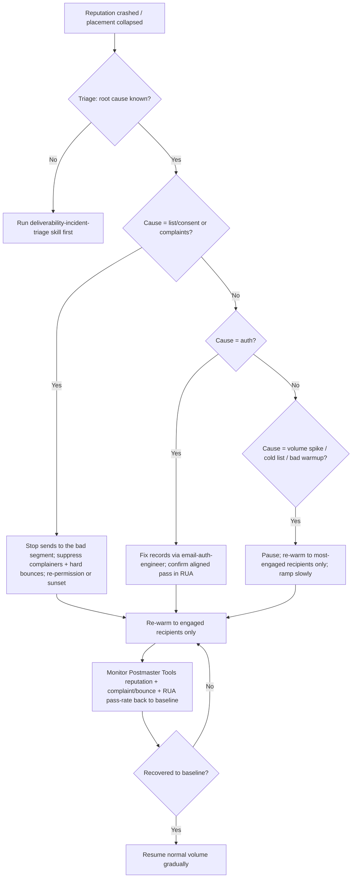

# Sender requirements & reputation (dated reference)

> Mailbox-provider *policy* and reputation mechanics. Unlike the RFC-grounded
> `email-authentication-standards.md`, the specifics here are **volatile** —
> providers update requirements and thresholds. Every provider-specific figure
> carries a retrieval date and a **re-verify-at-use** rider per the marketplace
> accuracy discipline. When quoting any threshold to a customer, confirm it live
> first (WebFetch/WebSearch).

## The Google / Yahoo 2024 bulk-sender requirements

_Retrieved 2026-06-15 from Google and Yahoo postmaster guidance; **re-verify
before quoting** — these are the headline requirements as they have stood since
rollout in early 2024. Marked `[unverified — confirm live]` where a precise number
is involved._

For senders of bulk mail (the commonly-cited threshold is **~5,000+ messages/day
to Gmail accounts** `[unverified — confirm live]`):

1. **Authenticate** — SPF *and* DKIM, with **DMARC** published (at minimum
   `p=none`) and aligned. This is the non-negotiable floor.
2. **One-click unsubscribe** — `List-Unsubscribe` + `List-Unsubscribe-Post`
   (RFC 8058), honored within **2 days** `[unverified — confirm live]`.
3. **Keep spam complaints low** — under **0.3%** (and ideally well below 0.1%) as
   measured in **Google Postmaster Tools** `[unverified — confirm live]`. A spike
   over the threshold triggers throttling/rejection.
4. **Send authenticated, valid mail** — proper formatting (RFC 5322), valid
   forward+reverse DNS (PTR) on sending IPs, and no impersonation of Gmail/Yahoo
   `From:` domains.

> These requirements are why a sender that "worked for years" suddenly saw Gmail
> reject its bulk mail in 2024 — the floor moved from "recommended" to "required."

## Reputation: domain vs IP

- **Domain reputation** travels with your sending domain and is the dominant
  long-term signal (and the reason subdomain separation matters — see below).
- **IP reputation** matters most on **dedicated IPs**; on **shared IPs** (most
  ESPs' default) you inherit the pool's reputation, good or bad.
- **Dedicated vs shared:** dedicated gives you control but must be warmed and
  needs sustained volume to stay warm; shared is lower-effort but couples your
  fate to other senders. Choose dedicated only at sustained high volume.

### Subdomain separation

Send **marketing** and **transactional** mail from **separate subdomains** (e.g.
`mail.example.com` vs `t.example.com`) so a marketing-reputation crash never
blackholes password resets. Both inherit/feed the org domain's DMARC.

## Warmup

New domains/IPs have no reputation; sending full volume immediately looks like a
spam attack.

- Ramp volume gradually over **2–6 weeks** `[unverified — varies by volume/ESP]`.
- Send to your **most-engaged recipients first** — opens/clicks build reputation.
- Keep complaint and bounce rates pristine during warmup; a bad warmup is worse
  than none.

## Engagement is a first-class reputation signal

Modern mailbox providers weight recipient engagement heavily:

- **Positive:** opens, replies, moving from spam→inbox, adding to contacts.
- **Negative:** deletes-without-open, marking spam, sending to dead/unengaged
  addresses.

Perfect authentication with poor engagement still degrades placement. This is why
**list hygiene** is a deliverability lever, not just a marketing nicety.

## List hygiene + feedback loops

- **Hard bounces** (5xx, invalid recipient) → suppress **immediately and
  permanently**. Never retry.
- **Soft bounces** (4xx, transient) → retry with backoff; suppress after repeated
  failure.
- **Complaints** (FBL/ARF, RFC 5965) → suppress **immediately and permanently**.
- **Sunset policy** — stop mailing recipients who haven't engaged in N days; they
  drag reputation and inflate complaint risk.
- **Confirmed opt-in (double opt-in)** at acquisition is the strongest defense
  against the complaint-rate ceiling.

## Reputation-recovery decision tree

## Monitoring surfaces (verify access, then watch)

- **Google Postmaster Tools** — domain/IP reputation, spam rate, auth pass rates,
  for Gmail.
- **Microsoft SNDS + JMRP** — IP data and the junk-mail feedback loop, for
  Outlook/Hotmail.
- **DMARC RUA reports** — which sources/streams pass or fail aligned auth.
- **Yahoo / other FBLs** — complaint reporting where available.

> Re-verification note: the 2024-rule thresholds and the bulk-sender volume cutoff
> above are the most likely facts to drift. Before putting any of them in a
> customer-facing deliverable, confirm against the provider's current postmaster
> documentation and update the retrieval date here.
