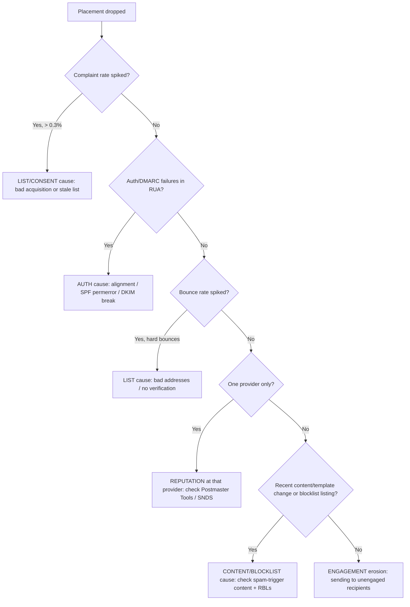

# Skill: Deliverability Incident Triage

When placement drops, the worst move is to immediately "fix the SPF record" — it
treats deliverability as purely an auth problem when the cause is often
reputation, list, content, or one specific receiver. This skill isolates the
cause first. Driven by `deliverability-architect`.

## Step 0 — One opinion up front: isolate before you prescribe

Gather the symptom shape before touching a record. The fix for a complaint-rate
spike (list/consent) is the opposite of the fix for an alignment break (auth) —
and applying the wrong one wastes the recovery window while reputation keeps
sliding.

## Step 1 — Characterize the drop

- **Scope** — all recipients, or one provider (Gmail vs Outlook vs Yahoo)? One
  provider regressing alone points at *that provider's* reputation signal, not auth.
- **Stream** — marketing, transactional, or both? (If you separated subdomains,
  this localizes the blast radius.)
- **Timing** — gradual decline (reputation erosion) vs cliff (a config change, a
  blocklist listing, or a bad send).
- **Symptom** — spam-foldering, deferrals (4xx), or hard rejects (5xx)?

## Step 2 — The decision tree

## Step 3 — Evidence to gather (per branch)

| Suspected cause | Evidence |
|---|---|
| **Auth** | DMARC RUA reports (which source/stream fails alignment), `dig` of current records |
| **Reputation** | Google Postmaster Tools (domain/IP reputation, spam rate), Microsoft SNDS/JMRP |
| **List/consent** | Complaint rate (FBL/ARF), hard-bounce rate, acquisition source of the affected segment |
| **Content/blocklist** | Recent template diffs, RBL lookups (Spamhaus etc.), link/domain reputation |
| **Engagement** | Open/click trend, recency of the recipients in the affected send |

## Step 4 — Recovery sequence

1. **Stop the bleeding** — pause the offending stream/segment; suppress hard
   bounces and complainers *immediately and permanently*.
2. **Fix the root cause** — apply the branch-specific fix (auth → records; list →
   re-permission/sunset; content → revert; reputation → re-warm).
3. **Re-warm to engaged recipients** — when reputation is the cause, rebuild by
   sending only to your most-engaged recipients first, ramping volume slowly.
4. **Monitor to confirm** — watch Postmaster Tools reputation + RUA pass-rate +
   complaint/bounce rates back to baseline before resuming full volume.

## Step 5 — Hand off

- Auth-record fixes → `email-auth-engineer`.
- Consent/retention questions on the list → `data-governance-privacy`.
- Content/segmentation/strategy → `marketing-operations`.

Volatile provider thresholds (e.g. the 0.3% complaint ceiling) are cited with a
date in [`../../knowledge/sender-requirements-and-reputation.md`](../../knowledge/sender-requirements-and-reputation.md);
verify before quoting in a customer-facing recommendation.
