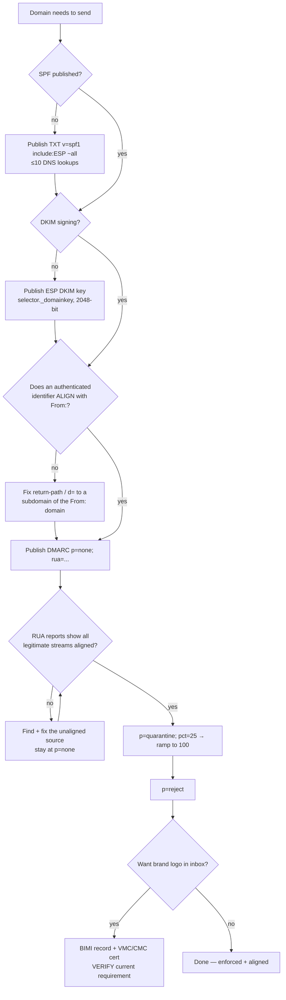
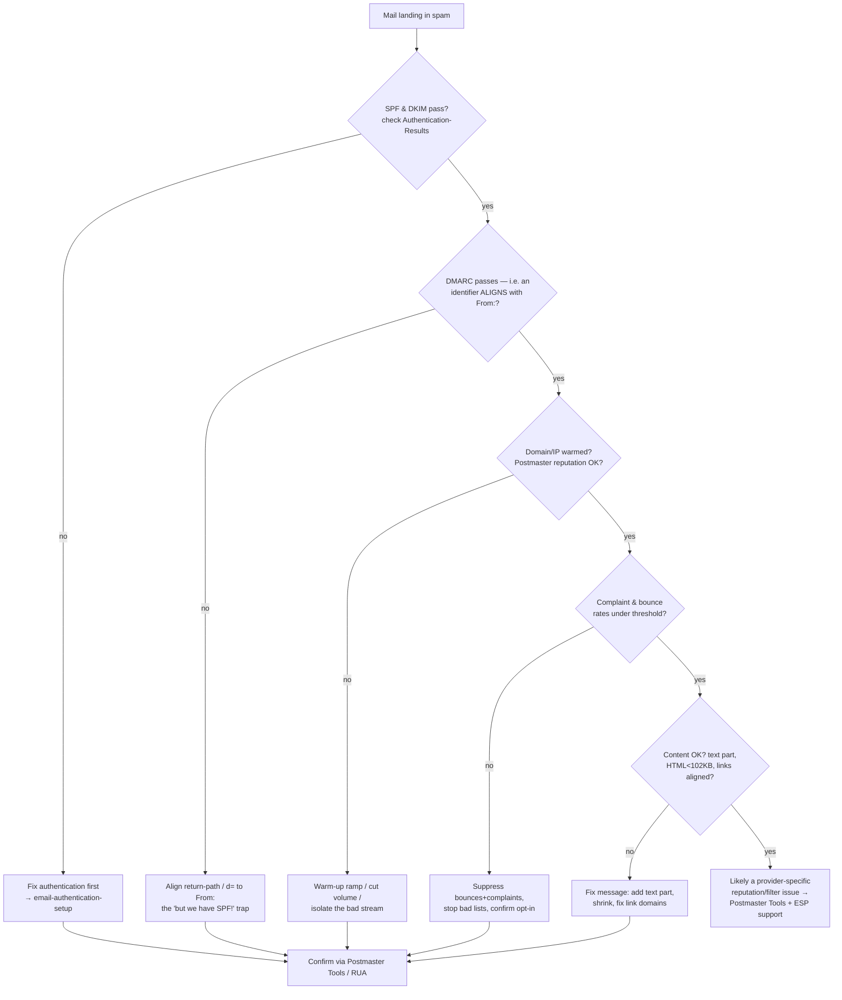
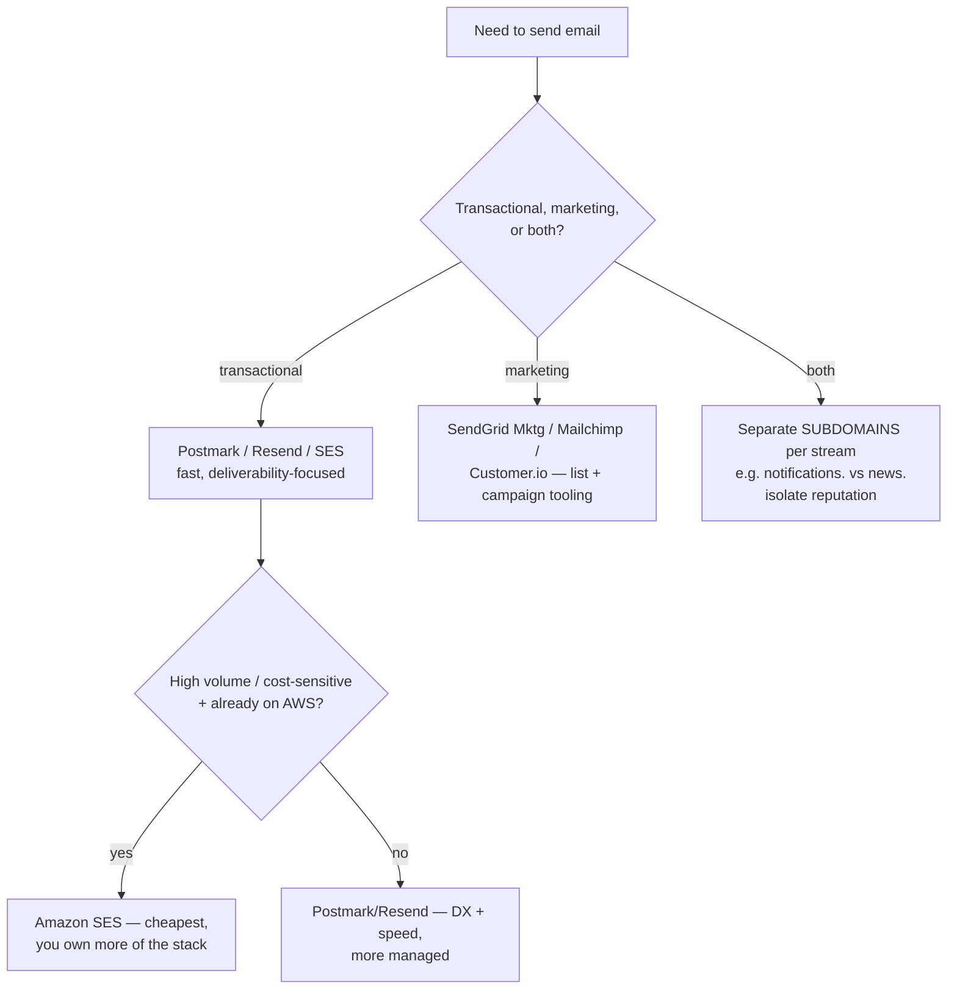

# Email authentication & deliverability decision trees

> Source of truth for the auth-setup and diagnosis branches. Agents carry compact inline priors; this file is re-read on demand.
>
> _Last reviewed: 2026-06-13 by `claude`. Confidence: Tier 1 (SPF/DKIM/DMARC mechanics are stable RFCs — RFC 7208 SPF, RFC 6376 DKIM, RFC 7489 DMARC, RFC 8058 one-click unsubscribe). Volatile specifics (Gmail/Yahoo thresholds, BIMI/VMC requirements) are flagged inline and carry a re-verify rider._

---

## Tree 1 — Authenticate → Align → Enforce (setup)

**The rule the tree encodes:** you cannot meaningfully enforce (`reject`) before you align, and you should not align-and-enforce blind — `p=none` + RUA reports are the evidence gate. SPF authenticates the envelope/return-path; DKIM signs the `d=` domain; DMARC requires one of them to **align** with the visible `From:`.

| Mechanism | Authenticates | Alignment check | Breaks on |
| --- | --- | --- | --- |
| SPF (RFC 7208) | envelope return-path | return-path domain == From: domain | **forwarding** (return-path changes) |
| DKIM (RFC 6376) | the `d=` signing domain | `d=` domain == From: domain | message body modified in transit |
| DMARC (RFC 7489) | the From: domain (via SPF **or** DKIM align) | n/a — it's the policy | neither SPF nor DKIM aligns |

> Because SPF breaks on forwarding, **DKIM alignment is the durable one** — design so DKIM aligns, and SPF is the bonus.

---

## Tree 2 — "Why are we landing in spam?" (diagnosis)

**Order matters:** never debug content (E) before authentication/alignment (A-B). A lower layer is meaningless if a higher one fails.

---

## Tree 3 — Which ESP / sending architecture?

See [`esp-capability-map-2026.md`](esp-capability-map-2026.md) for the dated feature comparison. The **stream-separation rule is non-negotiable**: transactional and marketing never share a sending subdomain, so a marketing reputation dip can't drop password-reset mail.

---

## Gmail / Yahoo bulk-sender requirements (volatile — verify)

For senders of **5,000+ messages/day** to Gmail/Yahoo (announced Oct 2023, enforced from **Feb 2024**):

1. **Authenticate** with SPF **and** DKIM, and publish a **DMARC** policy (at least `p=none`).
2. **One-click unsubscribe** — `List-Unsubscribe` + `List-Unsubscribe-Post: List-Unsubscribe=One-Click` (RFC 8058), honored within a short window (provider guidance: ~2 days).
3. **Spam-complaint rate** kept low — guidance targets staying **well under ~0.3%** (and never spiking to it), measured in Google Postmaster Tools.

> ⚠️ The exact thresholds, dates, and message-volume bars are **volatile** — re-verify against the current Gmail/Yahoo postmaster documentation before quoting to a client. Marked `[verify-at-use]`; map last reviewed 2026-06-13.
