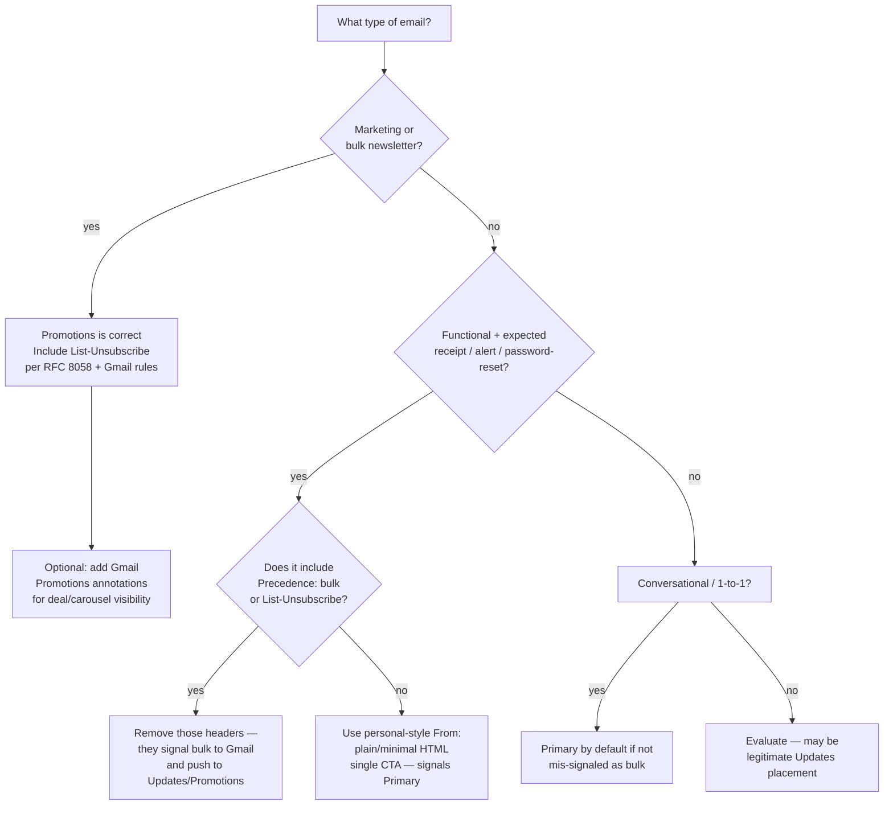

# Inbox categorization — Gmail tabs, Outlook Focused Inbox, and how senders are affected

> Delivery to the inbox is a binary pass/fail (inbox vs spam). But **within the inbox**, mailbox providers further sort mail into categories (Gmail tabs, Outlook Focused Inbox, Apple Mail summaries). A message that passes spam filters may still see significantly lower open rates depending on which category it lands in. This file covers the mechanics, the sender signals that drive categorization, and the guidance for optimizing placement where the provider allows it.
>
> _Last reviewed: 2026-08-10 by `claude`. Confidence: Tier 2 (Gmail/Outlook categorization logic is not RFC-specified; this is based on documented provider guidance and community-consensus understanding — re-verify before a client commitment; Gmail/Outlook update their models without announcement)._

---

## 1. Gmail category tabs

Gmail introduced category tabs in 2013. The tabs most relevant to senders:

| Tab | What lands here | Sender implication |
|---|---|---|
| **Primary** | Personal, conversational, transactional, and expected one-to-one messages | Highest open rates — target for transactional mail |
| **Promotions** | Bulk marketing, newsletters, offers, coupons | Lower open rates than Primary; purpose-built for this mail class |
| **Updates** | Bills, account notifications, receipts, confirmations (bulk but functional) | Mid-tier open rates; transactional-adjacent |
| **Social** | Notifications from social networks and sharing sites | App-specific; rarely a sender concern |
| **Forums** | Group emails, mailing lists, community digests | Rare in modern commercial email |

**Key insight:** Promotions is not spam. It's a usability layer for legitimate bulk mail. Trying to "escape" Promotions for marketing email can backfire — users expect marketing mail there and Gmail's classifier is tuned to place it correctly.

---

## 2. Signals Gmail uses for categorization

Gmail does not publish its categorization algorithm, but documented behavior and community evidence point to these signals:

### Header signals (most deterministic)

| Header | Effect |
|---|---|
| `List-Unsubscribe` (RFC 2369) | Strong Promotions/Updates signal — its presence means bulk |
| `Precedence: bulk` or `Precedence: list` | Promotions/Updates signal |
| `List-Id` | Promotions/Updates signal |
| `X-Mailer` / `X-Mailgun-*` / ESP-specific bulk headers | Bulk signal → Promotions |

**Implication for transactional mail:** omit `Precedence: bulk` and `List-Unsubscribe` from genuine one-to-one transactional messages (password resets, receipts, alerts). Those headers signal "I am bulk mail" to the classifier.

**Implication for marketing mail:** include `List-Unsubscribe` (you're required to by Gmail/Yahoo 2024 bulk-sender rules anyway). The Promotions placement is correct and expected for this mail class.

### Content signals

- Promotional language, discount codes, coupon offers, price-off claims → Promotions.
- Multiple links to the same domain (standard marketing template) → Promotions.
- Rich HTML with images and CTAs (classic newsletter structure) → Promotions.
- Plain text or minimal HTML, single CTA, personal tone → more likely Primary.

### Sender pattern

- A `From:` display name that looks like a company or brand name → Promotions.
- A `From:` address that looks personal (`john@company.com` with personal display name) → more likely Primary.
- Reply-to-a-prior-thread → always Primary (Gmail learns the relationship).

### Recipient behavior (per-user learning)

Gmail tracks per-user moves. If a user consistently moves a sender's mail from Promotions to Primary, Gmail adapts for **that user**. Senders cannot control this; it is a receiver-side preference signal. Encourage engaged subscribers to move your mail to Primary — this trains their inbox, not everyone's.

---

## 3. Gmail Promotions annotations (optional sender-side enhancement)

Gmail supports optional structured data in the email body (JSON-LD or microdata per schema.org) that allows senders to annotate Promotions tab messages with:

- **Deal badges** — discount amount, expiry date.
- **Product carousels** — product images and prices in the preview.
- **Sender logo** — brand image shown in the Promotions grid view.

These annotations are Gmail-specific, not deliverability levers (they do not move mail to Primary), but they can improve click-through from the Promotions tab. See Google's Email Markup documentation. `[verify-at-use: Google periodically updates the annotation schema and eligibility requirements — retrieved 2026-08-10.]`

---

## 4. Outlook Focused Inbox

Microsoft's equivalent is the **Focused** vs **Other** split, available in Outlook.com, Outlook for Microsoft 365, and the Outlook mobile app. The Focused tab shows mail Outlook judges most likely important to that user; Other shows the rest.

Key differences from Gmail:

- There are no named categories (Promotions, Updates, etc.) — only binary focused/other.
- The classifier is trained per-user; Microsoft's model is more opaque than Gmail's.
- Senders **cannot** publish structured signals to guarantee Focused placement (unlike Gmail's tab-header signals).
- Microsoft SNDS reputation data influences the model — senders with poor SNDS/JMRP ratings are more likely in Other.

**Practical guidance:** for Outlook placement, the levers are reputation (SNDS/JMRP monitoring, low complaint rates) and engagement (frequent opens/replies signal importance). There is no direct header or content optimization path equivalent to Gmail's.

`[verify-at-use: Microsoft updates the Focused Inbox model without announcement — retrieved 2026-08-10.]`

---

## 5. Apple Mail categories (iOS / macOS)

Apple Mail (iOS 16+, macOS Ventura+) introduced automatic inbox categorization into:

- **Primary** — personal mail.
- **Transactions** — receipts, orders, shipping.
- **Updates** — newsletters, social.
- **Promotions** — deals, marketing.

Apple's categorization runs locally on-device (Privacy Relay, Mail Privacy Protection); signals are similar to Gmail (bulk headers, content patterns). Unlike Gmail:

- There are no server-side signals senders can tune.
- Mail Privacy Protection means open tracking does not reliably indicate Apple Mail opens.

`[verify-at-use: Apple updates category logic across OS versions — retrieved 2026-08-10.]`

---

## 6. Decision tree — which tab should my mail land in?

---

## 7. What senders cannot control

- **Per-user Gmail category moves:** a user who moves all your mail to a tab overrides the classifier for their mailbox only.
- **Per-user Focused Inbox decisions:** Microsoft's model is per-user trained, not sender-controlled.
- **User opt-out of tabs:** Gmail users can disable category tabs and see everything in a single inbox — not sender-controllable.
- **Apple Mail on-device categorization:** runs after delivery, no server-side tuning possible.

---

## 8. Volatility note

Gmail/Outlook/Apple each update their categorization models without announcement. The header signals listed here reflect documented behavior as of 2026-08-10 — treat vendor-specific thresholds or annotation schemas as `[verify-at-use]` before advising a client to change their headers or markup.
