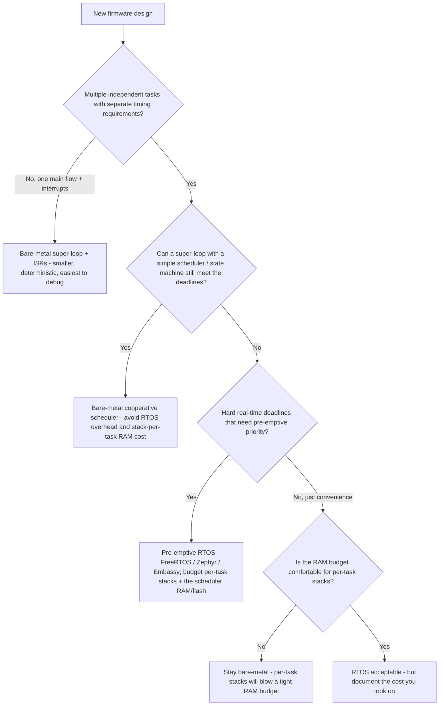
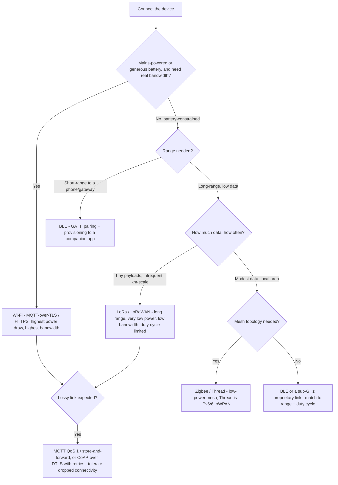

# Embedded & IoT Engineering — Decision Trees

_Decision trees + a dated capability map. Capability rows are `[verify-at-build]` — re-check against the silicon vendor / RTOS / stack docs before quoting. Last reviewed: 2026-06-08._

Traverse before choosing a scheduling model, a radio, or a provisioning posture.

## Decision Tree: RTOS or bare-metal?

An RTOS is a cost you take on for genuine concurrency — not a default.

_A super-loop with interrupts is often the right, debuggable, smaller answer. Reach for an RTOS when concurrent, independently-timed work genuinely needs pre-emption — and account for the per-task stack RAM._

## Decision Tree: Which connectivity protocol / radio?

The power/range/bandwidth budget picks the radio, not familiarity.

_BLE for short-range low-power, LoRa for long-range low-bandwidth, Wi-Fi for bandwidth at mains power, Zigbee/Thread for low-power mesh. Then pick a protocol that tolerates a dropped link, and duty-cycle the radio — it is the battery budget._

---

## Capability map (2026, `[verify-at-build]`)

| Layer | Options | Notes |
|---|---|---|
| RTOS | FreeRTOS, Zephyr, Embassy (Rust async), bare-metal super-loop | Zephyr for a batteries-included HAL + connectivity; FreeRTOS for minimal footprint; Embassy for async Rust `[verify-at-build]` |
| MCU / SoC family | ARM Cortex-M (STM32, nRF52/53, RP2040), ESP32 (Wi-Fi/BLE), RISC-V | nRF52/53 for BLE; ESP32 for Wi-Fi+BLE at low cost; STM32 for breadth — pick on flash/RAM/power headroom `[verify-at-build]` |
| Firmware language | C, C++ (subset), Rust (`embedded-hal`, Embassy) | Rust for memory-safety on new builds where the toolchain/ecosystem fits; C for breadth of vendor SDKs `[verify-at-build]` |
| Short-range radio | BLE (5.x), Zigbee, Thread (6LoWPAN) | BLE for phone-paired devices; Thread/Zigbee for low-power mesh `[verify-at-build]` |
| Long-range radio | LoRa / LoRaWAN, NB-IoT / LTE-M (cellular) | LoRaWAN for unlicensed km-scale low-bandwidth; LTE-M/NB-IoT for cellular coverage at higher cost `[verify-at-build]` |
| Device protocol | MQTT (over TLS), CoAP (over DTLS), LoRaWAN, HTTP | MQTT for pub/sub telemetry with QoS; CoAP for REST-like on constrained UDP `[verify-at-build]` |
| Secure boot / root of trust | ARm TrustZone-M, secure elements (ATECC608, SE050), MCU fuses, MCUboot | MCUboot for the verified-boot + A-B image flow; a secure element for key storage `[verify-at-build]` |
| OTA / device management | MCUboot (A-B + rollback), vendor cloud agents, LwM2M | Dual-bank A-B + rollback-on-failed-boot is the baseline; LwM2M for standardized device management `[verify-at-build]` |
| Provisioning / identity | X.509 per-device certs, PSK (discouraged at fleet scale), secure-element-stored keys | Per-device identity provisioned at manufacture/first-boot; never a shared fleet secret `[verify-at-build]` |
| Debug / trace | SWD/JTAG, SEGGER J-Link + RTT, OpenOCD, ITM/SWO trace | SWD + a fault handler writing context to retained RAM; RTT for low-overhead logging `[verify-at-build]` |

_Reference budgets: a coin-cell (CR2032 ~225 mAh) device lives on sleep current (µA) and a low duty cycle; the radio dominates active draw. The DORA-equivalent for firmware is field-update success rate + rollback rate — a fleet you can't safely update is a fleet you can't fix. Re-verify any silicon/RTOS/stack specific against its current docs/errata before quoting it to a consumer._
