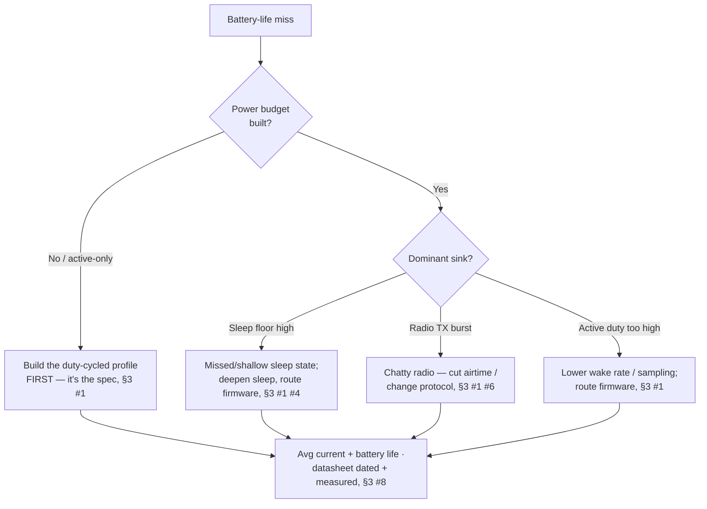
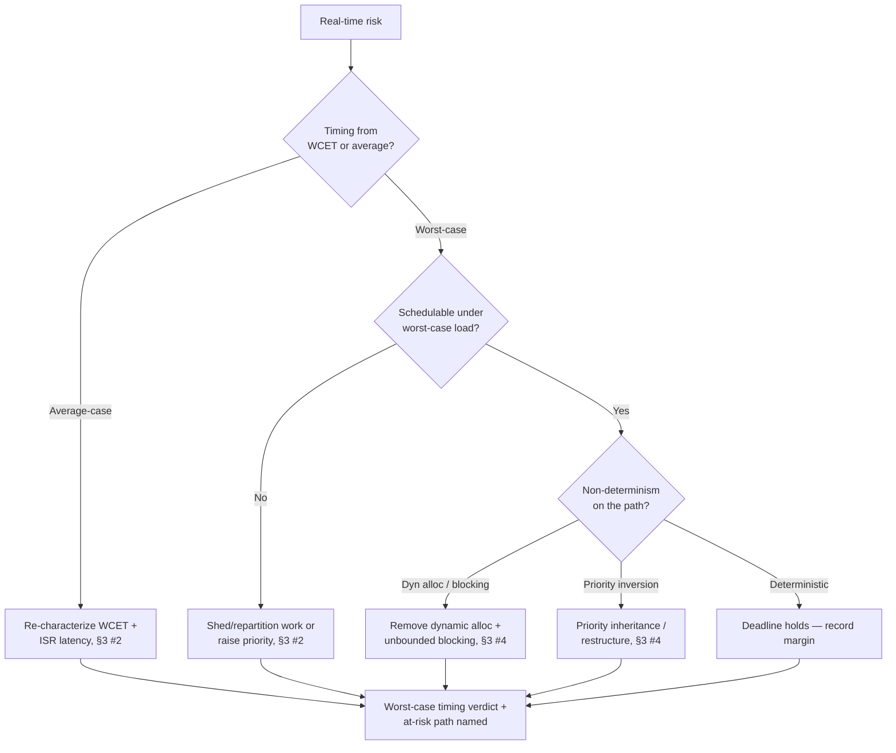

# Embedded & IoT Engineering Decision Trees

> Mermaid decision trees for the three most common triage paths. Traverse top-to-bottom and pick the smaller-blast-radius leaf — don't keyword-match the symptom to a method. Each tree encodes the team's house opinions (CLAUDE.md §3).

## Tree 1 — Battery won't hit its target



## Tree 2 — Will the deadline hold?



## Tree 3 — Which radio fits?

```mermaid
flowchart TD
    A[Pick connectivity] --> B{Range needed?}
    B -- "Wide-area / km" --> C{Data rate?}
    C -- "Low (telemetry)" --> C1[LoRa(WAN) / NB-IoT —<br/>long-range low-power, §3 #6]
    C -- "High (stream)" --> C2[Cellular — high power+cost;<br/>confirm budget, §3 #6]
    B -- "Local / room" --> D{Power budget tight?}
    D -- "Battery, tight" --> D1[BLE — low power, moderate<br/>rate, §3 #6]
    D -- "Mains / high rate" --> D2[Wi-Fi — high rate, high<br/>power, §3 #6]
    C1 --> E[Protocol on power/range/<br/>bandwidth/cost trade · airtime<br/>into power budget, §3 #1 #6]
    C2 --> E
    D1 --> E
    D2 --> E
```

## How to read these

- **Decompose before you act** — the first node of each tree is usually a STOP that prevents acting on an aggregate you haven't yet split.
- **Fix the constraint before adding volume** — more input into a leaking process wastes resource.
- Every leaf ends in the §6 Output Contract: owner · date · expected metric movement.
