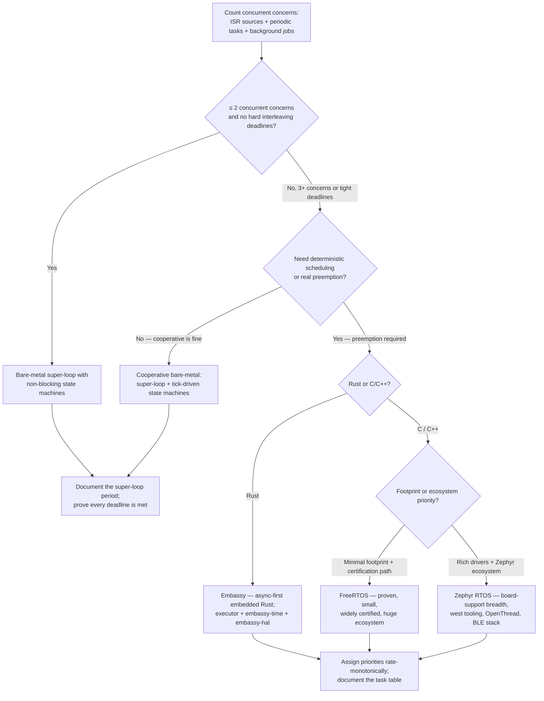
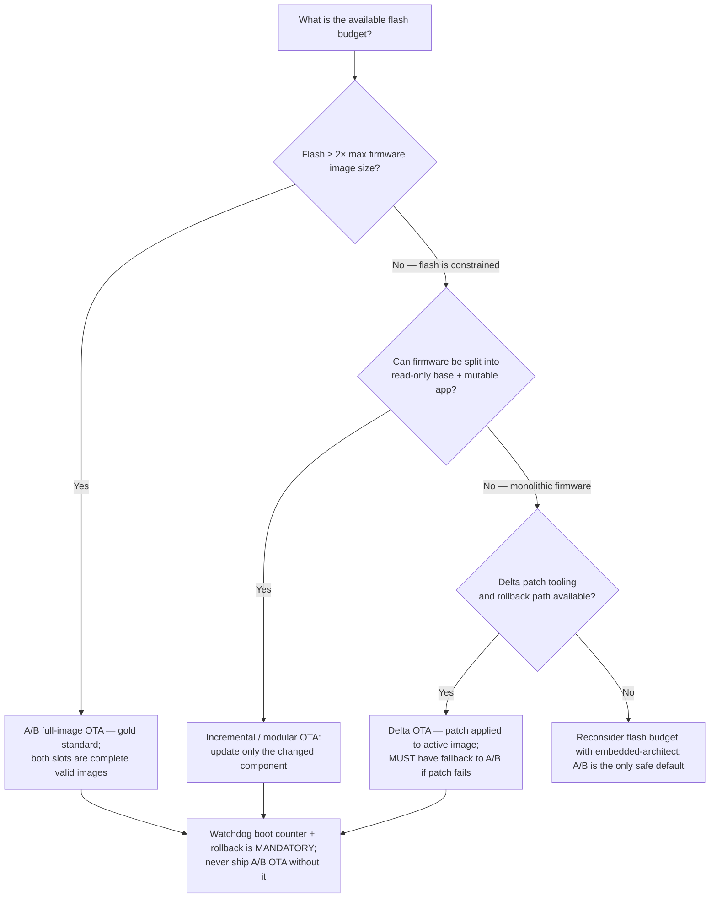
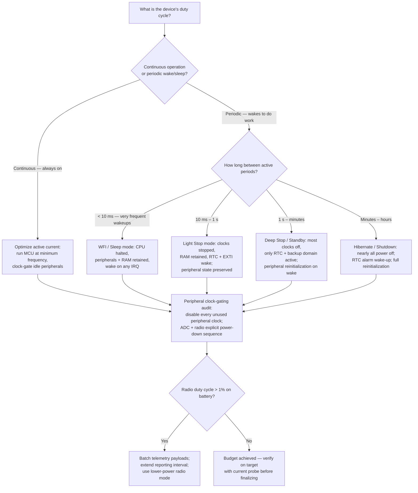

# Embedded IoT Firmware — Decision Trees + 2026 Capability Map

> Canonical knowledge bank for `embedded-iot-firmware`. **Traverse the relevant Mermaid tree
> top-to-bottom before recommending** — the proactive complement to the Capability Grounding
> Protocol. Volatile product/version facts in the capability map carry a retrieval date and a
> re-verify-at-use rider.

---

## Decision Tree: Bare-metal vs RTOS selection

**Leaf rule:** below 3 concurrent concerns with no tight interleaving requirement, a well-
structured super-loop with non-blocking state machines is simpler, faster to audit, and easier
to certify than an RTOS. Introduce an RTOS when you genuinely need preemption, not "just in
case." When you choose an RTOS, document the task table before writing any driver.

---

## Decision Tree: OTA strategy (A/B vs delta vs incremental)

**Leaf rule:** A/B full-image is the only scheme where a device can always recover from a
failed or interrupted OTA — both slots are complete, valid, bootable images. Delta and
incremental OTA can save bandwidth and are appropriate when flash is constrained, but they must
fall back to a full A/B swap for any unrecoverable patch failure. A watchdog-guarded boot
counter with a rollback trigger is non-negotiable regardless of OTA strategy.

---

## Decision Tree: Power-mode selection

**Leaf rule:** choose the deepest sleep mode that still meets the wakeup latency requirement.
Every step deeper typically saves one order of magnitude in sleep current. Clock-gate every
peripheral the MCU is not actively using — peripheral clocks left running in sleep mode are the
most common source of unexpected idle current. Always verify the power budget on real hardware
with a current probe before committing to a battery size.

---

## 2026 capability map — Embedded / IoT ecosystem (dated, re-verify at use)

_Retrieved 2026-06-08. Product versions, pricing, and support status are volatile — re-confirm
at use. This is orientation, not a procurement recommendation. [verify-at-use]_

### RTOS and firmware frameworks

| Framework | Language | Key strength | Flash footprint | Notes |
|---|---|---|---|---|
| **FreeRTOS** | C | Proven, tiny, huge ecosystem, widely certified (SafeRTOS variant) | ~5–15 KB | AWS-maintained; free; de-facto standard on STM32/ESP32/nRF; LTS versions available [verify-at-use] |
| **Zephyr RTOS** | C | Rich board support (500+ boards), west tooling, OpenThread, BLE stack, strong driver model | ~20–60 KB | RTOS + driver framework; steeper learning curve; strong for nRF52/nRF91 and ESP32 [verify-at-use] |
| **Embassy** | Rust | Async-first, zero-cost abstractions, compile-time memory safety, no RTOS overhead | ~10–30 KB | Rapidly maturing; async tasks via executor; best-in-class for nRF52/STM32; HAL coverage growing [verify-at-use] |
| **ThreadX / Azure RTOS** | C | Microsoft-backed, USBX/FileX ecosystem, TraceX, safety certifications (IEC 61508, DO-178C) | ~6–20 KB | Renamed Azure RTOS → Eclipse ThreadX under Eclipse Foundation (2023); check licensing [verify-at-use] |
| **Bare-metal (no RTOS)** | C/C++/Rust | Simplest, most auditable, lowest overhead | ~0 KB RTOS | Correct choice for ≤ 2 concurrent concerns |

### MCU families

| Family | Vendor | Cores | Notable for | Typical use |
|---|---|---|---|---|
| **STM32** (F/L/H/G/U/WB series) | ST Microelectronics | Cortex-M0+ to M33 | HAL quality, CubeMX tooling, STM32CubeIDE, wide peripheral set, dual-bank flash on most H/G/U series | Industrial sensors, motor control, wearables, gateways [verify-at-use] |
| **ESP32** (ESP32, S2, S3, C3, C6, H2) | Espressif | Xtensa LX6/LX7, RISC-V | Integrated Wi-Fi + BLE, large community, esp-idf mature, OTA support built-in | IoT end-nodes, Wi-Fi-primary devices [verify-at-use] |
| **nRF52 / nRF53 / nRF91** | Nordic Semiconductor | Cortex-M4/M33 | BLE 5.x, Thread/Zigbee (nRF52), LTE-M/NB-IoT (nRF91), ultra-low power, SoftDevice/nRF Connect SDK | BLE wearables, asset trackers, cellular IoT [verify-at-use] |
| **RP2040 / RP2350** | Raspberry Pi | Dual Cortex-M0+/M33 | PIO state machines for custom protocols, low cost, strong community | Hobbyist/prototyping, custom protocol interfaces [verify-at-use] |
| **SAMD21/SAMD51** | Microchip/Atmel | Cortex-M0+/M4 | Arduino ecosystem, USB native, low-power | Wearables, USB HID devices [verify-at-use] |

### OTA update platforms

| Platform | Notes |
|---|---|
| **Mender** (open-source + SaaS) | A/B partition OTA; strong rollback; Yocto/buildroot integration; device-agnostic; self-hostable [verify-at-use] |
| **AWS IoT Jobs + OTA Update Service** | MQTT-driven job distribution; FreeRTOS OTA library (coreMQTT-Agent); tight AWS IoT Core integration [verify-at-use] |
| **Azure IoT Hub + Device Update for IoT Hub (ADU)** | Microsoft-managed OTA; supports delta updates via libdiffencode; Azure DPS for provisioning [verify-at-use] |
| **MCUboot** | Open-source bootloader; A/B + overwrite + direct-XIP modes; Ed25519/RSA-PSS signing; used by Zephyr and ESP-IDF as default bootloader [verify-at-use] |
| **ESP-IDF OTA** | Built-in A/B OTA for ESP32 family; `esp_https_ota`; flash encryption + secure boot v2 integrated [verify-at-use] |
| **nRF Connect SDK FOTA** | BLE FOTA (MCUmgr over BLE); LTE-M/NB-IoT FOTA via nRF Cloud or custom; MCUboot-based [verify-at-use] |

### Secure boot tooling

| Tool | Notes |
|---|---|
| **MCUboot** | Canonical open-source bootloader; chain-of-trust from hardware OTP through app slot verification; Ed25519 default [verify-at-use] |
| **STM32 RDP / OPTBOOT** | ST's Read Protection + Option Bytes; dual-bank flash enables A/B without MCUboot on STM32H7/G0/U5 [verify-at-use] |
| **ESP32 Secure Boot v2** | RSA-PSS-3072 or ECDSA; eFuse-based trust anchor; digest chain through to app; flash encryption separate [verify-at-use] |
| **nRF SPE/NSPE (TrustZone)** | TrustZone-M on nRF9160/nRF5340; secure processing environment (SPE) for crypto + key storage; NSPE for app [verify-at-use] |
| **ATECC608 / SE050** | External secure elements; private key never leaves chip; offloads TLS key ops and ECDSA signing; paired with any MCU [verify-at-use] |

> Provenance: FreeRTOS/Zephyr/Embassy documentation and community release notes; Nordic, ST,
> and Espressif product pages; MCUboot GitHub; Mender.io documentation; AWS and Azure IoT
> documentation — all retrieved 2026-06-08. Versions and support status are volatile;
> re-verify at use. No invented products.

---

## See also

- [`../CLAUDE.md`](../CLAUDE.md) — team constitution and seams.
- [`../best-practices/README.md`](../best-practices/README.md) — the named, citable rules.
- Neighbour decision trees: `security-engineering` (crypto policy), `aws-cloud` / `azure-cloud`
  (cloud-side IoT), `data-streaming-engineering` (telemetry pipeline).

_Last reviewed: 2026-06-08 by `claude`._
