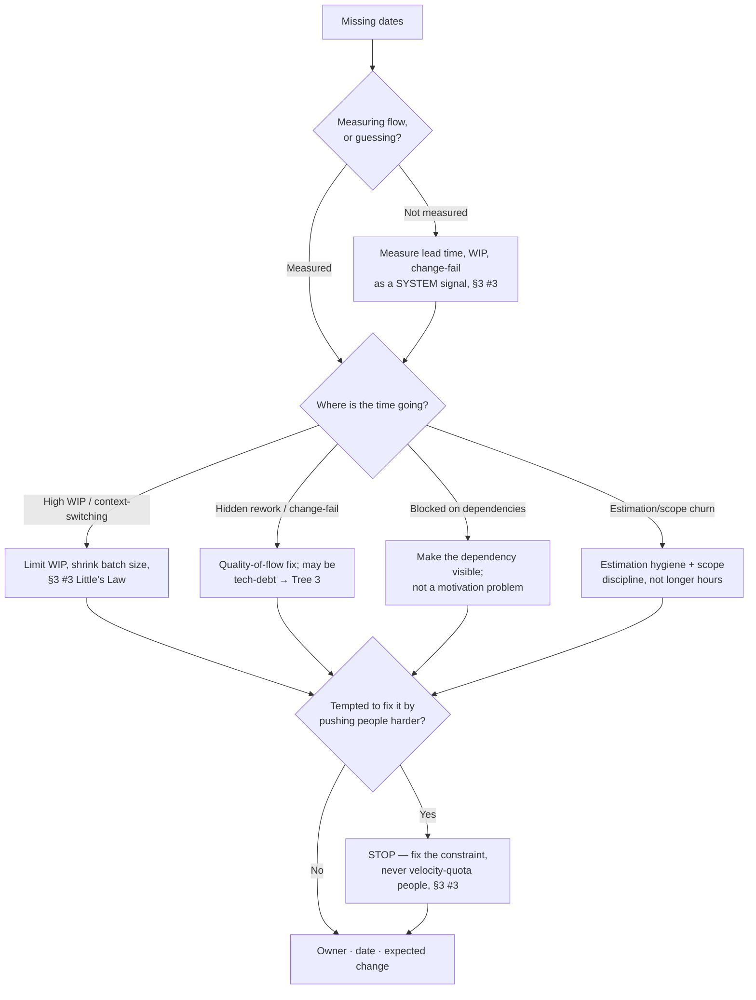

# Engineering Management Decision Trees

> Mermaid decision trees for the three most common triage paths. Traverse top-to-bottom and pick the smaller-blast-radius leaf — don't keyword-match the symptom to a fix. Each tree encodes the team's house opinions (CLAUDE.md §3). Every leaf ends in the §6 Output Contract: owner · date · expected change. **A claim about a person is a hypothesis to test, never a verdict (§3 #1).**

## Tree 1 — "Someone on my team is underperforming"

```mermaid
flowchart TD
    A[Felt: a person is underperforming] --> B{Is there dated, observable<br/>behavior with impact?}
    B -- "No — just a feeling/adjective" --> B1[Write the evidence FIRST:<br/>what, when, impact, §3 #1 #4]
    B -- "Have specific evidence" --> C{Checked the SYSTEM<br/>before the person?}
    C -- "Not yet" --> C1[Check expectations / context /<br/>altitude / blockers / health, §3 #5]
    C1 --> D{System gap explains it?}
    D -- "Yes" --> D1[Fix the system: clarify<br/>expectations, unblock, §3 #5]
    D -- "No — genuine gap" --> E{Is this an HR/legal<br/>instrument (PIP/term)?}
    C -- "Yes, system is fine" --> E
    E -- "Yes" --> E1[Route to people-operations-hr<br/>+ counsel, §2]
    E -- "No — coaching" --> E2[Fair expectations + support plan,<br/>dated, as a draft you own, §2]
    B1 --> C
    D1 --> F[Owner · date · expected change]
    E1 --> F
    E2 --> F
```

## Tree 2 — "We keep missing dates / delivery is unpredictable"



## Tree 3 — "Should we pay down this tech-debt or keep shipping?"

```mermaid
flowchart TD
    A[Tech-debt vs roadmap] --> B{Is the pain measured,<br/>or just felt?}
    B -- "Felt only" --> B1[Measure: lead-time drift, change-fail,<br/>rework, hotspots, §3 #4 #7]
    B -- "Measured" --> C{Is it on a hotspot<br/>(high churn × complexity)?}
    C -- "No — stable code" --> C1[Low leverage; defer, log the<br/>carrying cost, §3 #7]
    C -- "Yes — hotspot" --> D{Sized the carrying cost<br/>+ payback?}
    D -- "Not sized" --> D1[Run tech-debt calc: carrying cost,<br/>payback periods, §3 #7]
    D -- "Sized — short payback" --> E{Incremental paydown<br/>possible?}
    E -- "Yes" --> E1[Strangler-fig paydown in a<br/>reserved capacity slice, §3 #7]
    E -- "No — needs rewrite" --> E2[Rewrite = highest risk; trade<br/>explicitly vs roadmap, §3 #7]
    B1 --> C
    D1 --> E
    C1 --> F[Owner · date · expected change]
    E1 --> F
    E2 --> F
```

## How to read these

- **Decompose before you act** — the first node of each tree is usually a STOP that prevents acting on a feeling you haven't yet turned into dated evidence (§3 #1 #4).
- **Fix the constraint before adding pressure** — more input into a leaking process wastes the team (§3 #3).
- **A management deliverable about a person is a draft for a human to own**, never an autonomous verdict (§2).
