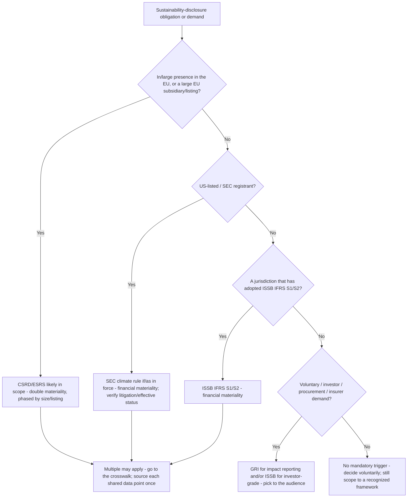
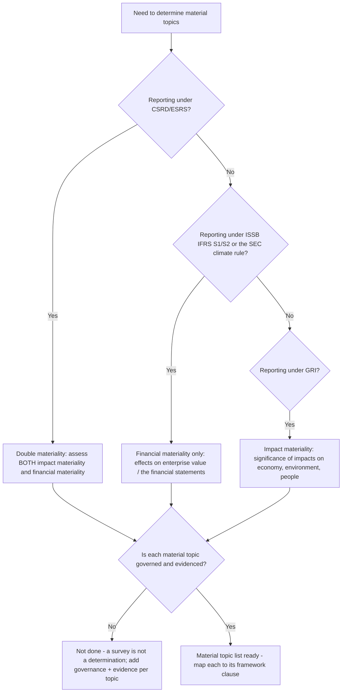

# ESG & Sustainability Reporting — Decision Trees

_Decision trees + a dated framework/standard map. Standard rows are `[verify-at-build]` — frameworks here are moving fast (CSRD omnibus changes, SEC climate-rule litigation, ISSB jurisdictional adoption); re-check against the standard-setter/regulator before quoting. Last reviewed: 2026-06-08._

Traverse before selecting a framework, running materiality, building an inventory, or targeting an assurance level.

## Decision Tree: Which framework(s) apply to us?

Applicability is driven by jurisdiction, listing, size, and counterparty demand — not by preference.

_More than one usually applies. Crosswalk the overlapping data points (ESRS ⇄ IFRS S ⇄ GRI ⇄ SEC) and source each once. `[verify-at-build]` the effective status of each — CSRD scope and the SEC rule have both moved._

## Decision Tree: Which materiality test do we run?

The framework picks the test; the test changes what's disclosed.

_Double materiality (CSRD) is impact AND financial; ISSB/SEC is financial only; GRI is impact. Name the test, the governance, and the evidence per topic — or it won't survive assurance._

---

## Reference: GHG Protocol scopes & the 15 Scope-3 categories

| Scope | What it covers | Reporting note |
|---|---|---|
| Scope 1 | Direct emissions: combustion, fleet, fugitive, process | From activity data × sourced/vintaged factor |
| Scope 2 | Indirect from purchased energy | Report **both** location-based (grid factor) **and** market-based (contractual instruments) where applicable |
| Scope 3 | Other value-chain emissions, 15 categories | Screen all 15 for relevance; include material ones; document any exclusion |

**The 15 Scope-3 categories** (upstream 1-8, downstream 9-15): 1 purchased goods & services · 2 capital goods · 3 fuel- & energy-related (not in S1/S2) · 4 upstream transport & distribution · 5 waste generated in operations · 6 business travel · 7 employee commuting · 8 upstream leased assets · 9 downstream transport & distribution · 10 processing of sold products · 11 use of sold products · 12 end-of-life of sold products · 13 downstream leased assets · 14 franchises · 15 investments (incl. financed emissions). `[verify-at-build]`

## Reference: location-based vs market-based Scope 2

- **Location-based** — grid-average emission factor for the region; always reportable.
- **Market-based** — reflects contractual instruments (RECs/GOs, PPAs, green tariffs, supplier-specific factors) that meet the GHG Protocol Scope-2 market-based quality criteria; instruments that fail the criteria default back to the grid factor.
- **Dual reporting** — where market-based instruments exist, report **both** figures; never silently pick one. Offsets are **not** a Scope-2 instrument and are reported separately, never netted in.

## Reference: double vs financial materiality

| Test | Used by | Question | Output |
|---|---|---|---|
| Double materiality | CSRD/ESRS | Impact on people/planet **AND** financial effect on the company | Topics material on either axis |
| Financial materiality | ISSB IFRS S1/S2, SEC | Effect on enterprise value / the financial statements | Topics material to investors |
| Impact materiality | GRI | Significance of impacts on economy, environment, people | Topics material to stakeholders |

## Reference: assurance levels

| Level | Conclusion form | Evidence depth | Typical use (2026) |
|---|---|---|---|
| Limited assurance | Negative ("nothing came to our attention") | Lower; analytics + inquiry-weighted | The common starting bar (e.g. CSRD initial phase) `[verify-at-build]` |
| Reasonable assurance | Positive ("in our opinion, fairly stated") | Higher; substantive testing, controls reliance | The intended end-state for some regimes over time `[verify-at-build]` |

_Know the target level **before** drafting — limited and reasonable demand different evidence depth and controls. Building to the wrong bar wastes effort or fails the engagement._

---

## Framework / standard capability map (2026, `[verify-at-build]`)

| Standard | Setter / regulator | Materiality | Notes |
|---|---|---|---|
| ESRS (under CSRD) | EFRAG / EU | Double | Phased by size/listing; omnibus changes in flight — verify scope & timing `[verify-at-build]` |
| IFRS S1 / S2 | ISSB (IFRS Foundation) | Financial | Adopted per jurisdiction; S2 is climate-specific `[verify-at-build]` |
| GRI Standards | GRI | Impact | The established impact-reporting standard; interoperable with ESRS `[verify-at-build]` |
| SEC climate disclosure rule | US SEC | Financial | Status has been subject to litigation/stay — verify effective status before relying `[verify-at-build]` |
| GHG Protocol | WRI / WBCSD | n/a (inventory standard) | Corporate Standard + Scope 2 Guidance + Scope 3 Standard `[verify-at-build]` |

_The frameworks here are unusually fast-moving in 2026 (CSRD omnibus, SEC rule litigation, ISSB adoption pace). Re-verify the effective status and the specific clause before quoting any of it to a consumer._
