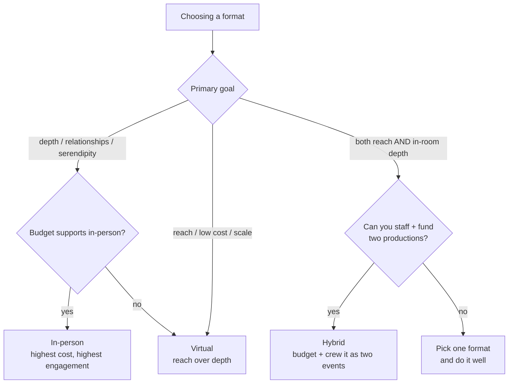
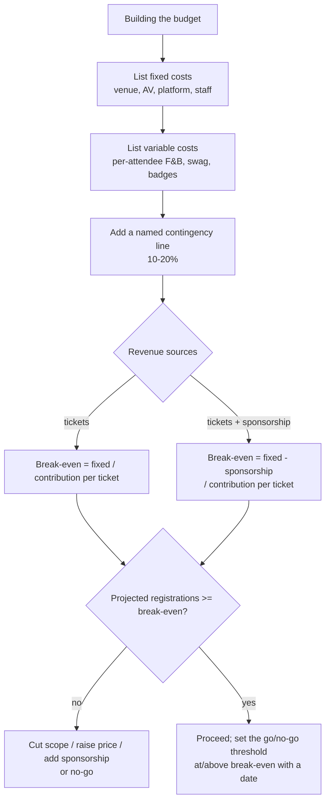
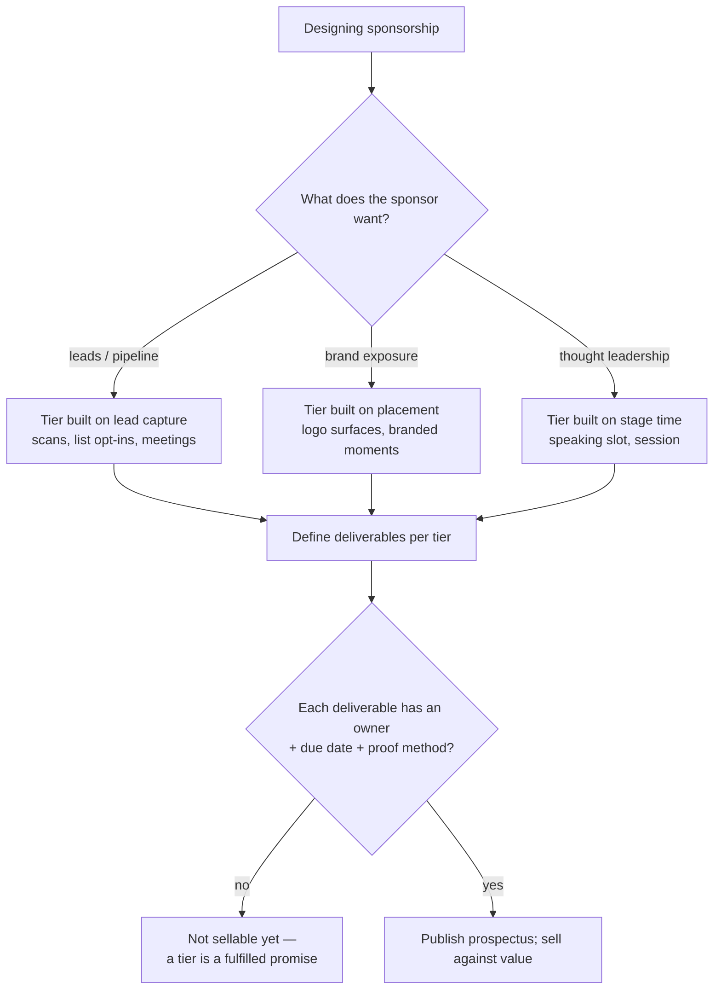
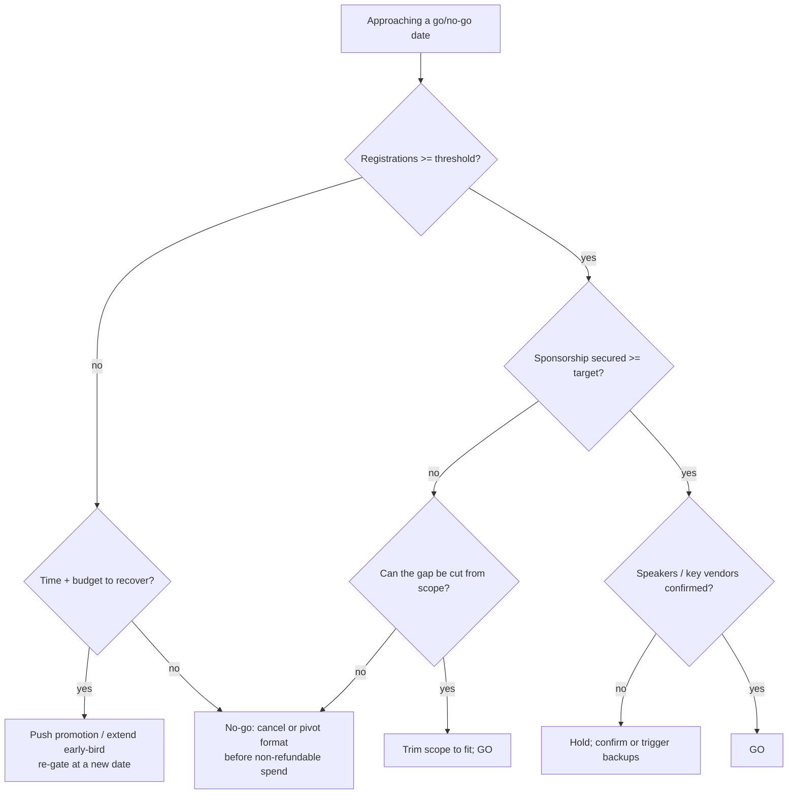

# Event Management — Decision Trees

> Reference decision trees for the `event-management` team. Agents **traverse the relevant tree top-to-bottom before choosing** (the proactive complement to the Capability Grounding Protocol). Each `## Decision Tree` section is a Mermaid graph plus the rule it encodes.
>
> _Last reviewed: 2026-06-22 by `claude`. Principles are durable; specific platform/benchmark names live (dated) in [`event-management-reference-2026.md`](event-management-reference-2026.md)._

---

## Decision Tree: in-person, virtual, or hybrid?

**Rule:** format follows goal + audience + budget. In-person buys depth at the highest cost; virtual buys reach cheaply at shallower engagement; hybrid buys both only if you fund and staff two simultaneous productions. Don't default to hybrid because it sounds inclusive.

---

## Decision Tree: budget & break-even model

**Rule:** every budget carries a named contingency line; break-even is a computed number (registrations and/or sponsorship to cover cost), and it sets the go/no-go threshold. A budget with no buffer breaks on the first surprise.

---

## Decision Tree: sponsorship tiering

**Rule:** a sponsorship tier is a set of *delivered* deliverables, each with an owner, a due date, and a proof method — not a logo size. Sell against value; fulfill and prove every promise, because proof is what renews.

---

## Decision Tree: go / no-go gate

**Rule:** name the go/no-go criteria early — each gate has a date and a hard threshold (registrations, sponsorship, speaker/vendor confirmations). Decide it before non-refundable spend ramps; a gate with no date is decoration.

---

## See also

- [`event-management-reference-2026.md`](event-management-reference-2026.md) — dated tooling/benchmark map (re-verify before quoting platforms or rates).
- Skills: [`../skills/design-event-plan-and-budget/SKILL.md`](../skills/design-event-plan-and-budget/SKILL.md), [`../skills/build-run-of-show/SKILL.md`](../skills/build-run-of-show/SKILL.md), [`../skills/sponsorship-and-revenue/SKILL.md`](../skills/sponsorship-and-revenue/SKILL.md), [`../skills/registration-and-attendee-ops/SKILL.md`](../skills/registration-and-attendee-ops/SKILL.md), [`../skills/post-event-measurement/SKILL.md`](../skills/post-event-measurement/SKILL.md).
