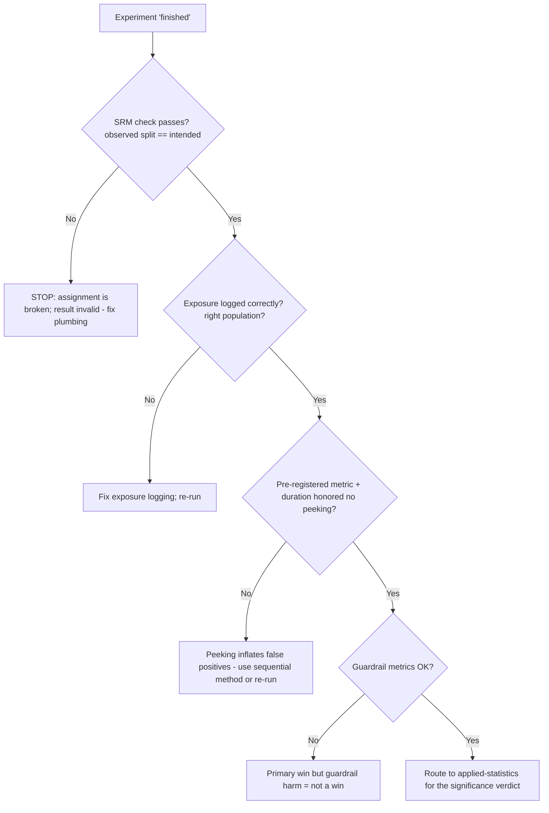
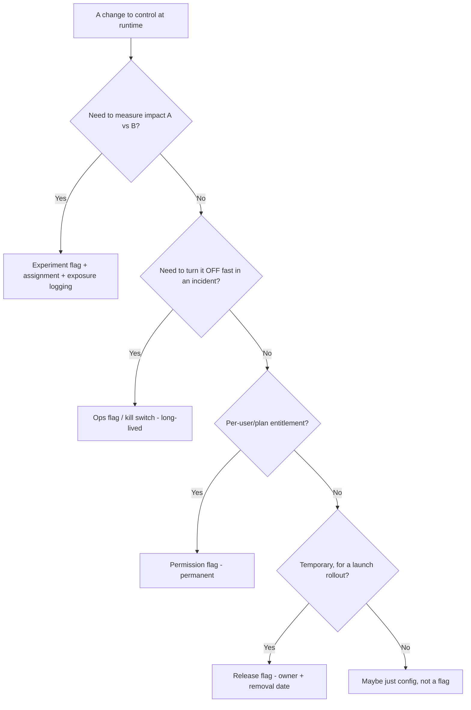
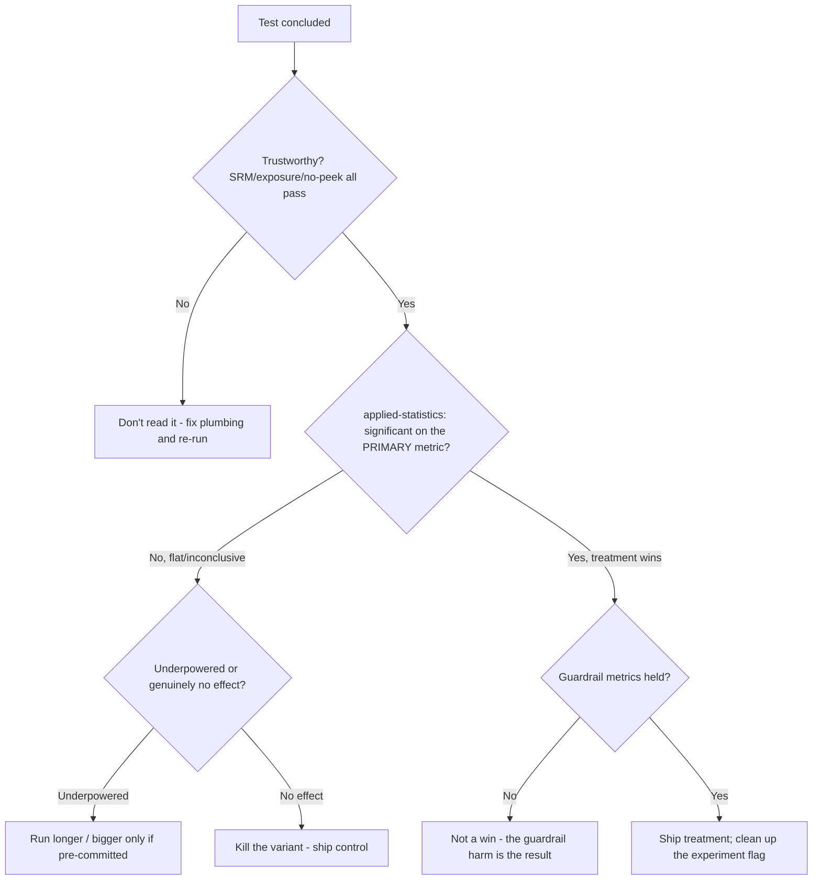
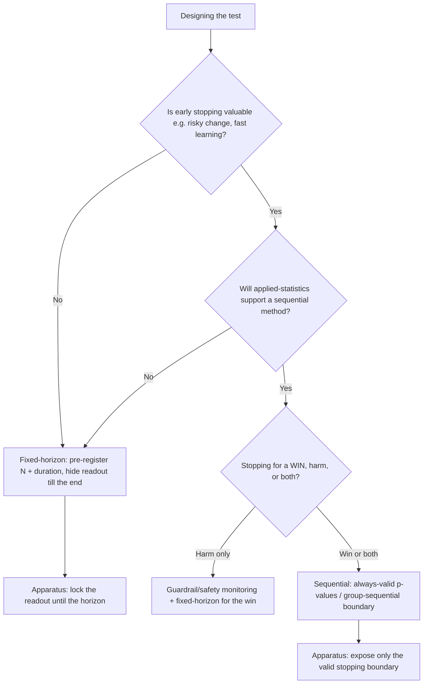
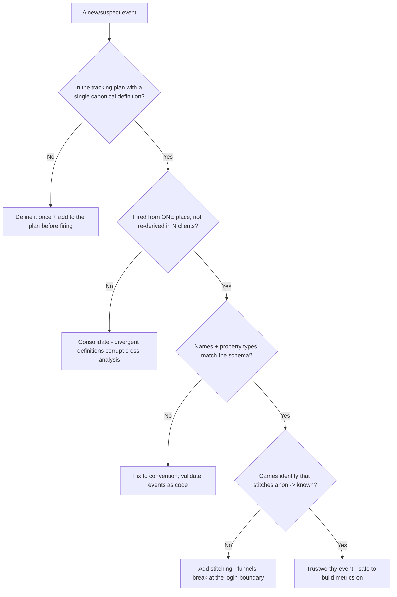

# Experimentation & Growth — Decision Trees

_Decision trees + a dated capability map. Capability rows are `[verify-at-build]` — re-check against the vendor before quoting. Last reviewed: 2026-06-04._

Traverse before reading a result or choosing a flag vs config. Significance verdicts route to applied-statistics.

## Decision Tree: Can I trust this experiment result?

Validate the plumbing before believing any metric; significance is a separate, later question for applied-statistics.

_This team certifies trustworthiness; applied-statistics certifies significance._

## Decision Tree: Feature flag vs config vs experiment?

Match the mechanism to the intent.

## Decision Tree: Ship, iterate, or kill after a test?

Only after the result is trustworthy AND significant; the apparatus certifies the former, applied-statistics the latter.

_A significant primary with a tripped guardrail is a trade for the business to make, not an automatic ship._

## Decision Tree: Fixed-horizon or sequential test?

Pick the analysis regime up front; mixing them (peeking a fixed-horizon test) is the false-positive trap.

_Either method is valid; checking a fixed-horizon test daily is not one of them._

## Decision Tree: Is this event instrumented correctly?

Before an event feeds a funnel or a metric, validate it against the tracking plan.

_Garbage events in means no analysis out; most 'our data is a mess' is a missing/ignored plan._

## Capability map (dated — verify at build)

| Capability | 2026 state `[verify-at-build]` | Notes |
|---|---|---|
| Feature-flag platforms (LaunchDarkly/Flagsmith/OSS) | GA | Targeting, kill switches, SDKs |
| CDP (Segment/RudderStack) | GA | Instrument once, fan out |
| Product analytics (Amplitude/PostHog/Mixpanel) | GA | Funnels, retention, experiments |
| SRM checks | standard practice | Catch broken assignment |
| Sequential testing | available | Valid peeking (with applied-statistics) |
| Server-side experimentation | recommended | Avoid client-side flicker/leak |
