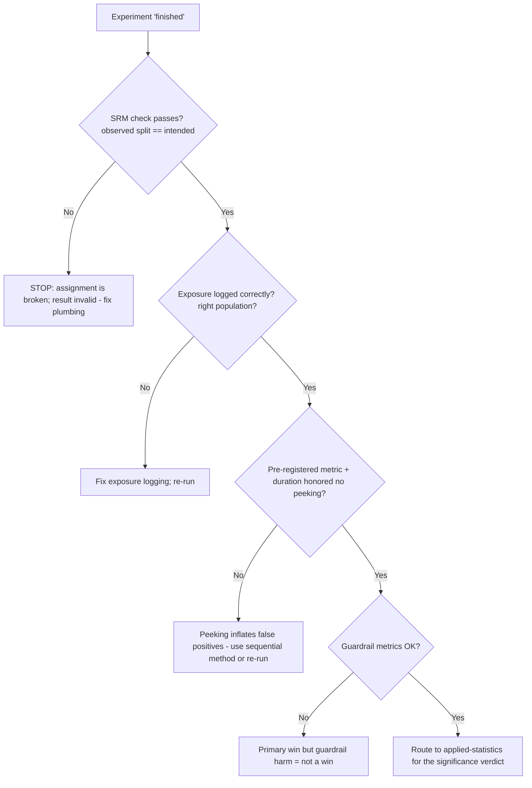
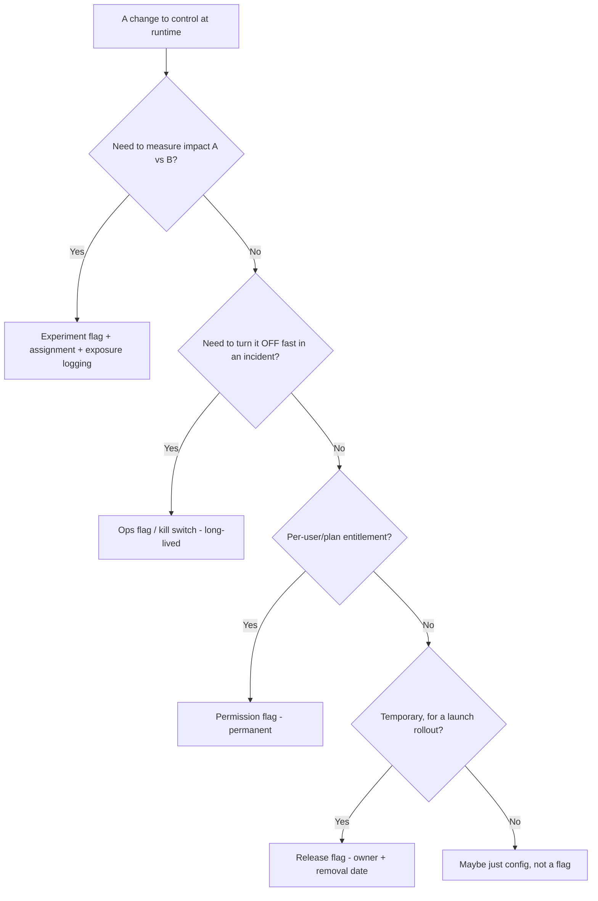
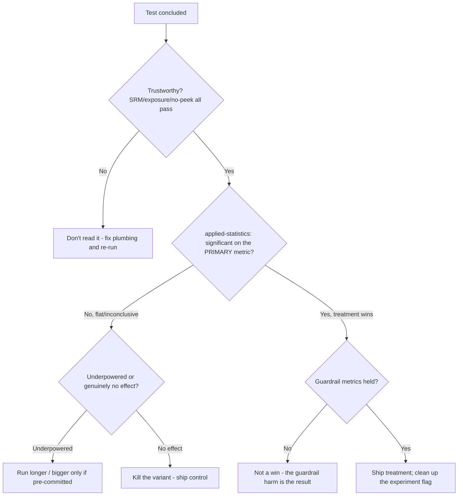
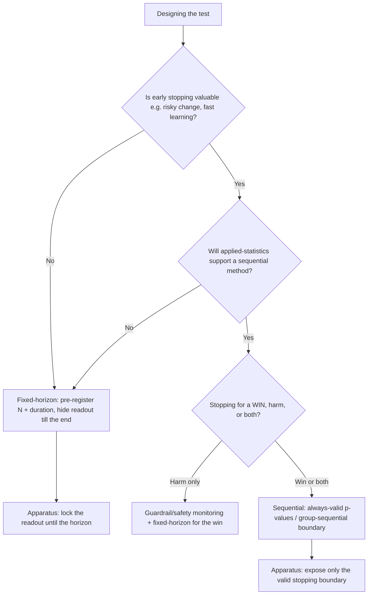
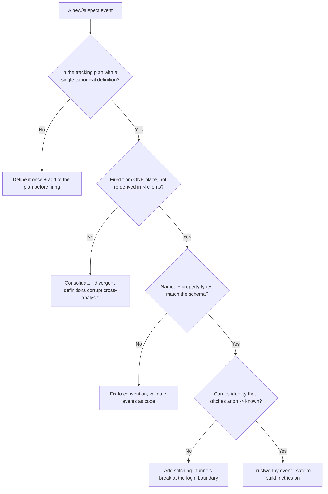
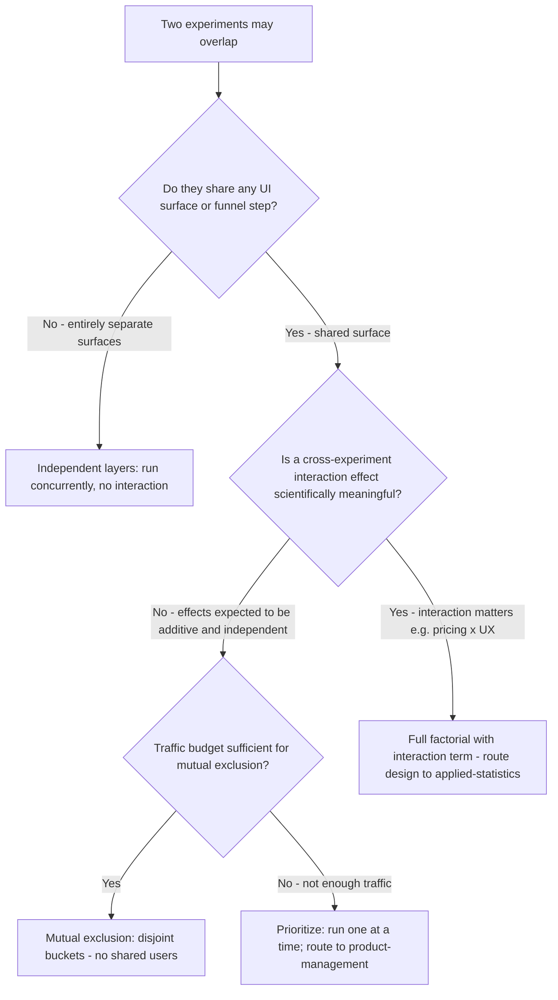
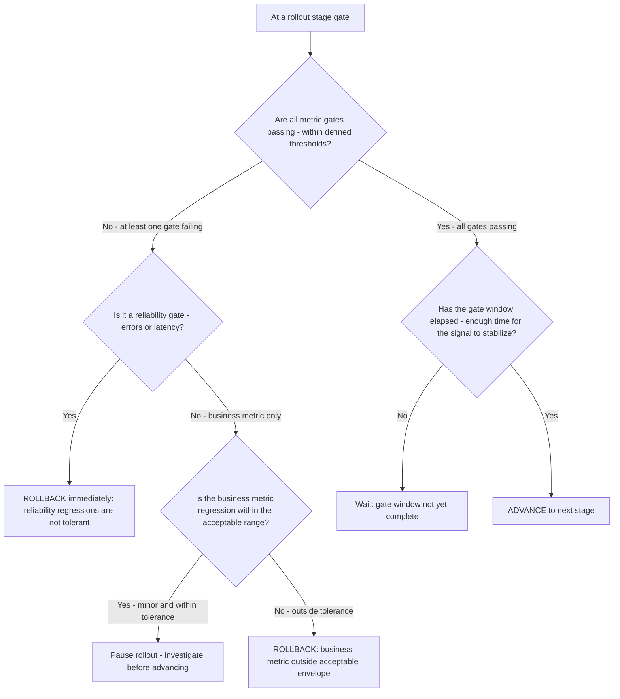
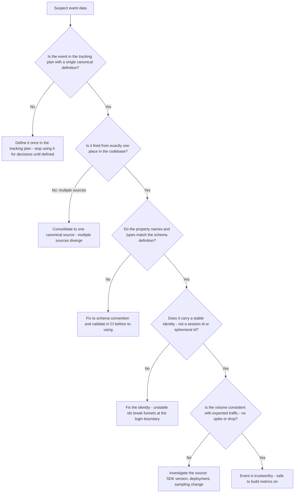

# Experimentation & Growth — Decision Trees

_Decision trees + a dated capability map. Capability rows are `[verify-at-build]` — re-check against the vendor before quoting. Last reviewed: 2026-06-04._

Traverse before reading a result or choosing a flag vs config. Significance verdicts route to applied-statistics.

## Decision Tree: Can I trust this experiment result?

Validate the plumbing before believing any metric; significance is a separate, later question for applied-statistics.

_This team certifies trustworthiness; applied-statistics certifies significance._

## Decision Tree: Feature flag vs config vs experiment?

Match the mechanism to the intent.

## Decision Tree: Ship, iterate, or kill after a test?

Only after the result is trustworthy AND significant; the apparatus certifies the former, applied-statistics the latter.

_A significant primary with a tripped guardrail is a trade for the business to make, not an automatic ship._

## Decision Tree: Fixed-horizon or sequential test?

Pick the analysis regime up front; mixing them (peeking a fixed-horizon test) is the false-positive trap.

_Either method is valid; checking a fixed-horizon test daily is not one of them._

## Decision Tree: Is this event instrumented correctly?

Before an event feeds a funnel or a metric, validate it against the tracking plan.

_Garbage events in means no analysis out; most 'our data is a mess' is a missing/ignored plan._

## Capability map (dated — verify at build)

| Capability | 2026 state `[verify-at-build]` | Notes |
|---|---|---|
| Feature-flag platforms (LaunchDarkly/Flagsmith/OSS) | GA | Targeting, kill switches, SDKs |
| CDP (Segment/RudderStack) | GA | Instrument once, fan out |
| Product analytics (Amplitude/PostHog/Mixpanel) | GA | Funnels, retention, experiments |
| SRM checks | standard practice | Catch broken assignment |
| Sequential testing | available | Valid peeking (with applied-statistics) |
| Server-side experimentation | recommended | Avoid client-side flicker/leak |

---

## Decision Tree: Concurrent experiments — how to handle overlap?

**When this applies:** Two or more experiments are being designed for the same user population, the same funnel step, or the same UI surface. Observable triggers: "can we run both tests at the same time?"; "these two experiments both touch checkout"; a product team requests simultaneous A/B tests.

**Last verified:** 2026-06-05 against standard experimentation infrastructure practice.

_Statistical design for full factorial routes to applied-statistics; this team builds the assignment plumbing._

**Rationale per leaf:**
- *Independent layers* — entirely separate surfaces have no shared context; natural mutual exclusion without traffic bucketing.
- *Mutual exclusion* — the default for shared-surface experiments: disjoint buckets, clean main effects, no interaction contamination.
- *Prioritise / serialize* — insufficient traffic for mutual exclusion means experiments are underpowered if split further; run sequentially.
- *Full factorial* — when the interaction is the point (e.g. does pricing change interact with the new checkout UX?); applied-statistics owns the design.

**Tradeoffs summary:**

| Approach | Traffic cost | Interaction handling | Complexity | Use when |
|---|---|---|---|---|
| Independent layers | None | N/A | Low | Separate surfaces |
| Mutual exclusion | 2x traffic needed | Ignored by design | Medium | Shared surface, effects expected independent |
| Serialize | None | N/A | Low | Insufficient traffic for ME |
| Full factorial | 4x traffic for 2x2 | Explicitly modelled | High | Interaction is scientifically meaningful |

---

## Decision Tree: Progressive rollout — advance, pause, or rollback?

**When this applies:** A feature is in a staged progressive rollout (e.g. 1% → 10% → 50% → 100%) and a decision must be made about whether to advance to the next stage. Observable triggers: "should we go to 50% now?"; "error rate is elevated — what do we do?"; "the rollout has been at 10% for 3 days."

**Last verified:** 2026-06-05 against standard progressive delivery practice.

_Reliability regressions are never tolerated at any stage: rollback immediately._

**Rationale per leaf:**
- *Rollback (reliability)* — a latency or error-rate regression at 1% will be 100x worse at 100%; immediate rollback is always correct.
- *Rollback (business metric)* — a conversion or revenue metric outside the defined envelope is a defect, not a tradeoff.
- *Pause and investigate* — a minor business-metric dip within tolerance may be noise; pause before advancing, diagnose before deciding.
- *Wait* — the gate window must elapse so the signal is statistically representative of sustained behaviour, not a spike.
- *Advance* — all gates passing, window elapsed: the decision is mechanical, not a judgment call.

**Tradeoffs summary:**

| Gate failure type | Action | Rationale |
|---|---|---|
| Reliability (errors/latency) | Rollback immediately | Blast radius grows linearly with traffic pct |
| Business metric outside tolerance | Rollback | The feature harms the business at scale |
| Business metric minor dip | Pause and investigate | May be noise; don't advance until understood |
| All gates pass, window elapsed | Advance | Mechanical decision; no judgment needed |
| Gate window not elapsed | Wait | Signal may not be stable yet |

---

## Decision Tree: Event instrumentation triage — is this event trustworthy?

**When this applies:** An event is being used in a funnel, a retention model, or an experiment metric calculation, and its trustworthiness is in question. Observable triggers: "our funnel numbers don't add up"; "this event count dropped 30% overnight"; "two teams are tracking different numbers for the same step."

**Last verified:** 2026-06-05 against standard product analytics data quality practice.

_Each 'No' branch is a root cause to fix before the event feeds any analysis._

**Rationale per leaf:**
- *Not in tracking plan* — an undocumented event has no owner, no schema, and no version history; it cannot be trusted.
- *Multiple sources* — divergent implementations produce divergent counts; consolidate to eliminate the contradiction.
- *Schema mismatch* — a type change (string → integer) silently breaks downstream queries; fix first.
- *Unstable identity* — session ids or ephemeral ids produce inflated unique-user counts and broken funnels.
- *Unexpected volume* — a sudden count change signals a deployment, SDK, or sampling change; investigate before attributing to user behaviour.
- *Trustworthy* — all five conditions satisfied; the event is safe to use as a metric numerator.
