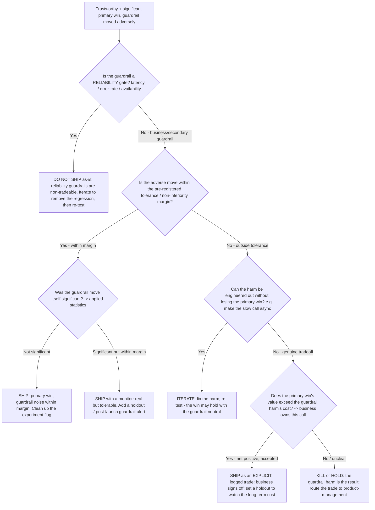

# Ship / iterate / kill on a guardrail breach — decision tree

_A focused, standalone Mermaid tree that drills into the **one node** the high-level "Ship, iterate, or kill after a test?" tree (in [`experimentation-growth-engineering-decision-trees.md`](experimentation-growth-engineering-decision-trees.md)) only touches: a primary-metric win with a tripped guardrail. That tree's leaf says "not a win — the guardrail harm is the result"; this tree expands the **trade decision** behind that leaf. Significance verdicts on either metric route to `applied-statistics`._

_Last reviewed: 2026-06-05 against standard trustworthy-online-experiment practice (guardrail / non-inferiority metric discipline)._

## When this applies

A test has **passed the trustworthiness gate** (SRM clean, exposure logged, no peeking — see the "Can I trust this result?" tree) **and** `applied-statistics` has returned a **significant primary-metric win**, but a **guardrail metric moved adversely**. Observable triggers: "the primary won but latency went up"; "add-to-cart is up but revenue-per-session is flat/down"; "do we ship despite the guardrail dip?"

This tree does **not** re-decide trustworthiness or significance — it assumes both are settled. It decides the **trade**.

_Reliability guardrails (latency/errors/availability) are effectively never traded for a conversion win — they sit on the left branch and force an iterate. Business guardrails (revenue-per-session, retention, support load) are tradeable only as an **explicit, logged** business decision, never a silent ship._

## Rationale per leaf

- **Reliability gate breached (C)** — a latency/error regression compounds with traffic and harms every downstream metric; it is non-tradeable. Iterate (often the harm is an engineering artifact like a synchronous call) and re-test, don't ship the trade.
- **Within tolerance + not significant (F)** — the guardrail "move" is noise inside the pre-registered margin; the primary win stands, ship and clean up the flag.
- **Within tolerance + significant (G)** — a real but tolerable cost; ship, but add a post-launch monitor / holdout because "within margin today" can drift.
- **Outside tolerance, harm engineerable (I)** — the most common good outcome: the guardrail harm is incidental (e.g. an extra blocking call) and can be removed without touching the primary lever. Iterate and re-test.
- **Outside tolerance, genuine trade, net positive (K)** — the win is worth the cost, but the business — not the experiment owner — makes and **logs** the call, with a holdout to track whether the long-term cost matches the estimate.
- **Outside tolerance, not net positive / unclear (L)** — the high-level tree's leaf: the guardrail harm IS the result. Kill or hold; route the trade framing to `product-management`.

## Tradeoffs summary

| Guardrail type | Within tolerance? | Engineerable? | Disposition |
|---|---|---|---|
| Reliability (latency/errors) | — | — | Iterate (non-tradeable); never ship the regression |
| Business/secondary | Yes (noise) | — | Ship; clean up flag |
| Business/secondary | Yes (real, significant) | — | Ship + monitor / holdout |
| Business/secondary | No | Yes | Iterate: remove the harm, re-test |
| Business/secondary | No | No, net positive | Ship as explicit logged business trade + holdout |
| Business/secondary | No, not net positive | No | Kill / hold; route trade to product-management |

## Seams

- **Significance of the primary OR the guardrail move** → `applied-statistics`. This tree assumes both are already settled.
- **The trade's business value vs. cost** → `product-management` (we frame the trade with clean metric data; they own the yes/no).
- **The long-term cost watch** → a holdout group (see [`../best-practices/holdout-group-for-long-term-effects.md`](../best-practices/holdout-group-for-long-term-effects.md)).
- **The reliability guardrail thresholds themselves** → `observability-sre` sets the SLOs; we enforce them as experiment gates.

## Sources (retrieved 2026-06-05)

- Guardrail / non-inferiority metric discipline is standard trustworthy-online-experiment practice (Kohavi, Tang & Xu, *Trustworthy Online Controlled Experiments*, 2020) `[unverified — training knowledge; offered as the canonical reference, re-confirm at use]`.
- The reliability-never-tradeable and progressive-rollback logic is consistent with the dated progressive-delivery practice already cited in [`experimentation-growth-engineering-decision-trees.md`](experimentation-growth-engineering-decision-trees.md) ("Progressive rollout — advance, pause, or rollback?", verified 2026-06-05).
