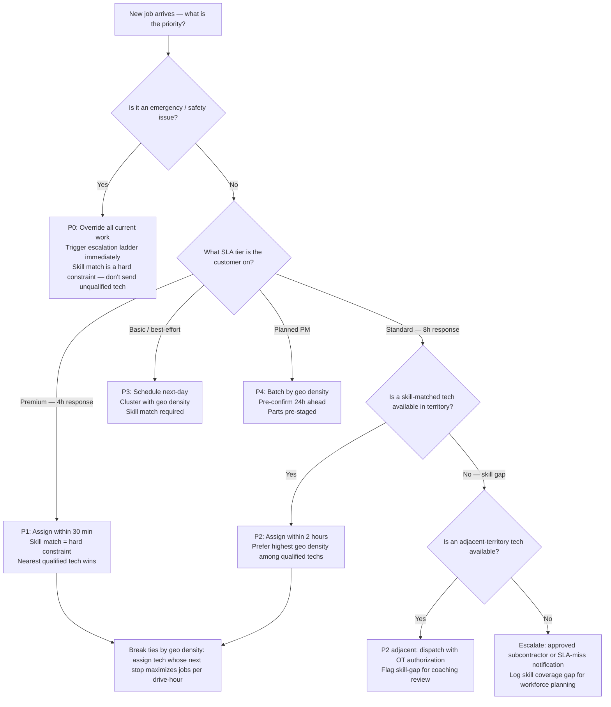
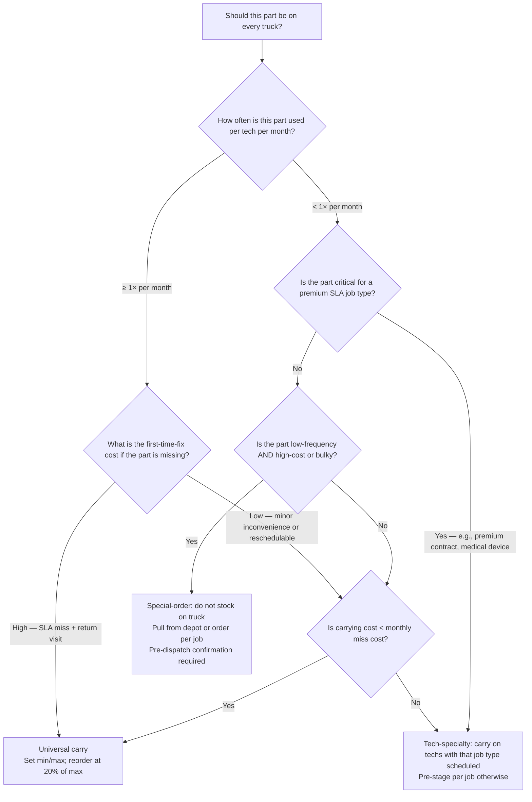
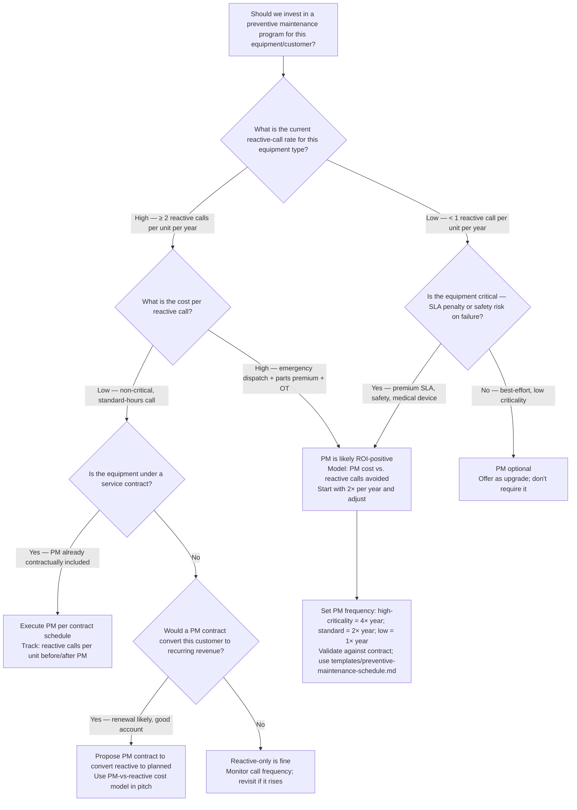

# Field-Service Management — Decision Trees + 2026 Capability Map

> Canonical knowledge bank for `field-service-management`. **Traverse the relevant Mermaid tree
> top-to-bottom before choosing** — the proactive complement to the Capability Grounding Protocol.
> Volatile product/version facts in the capability map carry a retrieval date and a re-verify-at-use
> rider.

---

## Decision Tree: Schedule Priority (SLA tier → skill match → geo density)

**Leaf rule:** skill match is always a hard constraint — dispatching an unqualified technician
does not clear the SLA; it creates a callback and a customer-satisfaction miss. After skill match,
break ties with geographic density (jobs per drive-hour), not by who is "next in the queue."

---

## Decision Tree: Stock the Part or Not

**Leaf rule:** every truck-stock decision must state the service-level target it is designed to
meet. Removing a part from truck stock without modeling the first-time-fix fill-rate impact is not
a cost optimization — it's a blind tradeoff. Use `scripts/fsm_calc.py` `truck_stock_fill_rate()`
to quantify fill-rate changes before recommending add or remove.

---

## Decision Tree: PM vs. Reactive Dispatch

**Leaf rule:** before cutting PM visit frequency to reduce cost, model the reactive-call increase
that follows. PM converts reactive cost (emergency dispatch premium + parts premium + overtime
+ SLA penalty risk) into planned cost. The break-even is typically 1.5–2 avoided reactive calls
per PM cycle, depending on the equipment type.

---

## 2026 Capability Map — FSM Platform Landscape (dated, re-verify at use)

_Retrieved 2026-06-08. Product positioning and pricing are volatile — re-confirm at use; this is
orientation, not a procurement recommendation. [verify-at-use]_

| Category | Options (2026) | Notes |
|---|---|---|
| **SMB field-service platforms** | **ServiceTitan** — dominant in HVAC/plumbing/electrical SMB; strong dispatch board, mobile app, flat-rate pricing, financing integrations | High per-seat cost; best fit for businesses doing > $2M revenue with complex dispatch needs [verify-at-use] |
| **Mid-market / enterprise FSM** | **Salesforce Field Service** (formerly FieldService Lightning) — part of the Salesforce ecosystem; strong for enterprises already on Salesforce CRM | Deep CRM integration; higher implementation cost; best when service is part of a larger enterprise workflow [verify-at-use] |
| **Industrial / complex assets** | **IFS Field Service Management** — strong for asset-intensive industries (elevators, medical devices, utilities); handles complex service contracts, warranty, and depot repair | Best for OEM service orgs and complex multi-location asset portfolios [verify-at-use] |
| **Small / regional service** | **FieldEdge** — HVAC/plumbing/electrical focus; lower cost than ServiceTitan; strong flat-rate pricing and dispatch board for smaller fleets | Good fit for 2–15 technician operations; fewer advanced analytics than ServiceTitan [verify-at-use] |
| **Scheduling optimization** | **Skedulo**, **Jobber** (SMB), **ServiceMax** (Salesforce-native enterprise) — specialized scheduling and mobile-workforce tools | ServiceMax overlaps with IFS in industrial; Jobber is lightweight for sole-proprietor/small-team [verify-at-use] |
| **Route optimization** | **OptimoRoute**, **Route4Me**, **Onfleet** — pure route/territory optimization tools that integrate with FSM platforms | Used as add-ons when the core FSM's routing is insufficient for high-density fleets [verify-at-use] |

> Provenance: platform positioning based on industry analysis and vendor documentation available
> as of 2026-06-08; market shares and feature sets are volatile — re-verify at procurement.
> No invented products. [verify-at-use]

---

## See also

- [`../CLAUDE.md`](../CLAUDE.md) — team constitution and seams.
- [`../best-practices/README.md`](../best-practices/README.md) — the 6 named, citable rules.
- [`../scripts/fsm_calc.py`](../scripts/fsm_calc.py) — calculator for utilization, first-time-fix,
  MTTR, route density, SLA attainment, and truck-stock fill rate.

_Last reviewed: 2026-06-08 by `claude`._
