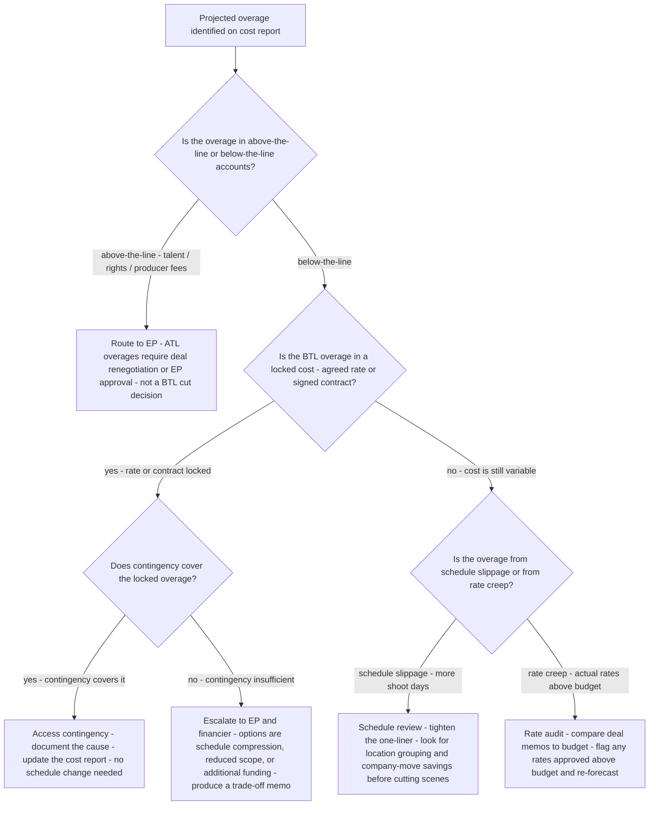
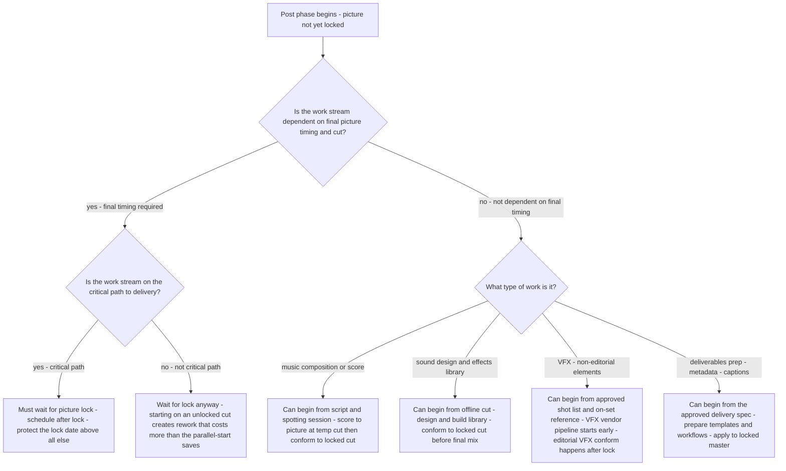
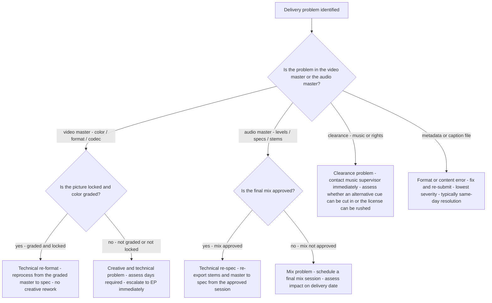

# Production decision trees

Which analysis for which symptom — traverse top-to-bottom before picking a method.

## Decision Tree: Can we make this for the budget?

1) Define the deliverable spec (§3 #6). 2) Build the top-sheet (§3 #1). 3) Schedule to shoot days (§3 #2). 4) Size contingency to risk (§3 #4).

## Decision Tree: Will we deliver on time?

1) Map the post dependency chain (§3 #3). 2) Protect picture lock (§3 #5). 3) Find the critical path.

## Decision Tree: Are we going over?

1) Track cost vs bid (§3 #4). 2) Watch contingency burn. 3) Forecast overage exposure.

## How to read these trees

Traverse top-to-bottom and stop at the first matching branch — the order encodes the cheap-checks-before-expensive-checks discipline (§3). Each leaf names a skill, a specialist, or a house-opinion to apply. Never skip a higher branch because a lower one looks more interesting; a denominator, seasonal, or definitional artifact masquerades as a finding more often than not.

## Decision Tree: Which skill for which task

- **Build the top-sheet budget** → use when: Build the budget bottom-up to a top-sheet with a risk-sized contingency, so the number is defensible. ([`../skills/build-the-top-sheet/SKILL.md`](../skills/build-the-top-sheet/SKILL.md))
- **Schedule the shoot** → use when: Schedule to shoot days, locations, and cast availability with company moves and turnaround, not the calendar. ([`../skills/schedule-the-shoot/SKILL.md`](../skills/schedule-the-shoot/SKILL.md))
- **Sequence the post pipeline** → use when: Sequence post as a dependency chain keyed off picture lock, so the delivery date rests on the critical path. ([`../skills/sequence-the-post-pipeline/SKILL.md`](../skills/sequence-the-post-pipeline/SKILL.md))
- **Define the deliverables** → use when: Define the delivery spec (formats, masters, captions, QC) first, since it's the actual product. ([`../skills/define-the-deliverables/SKILL.md`](../skills/define-the-deliverables/SKILL.md))
- **Track cost vs bid** → use when: Track cost against the bid line by line and watch contingency burn, so overage is managed not discovered. ([`../skills/track-cost-vs-bid/SKILL.md`](../skills/track-cost-vs-bid/SKILL.md))

## Decision Tree: Which specialist owns this

- **The engagement** → [`production-lead`](../agents/production-lead.md)
- **The day** → [`line-producer`](../agents/line-producer.md)
- **Post** → [`post-production-supervisor`](../agents/post-production-supervisor.md)
- **The numbers** → [`production-finance-analyst`](../agents/production-finance-analyst.md)

When two leaves apply, route to the **lead** first to scope and sequence — overlapping symptoms usually mean two drivers at once, and the lead keeps the analysis from collapsing into a single-cause story.

## Decision Tree: Which house-opinion gates the call

Before picking any method, check whether one of the standing biases (§3) already decides the framing:

1. Budget to a top-sheet with a real contingency — if this is in question, apply §3 #1 before any method.
2. Schedule to the shoot day, not the calendar — if this is in question, apply §3 #2 before any method.
3. Post is a dependency chain — sequence it, don't parallelize blindly — if this is in question, apply §3 #3 before any method.
4. Contingency and overage are managed, not hoped — if this is in question, apply §3 #4 before any method.
5. Locked picture is the gate everything downstream waits on — if this is in question, apply §3 #5 before any method.
6. Deliverables and specs are the actual product — define them first — if this is in question, apply §3 #6 before any method.
7. Crew, gear, and location costs are rate × time × risk — build them up — if this is in question, apply §3 #7 before any method.
8. Date and source any rate, union, or market figure — if this is in question, apply §3 #8 before any method.

## Escalation & guardrails

- Anything touching client PII / regulated records → stop and route to `ravenclaude-core` `security-reviewer`.
- Any external figure entering a deliverable → carry a source URL + retrieval date, or mark it `[unverified — training knowledge]` / `[ESTIMATE]` (§3, final house opinion).
- A recommendation ships only with an owner, a date, and an expected metric movement.
## Sourcing note

Figures in this file are from the author's domain knowledge and are marked `[unverified — training knowledge]` or `[ESTIMATE]` at point of use. Validate against a primary source before putting any figure in a client deliverable (§3 cite-or-mark rule).

## Decision Tree: Budget Overage — Classify Before Cutting

**When this applies:** The cost report shows a projected overage against the bid. The line producer and production finance analyst need to identify the overage class before deciding whether to cut the schedule, access contingency, or request additional funding.

**Last verified:** 2026-06-05 against production finance and cost-reporting practice.

**Rationale per leaf:**
- *ATL route to EP* — ATL costs are set by negotiated deals; a line producer cutting BTL to offset ATL overage is spending from the wrong budget and creating a false picture.
- *Access contingency* — a locked-cost overage with contingency coverage is the system working as designed; document and move on.
- *Escalate to EP* — when contingency is exhausted, the decision is strategic and belongs above the line producer's authority.
- *Schedule review* — schedule-driven overages are often recoverable by re-sequencing; cutting scenes is the last resort, not the first.
- *Rate audit* — rates above budget are a paperwork problem first; confirm the deal memos before assuming the overage is real.

**Tradeoffs summary:**

| Method | Cost / time | Blast radius | Approval gate? | Use when |
|---|---|---|---|---|
| Contingency draw | Immediate | Reduces future buffer | Line producer | Locked cost exceeds budget - contingency sufficient |
| Schedule compression | 1-2 days re-scheduling | Crew fatigue risk | UPM + director | Overage is from schedule slip - scenes can be tightened |
| Scope reduction | Creative impact | Deliverable affected | EP + director | Contingency exhausted - schedule cannot compress further |
| Additional funding request | Weeks - financier approval | Investor / studio relationship | EP + financier | All internal options exhausted |

## Decision Tree: Post Pipeline — What Can Start Before Picture Lock

**When this applies:** The post-production supervisor is planning the post schedule and needs to determine which work streams can begin in parallel before picture lock, and which must wait for it.

**Last verified:** 2026-06-05 against standard post-production dependency-chain practice.

**Rationale per leaf:**
- *Critical path waits for lock* — color, conform, and final sound mix all key off picture lock; starting before lock produces rework that costs more than the saved lead time.
- *Non-critical also waits* — starting online editorial on an unlocked cut is a common mistake; the rework is expensive and the time savings are illusory.
- *Music from script* — composers can begin thematic development and score to a temp cut; they conform to the locked cut in the final scoring pass.
- *Sound design early* — sound effects and design work is largely timing-independent and can be built to the scene; only the final mix requires the locked picture.
- *VFX pipeline early* — 3D build, simulation setup, and asset development happen independently of editorial timing; shot-specific VFX only conforms at lock.
- *Deliverables prep early* — metadata templates, caption workflows, and QC checklists are format-dependent, not cut-dependent; prepare the pipeline, apply it to the locked master.

**Tradeoffs summary:**

| Work stream | Can start before lock? | Risk if started early | Recover how? |
|---|---|---|---|
| Online conform and color | No | High rework - full re-conform | Wait for lock |
| Final sound mix | No | High rework - full re-mix | Wait for lock |
| Music composition | Yes - from script/temp | Minor - conform pass needed | Scoring session on locked cut |
| Sound design library | Yes - from offline cut | Minor - re-sync at lock | SFX conform pass |
| VFX pipeline setup | Yes - from shot list | Minimal if no cut changes | Shot-level conform |
| Delivery metadata and captions | Yes - from delivery spec | None - reapply to master | Apply templates to locked file |

## Decision Tree: Delivery Problem — Diagnose Before Panicking

**When this applies:** The production is approaching a delivery deadline and a problem has been identified — a deliverable is not ready, a spec is not met, or the distributor has flagged a QC issue. The post supervisor needs to triage the problem before deciding whether to push the deadline, fix the deliverable, or escalate.

**Last verified:** 2026-06-05 against post-production delivery and QC practice.

**Rationale per leaf:**
- *Technical re-format* — a format or codec mismatch on an approved master is a pipeline problem, not a creative one; re-processing is usually same-day.
- *Creative and technical* — an unlocked picture with a delivery problem is the worst-case scenario; the line producer needs to know immediately to assess whether the deadline is achievable.
- *Technical re-spec for audio* — an approved mix that misses delivery specs (loudness, format) is re-exported from the session, not re-mixed; usually same-day.
- *Mix problem* — an unapproved mix before delivery means the mix was not on the critical-path schedule; find and fix the schedule failure.
- *Clearance problem* — music that cannot be cleared blocks delivery; the music supervisor needs immediate authority to find an alternative and cut it in before the delivery date.
- *Metadata/caption error* — format errors in metadata or caption files are the most fixable delivery problem; address them first to confirm the residual problem.

**Tradeoffs summary:**

| Problem type | Resolution time | Decision authority | Escalate? |
|---|---|---|---|
| Format/codec mismatch on graded master | Same day | Post supervisor | No - handle and notify |
| Unlocked or ungraded video | Days to weeks | EP + director | Yes - immediately |
| Audio re-spec from approved mix | Same day | Post supervisor | No |
| Unapproved final mix | Days | Post supervisor + EP | Yes |
| Unclearable music cue | 1-3 days with alternatives | Music supervisor + director | Yes - immediately |
| Metadata/caption error | Hours | Post supervisor | No |
