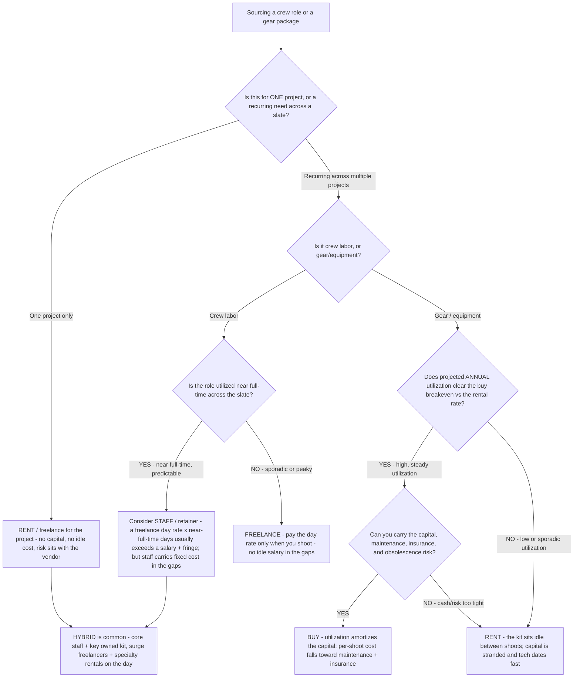

# Production resourcing decision tree — in-house crew/gear vs. rent/hire vs. buy

**Last reviewed:** 2026-06-05 · **Confidence:** medium (production-economics cost-framing + budgeting-convention sources, web-verified this date). Day rates, kit fees, rental rates, and utilization figures are market-, vendor-, and project-dependent — they carry inline `[verify-at-use]` / `[ESTIMATE]` markers and must be validated against the project's actual quotes and shoot-day count before any deliverable (CLAUDE.md section 3 #8).

> Canonical decision tree for the `line-producer` (the day — crew/gear) with a finance assist from `production-finance-analyst` (the breakeven). Traverse top-to-bottom **before** committing a resource as staff-vs-freelance or rent-vs-buy. The decision is **not** "owning is cheaper" — it is a **utilization + cash + risk** trade, and the right answer is usually **rent for the project** unless utilization across projects clears the buy breakeven. This is decision-support for the producer, not a procurement order (CLAUDE.md section 2).

---

## When this applies

A line producer is deciding how to source a resource — a key crew role, a camera/lighting/grip package, an edit suite — for a project or a slate. Common triggers: a gear-purchase pitch ("buy the camera, it pays for itself"), a staff-vs-freelance call on a recurring role, or a budget review on a recurring rental line.

## The tree



## Rationale per leaf (cash-light → capital-heavy)

- **Rent/freelance for one project** — the default. A single project rarely justifies capital or a salary; renting puts the maintenance, insurance, and obsolescence risk on the vendor and keeps the budget variable (it scales down if the shoot shrinks). Build it as rate × time × risk (CLAUDE.md section 3 #7).
- **Staff a recurring, near-full-time role** — a freelance day rate paid across near-full-time days usually exceeds a salary + fringe, so a *predictably busy* role can be cheaper as staff. But staff is **fixed cost** — you pay it in the gaps between projects, so it only wins when utilization is genuinely high and steady. Model the gap weeks honestly.
- **Freelance a sporadic role** — when the need is peaky or unpredictable, the day rate paid only on shoot days beats a salary that runs through the idle weeks.
- **Buy gear only when utilization clears the breakeven AND you can carry the risk** — owning replaces a per-shoot rental with amortized capital + maintenance + insurance, and camera/lighting tech **dates fast**, so an underused purchase strands capital *and* depreciates. Buy only when annual utilization is high and steady enough to amortize, and the production can carry the cash, upkeep, and obsolescence risk.
- **Hybrid (the usual answer)** — core staff + a few owned workhorse items (the kit you use on every job), with surge crew freelanced and specialty gear rented per shoot. Most production companies land here.

## The economic test (the load-bearing arithmetic)

Buying gear is justified when, **at projected annual utilization**, the amortized owned cost beats renting:

```
owned per-shoot-day cost = (purchase price / amortization days) + maintenance/day + insurance/day
```

If `rental day rate < owned per-shoot-day cost` at your real utilization, rent. The variable that flips the answer is **utilization** — capital spreads thin only when the kit actually works. The same logic governs staff-vs-freelance: `salary + fringe` vs `day rate × utilized days`; the break is the **idle-day count**, not the headline day rate.

## Gotchas

- **"It pays for itself" assumes the vendor's utilization, not yours** — re-run the breakeven on *your* projected shoot-day count, not the rental house's (`[verify-at-use]`).
- **Obsolescence is a real cost for gear** — a camera body two generations old rents for less and resells for less; fold depreciation into the amortized cost, not an afterthought.
- **Staff in the gaps is fixed cost** — a staffed role you can't keep busy between projects is a salary you pay for idle weeks; model the gap weeks, not just the shoot weeks.
- **Build crew/gear as rate × time × risk** (CLAUDE.md section 3 #7) — a day rate without kit fee, overtime exposure, and turnaround assumptions understates the real cost on the day; see [`../skills/build-the-top-sheet/SKILL.md`](../skills/build-the-top-sheet/SKILL.md).
- **Insurance + maintenance ride with ownership** — owned gear carries an ongoing insurance and upkeep obligation a rental folds into its day rate; don't model owned kit as free between shoots.

## Escalation & guardrails

- A capital-financing structure for a gear purchase, or the salary-vs-fringe modeling → [`production-finance-analyst`](../agents/production-finance-analyst.md).
- Employment-classification specifics (staff vs contractor, union obligations) → out of scope; route to the production's legal/payroll counsel (the team is not a union/legal authority, CLAUDE.md section 2).
- Every figure entering a deliverable carries a source URL + retrieval date or an `[unverified — training knowledge]` / `[ESTIMATE]` mark (CLAUDE.md section 3 #8).

## Sources (retrieved 2026-06-05)

- Saturation.io — *Film Budget Breakdown by Department* (BTL build-up, crew/gear as rate × time): https://saturation.io/blog/film-budget-breakdown-by-department
- First Draft Filmworks — *Complete Guide to Film Budget Format (2026)* (budget structure, rent-vs-buy framing): https://firstdraftfilmworks.com/blog/complete-guide-to-film-budget-format-expert-tips-for-creating-production-budgets-in-2026/
- The Filmmaker's Production Bible — *How to budget fringes & payroll fees* (salary + fringe vs day-rate framing): https://www.filmmakersproductionbible.com/how-to-budget-fringes-payroll-fees-and-avoid-unexpected-surprises/
