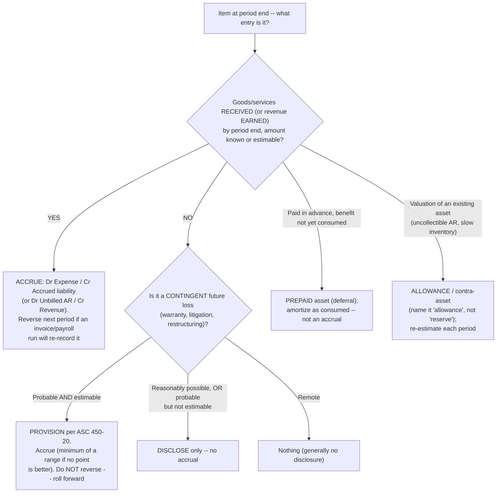
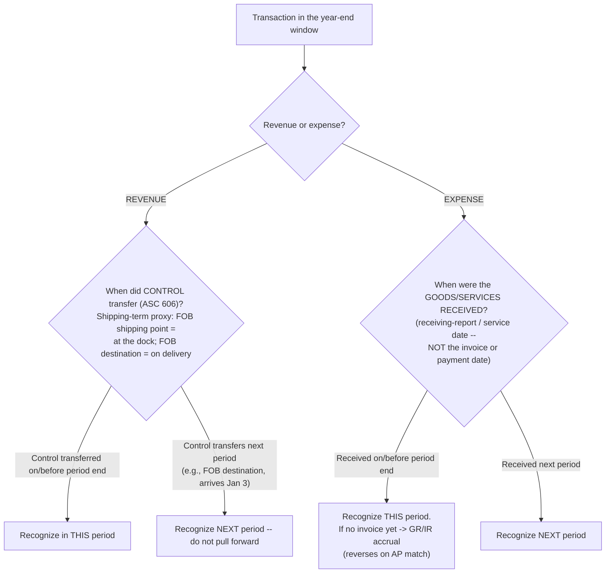

# Accrual & cutoff discipline — recording the right thing in the right period

> **Last reviewed:** 2026-06-04. Source: this plugin's deep-research synthesis [`../../../docs/research/2026-06-04-finance-domain-depth/accrual-cutoff-discipline.md`](../../../docs/research/2026-06-04-finance-domain-depth/accrual-cutoff-discipline.md), built from the FASB conceptual framework (CON 8), ASC 450 (contingencies), ASC 606 (revenue control transfer), SEC EDGAR correspondence on "reserve" terminology, and audit-assertion + controllership references. Refresh when (a) the revenue or contingency standards change in a way that shifts what counts as a current-period transaction, or (b) an engagement surfaces a fact pattern not covered. This is controllership craft cross-checked against the standards — confirm against current GAAP for a live close.

Two recurring close failures both come down to **period and substance**: booking something in the wrong month (a cutoff error), or booking the wrong *kind* of thing (an accrual where a provision belongs, a "reserve" no one can define, a reversing accrual left unreversed). Both erode the trust in the numbers FP&A then narrates — which is why this plugin's house rule is **reconcile before you narrate**: variance commentary on an account that hasn't been reconciled describes bookkeeping noise, not business performance. The trees below resolve "what kind of entry is this?" and "does it belong in this period?" Traverse them before posting.

A **proper accrual** clears two gates: (1) the **obligating event has occurred on or before period end** (goods received, service performed, wage earned), and (2) the amount is **reasonably estimable**. If the obligation exists and you already hold the invoice, it's a **payable**, not an accrual. If neither the event nor a reliable estimate exists, you do nothing (possibly disclose a contingency). `[high]`

---

## Decision Tree: Close — accrual vs. provision vs. prepaid vs. reserve vs. nothing

**When this applies:** an item is sitting at period end and you must decide what entry (if any) it is. Getting the *kind* wrong is as damaging as getting the period wrong — it determines whether the entry reverses, rolls forward, or shouldn't exist.

**Last verified:** 2026-06-04 against ASC 450-20 (probable + reasonably estimable; accrue the minimum of a range) and the FASB conceptual framework, corroborated across PwC Viewpoint 23.4, Deloitte DART, and SEC EDGAR correspondence on "reserve."

**Rationale per leaf:**

- _ACCRUE_ — a **true (reversing) accrual** is a placeholder for something settled and separately recorded shortly (received-not-invoiced goods, accrued payroll). Set the **auto-reversal flag** so the actual invoice posts cleanly next period with no double-count. `[high]`
- _PROVISION (ASC 450)_ — a loss contingency is accrued only when **probable** (read in practice as "significantly more than 50% / likely"; the codification assigns no explicit percentage) **and reasonably estimable**; when a range is estimable but no point is better, **accrue the minimum**. A provision does **not** reverse — it's **rolled forward** and re-measured. `[high]`
- _DISCLOSE / NOTHING_ — reasonably possible (or probable-but-not-estimable) → disclose, don't accrue; remote → generally nothing. `[high]`
- _PREPAID_ — a future benefit paid in advance is a deferral (asset), not an accrual; amortize as consumed. `[high]`
- _ALLOWANCE_ — a valuation of an existing asset is a contra-asset re-estimated each period. **Name it "allowance," not "reserve."** The SEC and the profession discourage "reserve" — it's undefined in authoritative literature and misleads readers into thinking cash was set aside. `[high]`

**The distinction practitioners must hold:** a **reversing accrual** (re-recorded next period from a source document) gets the auto-reversal flag; a **standing estimate** (provision, allowance, non-reversing accrual) goes on the **roll-forward** and is trued up. Leaving a reversing accrual unreversed **double-counts** the expense; auto-reversing a standing estimate **understates** the liability. `[high]`

---

## Decision Tree: Close — cutoff (does this transaction belong in this period?)

**When this applies:** a transaction sits in the year-end window (the last few days of the period and the first few of the next) and you must place it in the correct period. Cutoff is the temporal edge of two assertions — **completeness** (nothing left out → understatement risk, mostly expenses/liabilities) and **occurrence** (nothing pulled forward → overstatement risk, mostly revenue).

**Last verified:** 2026-06-04 against ASC 606-10-25-30 (point-in-time control indicators) and audit cutoff-testing references (Aurora Financials, maxwellcpareview, KPM).

**Cutoff testing & directionality** (the practitioner subtlety): test **occurrence** by starting *from the books* and vouching back to a real shipment/receipt (catches pulled-forward/fictitious entries → overstatement); test **completeness** by starting *from real-world evidence* (shipping log, receiving log) and tracing *into* the books (catches omissions → understatement). A December revenue entry whose bill of lading is dated January is an **occurrence failure** (overstatement); a Dec-28 receiving report with no accrual is a **completeness failure** (understatement). `[high]`

---

## Common cutoff errors

- **Revenue (overstatement / occurrence — the high-fraud-risk side):** **holding the books open** (early-January shipments booked in December to hit a target); **channel stuffing** (over-shipping distributors near period end, often with side agreements / extended return rights so control never really transferred — the tell is a late-period sales spike followed by early-next-period returns); **FOB-term misapplication** (booking FOB-destination at shipment). `[high]`
- **Expense (understatement / completeness):** **failing to accrue received-not-invoiced (GR/IR)** — a stale, unreconciled GR/IR balance is a classic audit finding; **"period 13" / soft-close** used as a dumping ground for missed accruals; **capitalizing what should be expensed** to defer expense. `[high]` / `[unverified — training knowledge]`

---

## How this ties to reconciliation discipline

A cutoff/accrual figure is only as trustworthy as the reconciliation behind it. The controllership sequence: **(1) subledger-to-GL tie-out** (each control account agrees to its subledger; differences are defined reconciling items, not plugs); **(2) accrual roll-forward** (`opening + additions − releases/utilization = closing`, starting from what was proved last month, with estimates trued up when the actual invoice arrives); **(3) review/sign-off with segregation of duties** (preparer proposes, a separate reviewer approves/posts; certification = sign-off + attached support + retained audit trail). `[high]`

> **Cutoff governance rule:** no accrual or revenue cutoff entry is "done" until (a) it traces to a source document on the correct side of the boundary, (b) the affected control account ties to its subledger, (c) reversing items carry the auto-reversal flag and standing items sit on the roll-forward, and (d) a second person has signed off. Narrate the variance to FP&A *after* that — never before.

This is the upstream gate for variance commentary: see [`variance-root-cause-triage.md`](./variance-root-cause-triage.md), whose first node is "was the account reconciled?" — if not, commentary is deferred to `controller`.

---

## When to escalate

- **An unreconciled account or an open GR/IR balance blocking commentary** → `controller` (this plugin) before any variance narrative ships.
- **A revenue-recognition / control-transfer judgment (ASC 606) at the boundary** → `controller` (this plugin); a complex multi-element or principal-vs-agent question warrants a technical-accounting read.
- **A loss-contingency provision with legal exposure (litigation, environmental, restructuring)** → `controller` flags; `regulatory-compliance` for a regulated entity; legal counsel for the probability/estimability judgment (the agents flag, the Team Lead routes).
- **The variance story for FP&A or the board** → `fpa-analyst` / `board-pack-composer` (this plugin), *after* reconciliation.

---

## Citations / sources

Full synthesis with inline confidence tags and source URLs: [`../../../docs/research/2026-06-04-finance-domain-depth/accrual-cutoff-discipline.md`](../../../docs/research/2026-06-04-finance-domain-depth/accrual-cutoff-discipline.md) (retrieved 2026-06-04). Anchored on the FASB conceptual framework (CON 8), ASC 450-20 (loss contingencies — probable + reasonably estimable, minimum of a range), ASC 606-10-25-30 (point-in-time control indicators), and SEC EDGAR correspondence discouraging "reserve," corroborated across PwC Viewpoint, Deloitte DART, and audit-assertion references. One source (`accountinginsights.org`) returned HTTP 403 on fetch and is cited from the search excerpt; the "period 13" and capitalization-at-cutoff points are tagged `[unverified — training knowledge]` in the research and rest on common ERP practice rather than an independent source this pass.
