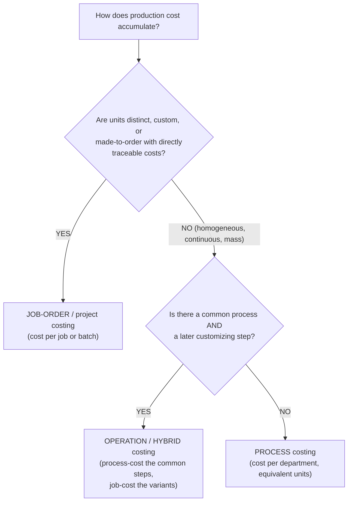
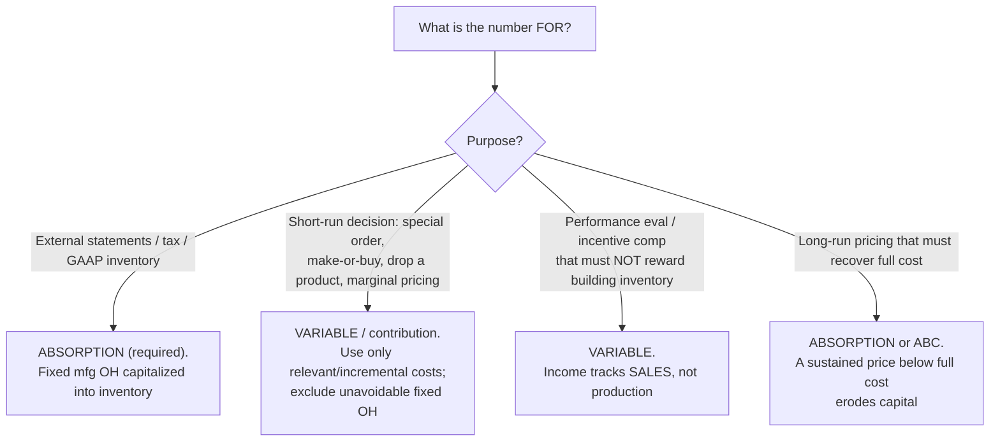
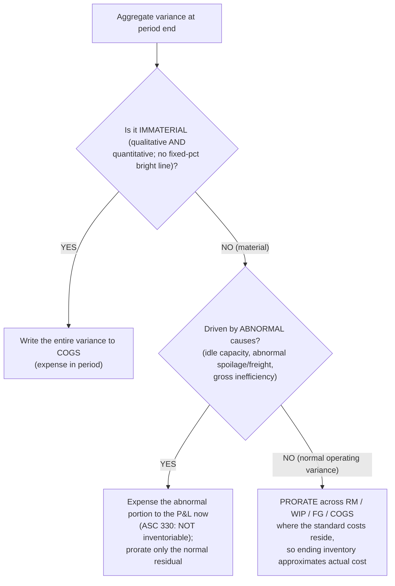

# Cost accounting — keep the GAAP ledger and the decision ledger separate

> **Last reviewed:** 2026-06-04. Source: this plugin's deep-research synthesis [`../../../docs/research/2026-06-04-finance-domain-depth/cost-accounting.md`](../../../docs/research/2026-06-04-finance-domain-depth/cost-accounting.md), built from the FASB ASC codification (330 inventory, ASU 2015-11 LCM→LCNRV), KPMG/RSM GAAP-vs-IFRS comparisons, and the managerial-accounting canon (OpenStax, LibreTexts, AccountingCoach, CFI, AccountingTools). Refresh when (a) an ASU revises inventory measurement, or (b) an engagement surfaces a fact pattern not covered. Codified claims (ASC 330, ASU 2015-11) are confirmed against the standard; managerial mechanics are stable textbook canon. Confirm against current GAAP for a live deliverable.

Cost accounting does two jobs with shared machinery but different masters, and the recurring failure is letting one frame leak into the other:

- **Inventory costing for external reporting** — governed by **ASC 330** (IFRS: IAS 2). **Absorption (full) costing is mandatory**; the number must be defensible to auditors and the SEC. `[high]`
- **Managerial / decision costing** — governed by relevance and judgment, not a standard. Variable costing, contribution margin, ABC, and CVP live here; they are *internal-only* and may freely diverge from the GAAP inventory number. `[high]`

Shipping variable-costing inventory to the balance sheet is a GAAP violation; feeding fully-absorbed unit cost (with allocated fixed overhead) into a make-or-drop decision is a relevance error. Keep the two ledgers of thought separate. The three trees below resolve the costing-method choice, the absorption-vs-variable choice, and variance disposition.

---

## Decision Tree: Cost — which product-costing system (job vs process vs hybrid)

**When this applies:** you are designing or reviewing how production cost accumulates. The choice is dictated by **product heterogeneity and cost-traceability**, not by industry label — and it is **orthogonal** to the cost-measurement basis (actual/normal/standard) and the cost-flow assumption (FIFO/weighted-average/LIFO). Don't conflate the three axes.

**Last verified:** 2026-06-04 against AccountingTools / OpenStax / LibreTexts managerial-accounting canon.

**When to move to ABC:** activity-based costing replaces a single volume-based allocation with multiple cost pools, each drained by its own driver. Its payoff rises with **product-mix diversity**, a **high and growing overhead-to-direct-labor ratio**, and **batch/complexity costs that don't scale with volume**. A plantwide volume rate on a diverse mix **cross-subsidizes** — high-volume simple products are over-costed, low-volume complex products under-costed. ABC is *not* worth it when overhead is small or products are homogeneous; Time-Driven ABC (TDABC) cuts the maintenance cost but carries its own time-equation estimation error. `[high]`

> **The death-spiral trap:** allocating *idle/unused* capacity into product cost raises unit cost → price rises or the product looks unprofitable → volume drops → more idle capacity → unit cost rises again. Cost products at the **practical-capacity rate** and route unused-capacity cost to a **period expense**, not onto the survivors. (This is the same principle ASC 330 codifies — see §normal capacity.) `[high]`

---

## Decision Tree: Cost — absorption vs variable costing, which for which purpose

**When this applies:** you must decide which costing basis produces the number. GAAP **requires absorption** for external reporting and inventory (fixed manufacturing overhead is a product cost under ASC 330); variable costing is an internal-decision tool only. The income difference when production ≠ sales is exactly **(units produced − units sold) × fixed OH per unit**. `[high]`

**Last verified:** 2026-06-04 against ASC 330, OpenStax, and Accounting For Management.

**Why variable costing kills the produce-to-inventory game:** under absorption, a manager can **lift reported income by overproducing** — building inventory parks fixed overhead on the balance sheet instead of the P&L. Variable costing expenses all fixed overhead in-period, so income tracks **sales, not production**. This is why internal performance reporting and incentive comp often run on contribution-margin statements even though the books close on absorption. **Caveat:** contribution analysis is a *short-run* tool — repeatedly pricing at variable cost ignores fixed-capacity recovery; over the long run prices must cover fully-absorbed (or ABC) cost. `[high]`

---

## Decision Tree: Cost — period-end variance disposition

**When this applies:** standard costing has produced variances and you must dispose of them at close. Sign convention throughout: **actual > standard ⇒ Unfavorable; actual < standard ⇒ Favorable.**

**Last verified:** 2026-06-04 against ASC 330 (abnormal costs are period expenses), Forvis, and Accounting In Focus; the materiality judgment has no bright line — the SEC rejects a fixed-percentage threshold.

**The full variance set** (AQ/SQ = actual/standard quantity for output; AP/SP = price; AR/SR = rate; AH/SH = hours): material **price** (AP−SP)×AQ and **quantity/usage** (AQ−SQ)×SP; **purchase price variance (PPV)** computed on quantity *purchased* (isolated at receipt); labor **rate** (AR−SR)×AH and **efficiency** (AH−SH)×SR; variable-OH **spending** and **efficiency**; fixed-OH **spending/budget** and **production-volume**. `[high]`

> **The fixed-overhead production-volume variance is a denominator artifact, not a spending signal** — it measures whether you produced at the activity level assumed when setting the rate. An unfavorable volume variance signals capacity *under-utilization*, not overspending. Variable OH has no volume variance. Over-reading this number is a common error. `[high]`

---

## Overhead allocation, capacity, and the ASC 330 normal-capacity rule

- **Predetermined OH rate** = estimated overhead ÷ estimated allocation base, applied as production occurs. **Applied > actual ⇒ over-applied** (favorable); **applied < actual ⇒ under-applied**. Dispose to COGS if immaterial, else prorate across WIP/FG/COGS. A single **plantwide rate** is acceptable only when overhead consumption is uniform across products; with a diverse mix or unlike departments, move to departmental or ABC rates. `[high]`
- **Capacity-level (denominator) choice** changes both unit cost and the volume variance: theoretical (unattainable) → practical (theoretical less unavoidable downtime — the basis ASC 330 effectively favors) → normal (multi-year average) → master-budget/expected. `[med]`
- **ASC 330-10-30 normal-capacity rule (the GAAP guardrail):** fixed production overhead absorbs at **normal capacity**. (1) The per-unit fixed-OH charge is **not increased** because of abnormally low production or an idle plant. (2) **Unabsorbed fixed overhead from abnormally low volume is a period expense**, not capitalized into inventory. (3) **Abnormal freight, handling, and spoilage are current-period charges, never inventoriable.** (4) In high-production periods the per-unit charge *is* reduced. So a controller closing a low-volume quarter cannot let standard absorption soak fixed overhead into ending inventory to flatter margin — the abnormal idle portion hits the P&L. `[high]`

## Cost behavior, CVP, and the cost flow

- **Cost behavior** within the **relevant range:** variable (total varies, unit constant), fixed (total constant, unit declines), mixed. Split via **high-low** (two points, outlier-sensitive) or **regression** (all points, preferred). `[high]`
- **CVP toolkit:** contribution margin = sales − variable costs; **break-even units** = fixed ÷ CM per unit; **break-even $** = fixed ÷ CM ratio; **target-profit units** = (fixed + target profit) ÷ CM per unit; **margin of safety** = sales − break-even sales; **degree of operating leverage** = CM ÷ operating income (high DOL → small sales change, large profit swing, both ways). **Compute break-even off the contribution-margin statement, never the absorption statement** — fixed manufacturing OH is buried in COGS there and unit cost is volume-dependent. `[high]`
- **Cost flow:** Raw Materials → WIP → Finished Goods → COGS, each transfer obeying `beginning + additions − ending = transferred out`. **COGM** = DM used + DL + OH applied + beginning WIP − ending WIP; **COGS** = beginning FG + COGM − ending FG. `[high]`

---

## US GAAP vs. IFRS (IAS 2) — must-know for dual reporters

- **LIFO:** permitted under US GAAP, **prohibited** under IFRS. `[high]`
- **Subsequent measurement:** post-ASU 2015-11, US GAAP measures FIFO/average-cost inventory at **lower of cost and NRV (LCNRV)** but **retains LCM for LIFO and the retail method**; IFRS uses lower of cost and NRV for all. `[high]`
- **Write-down reversal:** **prohibited** under US GAAP (a write-down sets a new basis); **required** under IFRS when NRV recovers, up to original cost. `[high]`

---

## Common practitioner errors

- **Plantwide rate on a diverse product mix** → cross-subsidization; fix with departmental or ABC rates. `[high]`
- **Treating fixed overhead as variable in a decision** — fully-absorbed unit cost in a special-order / make-or-buy / drop call; use relevant/incremental (variable + avoidable fixed) costs only. `[high]`
- **Mis-disposing variances** — dumping a material (especially favorable) variance entirely into COGS distorts inventory and margin. `[med]`
- **Capitalizing abnormal idle capacity / spoilage / freight** into inventory — an ASC 330 violation and an income-inflation move. `[high]`
- **Absorption-costing income games** — overproducing to defer fixed overhead into inventory; detect via the (production − sales) × fixed-OH-per-unit bridge and report performance on variable costing. `[high]`
- **Over-reading the fixed-overhead volume variance** as overspending; **computing break-even off an absorption statement**; **allocating unused-capacity cost onto survivors** (death spiral). `[high]`

---

## When to escalate

- **Inventory valuation, variance capitalization, abnormal-cost stripping, and LCM/LCNRV at close** → `controller` (this plugin); ties to [`accrual-and-cutoff-discipline.md`](./accrual-and-cutoff-discipline.md).
- **Building standard costs, the variance bridge, or a CVP/break-even model** → `financial-modeler` (this plugin); a unit-driven cost variance feeds the FP&A PVM bridge in [`variance-root-cause-triage.md`](./variance-root-cause-triage.md).
- **A special-order / make-or-buy / drop-a-product decision** → `fpa-analyst` (this plugin) for the relevant-cost framing; see [`fpa-decision-support-and-unit-economics.md`](./fpa-decision-support-and-unit-economics.md).
- **The deferred-tax effect of a book-vs-tax inventory difference (e.g., UNICAP/§263A, LIFO reserve)** → see [`tax-provision-asc740.md`](./tax-provision-asc740.md).
- **A live filing-grade inventory conclusion** → `ravenclaude-core` `deep-researcher` to confirm the current codification before it ships.

---

## Citations / sources

Full synthesis with inline confidence tags and source URLs: [`../../../docs/research/2026-06-04-finance-domain-depth/cost-accounting.md`](../../../docs/research/2026-06-04-finance-domain-depth/cost-accounting.md) (retrieved 2026-06-04). Anchored on the FASB ASC codification (330-10-30 normal capacity, ASU 2015-11 LCM→LCNRV with the LIFO/retail carve-out), KPMG/RSM GAAP-vs-IFRS comparisons, the FASB ASU 2015-11 text, and the managerial-accounting canon (OpenStax, LibreTexts, AccountingCoach, CFI, AccountingTools), with ≥2-source corroboration on codified claims. PwC Viewpoint, AccountingVerse, and Saylor returned HTTP 403 on fetch; a few fine distinctions resting on a single excerpt are tagged `[med]` in the research.
