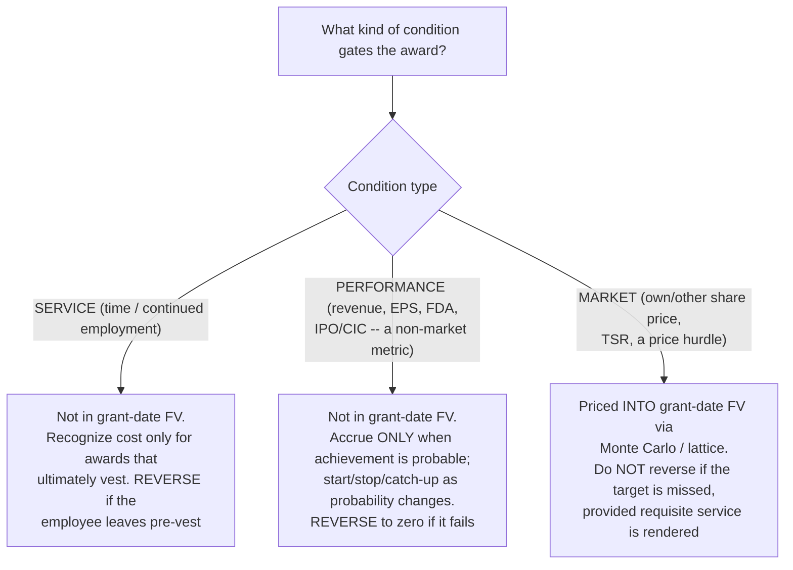
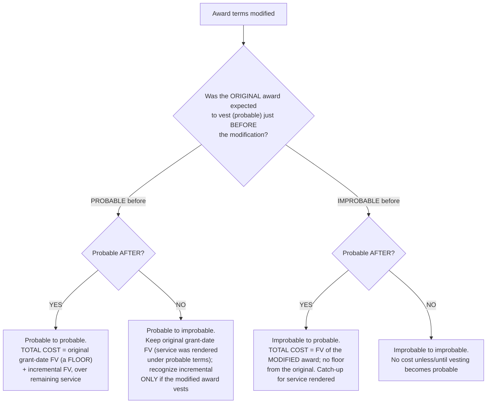

# Equity compensation (ASC 718) — the condition that decides everything

> **Last reviewed:** 2026-06-04. Source: this plugin's deep-research synthesis [`../../../docs/research/2026-06-04-finance-domain-depth/asc718-equity-comp.md`](../../../docs/research/2026-06-04-finance-domain-depth/asc718-equity-comp.md), built from the FASB ASC codification (718, 260, 718-740) and the Big-4 / specialist guides (PwC Viewpoint, Deloitte DART, BDO, Grant Thornton, Equity Methods, The Tax Adviser, CPA Journal). Scope: equity-classified, employee and (post-ASU 2018-07) nonemployee awards. Refresh when (a) a new ASU revises share-based-payment, EPS, or the deferred-tax mechanics, (b) the 409A safe-harbor regime changes, or (c) an engagement surfaces a fact pattern not covered. **Codification section numbers shift — confirm against the live ASC before quoting one in a memo.**

The grant-date fair value of an equity award is **fixed and never remeasured** for share-price movement — only a **modification** or a **classification change** moves the per-unit measure. `[high]` Everything hard about ASC 718 is therefore about *recognition*: how much expense, over what period, and whether it reverses. The single most consequential — and most often botched — decision is the **condition type**, because it independently answers two questions: *is the condition baked into grant-date fair value?* and *is recognized expense reversed if the condition fails?* Get that wrong and you have a restatement, not a rounding error. The trees below resolve the condition fork and the modification fork. Traverse them against the award's actual terms.

---

## Decision Tree: Equity comp — condition type drives fair value and expense reversal

**When this applies:** you are setting up (or reviewing) the expense for an award and must classify each vesting condition. **This is the #1 error area in ASC 718** — classify every condition before you book a dollar.

**Last verified:** 2026-06-04 against ASC 718-10-30-14/-35, PwC 2.5, Deloitte 3.4, and the BDO Blueprint excerpt.

**Rationale per leaf:**

- _SERVICE_ — true up to actual; cost lands only on awards that vest. `[high]`
- _PERFORMANCE_ — the metric is **not** in fair value; you assess **probability** each period and accrue only when achievement is probable, reversing cumulative expense to zero if it never becomes probable. The forfeitures-as-incurred election does **not** let you defer this probability assessment. `[high]`
- _MARKET_ — the probability of hitting the target is **already embedded as a discount** in the Monte-Carlo grant-date fair value, so a fully-served award that pays zero because TSR missed **keeps 100% of its expense**. Reversing it is the cardinal sin of ASC 718. `[high]`

**The load-bearing rule, stated plainly:** *Market conditions are in grant-date fair value and expense is NOT reversed if they fail (given service is rendered). Service and performance conditions are NOT in fair value and ARE trued up to actual vesting.* An award with both a market and a service/performance condition runs them **independently** — the market piece lives in FV; the service/performance piece still gates recognition and can still reverse. `[high]`

**Measurement & attribution corollaries:**

- **Model selection:** plain-vanilla service-vested option → **Black-Scholes-Merton**; dynamic exercise/term behavior → **lattice/binomial**; any **market condition** → **Monte Carlo** (closed-form BSM cannot value a path-dependent price target). `[high]`
- **Attribution:** a **service-only graded** award gets a **policy election** — straight-line or graded/accelerated, applied consistently. Any award with a **performance or market** condition **requires** graded/accelerated attribution; straight-line is not available. `[high]`
- **Forfeitures (ASU 2016-09):** an entity-wide policy election — estimate forfeitures (true up to actual) **or** account for them as they occur. Covers only the *service* condition; performance probability is still assessed every period; market conditions never reverse. `[high]`

---

## Decision Tree: Equity comp — modification accounting (the probability transition)

**When this applies:** award terms change (repricing, extending the exercise window, accelerating or re-targeting vesting). Modification accounting (ASC 718-20-35-3) layers an **incremental fair value** — `FV of the modified award immediately after − FV of the original award immediately before`, both at the modification date — on top of the original. **Classify by the probability transition, not the Roman numeral** (the I–IV numbering is inconsistent across guides).

**Last verified:** 2026-06-04 against ASC 718-20-35-3, PwC 4.3, and Stout / Armanino excerpts; the Roman-numeral mapping varies by source — workpapers should describe the probability transition.

**The two durable rules underneath the matrix** `[high]`:

1. **Original grant-date FV is a floor when the original award was probable.** You can add incremental cost; you cannot claw back the original.
2. **When the original was improbable, there is no floor** — total cost is rebuilt on the *modified* award's fair value, recognized as/when vesting becomes probable.

A vesting **acceleration at termination** often triggers a probable→improbable assessment: if the award *would have been forfeited* absent the acceleration, the modification recognizes the previously-unrecognized cost as incremental. An **equity-to-liability** reclassification re-measures the award as a liability. `[med]`

---

## ESPP, deferred tax, EPS, and 409A — the rest of the surface

- **ESPP (compensatory vs. noncompensatory, ASC 718-50).** An ESPP is **noncompensatory** (no expense) only if it clears every safe-harbor criterion — the key ones being a **discount ≤ 5%** *and* **no look-back or other option-like feature**. A typical **15%-discount-with-look-back** plan is **fully compensatory**, and the look-back's option value must be modeled (BSM-style). **Omitting ESPP expense is a common error, especially at newly public companies.** `[high]`
- **Deferred tax and ETR volatility (post-ASU 2016-09).** Book expense builds a **DTA** (for awards generating a future deduction — NQSOs, RSUs, SARs; ISOs/qualified ESPPs generally build none). At vest/exercise the actual deduction rarely equals cumulative book expense; the difference — **excess tax benefits and shortfalls** — now flows **through income-tax expense on the income statement** as a discrete item (the old APIC pool is gone). **Flag this loudly for FP&A:** the **effective tax rate is now structurally volatile and correlated with the share price** (rising stock → big deductions → windfalls → ETR drops; falling stock → shortfalls → ETR rises), a frequent source of analyst-estimate misses. See [`tax-provision-asc740.md`](./tax-provision-asc740.md). `[high]`
- **Cash flow statement.** Period SBC expense is a **non-cash add-back** in operating activities; post-2016-09 **excess tax benefits are operating**; cash paid to tax authorities for **net-share-settlement** withholding is a **financing** outflow. `[high]`
- **Diluted EPS (treasury-stock method).** Assume exercise/vest, then assume **assumed proceeds** (exercise price **+** average unrecognized comp; the pre-2016-09 windfall-tax-benefit component was removed) repurchase shares at the **average** price. Applied award-by-award, only when **dilutive** (out-of-the-money options are antidilutive → excluded); performance/market awards are included only to the extent the contingency would be met **as of the reporting date**; YTD uses **weighted-average** quarterly increments, not a fresh full-year TSM. `[high]`
- **409A vs. ASC 718.** Different regimes sharing an input: **IRC §409A** governs the option **strike** (must be ≥ common-stock FMV at grant); **ASC 718** governs the **book expense**. In practice the **409A common-stock FMV is the spot-price input** to the ASC 718 option model. A qualified-appraiser 409A gives a **rebuttable presumption of reasonableness**, good **12 months** or until a material event. **Stale or pre-IPO-low 409As drive a cheap-stock charge** — refresh near financings. `[high]`

---

## US GAAP vs. IFRS 2 — the divergences that change numbers

- **Attribution:** US GAAP allows a straight-line **policy choice** for service-only graded awards; **IFRS 2 always front-loads** (graded). `[high]`
- **Forfeitures:** US GAAP — estimate **or** account-as-incurred (election); IFRS 2 — **must estimate**. `[high]`
- **Deferred tax:** US GAAP — DTA on cumulative book expense, all excess/shortfall to **P&L** at settlement; IFRS 2 — DTA **remeasured each period** to current intrinsic value, with the excess over book expense booked to **equity**. Different P&L volatility and equity/P&L split. `[high]`

---

## Common practitioner errors

- **Reversing expense for a failed market condition** — the cardinal sin; a fully-served TSR-PSU that pays zero keeps all its expense. Restatement-grade. `[high]`
- **Wrong attribution** — straight-line on a performance/market award (only graded is allowed), or flip-flopping the election across similar awards. `[high]`
- **Forgetting the DTA / excess-benefit ETR volatility** — modeling a flat statutory rate and missing the share-price-driven windfalls/shortfalls that now whipsaw the ETR and EPS through the P&L. `[high]`
- **Mishandling modifications** — netting incremental FV against a decline instead of holding the original-grant-date floor, or chasing the Roman numeral instead of the probability transition. `[high]` / `[med]`
- **Omitting ESPP expense** — treating a 15%-discount-with-look-back plan as noncompensatory. `[high]`
- **Not assessing performance-condition probability each period** — wrongly assuming the forfeitures-as-incurred election lets you defer it. `[high]`
- **Stale 409A / cheap stock; diluted-EPS misses** — out-of-the-money options included, unrecognized comp omitted from proceeds, unmet performance shares counted, or a full-year TSM instead of weighted quarterly increments. `[high]` / `[med]`

---

## When to escalate

- **Grant-date fair-value modeling (Monte Carlo for a market condition, lattice, ESPP look-back), the expense schedule, or diluted-EPS share counts** → `financial-modeler` (this plugin).
- **The deferred-tax and ETR-volatility build (excess benefits/shortfalls through the provision)** → see [`tax-provision-asc740.md`](./tax-provision-asc740.md); `controller` (this plugin) owns the booking.
- **A 409A refresh or the cheap-stock analysis** → `valuation-analyst` (this plugin).
- **Disclosure prose for the board / investors** → `board-pack-composer` (this plugin).
- **A live filing-grade conclusion** → `ravenclaude-core` `deep-researcher` to confirm the current codification and any post-2026 ASUs before it ships.

---

## Citations / sources

Full synthesis with inline confidence tags and source URLs: [`../../../docs/research/2026-06-04-finance-domain-depth/asc718-equity-comp.md`](../../../docs/research/2026-06-04-finance-domain-depth/asc718-equity-comp.md) (retrieved 2026-06-04). Anchored on the FASB ASC codification (718-10 measurement/conditions, 718-20-35-3 modifications, 718-50 ESPP, 718-740 deferred tax, 260 diluted EPS) and ASU 2016-09 / 2018-07, cross-corroborated across PwC Viewpoint, Deloitte DART, BDO, Grant Thornton, Equity Methods, The Tax Adviser, and CPA Journal. Every premium technical guide returned HTTP 403 on fetch; load-bearing claims were corroborated across ≥2 independent excerpts (or an excerpt + codification) before being tagged `[high]`. The **modification Roman-numeral mapping is inconsistent across sources** — describe the **probability transition** in workpapers, never the numeral.
