# Finance decision trees — picking the right method on the first pass

> **Last reviewed:** 2026-05-30. Source: this plugin's agent opinions and skills (`financial-modeler`, `valuation-analyst`, `fpa-analyst`, `treasury-analyst`, `driver-based-forecasting`, `dcf-valuation`), and standard corporate-finance method definitions. Refresh when (a) an agent's opinion on method selection changes, (b) a new skill adds a method these trees should branch to, or (c) at least one engagement surfaces a leaf that isn't on a tree. Method definitions here are domain-standard framings, not engagement advice — confirm against current standards for a live deliverable.

These trees complement the variance triage tree in [`variance-root-cause-triage.md`](./variance-root-cause-triage.md). Each codifies a "which method?" decision the finance agents make repeatedly, where the wrong first pick wastes a forecast cycle, mis-prices a business, or routes a financing decision at the wrong lever. **Traverse the relevant tree top-to-bottom before selecting a method — do NOT pattern-match on the line label or the first approach that comes to mind.** When two leaves both fit, name both; the tree resolves the *primary* method, and finance methods are often triangulated, not exclusive.

---

## Decision Tree: FP&A — Forecast method selection (driver-based vs trend vs zero-based)

**When this applies:** you are about to build or refresh a forecast/budget for a line (or a whole P&L) and must choose *how* to forecast it — decompose into operational drivers, extrapolate a trend, or rebuild bottom-up from zero. The line is material enough that the method choice changes the answer or the effort materially.

**Last verified:** 2026-05-30 against this plugin's `fpa-analyst` / `financial-modeler` opinions and the `driver-based-forecasting` skill.

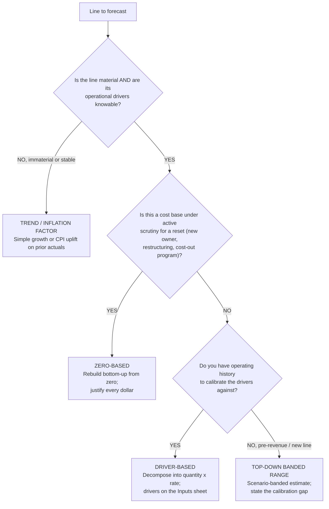

**Rationale per leaf:**

- _TREND / INFLATION_ — for an immaterial or stable, non-strategic line, driver decomposition is not free and materiality governs effort (house opinion #5); a trend or CPI factor is honest and cheap.
- _ZERO-BASED_ — when the *point* is to challenge the existing base (a cost-out, a new owner, a restructuring), starting from last year's number anchors the answer to the thing you're trying to reset; ZBB forces every dollar to re-justify.
- _DRIVER-BASED_ — the default for a material line with knowable drivers and history to calibrate them; it exposes the levers a decision-maker controls and is falsifiable against history and benchmarks. **requires:** operating history (or a credible external benchmark) to calibrate each driver.
- _TOP-DOWN BANDED RANGE_ — for a pre-revenue or brand-new line with no history, a false-precision driver tree is *less* honest than a scenario-banded top-down range; state the calibration gap rather than manufacture drivers.

**Tradeoffs summary:**

| Method | Effort | Falsifiable? | Best signal | Use when |
|---|---|---|---|---|
| Trend / inflation | low | weakly | none new | Immaterial / stable / non-strategic line |
| Zero-based | high | yes (line-by-line) | challenges the base | Cost reset: new owner, restructuring, cost-out |
| Driver-based | medium | yes (vs history + benchmark) | the controllable levers | Material line, drivers knowable, history exists |
| Top-down banded | low-medium | partially | honest range | Pre-revenue / new line, no calibration history |

The forecast of record is then held *beside the frozen budget*, never overwriting it — see [`../best-practices/fpa-rolling-forecast-beside-the-budget.md`](../best-practices/fpa-rolling-forecast-beside-the-budget.md).

---

## Decision Tree: Valuation — Primary method selection (DCF vs comps vs precedent)

**When this applies:** you must value a business or asset and choose which method carries primary weight. The valuation is of record (409A, fairness support, board decision, pre-deal) — not a back-of-envelope gut-check.

**Last verified:** 2026-05-30 against this plugin's `valuation-analyst` opinions and the `dcf-valuation` skill.

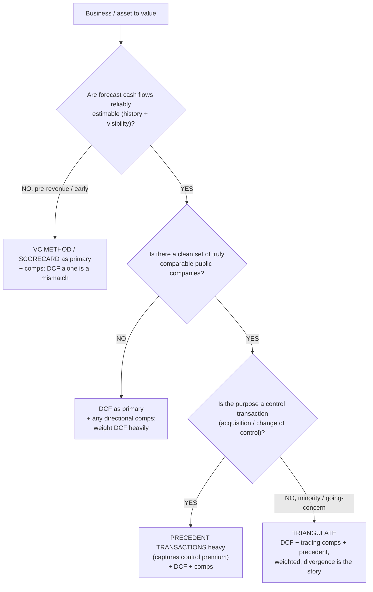

**Rationale per leaf:**

- _VC METHOD / SCORECARD_ — a pre-revenue company has no forecast to discount reliably; a DCF alone is a methodology mismatch (named anti-pattern). VC method / scorecard plus comps is the honest primary.
- _DCF (primary)_ — when no clean comp set exists (a genuinely novel business), the DCF carries the weight; disclose the thin comp universe and widen the range rather than fabricate comps.
- _PRECEDENT (heavy)_ — a control transaction transfers control, so a precedent set captures the control premium that trading comps (minority quotes) miss; still triangulate with DCF and comps.
- _TRIANGULATE_ — the default: DCF + trading comps + precedent, each weighted with a written rationale, presented as a range. One method is an estimate, not a valuation.

**Tradeoffs summary:**

| Primary method | Strongest when | Key weakness | Captures control premium? | Use when |
|---|---|---|---|---|
| VC / scorecard (+comps) | pre-revenue, no forecast | highly judgmental | n/a | Early-stage, no reliable cash-flow forecast |
| DCF (heavy) | forecast solid, comps thin | sensitive to WACC + terminal | no | Reliable forecast, no clean comp set |
| Precedent (heavy) | control deal, recent deals exist | deals age; data sparse | yes | Acquisition / change-of-control purpose |
| Triangulate all three | going-concern, minority | needs all three built | partial (via precedent leg) | Default valuation of record |

Whichever leads, the result is a **range with method weights**, never a single point — see [`../best-practices/valuation-triangulate-three-methods.md`](../best-practices/valuation-triangulate-three-methods.md). Terminal-value and WACC discipline govern the DCF leg ([`../best-practices/valuation-discipline-the-terminal-value.md`](../best-practices/valuation-discipline-the-terminal-value.md), [`../best-practices/valuation-build-wacc-from-sourced-components.md`](../best-practices/valuation-build-wacc-from-sourced-components.md)).

---

## Decision Tree: FP&A — Variance decomposition method (which bridge to build)

**When this applies:** a *reconciled* material variance needs commentary and you must choose how to decompose it — a price/volume/mix bridge, a constant-currency split, a one-time isolation, or a simple rate × volume bridge. The recon gate has already cleared (per the RECON leaf of [`variance-root-cause-triage.md`](./variance-root-cause-triage.md)).

**Last verified:** 2026-05-30 against this plugin's `fpa-analyst` opinions and the PVM leaf of the variance-root-cause triage tree.

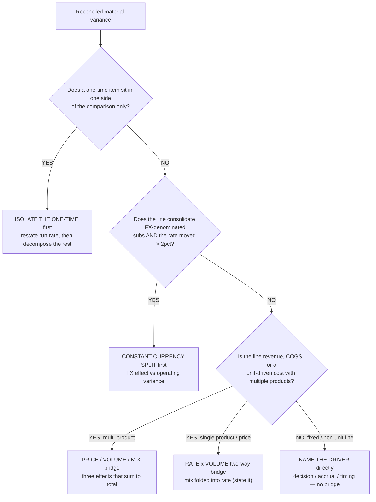

**Rationale per leaf:**

- _ISOLATE THE ONE-TIME_ — a one-time gain/charge distorts the run-rate read; isolate it first so the remaining decomposition describes the underlying trend (the ONE-TIME leaf of the triage tree).
- _CONSTANT-CURRENCY SPLIT_ — part of an FX-consolidated variance is mathematical translation, not operating performance; net FX out first so the bridge that follows is real (the FX leaf).
- _PVM_ — revenue and unit-driven costs hide price, volume, and mix moving together; the three-effect bridge that sums exactly to the total routes each slice to its owner.
- _RATE × VOLUME_ — a single-product / single-price line collapses mix to zero; a two-way bridge is sufficient and honest — state that mix is folded into rate.
- _NAME THE DRIVER directly_ — a fixed or non-unit line (rent, a legal accrual) has no price/volume/mix structure; name the decision, accrual, or timing driver directly.

**Tradeoffs summary:**

| Method | Effort | Ties to total exactly? | Routes to owner | Use when |
|---|---|---|---|---|
| Isolate one-time | minutes | after isolation | controller / source | Non-recurring item in one side only |
| Constant-currency split | ~1 hour | yes (FX + operating) | treasury (hedge read) | FX-consol line, rate moved > 2% |
| Price/volume/mix | half-day | yes (3 effects sum) | pricing / sales / product | Multi-product revenue or unit-driven cost |
| Rate × volume | hours | yes (2 effects) | sales / pricing | Single-product / single-price line |
| Name driver directly | minutes | n/a (no bridge) | decision owner | Fixed / non-unit line |

These compose with the triage tree's leaf order — see [`../best-practices/fpa-build-the-variance-bridge-price-volume-mix.md`](../best-practices/fpa-build-the-variance-bridge-price-volume-mix.md). Bridges are additive: if a one-time item *and* an FX move both apply, isolate the one-time, split FX, then bridge the remainder.

---

## Decision Tree: Capital — Acquire a capability (build vs buy vs lease)

**When this applies:** the business needs a capability or asset (software, a facility, equipment, a function) and must decide whether to build it in-house, buy/own it outright, or lease/subscribe. A capital or multi-year operating commitment turns on the answer.

**Last verified:** 2026-05-30 against this plugin's `financial-modeler` / `treasury-analyst` surface areas and standard NPV / lease-vs-buy framing.

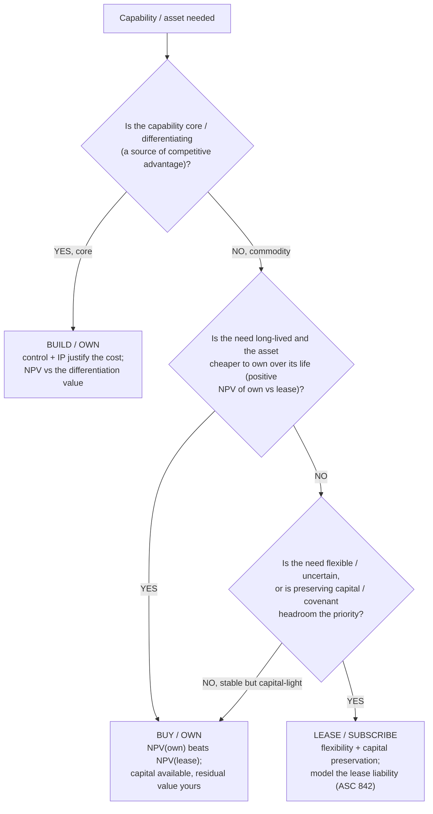

**Rationale per leaf:**

- _BUILD / OWN_ — a core, differentiating capability is worth controlling even at a cost premium; value it against the differentiation it protects, not just unit cost.
- _BUY / OWN_ — for a long-lived commodity asset where NPV(own) beats NPV(lease) and capital is available, ownership captures the residual value and avoids the lessor's embedded financing margin.
- _LEASE / SUBSCRIBE_ — where the need is flexible/uncertain, or preserving cash and covenant headroom matters more than the lifetime cost delta, leasing buys optionality. **requires:** modelling the lease liability and right-of-use asset on the balance sheet (a finance lease consumes covenant headroom like debt).

**Tradeoffs summary:**

| Option | Upfront cash | Balance-sheet effect | Flexibility | Use when |
|---|---|---|---|---|
| Build / own | high | capitalized asset + IP | low (committed) | Capability is core / differentiating |
| Buy / own | high | capitalized asset, residual yours | low | Long-lived commodity, NPV(own) wins, capital available |
| Lease / subscribe | low | lease liability (ASC 842) | high | Flexible/uncertain need, or preserve capital/covenant headroom |

The lease-vs-buy comparison is an NPV decision on after-tax cash flows at the right discount rate — keep the discount-rate discipline of [`../best-practices/valuation-build-wacc-from-sourced-components.md`](../best-practices/valuation-build-wacc-from-sourced-components.md). A finance/capital lease consumes covenant headroom — coordinate with [`../best-practices/treasury-cite-the-agreement-on-every-covenant.md`](../best-practices/treasury-cite-the-agreement-on-every-covenant.md).

---

## Decision Tree: Capital — Financing a need (debt vs equity vs internal cash)

**When this applies:** the business needs funding for growth, an acquisition, or a gap, and must choose the source — internal cash, debt, or equity (or a hybrid). The amount is material enough to move leverage, dilution, or runway.

**Last verified:** 2026-05-30 against this plugin's `treasury-analyst` / `valuation-analyst` surface areas and standard capital-structure framing.

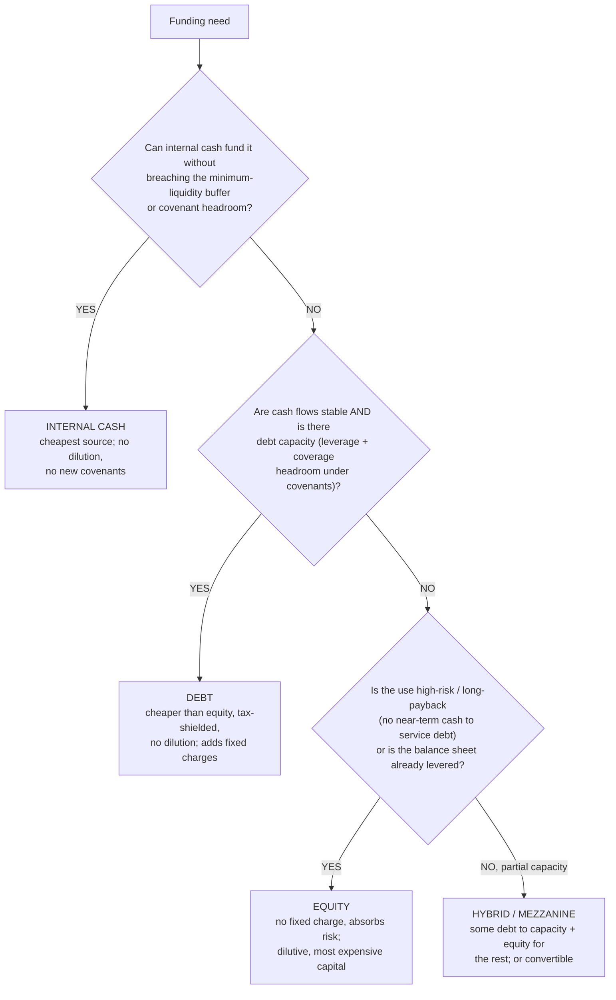

**Rationale per leaf:**

- _INTERNAL CASH_ — retained cash is the cheapest capital (no interest, no dilution, no new covenants) — but only to the point it does not breach the minimum-liquidity buffer or covenant headroom (treasury's "liquidity > leverage").
- _DEBT_ — cheaper than equity and tax-shielded, sensible when cash flows are stable enough to service fixed charges and covenant headroom exists; it adds fixed charges and covenants, so model the headroom. **requires:** debt capacity under existing covenants (test leverage + fixed-charge coverage first).
- _EQUITY_ — the most expensive capital and dilutive, but it carries no fixed charge and absorbs risk; right for high-risk / long-payback uses or an already-levered balance sheet that can't take more fixed charges.
- _HYBRID / MEZZANINE_ — when there's *some* debt capacity but not enough, layer debt to capacity and fund the rest with equity (or a convertible) to blend cost and dilution.

**Tradeoffs summary:**

| Source | Cost of capital | Dilution | Fixed charge / covenant | Use when |
|---|---|---|---|---|
| Internal cash | lowest | none | none | Fits within liquidity buffer + covenant headroom |
| Debt | low (tax-shielded) | none | yes (interest + covenants) | Stable cash flows, debt capacity exists |
| Equity | highest | yes | none | High-risk / long-payback use, or already levered |
| Hybrid / mezzanine | medium | partial | partial | Partial debt capacity; blend cost and dilution |

Test debt capacity against the actual covenants before committing — [`../best-practices/treasury-cite-the-agreement-on-every-covenant.md`](../best-practices/treasury-cite-the-agreement-on-every-covenant.md) — and confirm the liquidity buffer in the 13-week forecast ([`../best-practices/treasury-forecast-cash-direct-method-thirteen-weeks.md`](../best-practices/treasury-forecast-cash-direct-method-thirteen-weeks.md)). The cost-of-equity vs cost-of-debt comparison ties to the WACC build ([`../best-practices/valuation-build-wacc-from-sourced-components.md`](../best-practices/valuation-build-wacc-from-sourced-components.md)).

---

## Decision Tree: Revenue — over-time vs point-in-time recognition (ASC 606 step 5)

**When this applies:** a contract's revenue is being recognized and the decision is _when_ — recognized **over time** as the work progresses, or **at a point in time** when control transfers. Observable trigger: a new contract type (a subscription, a construction/build-to-order job, a milestone-based service, a product sale), or a period-end question "should this be deferred / how much is earned?". Assumes ASC 606 steps 1–4 are done (contract identified, performance obligations separated, price allocated); this is **step 5**. It does **not** decide GAAP-vs-management view (house opinion #12) — state the basis separately.

**Last verified:** 2026-05-30 against ASC 606 step-5 criteria (domain-standard framing). The specific over-time criteria, the input/output method rules, and any industry-specific guidance are **standard-version-specific** — `[verify-at-build]` against the current standard; this is an accounting-judgment area that escalates to the `controller` and, for anything novel, to technical-accounting/audit sign-off.

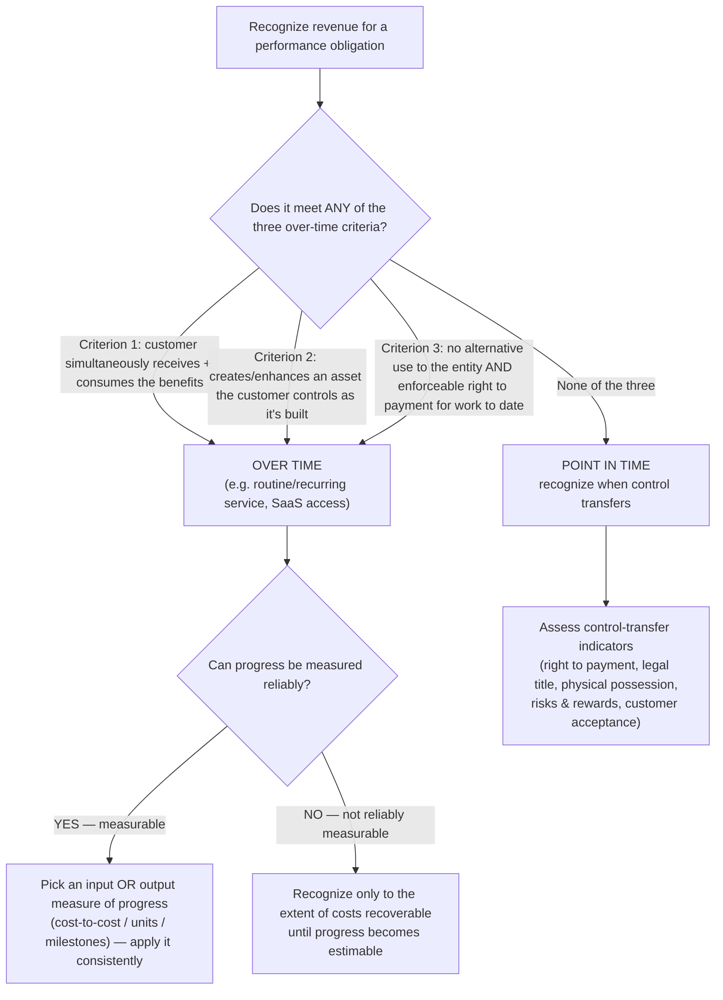

**Rationale per leaf:**

- _OVER TIME (any of three)_ — meeting **any one** of the three criteria forces over-time recognition; the most common is criterion 1 (a recurring service the customer consumes as delivered — the SaaS/subscription default). Criterion 3 is the build-to-order/custom-asset case that surprises teams who assume "we deliver at the end, so recognize at the end."
- _MEASURE_ — once over-time, you must choose a measure of progress (input methods like cost-to-cost, or output methods like units/milestones) and apply it consistently; switching mid-contract to flatter a period is a misstatement.
- _RECOVER_ — if progress genuinely can't be estimated yet, recognize revenue only up to recoverable costs (zero margin) until it can — don't guess a percentage.
- _POINT IN TIME_ — when none of the three over-time criteria are met (a standard product sale), recognize at control transfer; "control" is assessed on the indicator set, not on shipment date alone.

**Tradeoffs summary:**

| Outcome | Trigger | Recognition pattern | Common case | Trap avoided |
|---|---|---|---|---|
| Over time — measurable progress | any over-time criterion + estimable | as progress is measured | SaaS, long-term service, construction | Deferring earned revenue to delivery |
| Over time — cost-recovery only | over-time but not estimable | up to recoverable cost | early-stage custom build | Guessing a % complete |
| Point in time | none of the three criteria | at control transfer | product sale | Recognizing on ship date vs control |

Revenue-recognition conclusions are accounting judgments — document the criteria assessment and route novel/material judgments to the `controller` and audit sign-off; state GAAP-vs-management basis explicitly (house opinion #12).

---

## Decision Tree: Audit — control-deficiency severity (CD / SD / material weakness)

**When this applies:** a control test failed (or a control is missing) and the exception must be **classified by severity** before it's tracked, escalated, or disclosed. Observable trigger: a test-of-operating-effectiveness exception, a walkthrough gap, or a self-identified control failure. This operationalizes [`../best-practices/audit-classify-deficiency-severity.md`](../best-practices/audit-classify-deficiency-severity.md): severity is **likelihood × magnitude vs materiality**, not the cosmetic size of the gap.

**Last verified:** 2026-05-30 against the deficiency-severity best-practice (grounded in PCAOB AS 2201 / COSO). Specific framework definitions and any regulator-specific severity vocabulary are framework-/jurisdiction-specific — `[verify-at-build]` against the current standard.

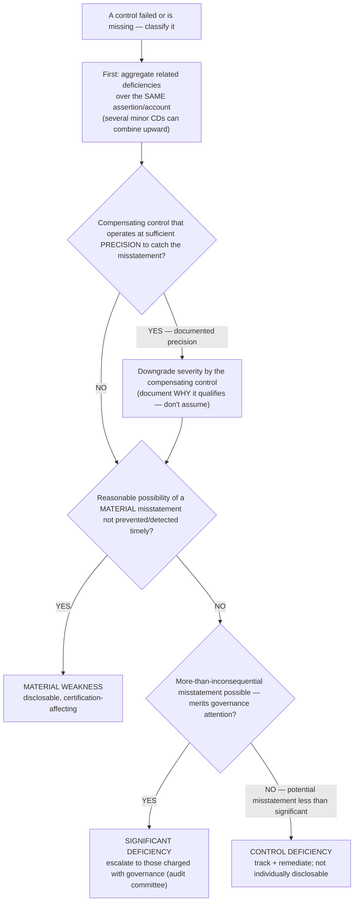

**Rationale per leaf:**

- _AGG (aggregate first)_ — severity is assessed on the **cluster**, not each exception in isolation; several individually-minor CDs over the same account/assertion can combine into an SD or MW. Skipping aggregation is how a real weakness hides as a list of small ones.
- _DOWN (compensating control)_ — a compensating control downgrades severity **only** if it operates at a precision that would actually catch the misstatement; document the precision rationale rather than treating any compensating control as an automatic downgrade.
- _MW_ — a reasonable possibility that a **material** misstatement wouldn't be caught timely; this is the disclosable, management-certification-affecting one. Never downgrade it because remediation is inconvenient.
- _SD_ — less than material but important enough to merit audit-committee attention (a reasonable possibility of a more-than-inconsequential misstatement).
- _CD_ — the control failed but the potential misstatement is less than significant; track and remediate, not individually disclosable. Magnitude (an immaterial account) can cap severity at CD even on a full failure.

**Tradeoffs summary:**

| Severity | Likelihood × magnitude | Disclosure / escalation | Heightened-scrutiny bias |
|---|---|---|---|
| Control deficiency (CD) | potential misstatement < significant | track + remediate | — |
| Significant deficiency (SD) | more-than-inconsequential possible | audit committee / governance | — |
| Material weakness (MW) | reasonable possibility of **material** | disclosable + certification-affecting | fraud + close-process controls bias toward SD/MW |

Deficiencies in controls over the financial-reporting process itself (period-end close, journal entries) and fraud-related deficiencies carry heightened scrutiny and bias upward regardless of single-instance magnitude. Final classification is an audit judgment — owned by `audit-prep-specialist`, defended with the framework cite.

---

## Decision Tree: Treasury — cash-shortfall response ladder (cheapest, most-reversible first)

**When this applies:** the 13-week direct-method cash forecast (or a covenant headroom check) shows a projected shortfall, and the question is _which lever to pull, in what order_. Observable trigger: a forecast week dips below the minimum cash buffer, a covenant test is at risk, or a large disbursement can't be funded. The discipline: exhaust **operating/working-capital levers** before **financing** ones, and reversible before irreversible — pulling an expensive or dilutive lever first destroys value a timing fix would have solved.

**Last verified:** 2026-05-30 against this plugin's `treasury-analyst` opinions and the `thirteen-week-cash-forecast` skill. Covenant definitions and facility terms are agreement-specific — `[verify-at-build]` against the actual agreement before relying on available headroom.

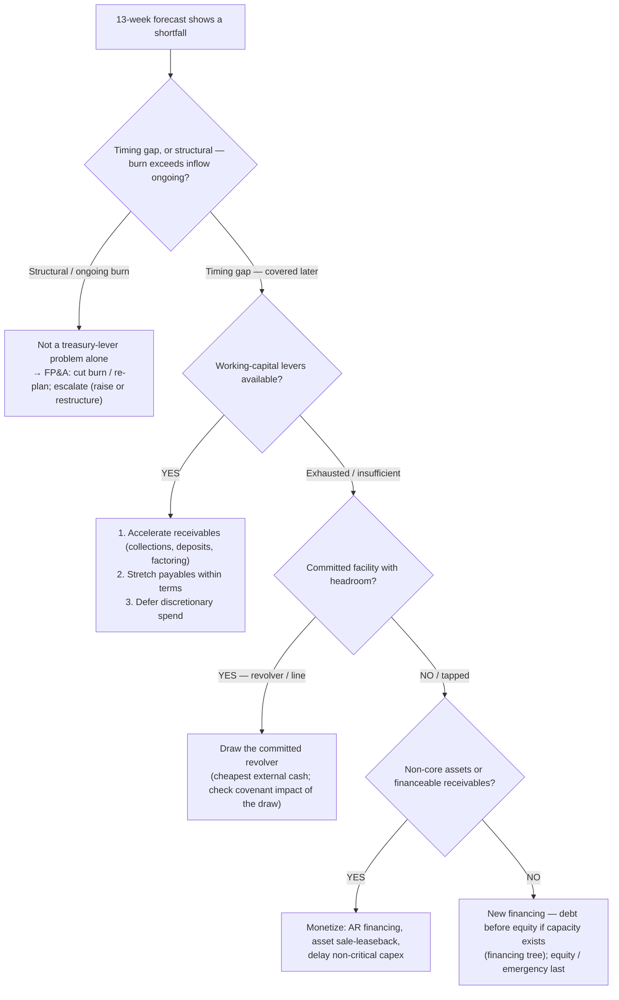

**Rationale per leaf:**

- _STRUCT (structural)_ — a persistent burn-exceeds-inflow gap is not a liquidity-lever problem; pulling treasury levers only buys weeks. Route to `fpa-analyst` to cut burn / re-plan and escalate a raise or restructuring; don't paper a structural hole with a revolver draw.
- _WCLEVER (working capital first)_ — accelerating collections, stretching payables _within terms_, and deferring discretionary spend are the cheapest and most reversible moves; exhaust them before any external draw. (Stretching payables beyond terms damages supplier relationships — a cost, not a free lever.)
- _DRAW (committed facility)_ — a committed revolver is the cheapest external cash and is what the facility is for; check the draw's effect on leverage covenants before drawing (a draw can itself trip a ratio).
- _MONETIZE_ — AR financing, sale-leaseback, and capex deferral convert balance-sheet items to cash without new permanent financing; mid-cost, partly reversible.
- _RAISE (new financing last)_ — new debt (if covenant/capacity allows) before equity; equity and emergency/bridge financing are the most expensive/dilutive and least reversible — last resort. Route the debt-vs-equity choice through the financing tree above.

**Tradeoffs summary:**

| Lever | Cost | Reversibility | Speed | Use when |
|---|---|---|---|---|
| Working-capital levers | lowest | high | days–weeks | timing gap, levers available |
| Draw committed revolver | low (interest) | high (repay) | days | facility headroom + covenant-safe |
| Monetize assets / AR | medium | partial | weeks | facility tapped, financeable assets exist |
| New debt | medium–high | low | weeks–months | covenant capacity remains |
| Equity / emergency | highest (dilution) | none | weeks–months | all else exhausted; structural need |

Always test the lever against the actual covenants ([`../best-practices/treasury-cite-the-agreement-on-every-covenant.md`](../best-practices/treasury-cite-the-agreement-on-every-covenant.md)) and re-run the 13-week forecast after; a structural shortfall escalates to `fpa-analyst` and, for a raise, the financing tree above.

---

## When to escalate

- **Forecast-method choice lands on ZERO-BASED for a whole cost base** → coordinate with `fpa-analyst` (budget owner) and the relevant department owners; ZBB is a process, not a single build.
- **Valuation method choice turns on a control-premium magnitude** → `valuation-analyst` defends the premium from a precedent study; do not assume a round number.
- **Build-vs-buy / lease-vs-buy crosses into systems architecture** (e.g., build vs buy a data platform) → escalate to `ravenclaude-core` `architect` per [`../CLAUDE.md`](../CLAUDE.md) §10.
- **Financing choice touches a regulated capital structure** (reg-capital, insurance, banking) → `regulatory-compliance` `regulatory-reporting-analyst`.
- **Any branch that turns on a volatile market input** (current WACC component, current covenant definition, current accounting standard) → re-verify the input before it gates an irreversible decision; mark it `[unverified — training knowledge]` if pulled from memory.

---

## Sources / provenance

These trees codify method-selection decisions already implicit in this plugin's agents and skills:

- Forecast-method tree — `fpa-analyst` ("headcount math beats opex assumptions," "three scenarios"), `financial-modeler` (driver decomposition), `driver-based-forecasting` skill, and house opinion #5 (materiality is a design constraint).
- Valuation-method tree — `valuation-analyst` ("three methodologies, weighted," "pre-revenue by DCF alone is a methodology mismatch," control-premium discipline), `dcf-valuation` skill.
- Variance-decomposition tree — `fpa-analyst` (`rate × volume / mix / FX` decomposition) and the PVM/FX/ONE-TIME leaves of [`variance-root-cause-triage.md`](./variance-root-cause-triage.md).
- Build-vs-buy and financing trees — `treasury-analyst` (liquidity > leverage, covenant capacity, capital-structure decisions) and `valuation-analyst` (NPV / cost-of-capital) surface areas, plus standard corporate-finance NPV and capital-structure framing. The ASC 842 lease-liability framing and ASC 606 references are domain-standard pointers, not engagement advice — confirm against the current standard for a live deliverable.
- Revenue-recognition-timing tree — `controller` (close/JE/revenue-cutoff judgment) and ASC 606 step-5 standard framing; an accounting-judgment area that escalates for novel/material cases. Added by the coverage campaign (2026-06-01).
- Deficiency-severity tree — `audit-prep-specialist`, the `soc-control-walkthrough` skill, and [`../best-practices/audit-classify-deficiency-severity.md`](../best-practices/audit-classify-deficiency-severity.md) (PCAOB AS 2201 / COSO framing). Added by the coverage campaign (2026-06-01).
- Cash-shortfall-ladder tree — `treasury-analyst` (liquidity-first, cheapest-and-most-reversible-first) and the `thirteen-week-cash-forecast` skill. Added by the coverage campaign (2026-06-01).

Method definitions are stated as standard framings; where a branch turns on a volatile market input or a current accounting standard, the input carries the accuracy-discipline caveat (verify before it gates an irreversible action).

---

## Decision Tree: Close / Controller — Which accrual approach is appropriate

**When this applies:** The controller or FP&A analyst is deciding how to estimate a period-end accrual — bonus, warranty, rent, professional fees, contingency — where the exact invoice has not yet arrived. The question is whether to use a formula-driven estimate, a probability-weighted range, a run-rate extrapolation, or to wait for the invoice.

**Last verified:** 2026-06-05 against ASC 420, ASC 450, ASC 460, and standard controller close practice.

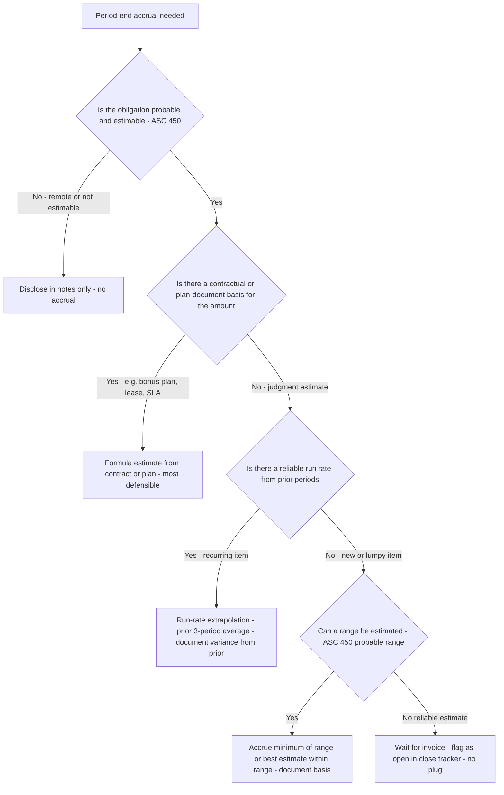

**Rationale per leaf:**
- *Disclose only* — ASC 450 requires accrual only when probable + estimable; a remote or non-estimable contingency gets disclosure, not a reserve.
- *Formula estimate* — a contractual basis (lease schedule, bonus plan payout table, warranty rate) is the most auditor-defensible source; compute from the document.
- *Run-rate extrapolation* — for recurring accruals (recurring professional fees, rent under a verbal arrangement), a 3-period average is a reasonable estimate; always document the comparable and explain deviations.
- *Minimum of range* — ASC 450-20-30: when a range of loss is given and no amount in the range is a better estimate than any other, accrue the minimum of the range.
- *Wait for invoice* — when no estimate is defensible, flagging as open is preferable to a plug; a plug creates the audit exposure that a missing invoice does not.

**Tradeoffs summary:**

| Method | Audit defensibility | Timeliness | Use when |
|---|---|---|---|
| Contract / plan formula | Highest | Day 1 of close | Written contractual or plan basis exists |
| Run-rate extrapolation | High | Day 1 | Recurring, stable item; prior 3+ periods of data |
| Probability-weighted range | Medium | Day 2-3 | One-time item; range estimable from facts |
| Wait for invoice | N/A - not an accrual | Depends on invoice timing | No defensible estimate available |

---

## Decision Tree: Treasury — Which covenant test to run first

**When this applies:** The treasury analyst is preparing a covenant-compliance certificate or monitoring compliance status mid-period. The credit agreement contains multiple financial covenants (leverage, coverage, liquidity) and the analyst must determine which test is most binding given current financial position.

**Last verified:** 2026-06-05 against standard US leveraged-finance covenant structures and the plugin's `treasury-analyst` skill.

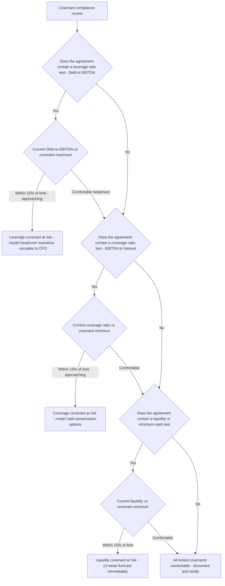

**Rationale per leaf:**
- *Leverage covenant at risk* — leverage is typically the most common breach trigger; model the EBITDA and debt scenarios at which breach occurs, and alert the CFO so waiver discussions can start before the measurement date, not after.
- *Coverage covenant at risk* — interest-coverage deterioration often precedes leverage deterioration; a falling EBITDA or rising interest cost signals the need for cash preservation before covenant breach.
- *Liquidity covenant at risk* — a minimum-cash or availability test is an immediate operational problem; 13-week cash forecast must be run now to size the shortfall and identify levers.
- *All compliant* — certify; document the headroom for each covenant in the compliance certificate and note the date of measurement and the credit-agreement definition used.

**Tradeoffs summary:**

| Covenant type | Primary driver | Typical measurement date | Early-warning action |
|---|---|---|---|
| Leverage - Debt/EBITDA | EBITDA decline or debt draw | Quarterly | Model downside EBITDA; start waiver dialogue 90 days before |
| Coverage - EBITDA/Interest | EBITDA fall or rate rise | Quarterly | Model rate sensitivity; consider fixed-rate swap |
| Liquidity - min cash/availability | Cash outflows | Monthly or continuous | 13-week direct-method forecast |

---

## Decision Tree: Valuation — Which terminal-value method to apply

**When this applies:** A DCF model has reached the end of the explicit forecast period and requires a terminal value. The analyst must choose between the Gordon Growth Model (perpetuity growth) and an exit-multiple approach, and must decide whether to apply both as a cross-check or rely on one.

**Last verified:** 2026-06-05 against standard DCF methodology and the plugin's `dcf-valuation` skill.

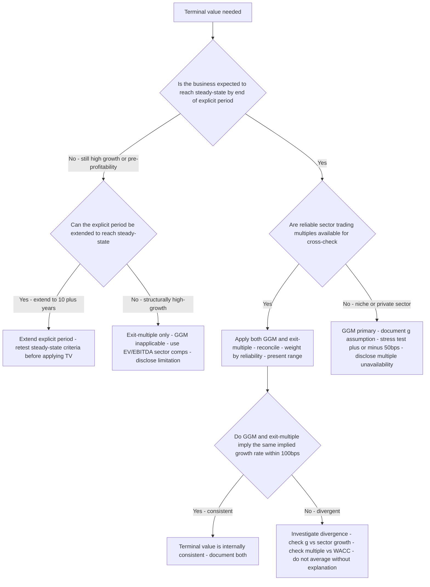

**Rationale per leaf:**
- *Extend explicit period* — applying a terminal value to a business that is not yet in steady state embeds growth-rate drift into the perpetuity; a longer explicit period is almost always the cleaner fix.
- *Exit-multiple only* — for high-growth or pre-profitability businesses, a GGM terminal value requires a long-run EBITDA margin assumption that is highly speculative; a multiple on a near-term EBITDA (e.g., Year 5) anchored on sector comps is more defensible.
- *Both, reconciled* — the GGM-implied multiple check (TV/EBITDA) and the multiple-implied growth rate check are the two most powerful consistency tests in a DCF; always perform both and disclose any divergence above 100 bps.
- *GGM primary* — for businesses with no reliable public comp set, the perpetuity model is the only option; document the long-run growth assumption relative to GDP and the sector, and show a ±50 bps sensitivity.
- *Reconcile divergence* — divergence between the two methods is a signal, not a mandate to average; the analyst must understand why (a comp set at unusual multiples, an implicit growth rate above GDP) before choosing the weight.

**Tradeoffs summary:**

| Method | Best when | Weakness | Cross-check |
|---|---|---|---|
| Gordon Growth Model | Steady-state, predictable cash flows | g sensitive - small change moves TV by double digits | Implied EV/EBITDA multiple vs sector |
| Exit multiple | Comparable sector comps available | Inherits market mis-pricing at exit | Implied perpetuity growth rate vs GDP |
| Both reconciled | Standard DCF | More work; requires honest reconciliation | Divergence investigation is the value |
