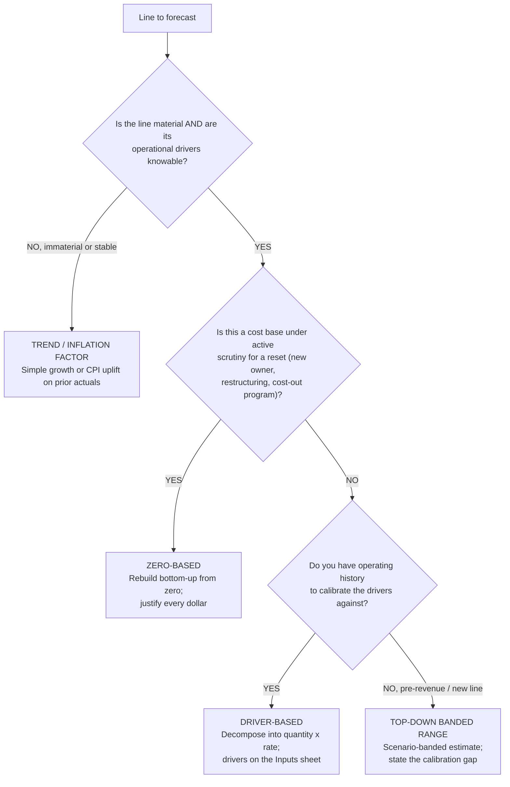
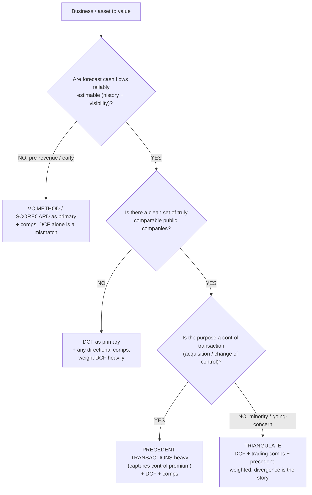
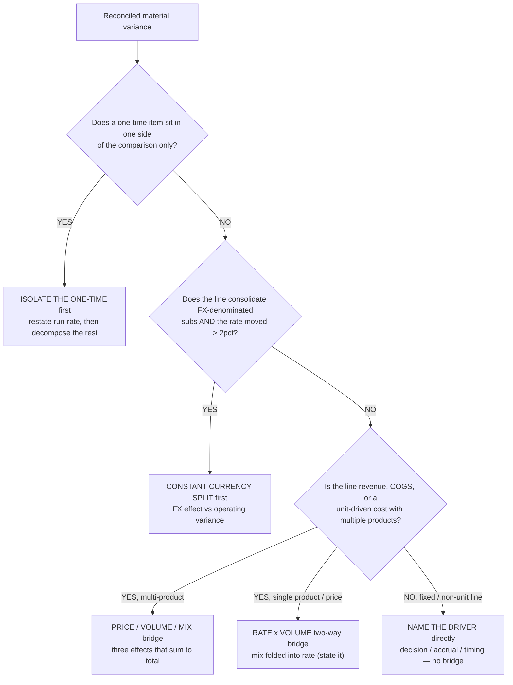
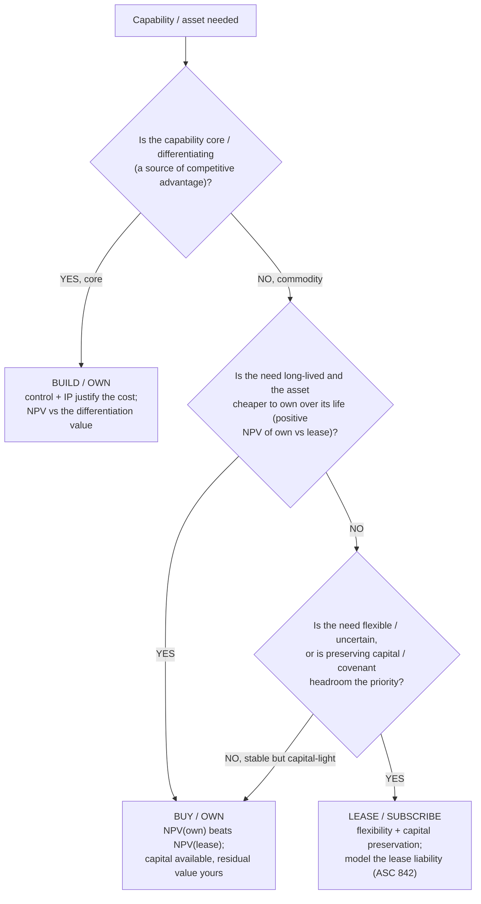
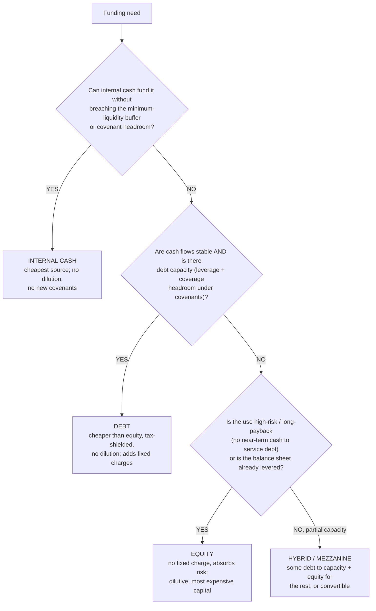

# Finance decision trees — picking the right method on the first pass

> **Last reviewed:** 2026-05-30. Source: this plugin's agent opinions and skills (`financial-modeler`, `valuation-analyst`, `fpa-analyst`, `treasury-analyst`, `driver-based-forecasting`, `dcf-valuation`), and standard corporate-finance method definitions. Refresh when (a) an agent's opinion on method selection changes, (b) a new skill adds a method these trees should branch to, or (c) at least one engagement surfaces a leaf that isn't on a tree. Method definitions here are domain-standard framings, not engagement advice — confirm against current standards for a live deliverable.

These trees complement the variance triage tree in [`variance-root-cause-triage.md`](./variance-root-cause-triage.md). Each codifies a "which method?" decision the finance agents make repeatedly, where the wrong first pick wastes a forecast cycle, mis-prices a business, or routes a financing decision at the wrong lever. **Traverse the relevant tree top-to-bottom before selecting a method — do NOT pattern-match on the line label or the first approach that comes to mind.** When two leaves both fit, name both; the tree resolves the *primary* method, and finance methods are often triangulated, not exclusive.

---

## Decision Tree: FP&A — Forecast method selection (driver-based vs trend vs zero-based)

**When this applies:** you are about to build or refresh a forecast/budget for a line (or a whole P&L) and must choose *how* to forecast it — decompose into operational drivers, extrapolate a trend, or rebuild bottom-up from zero. The line is material enough that the method choice changes the answer or the effort materially.

**Last verified:** 2026-05-30 against this plugin's `fpa-analyst` / `financial-modeler` opinions and the `driver-based-forecasting` skill.

**Rationale per leaf:**

- _TREND / INFLATION_ — for an immaterial or stable, non-strategic line, driver decomposition is not free and materiality governs effort (house opinion #5); a trend or CPI factor is honest and cheap.
- _ZERO-BASED_ — when the *point* is to challenge the existing base (a cost-out, a new owner, a restructuring), starting from last year's number anchors the answer to the thing you're trying to reset; ZBB forces every dollar to re-justify.
- _DRIVER-BASED_ — the default for a material line with knowable drivers and history to calibrate them; it exposes the levers a decision-maker controls and is falsifiable against history and benchmarks. **requires:** operating history (or a credible external benchmark) to calibrate each driver.
- _TOP-DOWN BANDED RANGE_ — for a pre-revenue or brand-new line with no history, a false-precision driver tree is *less* honest than a scenario-banded top-down range; state the calibration gap rather than manufacture drivers.

**Tradeoffs summary:**

| Method | Effort | Falsifiable? | Best signal | Use when |
|---|---|---|---|---|
| Trend / inflation | low | weakly | none new | Immaterial / stable / non-strategic line |
| Zero-based | high | yes (line-by-line) | challenges the base | Cost reset: new owner, restructuring, cost-out |
| Driver-based | medium | yes (vs history + benchmark) | the controllable levers | Material line, drivers knowable, history exists |
| Top-down banded | low-medium | partially | honest range | Pre-revenue / new line, no calibration history |

The forecast of record is then held *beside the frozen budget*, never overwriting it — see [`../best-practices/fpa-rolling-forecast-beside-the-budget.md`](../best-practices/fpa-rolling-forecast-beside-the-budget.md).

---

## Decision Tree: Valuation — Primary method selection (DCF vs comps vs precedent)

**When this applies:** you must value a business or asset and choose which method carries primary weight. The valuation is of record (409A, fairness support, board decision, pre-deal) — not a back-of-envelope gut-check.

**Last verified:** 2026-05-30 against this plugin's `valuation-analyst` opinions and the `dcf-valuation` skill.

**Rationale per leaf:**

- _VC METHOD / SCORECARD_ — a pre-revenue company has no forecast to discount reliably; a DCF alone is a methodology mismatch (named anti-pattern). VC method / scorecard plus comps is the honest primary.
- _DCF (primary)_ — when no clean comp set exists (a genuinely novel business), the DCF carries the weight; disclose the thin comp universe and widen the range rather than fabricate comps.
- _PRECEDENT (heavy)_ — a control transaction transfers control, so a precedent set captures the control premium that trading comps (minority quotes) miss; still triangulate with DCF and comps.
- _TRIANGULATE_ — the default: DCF + trading comps + precedent, each weighted with a written rationale, presented as a range. One method is an estimate, not a valuation.

**Tradeoffs summary:**

| Primary method | Strongest when | Key weakness | Captures control premium? | Use when |
|---|---|---|---|---|
| VC / scorecard (+comps) | pre-revenue, no forecast | highly judgmental | n/a | Early-stage, no reliable cash-flow forecast |
| DCF (heavy) | forecast solid, comps thin | sensitive to WACC + terminal | no | Reliable forecast, no clean comp set |
| Precedent (heavy) | control deal, recent deals exist | deals age; data sparse | yes | Acquisition / change-of-control purpose |
| Triangulate all three | going-concern, minority | needs all three built | partial (via precedent leg) | Default valuation of record |

Whichever leads, the result is a **range with method weights**, never a single point — see [`../best-practices/valuation-triangulate-three-methods.md`](../best-practices/valuation-triangulate-three-methods.md). Terminal-value and WACC discipline govern the DCF leg ([`../best-practices/valuation-discipline-the-terminal-value.md`](../best-practices/valuation-discipline-the-terminal-value.md), [`../best-practices/valuation-build-wacc-from-sourced-components.md`](../best-practices/valuation-build-wacc-from-sourced-components.md)).

---

## Decision Tree: FP&A — Variance decomposition method (which bridge to build)

**When this applies:** a *reconciled* material variance needs commentary and you must choose how to decompose it — a price/volume/mix bridge, a constant-currency split, a one-time isolation, or a simple rate × volume bridge. The recon gate has already cleared (per the RECON leaf of [`variance-root-cause-triage.md`](./variance-root-cause-triage.md)).

**Last verified:** 2026-05-30 against this plugin's `fpa-analyst` opinions and the PVM leaf of the variance-root-cause triage tree.

**Rationale per leaf:**

- _ISOLATE THE ONE-TIME_ — a one-time gain/charge distorts the run-rate read; isolate it first so the remaining decomposition describes the underlying trend (the ONE-TIME leaf of the triage tree).
- _CONSTANT-CURRENCY SPLIT_ — part of an FX-consolidated variance is mathematical translation, not operating performance; net FX out first so the bridge that follows is real (the FX leaf).
- _PVM_ — revenue and unit-driven costs hide price, volume, and mix moving together; the three-effect bridge that sums exactly to the total routes each slice to its owner.
- _RATE × VOLUME_ — a single-product / single-price line collapses mix to zero; a two-way bridge is sufficient and honest — state that mix is folded into rate.
- _NAME THE DRIVER directly_ — a fixed or non-unit line (rent, a legal accrual) has no price/volume/mix structure; name the decision, accrual, or timing driver directly.

**Tradeoffs summary:**

| Method | Effort | Ties to total exactly? | Routes to owner | Use when |
|---|---|---|---|---|
| Isolate one-time | minutes | after isolation | controller / source | Non-recurring item in one side only |
| Constant-currency split | ~1 hour | yes (FX + operating) | treasury (hedge read) | FX-consol line, rate moved > 2% |
| Price/volume/mix | half-day | yes (3 effects sum) | pricing / sales / product | Multi-product revenue or unit-driven cost |
| Rate × volume | hours | yes (2 effects) | sales / pricing | Single-product / single-price line |
| Name driver directly | minutes | n/a (no bridge) | decision owner | Fixed / non-unit line |

These compose with the triage tree's leaf order — see [`../best-practices/fpa-build-the-variance-bridge-price-volume-mix.md`](../best-practices/fpa-build-the-variance-bridge-price-volume-mix.md). Bridges are additive: if a one-time item *and* an FX move both apply, isolate the one-time, split FX, then bridge the remainder.

---

## Decision Tree: Capital — Acquire a capability (build vs buy vs lease)

**When this applies:** the business needs a capability or asset (software, a facility, equipment, a function) and must decide whether to build it in-house, buy/own it outright, or lease/subscribe. A capital or multi-year operating commitment turns on the answer.

**Last verified:** 2026-05-30 against this plugin's `financial-modeler` / `treasury-analyst` surface areas and standard NPV / lease-vs-buy framing.

**Rationale per leaf:**

- _BUILD / OWN_ — a core, differentiating capability is worth controlling even at a cost premium; value it against the differentiation it protects, not just unit cost.
- _BUY / OWN_ — for a long-lived commodity asset where NPV(own) beats NPV(lease) and capital is available, ownership captures the residual value and avoids the lessor's embedded financing margin.
- _LEASE / SUBSCRIBE_ — where the need is flexible/uncertain, or preserving cash and covenant headroom matters more than the lifetime cost delta, leasing buys optionality. **requires:** modelling the lease liability and right-of-use asset on the balance sheet (a finance lease consumes covenant headroom like debt).

**Tradeoffs summary:**

| Option | Upfront cash | Balance-sheet effect | Flexibility | Use when |
|---|---|---|---|---|
| Build / own | high | capitalized asset + IP | low (committed) | Capability is core / differentiating |
| Buy / own | high | capitalized asset, residual yours | low | Long-lived commodity, NPV(own) wins, capital available |
| Lease / subscribe | low | lease liability (ASC 842) | high | Flexible/uncertain need, or preserve capital/covenant headroom |

The lease-vs-buy comparison is an NPV decision on after-tax cash flows at the right discount rate — keep the discount-rate discipline of [`../best-practices/valuation-build-wacc-from-sourced-components.md`](../best-practices/valuation-build-wacc-from-sourced-components.md). A finance/capital lease consumes covenant headroom — coordinate with [`../best-practices/treasury-cite-the-agreement-on-every-covenant.md`](../best-practices/treasury-cite-the-agreement-on-every-covenant.md).

---

## Decision Tree: Capital — Financing a need (debt vs equity vs internal cash)

**When this applies:** the business needs funding for growth, an acquisition, or a gap, and must choose the source — internal cash, debt, or equity (or a hybrid). The amount is material enough to move leverage, dilution, or runway.

**Last verified:** 2026-05-30 against this plugin's `treasury-analyst` / `valuation-analyst` surface areas and standard capital-structure framing.

**Rationale per leaf:**

- _INTERNAL CASH_ — retained cash is the cheapest capital (no interest, no dilution, no new covenants) — but only to the point it does not breach the minimum-liquidity buffer or covenant headroom (treasury's "liquidity > leverage").
- _DEBT_ — cheaper than equity and tax-shielded, sensible when cash flows are stable enough to service fixed charges and covenant headroom exists; it adds fixed charges and covenants, so model the headroom. **requires:** debt capacity under existing covenants (test leverage + fixed-charge coverage first).
- _EQUITY_ — the most expensive capital and dilutive, but it carries no fixed charge and absorbs risk; right for high-risk / long-payback uses or an already-levered balance sheet that can't take more fixed charges.
- _HYBRID / MEZZANINE_ — when there's *some* debt capacity but not enough, layer debt to capacity and fund the rest with equity (or a convertible) to blend cost and dilution.

**Tradeoffs summary:**

| Source | Cost of capital | Dilution | Fixed charge / covenant | Use when |
|---|---|---|---|---|
| Internal cash | lowest | none | none | Fits within liquidity buffer + covenant headroom |
| Debt | low (tax-shielded) | none | yes (interest + covenants) | Stable cash flows, debt capacity exists |
| Equity | highest | yes | none | High-risk / long-payback use, or already levered |
| Hybrid / mezzanine | medium | partial | partial | Partial debt capacity; blend cost and dilution |

Test debt capacity against the actual covenants before committing — [`../best-practices/treasury-cite-the-agreement-on-every-covenant.md`](../best-practices/treasury-cite-the-agreement-on-every-covenant.md) — and confirm the liquidity buffer in the 13-week forecast ([`../best-practices/treasury-forecast-cash-direct-method-thirteen-weeks.md`](../best-practices/treasury-forecast-cash-direct-method-thirteen-weeks.md)). The cost-of-equity vs cost-of-debt comparison ties to the WACC build ([`../best-practices/valuation-build-wacc-from-sourced-components.md`](../best-practices/valuation-build-wacc-from-sourced-components.md)).

---

## When to escalate

- **Forecast-method choice lands on ZERO-BASED for a whole cost base** → coordinate with `fpa-analyst` (budget owner) and the relevant department owners; ZBB is a process, not a single build.
- **Valuation method choice turns on a control-premium magnitude** → `valuation-analyst` defends the premium from a precedent study; do not assume a round number.
- **Build-vs-buy / lease-vs-buy crosses into systems architecture** (e.g., build vs buy a data platform) → escalate to `ravenclaude-core` `architect` per [`../CLAUDE.md`](../CLAUDE.md) §10.
- **Financing choice touches a regulated capital structure** (reg-capital, insurance, banking) → `regulatory-compliance` `regulatory-reporting-analyst`.
- **Any branch that turns on a volatile market input** (current WACC component, current covenant definition, current accounting standard) → re-verify the input before it gates an irreversible decision; mark it `[unverified — training knowledge]` if pulled from memory.

---

## Sources / provenance

These trees codify method-selection decisions already implicit in this plugin's agents and skills:

- Forecast-method tree — `fpa-analyst` ("headcount math beats opex assumptions," "three scenarios"), `financial-modeler` (driver decomposition), `driver-based-forecasting` skill, and house opinion #5 (materiality is a design constraint).
- Valuation-method tree — `valuation-analyst` ("three methodologies, weighted," "pre-revenue by DCF alone is a methodology mismatch," control-premium discipline), `dcf-valuation` skill.
- Variance-decomposition tree — `fpa-analyst` (`rate × volume / mix / FX` decomposition) and the PVM/FX/ONE-TIME leaves of [`variance-root-cause-triage.md`](./variance-root-cause-triage.md).
- Build-vs-buy and financing trees — `treasury-analyst` (liquidity > leverage, covenant capacity, capital-structure decisions) and `valuation-analyst` (NPV / cost-of-capital) surface areas, plus standard corporate-finance NPV and capital-structure framing. The ASC 842 lease-liability framing and ASC 606 references are domain-standard pointers, not engagement advice — confirm against the current standard for a live deliverable.

Method definitions are stated as standard framings; where a branch turns on a volatile market input or a current accounting standard, the input carries the accuracy-discipline caveat (verify before it gates an irreversible action).
