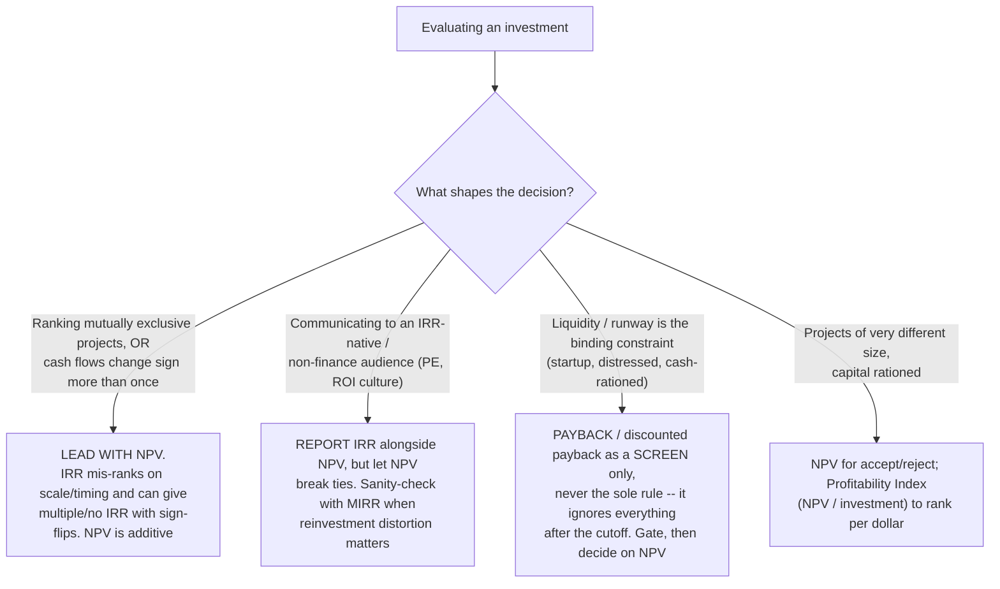
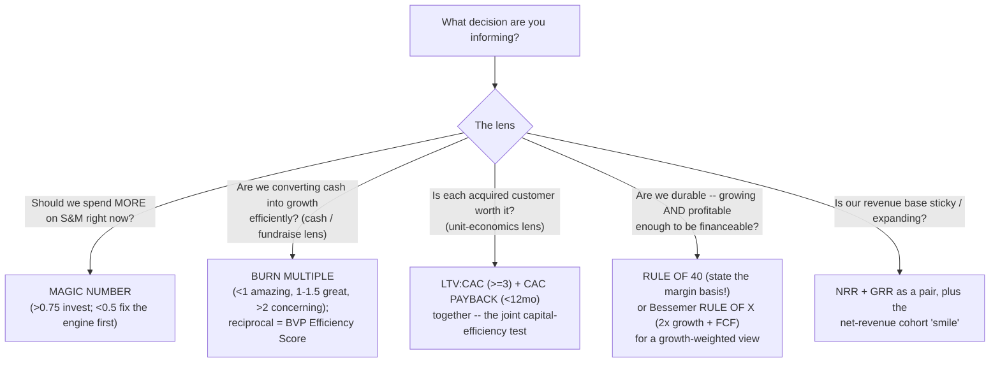

# FP&A decision support & unit economics — the playbooks on top of the metrics

> **Last reviewed:** 2026-06-04. Source: this plugin's deep-research synthesis [`../../../docs/research/2026-06-04-finance-domain-depth/fpa-decision-support-and-unit-economics.md`](../../../docs/research/2026-06-04-finance-domain-depth/fpa-decision-support-and-unit-economics.md), built from the SaaS-metrics canon (Skok/forEntrepreneurs, a16z, Gurley, Bessemer/BVP, Sacks) and corporate-finance authorities (CFI, Wall Street Prep, AFP, Damodaran). Refresh when an engagement surfaces a decision pattern not covered, or when benchmark cohorts shift. **Every famous threshold below — LTV:CAC > 3, CAC payback < 12 mo, Rule of 40, magic number > 0.75, burn multiple < 1 — is a stage-/segment-/rate-environment-dependent rule of thumb, not a law. Date it and segment it before quoting it to a board.**

This file is the **analytical-playbook layer**: which formula is defensible, what a ratio is actually telling you, where it lies to you, and which method leads a decision. It complements — does not duplicate — the dictionary-level metric definitions in [`../skills/kpi-definition/SKILL.md`](../skills/kpi-definition/SKILL.md). The two trees below resolve the capital-budgeting-method choice and the "which efficiency metric" choice.

**Two rules that run through everything:** (1) unit economics run on **gross-margin (contribution) dollars, not top-line revenue** — using revenue overstates LTV and understates payback; (2) **segment before you trust** — a blended number (blended CAC, total ARPA, net ARR) hides the broken part.

---

## Unit economics — the judgment on top of the definitions

- **CAC must be fully-loaded and segmented.** Fully-loaded = all sales + marketing cost (salaries, commissions, ad spend, tooling, allocated overhead), not just media. **Blended CAC averages free/organic with paid and hides a broken paid channel** — never approve a channel budget increase on a blended number; confirm that channel's standalone CAC/payback first. `[high]`
- **LTV — the correct formula vs. the naive one.** Naive `LTV = ARPA ÷ churn` overstates two ways: it treats revenue as profit, and at low churn it implies absurd 20–40-year lifetimes. Correct: `LTV = (ARPA × Gross Margin %) ÷ (revenue churn rate + discount rate)` — the discount rate caps the geometric series and values near-term cash higher. Pragmatic early-stage alternative: cap assumed lifetime at **3–4 years** rather than inverting a churn rate observed for only a few quarters. Gurley's "dangerous seduction": a big LTV is seductive precisely because it's used as *leverage to justify ludicrous acquisition spend today* against speculative future profit. `[high]`
- **LTV:CAC ≥ 3** is the sustainability guideline; **below 3** → fix CAC/churn/pricing before scaling; **above ~5** is a *warning*, not a trophy — usually under-investment in growth or an inflated-LTV artifact. `[high]`
- **CAC payback** = `CAC ÷ (new MRR per customer × gross margin %)`; **< 12 months** is the canonical "good" (enterprise 18–24 can be healthy given longer retention). Two errors inflate it 20–40%: using total ARPA instead of cohort MRR, and blended instead of subscription gross margin. The subtle one: **counting expansion in the numerator** improperly shortens new-logo payback — acquisition cost recovers from the *initial* contract; keep new-logo and net-of-expansion payback distinct. `[high]` / `[med]`

## SaaS growth analytics

- **The ARR/MRR movement bridge** (`beginning + new + expansion − contraction − churn = ending`) — the diagnostic value is in the *composition*, not the net: if contraction + churn grows faster than expansion, the engine is fragile even when net ARR rises. Date New at service start and Churn at contract end. `[high]`
- **NRR/GRR read as a pair:** GRR is what you're losing; NRR is what you keep after expansion. A 130% NRR on an 80% GRR is a leaky bucket papered over by a few expanding whales (concentration risk). Segment splits matter more than the headline (enterprise NRR medians run well above SMB). `[high]`
- **Cohort "smile":** the prized net-revenue-retention curve dips early, flattens, then curves back **above 100%** as expansion outpaces churn — visual proof of a durable expansion motion. A curve that only decays is a transactional business wearing a subscription label. `[high]`
- **a16z's vanity-metric warning list:** bookings ≠ revenue ≠ billings; ARR ≠ run-rate (don't annualize one strong month); report **gross** churn, not net-only (net understates the bleed); GMV ≠ revenue; cumulative charts always rise (show period-over-period rate, label the axis, pair % with absolutes). `[high]`

---

## Decision Tree: FP&A — which capital-budgeting method leads

**When this applies:** you are evaluating an investment (capex, a new product line, build-vs-buy, a market entry) and must choose the method that *decides* it. A defensible case uses **incremental cash flows only, ignores sunk costs, charges opportunity cost, and discounts at a risk-matched rate** (the **hurdle rate** = WACC plus a premium for project-specific risk — discounting a risky bet at the corporate WACC overvalues it).

**Last verified:** 2026-06-04 against CFI, Wall Street Prep, AFP, and Financial Edge.

Core rules: **NPV > 0 → accept**; **IRR > hurdle → accept** (NPV wins on conflict); **payback < target → passes the screen only**. **Build-vs-buy** is a 5-year TCO + opportunity-cost decision, not a sticker-price one — build TCO ≈ 5–10× initial dev cost (~80% of lifetime cost is post-launch); default heuristic: **buy commodity, build differentiation**. `[high]` / `[med]`

---

## Decision Tree: FP&A — which efficiency metric for this decision/stage

**When this applies:** you must pick the lead efficiency metric for a board/operating conversation. The right metric depends on the *decision*, not fashion — and the stage modifies which is actionable.

**Last verified:** 2026-06-04 against The SaaS CFO, CFI, Wall Street Prep, Sacks/Craft (burn multiple), Meritech, and Bessemer.

**Efficiency-metric definitions & traps:** **magic number** = `(Δ quarterly revenue × 4) ÷ prior-quarter S&M`. **Burn multiple** (Sacks) = `net burn ÷ net new ARR` (worsens earlier-stage; lifecycle average ~1.6×). **Rule of 40** = `growth % + profit margin % ≥ 40` — the margin term is **not** a free choice: private cos often use EBITDA, public/investors increasingly use **FCF margin** (harder to game), so **state the margin definition every time** and never compare an EBITDA-based 42 against a peer's FCF-based 42. Bessemer's **Rule of X** weights growth ~2× (`2 × growth % + FCF margin %`). **Stage modifier:** pre-PMF/seed → burn multiple naturally high, LTV horizons unreliable (cap 3–4 yrs); growth → magic number + LTV:CAC + payback most actionable; scale/pre-IPO → Rule of 40 / Rule of X + FCF discipline dominate. `[high]`

---

## Pricing, scenarios, and business partnering

- **Pricing & discounting math (memorize for the room):** on a **40% gross margin, a 10% price cut is a 25% margin hit** (40% → 30%); a **1% price drop can cut operating profit ~8%**, needing **~18.7% more volume** just to break even on profit. A discount also sets a **lower price anchor** that propagates to other accounts and renewals — the "death spiral." **FP&A's job: quantify the offsetting volume *before* a discount is approved, and govern discount authority by tier.** Price realization (pocket ÷ list) and discount-leakage recovery are among the highest-ROI margin programs because they recover margin from activity the business already runs. `[high]` / `[med]`
- **Scenario & sensitivity:** run **sensitivity first** (flex one driver at a time → find the few that move the answer; the **tornado diagram** is the executive output), **then scenario** (flex a coherent set into base/upside/downside stories). **Monte Carlo** when the *shape* of risk (tail risk, P10/P50/P90) matters. **Present a range with the swing drivers named, not a point estimate — and attach every scenario to a decision or trigger**, or it's "scenario theater." `[high]` / `[med]`
- **Business partnering:** FP&A's role has shifted from reporting the past to **supporting forward decisions** — in the room *before* the decision. **Lead with the "so what,"** not the table; pre-define the **trigger points** (pipeline swings, runway thresholds) that prompt a decision so partnering is a routine, not a fire drill. `[high]`

---

## The error-mode catalogue (what actually goes wrong)

- **Naive LTV** (`ARPA ÷ churn`, ignoring margin and discounting) → gross-margin-based + discount rate, or cap at 3–4 yrs. `[high]`
- **Blended CAC/payback** hiding a broken paid channel → segment by channel; gate budget on standalone channel payback. `[high]`
- **Expansion in the CAC-payback numerator; blended GM / total ARPA in payback** → separate new-logo from net-of-expansion; use subscription GM + cohort MRR. `[high]` / `[med]`
- **LTV:CAC > 5 read as a win** → treat a high ratio as a question (under-investment or inflated LTV). `[high]`
- **Net ARR without the bridge; NRR-only without GRR** → always show composition; read NRR and GRR as a pair. `[high]`
- **Rule of 40 on mixed bases; bookings/run-rate quoted as revenue** → state the margin definition; distinguish bookings/billings/ARR/run-rate. `[high]`
- **Payback as the sole capital rule; IRR to rank mutually exclusive/sign-flipping projects; sunk cost in the case; WACC as hurdle for a risky project** → screen with payback decide with NPV; NPV breaks IRR ties; incremental cash only; risk-matched hurdle. `[high]`
- **Reflexive discounting; scenario theater; point estimates to executives** → compute offsetting volume and govern authority; tie scenarios to triggers; present ranges + tornado. `[high]`

---

## When to escalate

- **Building the model behind a case (NPV/IRR, scenarios, the unit-economics model)** → `financial-modeler` (this plugin); the WACC/hurdle build follows [`wacc-cost-of-capital-sourcing.md`](./wacc-cost-of-capital-sourcing.md).
- **Where these metrics sit in the plan, and capacity/headcount feasibility** → see [`fpa-operating-model-and-planning.md`](./fpa-operating-model-and-planning.md); KPI *definitions* live in [`../skills/kpi-definition/SKILL.md`](../skills/kpi-definition/SKILL.md).
- **The metric pack / decision memo for the board** → `board-pack-composer` (this plugin); lead with the "so what."
- **A valuation of record (not a decision screen)** → `valuation-analyst` (this plugin); see the valuation tree in [`finance-decision-trees.md`](./finance-decision-trees.md).
- **Statistical rigor on a cohort model, retention curve, or Monte Carlo** → `applied-statistics`, via the Team Lead.

---

## Citations / sources

Full synthesis with inline confidence tags and source URLs: [`../../../docs/research/2026-06-04-finance-domain-depth/fpa-decision-support-and-unit-economics.md`](../../../docs/research/2026-06-04-finance-domain-depth/fpa-decision-support-and-unit-economics.md) (retrieved 2026-06-04). Anchored on the SaaS-metrics canon (Skok/forEntrepreneurs, a16z, Gurley, Bessemer/BVP, Sacks) corroborated by Wall Street Prep, CFI, ChartMogul, Meritech, and Scale VP, plus corporate-finance authorities (CFI, Wall Street Prep, AFP) for the capital-budgeting and pricing content. The primary canon domains (forentrepreneurs.com, a16z.com, abovethecrowd.com) returned HTTP 403 on fetch, so headline claims rest on search excerpts cross-checked against ≥2 independent secondaries before a `[high]` tag. **All thresholds are stage-/segment-/rate-dependent rules of thumb — date and segment before quoting.**
